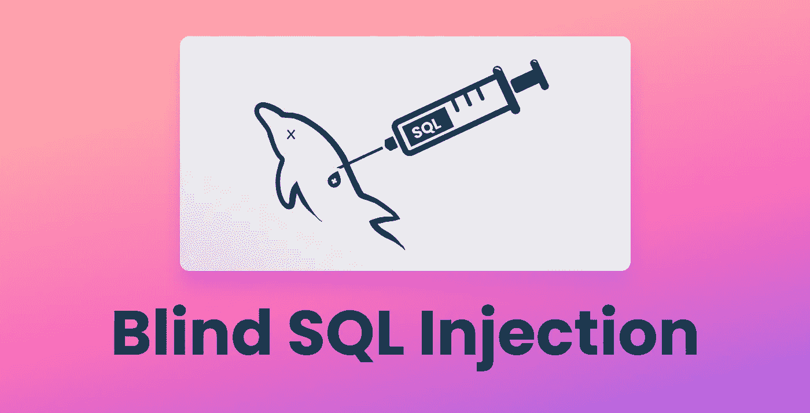
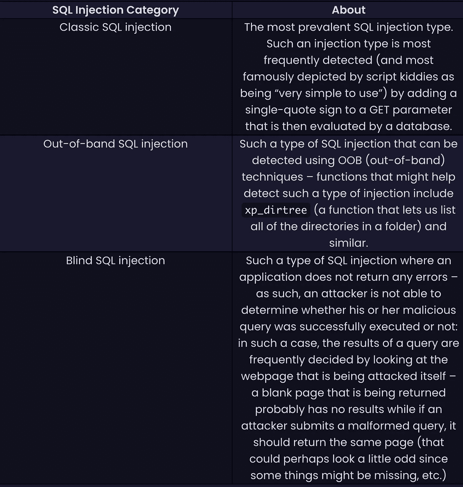
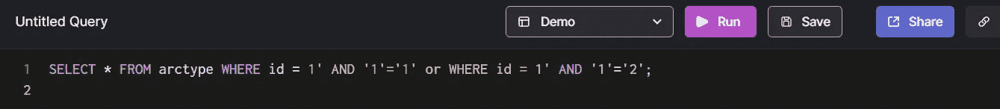
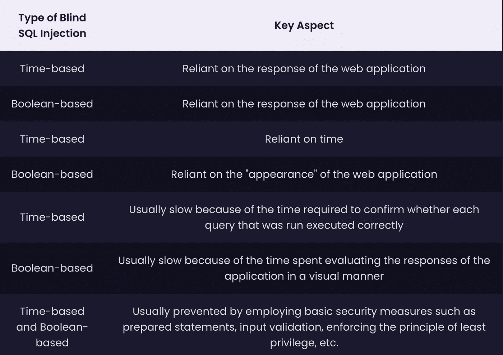

# 盲目的 SQL 注入—威胁还是儿戏？

> 原文：<https://betterprogramming.pub/blind-sql-injection-threat-or-childs-play-6080d955a933>

## 盲 SQL 注入是一种 SQL 注入，攻击者无法理解我们的 web 应用程序是如何“思考”的



数据库世界中的一个主要问题是 SQL 注入——它如此普遍，以至于 [OWASP 一直将其列为针对 web 应用程序的头号威胁](https://owasp.org/www-project-top-ten/2017/)。 [SQL 注入可以有很多种类型](https://arctype.com/blog/sql-injection/)，其中一种就是盲人 SQL 注入——在这篇博客文章中，我们将探讨这种攻击有多有害。

# 什么是 SQL 注入？它有哪些类别？

正如我们已经在[的一些早期博客文章](https://arctype.com/blog/sql-injection/)中告诉你的，SQL 注入是针对数据库的主要攻击——当用户提供的输入未经净化和适当处理就直接转发到数据库时，应用程序容易受到 SQL 注入的攻击。

理解 SQL 注入的分类非常重要，因为有几个关键原因:

*   不同类型的 SQL 注入以不同的方式影响 web 应用程序。
*   有些类型的 SQL 注入比其他类型的更容易预防。
*   某些类型的 SQL 注入直接取决于我们的 web 应用程序的功能(例如，成功的盲 SQL 注入攻击的结果直接取决于我们的 web 应用程序是否显示错误)。)
*   一些类型的 SQL 注入攻击有子类型(想想基于时间的盲 SQL 注入)，这些子类型也可能为邪恶的一方达成或破坏交易，因为它们直接依赖于一个特定的因素，在这种情况下，无法控制，所以它们直接是时间。

SQL 注入有几个类别:



正如您所看到的，SQL 注入并不属于太多的类别，然而，虽然经典的 SQL 注入被最频繁地使用，但当经典的 SQL 注入攻击不起作用时，攻击者通常会转向 SQL 的盲点，他们尝试用盲目的 SQL 注入攻击应用程序。

# 盲目 SQL 注入的王国

把你的应用程序想象成一座城堡。我们知道，这看起来至少有点奇怪，但请耐心等待。现在，将您的 web 应用程序想象成一座城堡。完成了吗？好吧，想象一下，一群拿着长矛的盲人士兵正在攻击城堡，他们的长矛经常打不中城堡的防御工事。你认为——拿着长矛的盲人士兵有多少时间来完成你城堡的防御？这需要一段时间，但士兵们最终会通过。这是真的——一旦士兵通过，你储存在城堡里的宝藏(你的 web 应用程序内的数据)就是仙人掌——他们会偷走一切。

士兵装备精良，即使他们是瞎子，他们最终也会破坏你的防御——哦，不！这就是盲人 SQL 注入在现实世界中的工作方式，所以让我们再给你举一个例子:

1.  攻击者通过在某个参数后添加单引号，发现您的 web 应用程序容易受到 SQL 注入的攻击，然后您的 web 应用程序会返回一个错误。
2.  攻击者一直在手工制作 SQL 查询—没有一个返回任何错误。然而，他很快发现，如果他执行一种类型的查询，您的 web 应用程序中的数据会显示在屏幕上，在他执行另一种查询后，数据会消失。“啊哈！”，—攻击者认为。“明白了。得到了一个盲目的 SQL 注入缺陷。”

您可能已经注意到，盲 SQL 注入就是这样一种攻击，它以查询的形式向数据库提出“问题”,并试图根据 web 应用程序的响应来确定它们是真还是假。通过运行如下查询，可以最频繁地检测到盲 SQL 注入:



如果 web 应用程序返回一个“肯定”的响应(意味着它在网页上返回一个可见的差异)，则 web 应用程序容易受到这种攻击，而如果应用程序无动于衷，则很可能不会。在第一种情况下，攻击者将知道您的数据库有问题，并试图进一步穿透您的防御。于是游戏开始了——攻击者试图注意到您的 web 应用程序愿意返回什么样的响应。一个查询返回一个有结果的页面——好的，他进一步探查，一个查询返回一个空白页——hmmm……他更改了查询并再次尝试。因此，游戏继续进行，直到从您的数据库中提取出恶意方感兴趣的所有数据。是的，这种查询*将会*花费很长时间(这也是盲人 SQL 注入最出名的事情之一)，但是请记住，尽管时间可能会令人难过，但它可能不会阻止旨在尽可能多地伤害您的系统或窃取您所有数据的攻击者。

一些 web 应用程序甚至可能过滤 GET 或 POST 参数中的部分，这意味着它们可能“捕捉”到正在使用的单引号或双引号，但这只是问题的一部分。这种功能通常是 web 应用程序防火墙类型功能的一部分——我们已经在我们的另一篇文章的[中讨论过 WAFs(Web 应用程序防火墙的缩写),所以我们不会说得太详细，但请记住，Web 应用程序防火墙可以偏转各种攻击，从拒绝服务到 SQL 注入，你猜对了。你可以通过](https://arctype.com/blog/intrusion-detection-system/)[访问世界上最大的&最快的数据泄露搜索引擎之一——breakdirectory](https://breachdirectory.com)——的网站，找到一个 web 应用防火墙的活生生的例子，但是现在，让我们回到主题。

# SQL 盲注入的类型

有两种类型的盲 SQL 注入——基于布尔的和基于时间的。基于布尔的盲 SQL 注入依赖于向数据库发送特定的 SQL 查询，通过查看应用程序的响应来确定查询是否返回`TRUE`或`FALSE`结果，而基于时间的 SQL 注入依赖于时间——探测 web 应用程序的盲基于时间的 SQL 注入的查询将迫使数据库在返回响应之前等待几秒钟，如果在指定的秒数过后返回响应，攻击者将能够确定应用程序容易受到基于时间的盲 SQL 注入的攻击。以下是这两种类型之间的一些主要区别和相似之处:



# 防范盲目的 SQL 注入

与普遍看法相反，防范失明型 SQL 注入病毒并不需要太多技能或努力——使用基本的安全措施就可以预防。对，就这么简单！我们可以通过在 PHP 中使用准备好的数据对象(PDO)来实现这一点(它们将用户提供的输入和查询的其余部分分开，因此任何类型的 SQL 注入都是不可能的)，通过使用自动测试解决方案来通知我们的应用程序是否容易受到 SQLi 的影响，或者，当然，使用白名单安全控制——作为开发人员，我们应该养成过滤和净化以某种方式与我们的数据交互的各种参数的习惯。通过这样做，我们可以将我们的 web 应用程序提升到下一个安全级别，防止各种 SQL 注入攻击和其他类型的安全问题。

一旦我们将我们的网络应用程序提升到下一个安全级别，我们也必须关注我们自己帐户的安全——我们可以通过[break directory](https://breachdirectory.com)进行搜索，以查看我们的帐户是否有风险，并根据给我们的建议采取行动。一旦我们做到这一点，我们的帐户也应该是安全的。赢了——赢了！

# 摘要

盲 SQL 注入是一种 SQL 注入，攻击者无法知道我们的 web 应用程序是如何“思考”的，因此他们不得不依赖 web 应用程序给我们的输出或依赖时间，这取决于使用的是哪种方法(基于布尔的还是基于时间的)。当依赖基于布尔的 SQL 注入时，攻击者依赖于 web 应用程序可能看起来与通常不同的事实，而当使用基于时间的 SQL 注入时，攻击者严重依赖于时间。

无论攻击者选择使用哪种类型的 SQL 注入，都不会为攻击者提供快速获取数据的方法——攻击者可能会花费数小时、数天甚至数月来获取他感兴趣的数据，但一旦攻击成功完成，这些数据通常会在暗网上以数千美元的价格出售给其他恶意方，这种循环将继续下去。

为了防止盲 SQL 注入，请确保采用安全的编码实践，不要将用户输入直接转发到数据库中，并细化 web 应用程序中返回错误的方式。

此外，确保通过已知的数据泄露搜索引擎进行搜索，如[break directory](https://breachdirectory.com)，以确保您的数据在白天和晚上以及下一次之前都是安全的。下一篇博客再见！

```
**Want to Connect?**Keep an eye on the [Arctype blog](https://arctype.com/blog) — you will find decent security-related advice over there as well.
```