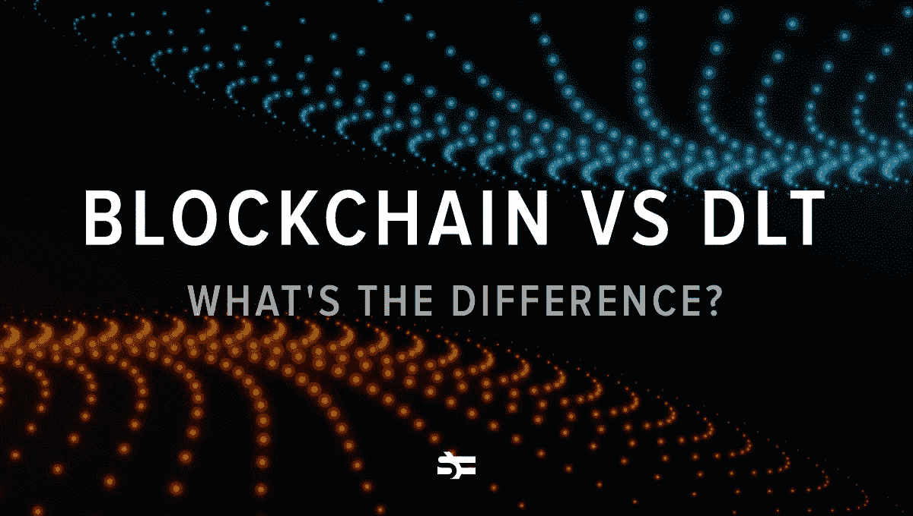
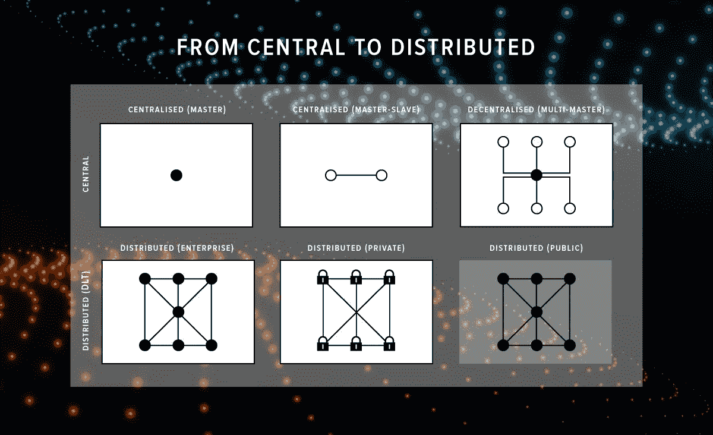
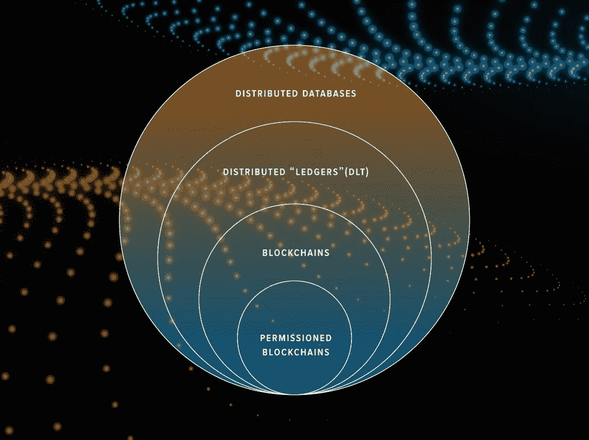

# 区块链与分布式账本技术

> 原文：<https://betterprogramming.pub/blockchain-vs-distributed-ledger-technology-whats-the-difference-2587d9780c99>

## 有什么区别？

术语*区块链*和*分布式账本技术* (DLT)经常被用作同义词。你猜怎么着:他们不是！所以，如果你不想在同事面前看起来像个怪人，请继续读下去。

# 什么是分布式账本技术？

DLT 是一种储存信息的方式。让我们逐字分析一下。

## 分布式账本技术简史

所以首先，有*莱杰。很久以前，当人们对互联网、电子收银机和其他不稳定的高科技一无所知时，他们会将交易信息记录在一本名为账本的普通书中。*

想象一下:你去银行申请一张信用卡，银行职员在纸上记录下你取了多少钱，什么时候需要恢复。

这样存储信息有问题吗？当然，他们有很多人。

*   盗窃:任何人都可以盗窃账本，删除或更改信息。这可以由你的债权人、其他银行职员甚至你来完成。
*   **人为因素:**很容易有意或无意地把$100，000 写成$10，000，这对作为借款人的你来说会是一个不愉快的惊喜。
*   **不可抗力**。所有的记录都可能被自然原因破坏，比如洪水或火灾。

问题是，如今在常规服务器或云数据库上保存记录，在安全性方面与仅仅存储在纸上没有太大区别。有人可以黑，或者服务器可以自己崩溃(单点故障的问题)。

所以把所有的鸡蛋放在一个篮子里不是一个好的解决办法。我们该怎么办？

复印。

这就是单词*分布*进入游戏的地方。

分布式意味着书里的信息由所有成员保存、管理和使用。它仍然是一本书——或者更准确地说，是一个数据库——但它分布在 DLT 网络的所有参与者中。这些也被称为*节点。*

在没有任何中央权力机构的情况下，如何确保相同的数据在整个网络中可见？

1991 年，研究人员斯图尔特·哈伯和 w·斯科特·斯托纳塔问了自己同样的问题。他们提出了给数字数据打上时间戳的实用方法。

遵循他们的逻辑:

*   在数字世界里，一切都是可以修改的。通常，您没有机会看到数据是否被更改。为了解决这个问题，您需要给信息加上时间戳，这样所有的更改都可以被跟踪。
*   您需要为实际的内容标记时间戳，而不是存储这些数据的文件的创建时间。
*   此外，时间戳的日期和时间不得伪造。科学家们引入哈希和数字签名作为解决这个问题的可能手段。

这些原则基本上催生了 DLT。

2002 年，David Mazières 和 Dennis Shasha 继续发展这一概念，研究如何在块中存储数据。他们正在研究一种多用户网络文件系统的协议，称为安全不可信数据存储库(SUNDR)。他们的工作成果为今天的区块链奠定了基础。区块链出现并传播后，DLT 的历史就成了区块链的[历史。](https://medium.com/blockstreethq/before-blockchain-there-was-distributed-ledger-technology-319d0295f011)

在分布式分类帐系统中，所有节点都有自己的分类帐副本，并独立更新信息。

要进行更改，它们需要通过一种共识机制，在这种机制中，节点集体同意引入更改。这就是我们如何确保分类帐的副本在所有节点中是相同的。

有许多方法可以做到这一点。共识机制的选择取决于你希望你的系统对错误行为者有多大的容忍度(以及其他几个约束)。虽然从技术上讲，只需一个[矢量时钟](https://levelup.gitconnected.com/distributed-systems-physical-logical-and-vector-clocks-7ca989f5f780)就能达成共识，但使用像 [Paxos](https://en.wikipedia.org/wiki/Paxos_(computer_science)) 和 [pBFT](https://medium.com/coinmonks/pbft-understanding-the-algorithm-b7a7869650ae) 这样的协议要流行得多。

所以，总而言之，*分布式总账*的定义如下:

> “分布式分类帐技术是一种分布在网络不同节点上的分散数据库。每个节点查看所有有问题的记录，并处理每个事务。这些节点共同对每件物品的真实性进行投票，在一定条件下保证信任和透明。”

# 分布式账本技术的优势

DLT 因其相对于集中式数据存储系统的诸多优势而广受欢迎。

*   **透明性和不变性:**与集中式系统不同，所有节点对数据享有平等的权利。所有的决定都是集体做出的。DLT 提供了一个不变的和可验证的所有业务的审计线索。
*   **抗攻击:** DLT 是一个比传统集中式数据库更能抵御网络攻击的系统，因为它是分布式的。没有单一的攻击点，这使得黑客攻击这种系统的尝试过于昂贵和无用。

# 区块链 vs DLT

现在让我们回到区块链。为什么每个人都混淆了这两个术语？

答案是，区块链确实是一个分布式总账系统。区块链用户对数据也有去中心化的控制，很多节点参与数据的分发、管理、变更。

重要的是，区块链是 DLT 的一种特殊类型。它看起来像一系列的信息块。它们中的每一个都依赖于前一个和后一个块，这模仿了链的构造。

以下是区块链和 DLT 的不同之处:

*   **可用操作:**在传统的数据库技术中，有四种操作可用:`Create`、`Retrieve`、`Update`和`Delete` (CRUD)。在区块链中，您只能使用`Create`和`Retrieve`操作。
*   **区块结构:**区块链将数据表示为区块链，这对于其他类型的 DLT 并不是强制性的。
*   **序列:**分布式账本技术不必遵循区块链的逐块结构。
*   **代币:**区块链一般是代币经济，但 DLT 不要求它们的用法。

# 不同类型的 DLT

区块链是最受欢迎的 DLT 类型。然而，它不是唯一的。

当今工业中最常用的 DLT 可分为三类:

*   **Public:** 这是一个分散的系统，任何两方，不管他们在哪里，都可以进行交易。公共 DLT 依赖于所有节点的共识。
*   **私有:**常用于企业作为企业数据库。这是一个许可的网络——意味着不同的分类账仍然在节点间同步。然而，有一个拥有者有权决定谁可以访问网络。
*   **Consortium:**DLT 财团由在网络上享有平等权利的公司组成的联盟使用。该系统允许多个企业使用 DLT 作为分散系统。这些也被称为*联合 DLT。*

# 案例研究:卡尔达诺定居层

Serokell 是开发 Cardano 项目的独立研究人员和软件工程师团队之一。这是一个开源的、去中心化的公共区块链。Cardano 的目的是为用户提供一个智能合约平台，克服常见的安全缺陷，降低交易成本，提高网络速度。

我们为 CSL 开发了卡达诺结算层加密货币和钱包。

Cardano 使用了一种利害关系证明共识算法。这一选择给 CSL 带来了一些新的特色。让我们更详细地谈论他们。

## 委托

此功能允许节点离线，但仍对系统有影响。委托与 [PoW，](https://en.wikipedia.org/wiki/Proof_of_work)不兼容，在这里每个人都应该出席才能投票。用户可以从使用 Cardano 中受益于两种类型的功能。

**重型代表团**

它是如何工作的？想象一下在一个企业的董事会里。所有成员都有股份，参加会议，并对公司的决策进行投票。

*   如果他们中的一个人不能参加会议，他们相信有人会代表他们投票。为此，需要一份授权令(或者在我们的情况下，需要一份委托书)。它将被发送给董事会的其他成员，让他们知道其他人有资格代表该成员投票。
*   如果缺席的成员参加了下一次会议，他们需要撤销代理，向每个成员发送一封签名信，声明它不再有效。

**光明代表团**

另一种选择是只给你的代表一份委托书，他会在需要代表你投票时向其他人出示。如果你来参加会议，其他人会忽略代理人。

此功能允许所有用户投票支持提议的更新。任何用户都可以建议对系统进行更新。其他人会检查一下，确保它是安全的，不允许任何人滥用这个系统。如果没问题，他们会投出他们的股份来更新。所以这个系统是自我调节的:一个用户提议更新，其他用户投票。如果有足够的票数，系统将会更新。

## 智能合同

你可以编写代码，发送到系统中的所有节点，代码就会在这些节点上运行。每个节点将检查代码是否正确——例如，它没有浪费不允许花的钱。

这个概念提供了通过 CSL 编写应用程序的能力。比如你可以写自己的赌博平台。它的优点是游戏的处理不仅仅发生在一个服务器上——这个服务器可能被破坏了——而是发生在多个执行代码的节点上。

即使其中一个节点损坏了，其他节点也会说，“您认为执行的结果是这样的，但我们不这么认为。”因为它们占了上风，所以没有人计算损坏的节点。

总的来说，CSL 试图提出一种科学驱动的发展方法来建设一个全新的社区。毕竟，加密货币不仅仅是技术决策、算法和编码。这是一群相信自己在做正确的事情的人，这可能有助于为整个世界建立一个更美好的金融科技未来。

# 总结

现在，你可以区分 DLT 和区块链。你已经了解了区块链相对于其他类型的分布式分类账系统的优势和劣势。

这些技术代表了一种存储和处理数据的新方式，正在被全球不同行业越来越多的公司采用，如医疗保健、法律、教育等。