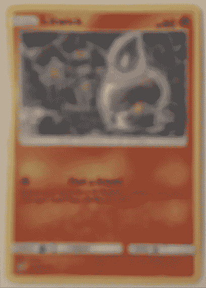
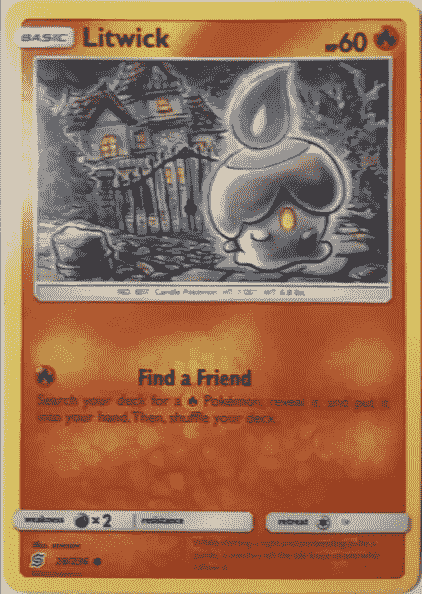
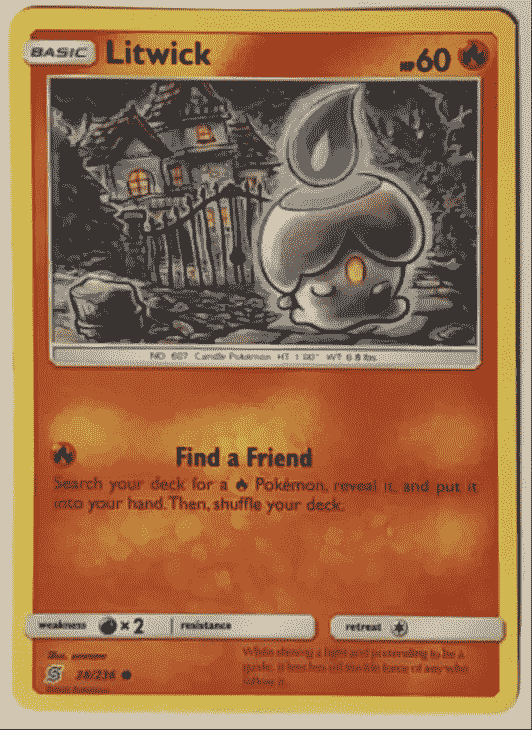
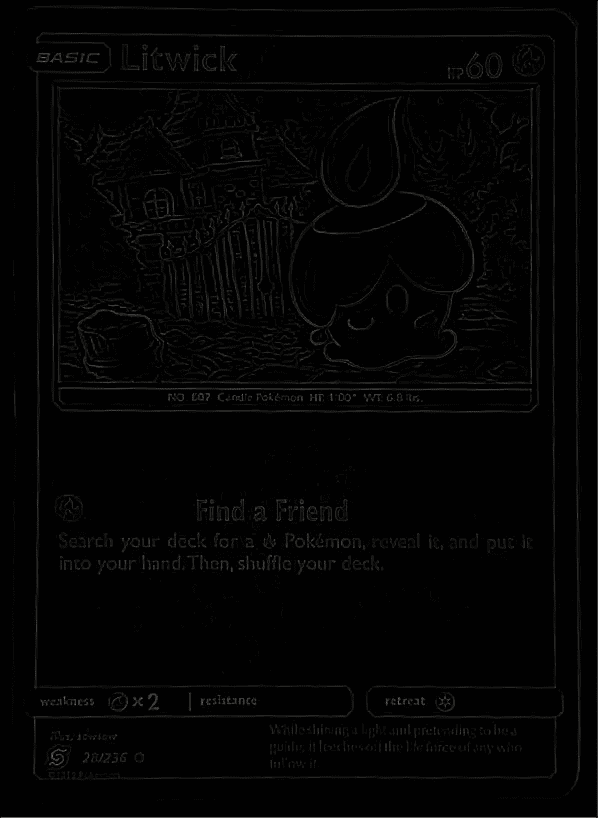

# 通过 iOS 上 GPU 加速的金属性能着色器进行模糊检测

> 原文：<https://betterprogramming.pub/blur-detection-via-metal-on-ios-16dd02cb1558>

## 使用 ARKit 的更改图像跟踪功能通过相机跟踪矩形对象，并实时转换它们


由[保罗·斯科鲁普斯卡斯](https://unsplash.com/@pawelskor?utm_source=unsplash&utm_medium=referral&utm_content=creditCopyText)在 [Unsplash](https://unsplash.com/s/photos/focus?utm_source=unsplash&utm_medium=referral&utm_content=creditCopyText) 上拍摄

当在相机帧上进行实时视频或图像处理时，一个令人烦恼的问题是，有时相机可能需要时间来对焦。在此期间，所有捕获的帧都是模糊的，这可能会导致您试图检测或跟踪的任何东西出现误报。因此，将图像的模糊程度作为算法的输入或简单地跳过它可能会有所帮助，从而提高输出的准确性。

在我的情况下，我正在遵循苹果的 ARKit 样本，名为[改变图像跟踪](https://developer.apple.com/documentation/arkit/tracking_and_altering_images)，它跟踪通过相机看到的矩形物体，并实时转换它们。我发现的一个问题是，如果它最初检测到图像失焦，那么即使在相机焦点固定后，它也会继续尝试跟踪模糊的图像，导致图像不匹配，从而导致不可靠的跟踪。这种技术让我可以在开始跟踪之前，快速确保捕捉到的图像对焦。

我发现 Adrian Rosebrock 关于这个主题的一个很棒的[博客帖子](https://www.pyimagesearch.com/2015/09/07/blur-detection-with-opencv/)，它提出了一个可行的方法，称为拉普拉斯的*方差，我使用金属性能着色器重新实现了这个方法，得到了令人满意的结果，我想在这里分享一下。*

# 方法

它只需执行两个步骤:

1.  使用`MPSImageLaplacian`将源图像转换为拉普拉斯图像。
2.  使用`MPSImageStatisticsMeanAndVariance`获得拉普拉斯的方差。

结果将是一个表示模糊度的数字。数字越低，越模糊。对我来说，0、1 或 2 的方差会太模糊，导致我的算法给我假阳性。方差为 3 或更高(对于我的测试数据，通常达到 5)，我能够得到更好的结果:

## 方差= 1



## 方差= 2



## 方差= 5



## 拉普拉斯算子用于方差为 4 的图像

出于好奇，下面是拉普拉斯算子对聚焦图像的结果。失焦图像的拉普拉斯基本上是一个黑色的矩形。



# 密码

以下是 Swift 中的一些代码:

```
**import** Metal
**import** MetalPerformanceShaders
**import** MetalKit...
**// Initialize MTL**
self.mtlDevice = MTLCreateSystemDefaultDevice()
self.mtlCommandQueue = mtlDevice?.makeCommandQueue()
...**// Create a command buffer for the transformation pipeline
let** commandBuffer = **self**.mtlCommandQueue.makeCommandBuffer()!**// These are the two built-in shaders we will use
let** laplacian = MPSImageLaplacian(device: **self**.mtlDevice)
**let** meanAndVariance = MPSImageStatisticsMeanAndVariance(device: **self**.mtlDevice)**// Load the captured pixel buffer as a texture
let** textureLoader = MTKTextureLoader(device: **self**.mtlDevice)
**let** sourceTexture = **try**! textureLoader.newTexture(cgImage: referenceImagePixelBuffer.toCGImage()!, options: nil)**// Create the destination texture for the laplacian transformation
let** lapDesc = MTLTextureDescriptor.texture2DDescriptor(pixelFormat: sourceTexture.pixelFormat, width: sourceTexture.width, height: sourceTexture.height, mipmapped: **false**)
lapDesc.usage = [.shaderWrite, .shaderRead]
**let** lapTex = **self**.mtlDevice.makeTexture(descriptor: lapDesc)!**// Encode this as the first transformation to perform**
laplacian.encode(commandBuffer: commandBuffer, sourceTexture: sourceTexture, destinationTexture: lapTex)**// Create the destination texture for storing the variance.
let** varianceTextureDescriptor = MTLTextureDescriptor.texture2DDescriptor(pixelFormat: sourceTexture.pixelFormat, width: 2, height: 1, mipmapped: **false**)
varianceTextureDescriptor.usage = [.shaderWrite, .shaderRead]
**let** varianceTexture = **self**.mtlDevice.makeTexture(descriptor: varianceTextureDescriptor)!**// Encode this as the second transformation**
meanAndVariance.encode(commandBuffer: commandBuffer, sourceTexture: lapTex, destinationTexture: varianceTexture)**// Run the command buffer on the GPU and wait for the results**
commandBuffer.commit()
commandBuffer.waitUntilCompleted()**// The output will be just 2 pixels, one with the mean, the other the variance.
var** result = [Int8](repeatElement(0, count: 2))
**let** region = MTLRegionMake2D(0, 0, 2, 1)
varianceTexture.getBytes(&result, bytesPerRow: 1 * 2 * 4, from: region, mipmapLevel: 0)**let** variance = result.last!
```

# 结论

这种检查图像是否模糊的方法是 GPU 加速的，对于大约 1000 x 600 的图像，在 iPhone 8 上需要三到九毫秒。