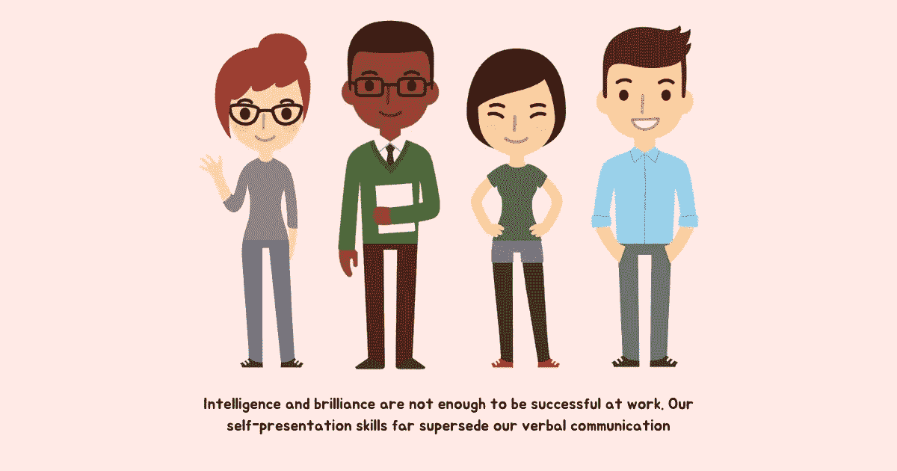

# 你的肢体语言错误以及如何改正

> 原文：<https://betterprogramming.pub/body-language-mistakes-and-how-to-fix-them-6452100fb0f5>

## 我们在工作中不断交流，即使我们不说话的时候也是如此

图片来源:作者

我们更多的是通过身体说话，而不是言语。我们摆出的姿势、脸上的表情、手势和眼球运动传达的信息远远超出了我们想要暴露的范围。

会议中微妙的微笑可以表明愿意参与对话，而严厉的目光可以立即扼杀对话。不停地查看手机或看手表会发出不关心的信号，而关注对方会发出感兴趣的信号。

翻白眼表示对另一个人的想法或行为的不信任或厌恶，而当我们真正对他人好奇时，我们的眼睛会发光。在走廊上走路时低着头表示缺乏存在感，而通过简单的点头来承认人们经过会让人感到温暖。面试中有力的握手会散发出自信和力量，而无力的握手会暴露出紧张和虚弱。

这些非语言的暗示构成了我们身体语言的一部分，即使在我们沉默的时候也会说话，揭示出我们当时的想法和感受。

奥利维亚·福克斯·卡巴内曾在斯坦福、耶鲁、哈佛、麻省理工和联合国讲学，她说，

> “在人类进化的范围内，语言是一项相对较新的发明。但在此之前，我们已经通过非语言交流方式进行了很好的互动。因此，非语言交流已经被植入我们的大脑，比最近的语言处理能力要深刻得多。这就是为什么非语言交流的影响要大得多。”

她接着指出，“在我们没有意识到的情况下，我们的身体每分钟都会发出数以千计的信号。就像我们的呼吸和心跳一样，这些信号是数百万身体功能的一部分，这些功能不是由我们的意识控制，而是由我们的潜意识控制。”

理解我们肢体语言的力量以及它在工作场所沟通和协作中的作用，可以通过采用积极的沟通方式将我们聚集在一起，而不是通过误解的桥梁将我们分开。

# 肢体语言在交流中的重要性

我们的肢体语言在印象管理中起着关键作用，印象管理是一种影响他人如何看待我们的艺术。

积极的肢体语言可以展示我们贡献的热情、对自己能力的信心、乐于接受挑战，以及我们对推动结果和认识未来需求的热情。它可以打开一个充满新的可能性的世界。

消极的肢体语言会发出强烈的信号，表明我们拒绝做出贡献，我们怀疑自己的能力或不愿意接受挑战，对结果持冷漠和漠不关心的态度，并且与现实脱节，无法处理未来的潜力。它会关闭通往成功和成长的大门。

> “人们可能不会记得你说过的话，但他们会记得你给他们的感受。”—玛娅·安杰洛

既然我们的情绪在很大程度上驱动着我们的决策，猜猜当一个新项目或职位出现时，谁会得到关注——一个对自己的肢体语言表现出自信的人，还是一个看起来像神经衰弱的人？

智力和才华不足以在工作中取得成功。我们的自我展示技能远远取代了我们的口头交流。

> “你表现自己的方式是个人力量的来源——这种力量是保持风度的关键。它是让你释放自我的钥匙——你的能力、创造力、勇气，甚至是慷慨。它不会给你你所没有的技能或才能；它帮助你分享你所拥有的。它不会让你变得更聪明或消息更灵通；它让你更有弹性，更开放。它不会改变你是谁；它让你成为你自己。”—艾米·卡迪

当我们所说的与我们所相信的不一致时会发生什么？我们可以通过言语撒谎，但我们的身体会揭露真相。我们通过身体发出的非语言信号比语言更有说服力。

考虑一下这个。有人向你提出新策略的建议。你只是点头表示同意，而不是表达你的真实意见。但是你眼睛周围的紧张、你说话的语气和许多其他非语言暗示会让对方不舒服，让他们对你的建议感到不确定，并决定永远不再信任你。

这个想法不是通过你的肢体语言来表现不真实，而是意识到它的含义。

研究表明，我们在与他人见面的几分钟内就形成了对他们的印象，然后我们的确认偏见会引导我们挑选证实我们观点的数据。任何加强我们信仰体系的东西都被欣然接受，而与之相抵触的则被拒绝。

意识到我们的肢体语言在形成这种印象中所起的作用可以帮助我们把面试的结果扭曲成对我们有利的。

对于处于领导地位的人来说，肢体语言极其重要，因为组织中的人不仅会模仿领导说话的方式，还会选择他们的非语言暗示。

肢体语言积极的领导者看起来平易近人，乐于接受反馈，并愿意改变，而肢体语言消极的领导者看起来难以接近，不愿接受反馈，并且过于傲慢，无法适应和改变未来的需求。

艾米·卡迪问道:“我们的非语言支配着别人对我们的想法和感受，但是我们的非语言支配着我们对自己的想法和感受吗？”

绝对的。掌握非语言交流的艺术不仅能更好地与他人交流，而且对我们也有好处。通过积极的肢体语言展现最好的自己，让我们成为未来的创造者，而不是他人看法的受害者。它带来了更多的成长机会和更高的成功几率。

# 四种肢体语言错误及其纠正方法

## 1.心灵与身体不协调

当我们的思想与我们的身体不一致时，我们可能会试图通过控制我们的姿势和面部表情来描绘一种与我们内在自我相冲突的状态。但是这种不协调迟早会在我们的肢体语言中表现出来。

积极的肢体语言跟不上消极的精神状态——我们头脑中的想法会在我们的身体上表现出来。如果我们没有意识到，这些*微表情*会被我们周围的人注意到。

> “不管我们喜欢与否，我们的肢体语言都表达了我们的精神状态。我们的面部表情、声音姿势和身体语言的所有其他组成部分反映了我们每一秒钟的精神和情感状况。因为我们没有有意识地控制这种流动，所以我们头脑中的任何东西都会在我们的身体语言中表现出来。”—奥利维亚·福克斯·卡巴内

**如何调整我们的身心**

研究表明，我们的大脑无法区分想象和现实。所以无论我们的思想相信什么，我们的身体都会投射。

我们可以通过捕捉自己处于负面心理状态的时刻——不同意、不安全、焦虑、沮丧、焦虑、批评和自我怀疑——并选择进入积极的状态，来产生想要的肢体语言。

*   当你需要展示自信时，寻求灵感。
*   当你因意见不合而感到焦虑时，问问自己“我能从别人身上学到什么”和“我的偏见是如何导致我思想封闭的。”
*   当你看到的都是消极的时候，选择问“对于这种情况，我能想到的唯一积极的事情是什么？”
*   当自我怀疑吞噬你的时候，告诉自己“我需要放下恐惧，去创造一个更好的自己。”
*   当你夸大一个消极的结果时，问问自己“最坏的可能是什么”和“真的有那么糟吗，还是我在编故事。”

采用一个积极的参考框架，从一个问题转移到一个解决方案的心态，可以帮助我们从消极的内部状态转移到积极的状态。

## 2.我们不承诺出席

> “活在当下——关注正在发生的事情，而不是沉浸在自己的想法中——能带来巨大的回报。当你表现出风度时，你周围的人会感到被倾听、被尊重和被重视。”—奥利维亚·福克斯·卡巴内

当我们没有参与谈话时，当我们沉浸在自己的想法中，只是假装在听时，这在我们发送给别人的非语言信号中清晰地表现出来。

我们可能开始摆弄手机或笔记本电脑，表现出注意力分散的迹象，东张西望，而不是进行目光接触，这表明我们对他们要说的话不感兴趣。出于不舒服，我们甚至会多次变换姿势。

没有我们的意识，我们的肢体语言会传达出对他人的不尊重和不信任。

**如何到场**

> “你必须承诺一次谈话，即使是简短的，否则就走开。如果你太分心了，向自己和对方承认这一点。要么出现，要么消失。”—塞莱斯特·黑德利

从你不感兴趣的谈话中走开比假装在场更有礼貌。

一旦你决定参与，你首先需要说服并告诉自己，你想要在场。说“我选择活在当下”,然后采用与之一致的肢体语言:热情地看着对方，稍微倾斜一点来培养兴趣，并试图理解对方想要说什么。

你可能偶尔会走神，但是通过选择精神上的当下，你可以把你的注意力带回到谈话中。积极的倾听虽然困难，却是最有效的非语言交流形式；它需要不断的练习和头脑的训练。

## 3.我们忽略了背景

当我们与某人交谈时，他们对我们的看法基于会议的背景、他们的期望以及他们自己的个人和文化过滤器。

如果没有意识到人们是在特定的环境中活动的，我们可能会发出与他们的价值观相冲突的非语言信号，违背他们的精神状态，甚至违背他们的自我意识。

**如何应用上下文**

当我们进行一场艰难的对话而不去理解对方此刻的感受时，我们可能会显得冷漠、没有感情，而且非常粗鲁。通过在我们的肢体语言中采用友善和温暖，我们可以传达正确的信息，而不一定会让他们感觉不好。

当某人被拒绝升职时，表现出漠不关心的态度而不理解这种态度在他们生活中的价值会让他们怨恨你。通过给他们一个机会来表达自己的感受来展示存在感和关心的肢体语言可以建立更好的关系。

当一个同事在为个人损失悲伤时，你的肢体语言可能会显得太唐突，而他们需要的只是让这种感觉平息的空间。这可能是个人偏好或文化差异，但如果不了解其背景，实际上可能弊大于利。

当与难相处的人打交道时，你的身体语言可能会转变为“战斗或逃跑”的反应。但是，如果你花点时间分析一下这种情况，而不受到基本归因错误的影响，你可能会理解他们行为背后的基本原理。

每种情况都是独特的。我们需要考虑每个人的背景和个人过滤器，为他们设计合适的肢体语言。

## 4.我们讲述了一个矛盾的故事

我们可能认为自己非常平易近人，但其他人可能会发现我们难以接近。我们也可能认为自己思想开放，而别人可能觉得我们有偏见。我们可能认为我们为人们提供了一个心理安全的环境，但我们的员工可能害怕犯错。

现在很容易说，“只是他们，不是我。我已经和他们沟通过多次了。”但说真的，这是真的吗？你的意图可能与你的现实情况相差甚远。

> “就在我们观察了别人的所作所为之后，就在我们对此产生某种情绪之前，我们给自己讲了一个故事。我们给我们观察到的行为赋予意义。我们猜测这种行为的动机。他们为什么要这么做？我们还加入了判断——这是好还是坏？然后，基于这些想法或故事，我们的身体会以一种情绪做出反应。”—凯丽·帕特森

当我们的肢体语言与我们的语言不一致时，人们会察觉到我们的非语言信号——当有人犯错时，我们脸上轻蔑的表情，传达坏消息时来回踱步，要求反馈时坐立不安，当我们不同意时翻白眼，做手势表示责备，等等。

所以当你用语言表达一件事时，你的身体可能会说相反的话。当人们得到令人困惑的信号时，他们倾向于相信他们观察到的，而不是他们听到的。

**如何讲述正确的故事**

让你的肢体语言与你想要传达的信息同步。当一个人的肢体语言反映了他所说的话时，人们很容易相信他。

当寻求反馈时，看着对方的眼睛，不要分心。当有人犯错误时，在你面前表现出好奇，让他们从错误中学习。当告诉人们感到舒适地接近你时，做张开手臂和手的手势。传达坏消息时，要强烈，但要用充满激情和希望的目光看待他人，以显示对自己有能力把事情做好的信心。

人们花了很多时间来完善他们的演讲，却没有验证他们的演讲通过他们的身体传达了什么。当要给人留下正确的印象时，不要只说你的话，也要让你的肢体语言发挥作用。

# 摘要

通过以下方式掌握工作场所的非语言沟通艺术:

1.  **调整到积极的心态**:意识到自己的消极心态，选择积极的心态。
2.  **承诺在场**:练习积极倾听，完全投入到对话中，而不是仅仅在场。
3.  **考虑环境**:通过考虑他人的价值观、精神状态和自我意识来与他们建立联系。
4.  讲述正确的故事:让你的身体与你想要传达的信息同步。