# 用 Boids 模拟 Python 中的鸟群行为

> 原文：<https://betterprogramming.pub/boids-simulating-birds-flock-behavior-in-python-9fff99375118>

## 群体智能带来的编码乐趣

[见 GitHub 回购本](https://github.com/roholazandie/boids)

也许你已经被一群逆着夕阳飞翔的鸟儿的迷人流动迷住了。数百甚至数千只鸟一起飞翔，形成无尽的形状，就好像它们是一个整体，这是一个令人难以置信的景象。

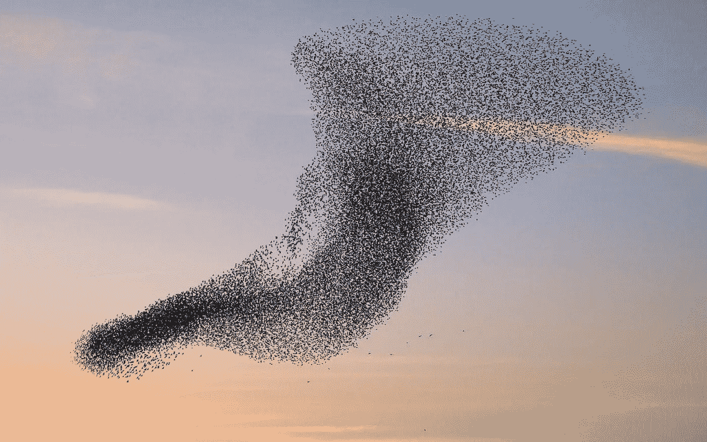

鸟群

对许多人来说，这是一个浪漫的场景，但今天不是诗歌或浪漫的日子。相反，我打算用 Python 实现类似的东西，向理解复杂系统迈出一小步。用诺贝尔奖得主物理学家理查德·p·费曼的话说:

> *我不能创造的东西我不懂。*

让我们开始欢乐吧！

# 群体智能

我不会深入研究群体智能，但我会尝试总结它的要点。简而言之，对自然的经典理解是有限的主体相互作用——例如，几个粒子相互施加作用力——对于任何超过十几个粒子和数百个相互作用的复杂系统来说，这都不是一个好的模型。经典系统是有意义的，因为它们遵循我们所知的“常识”。现实的经典图景建立在几个假设之上，在这里我将列举出其中最相关的几个:

1.  一个复杂的系统应该有复杂的规则来管理
2.  一个复杂的系统需要一个管理者(或创造者)来创造、维护和引导它。

这些规则对于真实的系统(复杂的)来说根本不成立，这就是故事有趣的地方！

首先，复杂系统可以遵循一套非常简单且有限的规则。但是这些系统如何表现出复杂的行为呢？答案是通过一种被称为[的机制出现](https://en.wikipedia.org/wiki/Emergence)。

其次，复杂系统不需要创造者——它们是[自组织的](https://en.wikipedia.org/wiki/Self-organization)！被浪费鸟群就是一个例子。很长一段时间，鸟类的群集行为是一个谜。有些人甚至认为，用当前的科学无法轻易解释群集现象。然而，随后的仔细研究表明，这实际上非常简单。

克雷格·雷诺兹介绍了一个名为 [boids](https://en.wikipedia.org/wiki/Boids) 的系统，该系统可以模拟类似鸟类的群集行为。他的人工生命模型遵循三个简单的规则:

*   **分离**:转向以避免拥挤当地的絮凝物
*   **对准**:转向当地队友的平均航向
*   **凝聚力**:转向向本地群体的平均位置(重心)移动

只有上述规则，你才能看到涌现的复杂性几乎是无中生有的。

# 用 Python 实现

因为我们想看到结果，我们必须使用一个可以处理图形的库。我使用的库是[P5](https://github.com/p5py/p5)——一个基于[原始 js 库](https://p5js.org/)的 python 库。您也可以使用其他库。Youtube 上有一个很好的教程[,我会试着遵循它并用 Python 实现。](https://www.youtube.com/watch?v=mhjuuHl6qHM)

首先，我们需要安装`p5`:

```
pip install p5
```

然后，我们需要创建一些“boids”作为我们的鸟。我们将这些称为 boids 而不是 birds，因为 birds 只是一种可能的模型——它们可以是鱼或任何其他群集模式。为此，我们创建了一个类:

很明显，我们需要为每个 boid 设置一个位置，所以我们创建了另一个名为 main.py 的文件，并将图形处理放在那里。在 p5 中，我们有两个重要的函数:`setup`准备画布并在开始时只运行一次，函数`draw`循环运行并负责创建最终动画的更改:

如果您运行上面的代码，您应该会看到一个定义了大小和颜色的空白画布。在`draw`中，我们每次都做同样的事情:用定义的 rgb 颜色绘制画布。还没有动画。

现在我们想在画布上创建许多静态的 boids。我在上面的类中添加了函数`show`:

`stroke`功能决定笔画的颜色，而`circle`功能在定义的位置以定义的半径创建一个圆。

现在，让我们回到 main.py 来创建 30 个具有随机位置的 boids:

注意 *random.rand* 生成随机数。我们现在有了类似于这个图的东西:

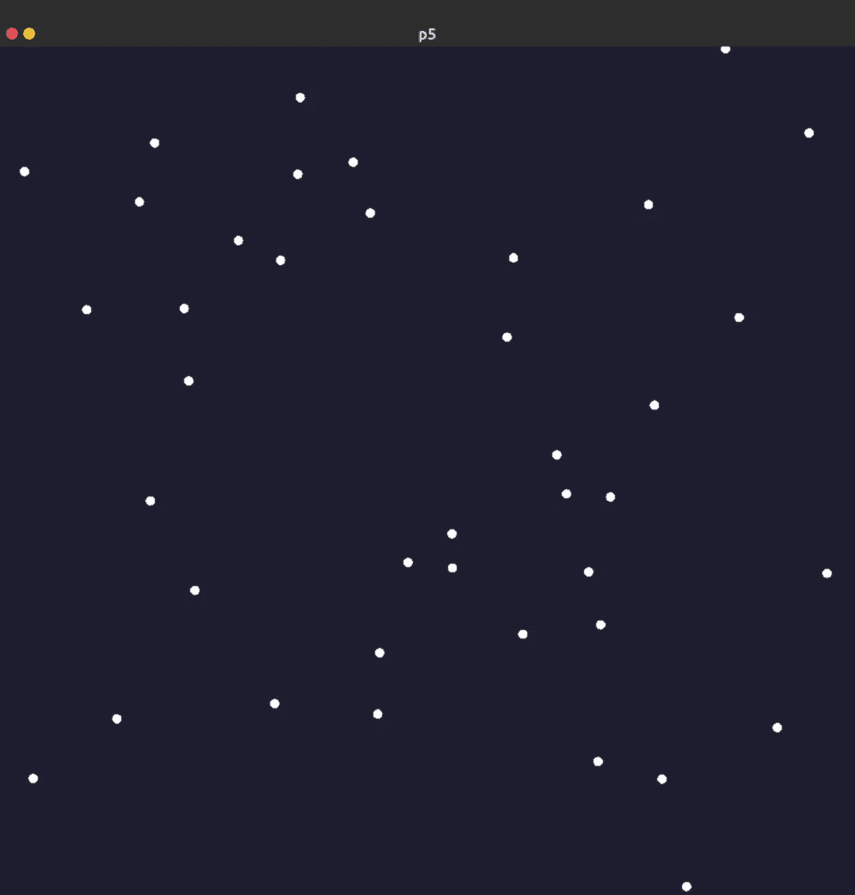

现在，如果我们想让这些点移动，我们需要定义它们的速度和加速度。如果你记得高中物理，你会知道速度和加速度是矢量对象。好消息是您不需要定义 Vector 类，因为`p5`已经实现了它，以及它的所有方法和属性:

另一个更新值的函数:

因此，我们需要将它添加到 main.py 中:

这一步的输出将会是许多随机飞来飞去然后消失的机器人:

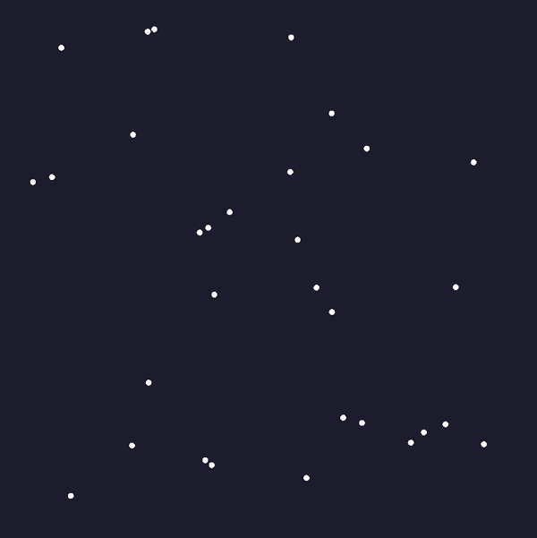

我们如何把它们保存在盒子里？我们必须把盒子变成整个世界，所以每当一个机器人离开盒子，它就会在对面重新出现。为此，我们必须向 boids.py 添加另一个函数:

添加该函数后，输出如下:

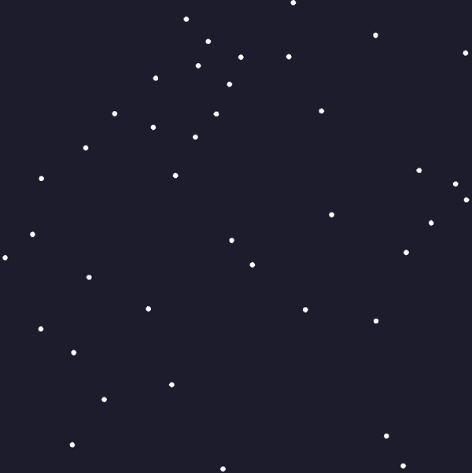

你可以看到 boids 开始缓慢，然后他们有点疯狂。我们想要更流畅的动作。要做到这一点，我们必须将向量标准化，并为它们创建一个`max_speed`限制。在下面的代码片段中，我们将`max_speed`设置为 5:

这是结果:

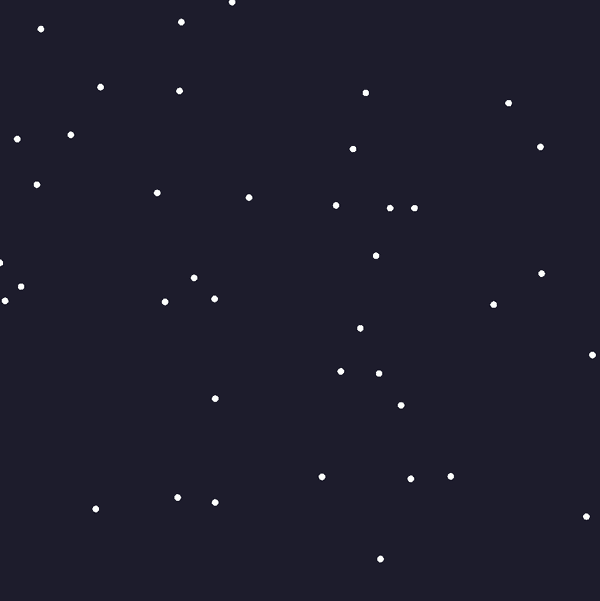

这个看起来不错！现在是时候给鸟群添加行为了，而不是让它们随机漂浮。

我们从力学中知道，改变速度的东西叫做力，力等于加速度乘以质量。我们可以用加速度来代替力。另一方面，我们已经说过每个 boid 只是看到它周围的局部 boid。为了对齐，我们查看局部 boids 并计算它们的平均方向(这是速度向量的一部分),然后跟随它。

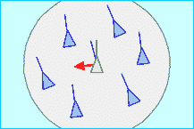

上图中绿色的 boid 是当前的**boid。*当前 boid 的方向用绿色向量表示，但是局部絮凝物的平均方向用来自它的蓝色线表示。我们必须施加一个力，从当前的方向，朝着期望的方向。该向量由红色箭头表示，是其他两个向量的减法:*

> *转向= avg_vec —自身速度*

*算法如下:*

*请注意，在所有 boid 的循环中，我们只在某个距离寻找 boid——这个距离我们称之为`perception`(这里等于 100)。这是有道理的，因为在现实世界中，鸟类只会看到当地的鸟群，并根据当地的信息来驾驶。如果 boid 是单独的，我们也必须小心，以确保它不做任何事情(总计> 0)。然后我们归一化向量，因为我们只需要方向，然后乘以 max_speed。最后，我们做减法。*

*我们还创建了另一个函数，`apply_behaviour,`，它负责在我们进行的过程中应用每一个规则:*

*然后我们将其添加到 main.py 中的 draw 函数中:*

*从现在开始，我们不再改变 main.py 中的任何内容。结果是:*

*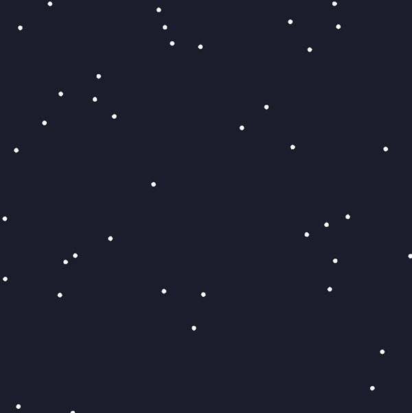*

*目前为止看起来很棒！但是我们还有更多事情要做。*

*凝聚力意味着转向当地群体的中心。我们这样做是为了迫使机器人彼此贴紧而不分开。*

**

*我们必须设法迫使当前的 boid(绿色的那个)朝向局部 boid 的质心——如绿点所示。因为所有物体的质量相同，所以质心等于它们的平均位置。找到`center_of_mass`后，我们从中减去位置。换句话说:*

**vec_to_com =质心—自身位置**

**转向= vec_to_com —自身速度**

*该功能类似于对齐:*

*我们在上面的代码中执行了两次归一化——一次是针对朝向质心的向量，另一次是针对转向。同样，我们这样做是因为我们想要方向，幅度的控制应该由另一个参数来完成(这里是`max_speed`和`max_force`)。*

*现在我们将内聚力函数添加到`apply_behaviour`函数中，但是我们希望看到它没有对齐规则:*

*如果我们将“最大作用力”设置为 1，将“最大速度”设置为 10，就会发生这种情况:*

*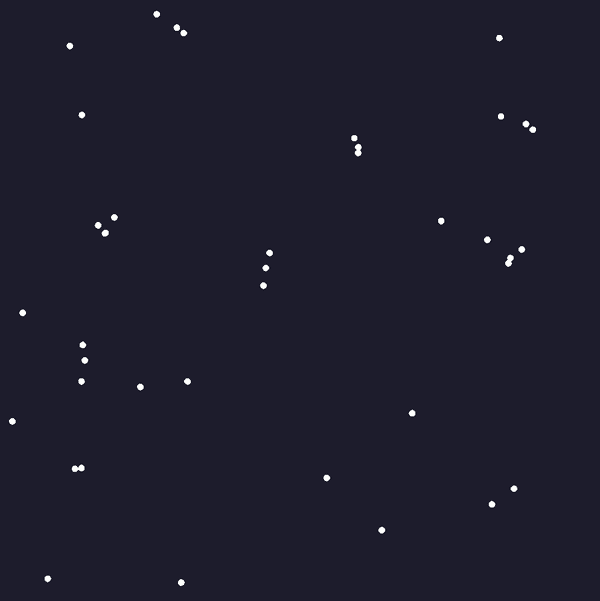*

*正如你所看到的，机器人试图彼此靠近，这正是我们所期待的。*

*现在到了最后一条规则:分离。分离是必要的，这样我们的机器人就不会撞在一起。每个 boid 应该看到他们自己的本地 flockmates，如果他们太接近。*

*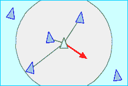*

*只有一个微妙之处:我们希望 boid 更多地避开更近的 boid，而不是它们视野范围内的远处 boid(圆圈)。越近的人施加的力越大。我们需要使用距离反比定律:*

*正如你所看到的，在主循环中，我们跟踪距离，并将`diff`向量——逃跑的方向——除以到特定絮凝物的距离。如果我们加上这条规则，我们就有:*

*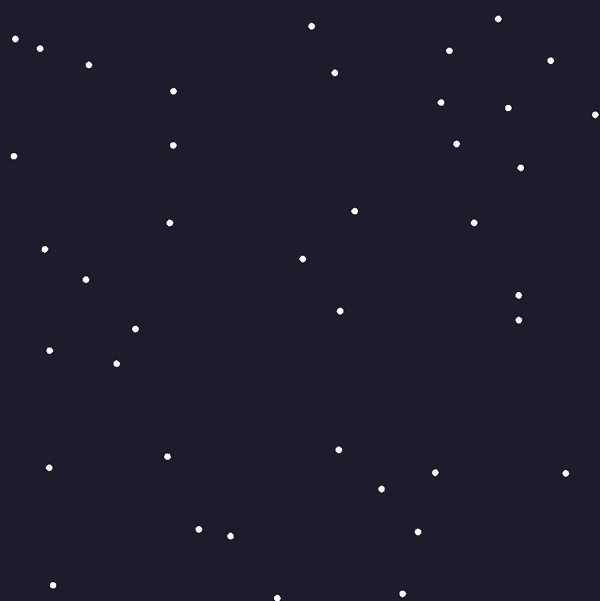*

*你可以看到每个 boid 都渴望尽可能远离所有其他人——好像他们不喜欢社交！*

*在整篇文章中，我交替使用了力和加速度。现在我们可以利用力的叠加定律同时施加所有的加速度:*

*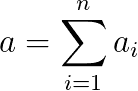*

*所以我们只用向量加法:*

*这是应用所有这些规则的最终结果:*

*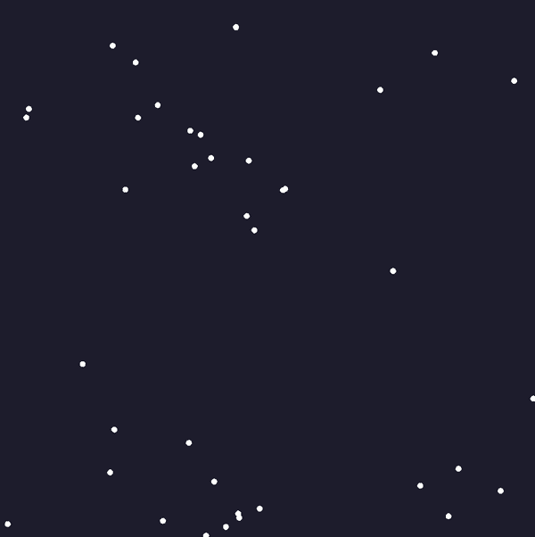*

*这就是我要找的东西！有几件事要提一下。这完全是真实世界鸟类的行为。这是一个人工生命作品，试图模拟现实世界的现象，并展示真实系统如何遵循简单的规则，却表现出复杂的行为。boids 向我们展示了复杂性可以从自组织过程中产生。*

*在这种编程中有一些不同之处:你不能决定显示什么样的模式。当然，您可以调整参数来查看不同类别的行为，但最终系统会产生独特的模式。 ***这是规则和随机性的相互作用。****

# *一个技术细节*

*如果你运行这些代码，你会发现当 boids 的数量超过 50 个时(取决于你的硬件)，速度会非常慢。原因很明显，代码是低效的，并且具有 O(n)的复杂度，这对于计算机科学算法来说是非常慢的。你大概意识到了，没有必要让每个 boid 去检查所有其他 boid，所以可以通过划分空间来优化算法。这在本质上类似于优化 knn 算法的问题。你可以在这里找到一些补救措施。*

*我试图使用 [Ray](https://github.com/ray-project/ray) 库来并行化规则，但这并没有产生巨大的差异。你可以在[我的 GitHub 回购](https://github.com/roholazandie/boids)里看到。如果你发现任何解决方案，使速度大幅度提高，发送一个推送请求给我！*