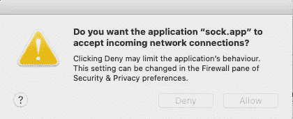

# 如何在 SwiftUI 中建立局域网连接

> 原文：<https://betterprogramming.pub/bonjour-over-a-network-framework-b533a714b8f5>

## iOS 网络框架上的 Bonjour


由[费萨尔·瓦希德](https://unsplash.com/@fwaheed17?utm_source=medium&utm_medium=referral)在 [Unsplash](https://unsplash.com?utm_source=medium&utm_medium=referral) 上拍摄的照片。

我相信你听说过这样一句话“成功的秘诀是人际关系网。”我怀疑这也是构建杀手级应用的秘密。让我们来了解一下可以用来连接应用程序的技术(也称为套接字)。

好的，有两种口味:TCP 和 UDP。简而言之，TCP 套接字保证传递，而 UDP 套接字不保证传递。当您需要确保您发送的消息到达时，TCP 套接字非常有用。当你更关心速度时，UDP 套接字是有用的。

那就说说代码吧。现在，和所有的对话一样，我们有人在说，有人在听。这种通信通过使用套接字的 UDP 连接进行。的确，你需要一双。你在一个设备上听，在另一个设备上说。

# 一个简单的监听插座

让我们从一个简单的套接字应用程序开始，它监听端口 1984，并将我们发送给它的内容打印到屏幕上(当然，假设我们发送了一个可打印的字符串):

这是一个我称之为`connect`的类，在其中我定义了一个监听程序，当被调用时它会监视所提供的端口。当你通过这个端口发送数据时，它会打印出来。要使用上述代码，您只需在 SwiftUI 定义中调用它:

当然，这只是听力部分。幸运的是，由于 OS X 是 UNIX，我们可以使用命令行工具来测试它。这一行:

```
echo -n "ping" | nc -4u -w1 192.168.1.110 1984
```

请注意，我在这里使用的 IP 地址是运行模拟器的计算机的 IP 地址(如果您在真实设备上运行它，它将是您的 iPhone/iPad 的 IP 地址)。此外，当您运行此代码时，您可能会看到一个如下所示的弹出窗口:



这个问题的答案是“允许”。

所以继续运行它，试试回声。您应该看到单词“ping”出现在调试屏幕上(当然，假设这是您发送给它的内容)。

# 一个简单的通话插座

显然，你需要能够通过 iOS 与你的 socket 对话。这样做也相当容易。将这段代码添加到您的`connect`类中:

并将这段代码添加到 SwiftUI 文件中，以完成这项工作:

当你点击“Hello World”标签时，就会发出单词“pong”。显然，我们硬编码到应用程序中的 IP 地址和端口(1984)也来自我们的模拟器/真实设备。

你完成了…只是你没有，因为我们现在还处于原型模式。你可以用一个固定的端口号来传递信息。不过，固定的 IP 地址是不可能的。你肯定需要更多。

# 使用 Bonjour 协议联网

对我们来说幸运的是，现在有一个已经运行了近 20 年的久经考验的解决方案:一个由苹果公司在 2002 年开发的协议(最初，它被称为 rendezvous)。让我们修改我们的`connect`类中的代码来利用它，并将那些硬编码的端口号/IP 地址驱逐到进程中(嗯，差不多)。

首先，我们需要重新设计监听方法来启动查询服务。显然，我们还需要重做连接方法，以使用新公布的服务:

这段代码注册了一个名为`_whack`的 bonjour 服务，该服务将在 UDP 上运行。我们将 IP 地址和端口号问题留给 bonjour 服务。

修改完这些之后，我们还需要在 SwiftUI 代码中更改对它们的调用:

这就创建了一个名为`“whack”`的服务，它在我们启动应用程序时运行。这是一个服务，我们随后使用`tap`手势进行查询，以建立套接字连接。

注意，您可以在 UNIX shell 中运行以下命令来检查`whack`服务是否正在运行(一个有用的调试技巧):

```
dns-sd -B _whack._udp
```

这就把我带到了这篇关于跨局域网建立连接的短文的结尾。

保持冷静，继续编码。