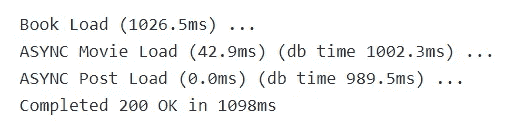

# Rails 7 中的异步查询提升了性能

> 原文：<https://betterprogramming.pub/boost-performance-with-asynchronous-queries-in-rails-7-edd52e34a3cc>

## 看看最新框架版本中的新特性


Rails 由于其相对易用、优秀的文档和热情的社区支持而拥有坚实的追随者。

因此，人们一直在寻找对 Rails 一些众所周知的缺点的改进。多年来，对 Rails 的一个普遍批评是速度慢/性能差。为了解决这个问题，Rails 7 的发布引入了一种新的方法来支持异步查询。

# 新来的孩子

查询以同步方式执行。采取以下措施:

这三个查询将按顺序进行。第一个查询是`Book`模型。完成后，查询`Movie`。然后进行`Record`的查询。因此，可能会出现速度变慢的情况，因为在进入下一个查询之前必须完成每个查询。在处理特别大的数据集时，这会进一步影响性能。

为了解决这个问题，Rails 7 带来了一个新的 ActiveRecord 方法`load_async`。

在上面的例子中，进行了同样的三个查询，但是通过使用`load_async`，每个查询都是并发执行的。这三个查询在与一个查询几乎相同的时间内完成，从而提高了性能。欢迎使用 Rails 中的异步查询！

# 设置

异步执行是 Rails 7 的一个新特性，但默认情况下并没有启用。要配置它，请转到您的环境配置文件，如`config/environments/development.rb`，并放置以下内容:

```
config.active_record.async_query_executor = :global_thread_pool
```

`:global_thread_pool`设置对数据库查询使用单个池。如果应用程序只有一个数据库或者一次只对一个数据库进行查询，这是非常理想的。如果应用程序使用多个数据库，则建议将设置更改为`:multi_thread_pool`。

# 过程

设置应用程序使用`load_async`后，执行查询后检查日志。



前缀为`ASYNC`的两个日志行表示它们是与`Book`同时执行的。完成的总时间大约是一秒钟。还不错！按顺序完成同样的查询至少需要三秒钟。

那么这是如何工作的呢？Ruby 有线程，线程是执行进程的一种方式。默认情况下，进程在主线程中处理，这意味着程序必须等待一个进程完成执行，然后才能处理下一个进程。换句话说，你在 Ruby 程序中看到的标准顺序性能。

在 i/o 绑定的应用程序中，这是一种利用外部资源(如数据库查询和 API 请求)的应用程序，Ruby 有一个`Thread`类，它为一个进程创建一个线程，并允许程序的其他部分继续并行运行，同时等待该进程完成。一旦线程进程完成执行，它就被加入到程序中。查看这个伟大的[指南](https://www.rubyguides.com/2015/07/ruby-threads/)来学习更多关于 Ruby 线程的知识。

记住线程的概念，让我们回到`load_async`。用`load_async`进行的每个查询都会创建一个新线程，然后允许程序的下一部分在等待结果时执行。一旦查询完成，它就被连接回主线程，从而实现前面示例中看到的性能提升。

# 一些警告

有了显而易见的性能增强，您可能想知道是否可以把`load_async`扔得到处都是，坐下来，享受一个超快的应用程序。不幸的是，答案是否定的。有几件事需要注意。

首先，应该根据池的大小来考虑查询的数量。超过池大小会导致数据库连接错误。每个数据库对一次可以建立的连接数都有自己的限制，所以请确保您知道它们是什么，并相应地进行规划。可以在你的 Rails 应用程序的`database.yml`文件中更改池大小的设置。

使用`load_async`要考虑的另一件事是，增加连接数会影响数据库内存，如果过载太多，实际上会降低查询时间。这可能会降低应用程序的速度，并否定使用`load_async`的初衷。一定不要做得太多，并且要注意数据库一次处理的连接数。

# 结论

Rails 7 中添加的`load_async`利用了 Ruby 线程模型来并行运行进程。如果使用得当，它可以提高频繁使用数据库和 API 查询的 Rails 应用程序的速度。这些改进和对 Rails 的持续支持是该框架仍然流行的原因之一。给`load_async`一个尝试，在这里看看 Rails 7 [的其他一些新特性。](https://blog.appsignal.com/2021/12/15/whats-new-in-rails7.html)