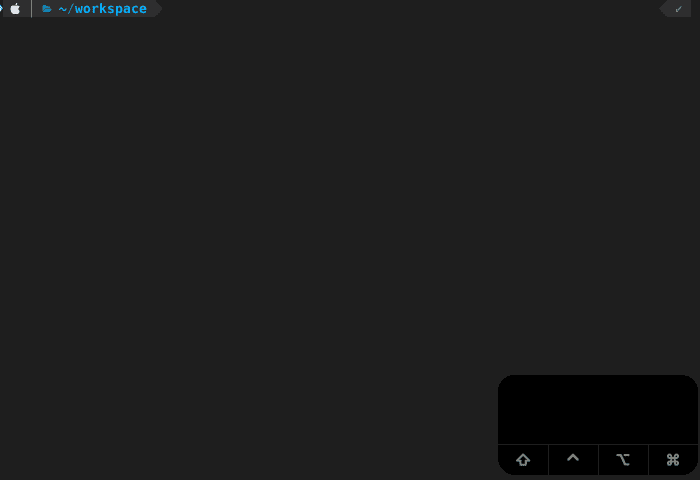
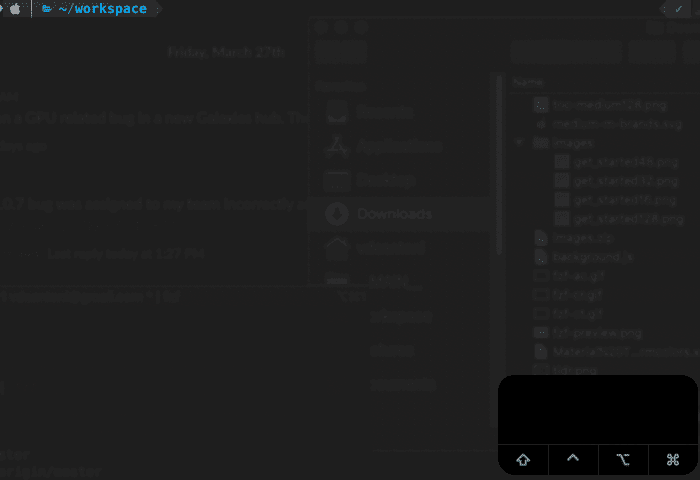
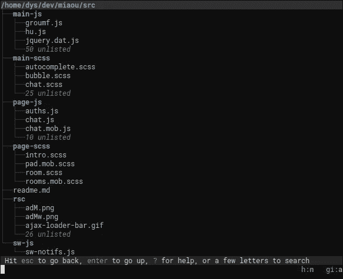

# 使用模糊查找器提高您的命令行效率

> 原文：<https://betterprogramming.pub/boost-your-command-line-productivity-with-fuzzy-finder-985aa162ba5d>

## 使用 fzf 提升您的 CLI 技能


[维多利亚博物馆](https://unsplash.com/@museumsvictoria?utm_source=medium&utm_medium=referral)在 [Unsplash](https://unsplash.com?utm_source=medium&utm_medium=referral) 上拍摄的照片

> 4 月 7 日更新:
> *增加了 macOS 的 chrome 书签浏览器

作为开发人员，在编码时，我们将大部分时间花在 ide 和/或文本编辑器上，尽管他们在抽象低级命令以构建、测试、运行和调试我们的代码方面做得很好，但最终您会发现自己不得不通过命令行运行命令或更改文件。

您可以使用内置命令和 POSIX 实用程序，如`pwd`、`ls`、`cd`、`mv`、`cp`、`rm`、`mkdir`、`touch`、`cat`、`grep`、`find`等。

但是，如果您想在使用 CLI 工具时提高工作效率，fzf 是:

> "命令行的交互式 Unix 筛选器，可用于任何列表；文件、命令历史、进程、主机名、书签、git 提交等。”— [fzf](https://github.com/junegunn/fzf)


fzf 预览

在本文中，我将向您展示如何配置和定制`fzf`，以及如何将它用作生产力助推器的例子。

# 目录

```
· [Installation](#c4fb)
· [Usage](#1203)
  ∘ [Key bindings](#8ba3)
  ∘ [Fuzzy completion alias](#8b19)
  ∘ [Search syntax](#6261)
· [Customization](#9ce6)
  ∘ [Finder layout](#6480)
  ∘ [Preview window](#451c)
  ∘ [Color and UI configuration](#9bdd)
  ∘ [Key bindings](#d515)
  ∘ [Setting options as default](#e770)
· [Advanced Examples](#f4e9)
  ∘ [Changing the default command](#1afd)
  ∘ [Forgit](#9ccd)
  ∘ [Searching file contents](#4cbe)
  ∘ [Docker](#5a33)
  ∘ [Homebrew](#e100)
  ∘ [npm](#3b54)
  ∘ [z](#f623)
  ∘ [Chrome bookmark browser (macOS)](#0e88)
· [Similar Tools](#7aa0)
  ∘ [Broot](#e49c)
```

# 装置

您可以在 Linux、macOS 和 Windows 上安装`fzf`。如果你在 macOS 或 Linux 上，可以通过 [Homebrew](http://brew.sh/) 和 [Linuxbrew](http://linuxbrew.sh/) 获得，要安装它，运行:

```
brew install fzf
```

对于 Windows 和其他选项，请访问 GitHub 上的官方[安装页面](https://github.com/junegunn/fzf#installation)。

还建议安装键绑定和模糊补全:

```
$(brew --prefix)/opt/fzf/install
```

这将为`bash`和`zsh`生成一个文件(并在您的`.bashrc`或`.zshrc`文件中获得它)，该文件包括三个键绑定和模糊完成别名。

# 使用

要启动交互式 UI，请运行:

```
fzf
```

当没有提供参数时，`fzf`启动一个交互式查找器，由`find`提供文件建议。

然后可以输入用`SPACE`分隔的搜索词，用`Arrow-UP`和`Arrow-DOWN`导航，用`TAB`选择多个文件，按`ENTER`确认。完成后，所选文件的路径将打印在屏幕上。

在下面的例子中，我运行`fzf`，搜索 *READ，*用`TAB`选择文件，用`ENTER`确认:



fzf 示例

对于单项选择，不需要`TAB`。当所需条目高亮显示时，按`ENTER`即可。

我们也可以使用`fzf`的输出作为另一个命令的参数:

```
vim $(fzf)
```

因为`fzf`可以从 STDIN 中读取一个列表，对其进行处理，并将选择的项目写入 STDOUT，所以当`fzf`与其他命令一起运行时，事情变得更加有趣。

```
# npm search
npm search react | fzf# grep
grep -irl react * | fzf# PATH folders
echo $PATH | tr ':' '\n' | fzf
```

如果使用`zsh`，可以为`| fzf`添加一个*全局*别名:

```
alias -g Z='| fzf' # change Z to whatever you like
```

同样的例子可以写成:

```
npm search react Z
grep -irl react * Z
echo $PATH | tr ':' '\n' Z
```

## 按键绑定

默认情况下，安装脚本会添加三个键绑定:

1.  **CTRL-T**

将选定的文件和目录粘贴到命令行上。

在下面的例子中，我先输入`vim`，然后输入`CTRL-T`，出现的`fzf`界面让我搜索我想要的文件。一旦我找到文件，我按下`ENTER`返回到我的`vim`命令和文件路径。


CTRL-T 示例

您可以用`TAB`和`Shift-TAB`选择多个文件和目录，路径会全部粘贴到命令行上，中间用空格隔开。当你想`rm`或者`cat`多个文件的时候非常有用。

**2。CTRL-R**

将历史记录中选定的命令粘贴到命令行上。

在下面的例子中，我简单地通过按下`CTRL-R`来调用 UI，然后我可以搜索之前执行的任何命令，在这个例子中，我在寻找`npm`命令来列出我的所有全局安装包，而不包括它们的依赖项。


CTRL-R 示例

**3。ALT-C**

Cd 放入选定的目录。

在下面的例子中，我可以从我的`workspace`文件夹快速`cd`(不需要输入`cd`)到我的`personal-website`回购的`src`文件夹。


ALT-C 示例

如果您的终端将`ALT-C`作为*、*处理，您可以在您的`.(ba|z)shrc`文件中添加下面一行到 source 命令之后:

```
bindkey "ç" fzf-cd-widget
```

## 模糊完成别名

默认情况下，安装脚本将模糊完成触发器定义为`**`。

如果你像我一样使用`zsh`，你可能会经常使用`**`作为其[文件名生成](http://zsh.sourceforge.net/Intro/intro_2.html)(又名 [Glob](https://en.wikipedia.org/wiki/Glob_(programming)) )的一部分，这可能会令人困惑，但不用担心，我们可以通过在你的`.zshrc`文件中设置`FZF_COMPLETION_TRIGGER`来轻松定制它:

```
export FZF_COMPLETION_TRIGGER='**' # change ** to whatever you like 
```

模糊完成知道它前面的命令，这意味着建议可以根据您要做的事情而改变:

```
# Directories under current directory (single-selection)
cd **<TAB># Files under your home directory (multi-selection)
vim ~/**<TAB># Host names are extracted from /etc/hosts and ~/.ssh/config
ssh **<TAB># Environment variables
unset **<TAB>
export **<TAB># Aliases
unalias **<TAB>
```

此外，为 kill 命令提供了 PID 的模糊完成。在这种情况下，没有触发序列，只需在`kill`命令后按下`tab`键即可。

```
# Can select multiple processes with <TAB> or <Shift-TAB> keys
kill -9 <TAB>
```

有一些[实验性 API](https://github.com/junegunn/fzf#settings)用于定制模糊完成，并为其他命令启用它。

## 搜索语法

除了已经讨论过的模糊搜索之外，`fzf`还支持改变搜索词处理方式的特殊标记:

*   `'wild`:完全匹配，返回包含`wild`的项目。
*   `^music` : Prefix-exact-match，返回以`music`开头的项目。
*   `.mp3$`:后缀精确匹配，返回以`.mp3`结尾的项目。
*   `!fire`:逆向精确匹配，返回不包含`fire`的项目。
*   `!^music`:逆序前缀精确匹配，返回不以`music`开头的项目。
*   `!.mp3$`:反后缀精确匹配，返回不以`.mp3`结尾的项目。

请注意，`SPACE`充当的是`AND`操作员，`|`充当的是`OR`。例如，匹配以`music`开头并以`mp3`、`wav`或`flac`结尾的条目的查询如下所示:

```
^music mp3$ | wav$ | flac$
```

# 用户化

`fzf`提供了许多选项来配置 finder 布局、预览窗口、自定操作的按键绑定等等。我将在本节中介绍选项的子集，完整的选项列表请参见`man`页(`man fzf`)。

## 取景器布局

屏幕底部显示`default`布局。我个人比较喜欢`reverse`，从屏幕上方显示。我还设置了`height=80%`,这样当 finder 打开时，我仍然可以看到上下文的终端。

您可以通过运行以下命令来查看:

```
fzf --layout=reverse --height=80%
```

另一个与布局相关的选项是`info`，我建议设置为`inline`。它保存了一个额外的行，其中包含关于条目数量的信息(是否启用了排序，等等。)与查询在同一行。

## 预览窗口

`fzf`我最喜欢的功能之一。它允许你预览一个条目的内容(文件、目录、环境变量等)。).



预览窗口示例

您可以通过以下选项实现该行为:

```
fzf --preview '([[ -f {} ]] && (bat --style=numbers --color=always {} || cat {})) || ([[ -d {} ]] && (tree -C {} | less)) || echo {} 2> /dev/null | head -200'
```

让我们仔细看看它是如何工作的:

`--preview`选项接受对当前行执行的命令，其输出显示在预览窗口上。该命令可以使用占位符`{}`，该占位符将被当前行的字符串替换。

你可以使用更多的占位符，比如`{+}`、`{q}`和`{n}`。更多信息请参考`man`页(`man fzf`)。

使用`cat`的一个更简单的命令如下所示:

```
fzf --preview 'cat {}'
```

所以，回到我们更复杂的命令，让我们来分解一下:

首先，我们检查字符串是否是一个文件，如果是，我们尝试用`[bat](https://github.com/sharkdp/bat)`打开它(像`cat`一样，但是有语法高亮显示)，如果失败，我们退回到`cat`:

```
([[ -f {} ]] && (bat --style=numbers --color=always {} || cat {}))
```

如果字符串不是一个文件，我们检查它是否是一个目录。如果是，我们尝试用`[tree](https://linux.die.net/man/1/tree)`打开它，如果失败，我们返回到`less`:

```
([[ -d {} ]] && (tree -C {} | less))
```

如果它不是一个文件或目录，我们最后的资源是`echo`它:

```
echo {}
```

最后，我们将所有错误重定向到`/dev/null`并返回前 200 行:

```
2> /dev/null | head -200
```

## 颜色和用户界面配置

有四种基础方案可供选择:`dark`、`light`、`16`和`bw`，您还可以为 16 种 UI 元素(即文本、背景、装订线、边框等)设置单独的颜色(ANSI 颜色代码或#RRGGBB 格式的 24 位颜色)。).

例如，我一直使用的颜色:

```
fzf --color='hl:148,hl+:154,pointer:032,marker:010,bg+:237,gutter:008'
```

如果您想了解可以使用的 ANSI 颜色，请运行:

```
for i in {0..255}; do print -Pn "%K{$i}  %k%F{$i}${(l:3::0:)i}%f " ${${(M)$((i%6)):#3}:+$'\n'}; done
```

提示、指针和标记也可以自定义:

```
fzf --prompt='~ ' --pointer='▶' --marker='✗'"
```

## 按键绑定

您可以为超过 40 个不同的动作创建按键绑定，包括`execute`，它可以用来调用任何外部命令。

我使用的一些键绑定是:

```
# Toggle preview window visibility with '?'
fzf --bind '?:toggle-preview'# Select all entries with 'CTRL-A'
fzf --bind 'ctrl-a:select-all'# Copy the selected entries to the clipboard with 'CTRL-Y'
--bind 'ctrl-y:execute-silent(echo {+} | pbcopy)'# Open the selected entries in vim with 'CTRL-E'
--bind 'ctrl-e:execute(echo {+} | xargs -o vim)'#Open the selected entries in vscode with 'CTRL-V'
--bind 'ctrl-v:execute(code {+})'
```

## 将选项设置为默认值

选项也可以添加到`$FZF_DEFAULT_OPTS`中，以便它们总是被应用，不仅是在`fzf`中，在使用键绑定和模糊完成时也是如此。

结合以上所有选项，我们将拥有:

```
export FZF_DEFAULT_OPTS="
--layout=reverse
--info=inline
--height=80%
--multi
--preview-window=:hidden
--preview '([[ -f {} ]] && (bat --style=numbers --color=always {} || cat {})) || ([[ -d {} ]] && (tree -C {} | less)) || echo {} 2> /dev/null | head -200'
--color='hl:148,hl+:154,pointer:032,marker:010,bg+:237,gutter:008'
--prompt='∼ ' --pointer='▶' --marker='✓'
--bind '?:toggle-preview'
--bind 'ctrl-a:select-all'
--bind 'ctrl-y:execute-silent(echo {+} | pbcopy)'
--bind 'ctrl-e:execute(echo {+} | xargs -o vim)'
--bind 'ctrl-v:execute(code {+})'
"
```

这里有几样东西是新的:

*   `multi`允许一次选择多个条目。
*   不建议默认让预览窗口可见，因此我们有了`preview-window=:hidden`。然后可以用`?`切换可见性。

将那个`export`添加到你的`.bashrc`或`.zshrc`后，每次你与`fzf`互动，那些选项都会自动添加。

# 高级示例

## 更改默认命令

默认情况下，`fzf`使用`find`生成文件系统条目。如果您想切换到更友好的工具，如`[fd](https://github.com/sharkdp/fd)`，请遵循以下步骤:

设置以下环境变量:

```
# fzf's command
export FZF_DEFAULT_COMMAND="fd"# CTRL-T's command
export FZF_CTRL_T_COMMAND="$FZF_DEFAULT_COMMAND"# ALT-C's command
export FZF_ALT_C_COMMAND="$FZF_DEFAULT_COMMAND --type d"
```

覆盖模糊完成使用的下列函数:

```
# for more info see fzf/shell/completion.zsh_fzf_compgen_path() {
    fd . "$1"
}_fzf_compgen_dir() {
    fd --type d . "$1"
}
```

说完，`fd`将力量`fzf`、`CTRL-T`、`ALT-C`、`**`。

我个人喜欢显示`hidden`文件、`follow`链接、`exclude`任何`.git`和`node_modules`文件夹。

```
export FZF_DEFAULT_COMMAND="fd --hidden --follow --exclude '.git' --exclude 'node_modules'"
```

确保查看`fd`的`man`页面更多选项。

## 福吉特

[Forgit](https://github.com/wfxr/forgit) 是一个由`fzf`驱动的实用工具，用于交互式使用 git。


git 日志

它添加了一些您可以使用的别名:

*   `ga`:交互式`git add`选择器。
*   `glo`:交互式`git log`查看器。
*   `gd`:交互式`git diff`查看器。为了获得更好的差异，建议使用`[delta](https://github.com/dandavison/delta)`。
*   `grh`:交互式`git reset HEAD <file>`选择器。
*   `gcf`:交互式`git checkout <file>`选择器。
*   `gss`:交互式`git stash`查看器。
*   `gclean`:交互式`git clean`选择器。

要安装它，您需要为您的 shell 下载并获取插件文件。其他选项请参见[官方页面](https://github.com/wfxr/forgit#manual-installation)。

需要记住的一点是，forgit 为`fzf`定义了自己的默认选项，它们可能会与您已经有的选项冲突。如果是这种情况，您需要从插件文件中删除一些(例如[https://github . com/wfxr/forgit/blob/master/forgit . plugin . zsh # L205-L213](https://github.com/wfxr/forgit/blob/master/forgit.plugin.zsh#L205-L213))

## 搜索文件内容

在文件中搜索模式是我们每天都要做几次的事情之一。

有几个命令行工具可以帮助解决这个问题，`grep`可能是最流行的一个。我一直在用 [ripgrep](https://github.com/BurntSushi/ripgrep) ( `rg`)。除了[一般更快](https://github.com/BurntSushi/ripgrep#is-it-really-faster-than-everything-else)之外，默认情况下，ripgrep 会尊重你的`.gitignore`，自动跳过隐藏文件/目录和二进制文件。

这里有一个 [gbstan](https://github.com/gbstan) 的函数`fif`，它结合了`ripgrep`和`fzf`:

```
# find-in-file - usage: fif <SEARCH_TERM>
fif() {
  if [ ! "$#" -gt 0 ]; then
    echo "Need a string to search for!";
    return 1;
  fi rg --files-with-matches --no-messages "$1" | fzf $FZF_PREVIEW_WINDOW --preview "rg --ignore-case --pretty --context 10 '$1' {}"
}
```

要使用它，将其声明添加到您的`.(ba|z)shrc`文件并运行:

```
fif <SEARCH_TERM>
```

它将使用`rg`搜索匹配模式的文件，然后使用`fzf`显示结果，预览窗口显示准确的行。

## 码头工人

如果你使用 Docker，这里有三个函数你可能会觉得有用:`da`、`ds`、`drm`。

```
# Select a docker container to start and attach to
function da() {
  local cid
  cid=$(docker ps -a | sed 1d | fzf -1 -q "$1" | awk '{print $1}')

  [ -n "$cid" ] && docker start "$cid" && docker attach "$cid"
}# Select a running docker container to stop
function ds() {
  local cid
  cid=$(docker ps | sed 1d | fzf -q "$1" | awk '{print $1}')

  [ -n "$cid" ] && docker stop "$cid"
}# Select a docker container to remove
function drm() {
  local cid
  cid=$(docker ps -a | sed 1d | fzf -q "$1" | awk '{print $1}')

  [ -n "$cid" ] && docker rm "$cid"
}
```

## 公司自产自用

看看这些功能来帮助你管理自制软件:

```
# Install (one or multiple) selected application(s)
# using "brew search" as source input
# mnemonic [B]rew [I]nstall [P]lugin
bip() {
  local inst=$(brew search | fzf -m)

  if [[ $inst ]]; then
    for prog in $(echo $inst);
    do; brew install $prog; done;
  fi
}# Update (one or multiple) selected application(s)
# mnemonic [B]rew [U]pdate [P]lugin
bup() {
  local upd=$(brew leaves | fzf -m)

  if [[ $upd ]]; then
    for prog in $(echo $upd);
    do; brew upgrade $prog; done;
  fi
}# Delete (one or multiple) selected application(s)
# mnemonic [B]rew [C]lean [P]lugin (e.g. uninstall)
bcp() {
  local uninst=$(brew leaves | fzf -m)

  if [[ $uninst ]]; then
    for prog in $(echo $uninst);
    do; brew uninstall $prog; done;
  fi
}
```

和[自制酒桶](https://github.com/Homebrew/homebrew-cask):

```
# Install or open the webpage for the selected application 
# using brew cask search as input source
# and display a info quickview window for the currently marked application
install() {
    local token
    token=$(brew search --casks | fzf-tmux --query="$1" +m --preview 'brew cask info {}')

    if [ "x$token" != "x" ]
    then
        echo "(I)nstall or open the (h)omepage of $token"
        read input
        if [ $input = "i" ] || [ $input = "I" ]; then
            brew cask install $token
        fi
        if [ $input = "h" ] || [ $input = "H" ]; then
            brew cask home $token
        fi
    fi
}# Uninstall or open the webpage for the selected application 
# using brew list as input source (all brew cask installed applications) 
# and display a info quickview window for the currently marked application
uninstall() {
    local token
    token=$(brew cask list | fzf-tmux --query="$1" +m --preview 'brew cask info {}')

    if [ "x$token" != "x" ]
    then
        echo "(U)ninstall or open the (h)omepage of $token"
        read input
        if [ $input = "u" ] || [ $input = "U" ]; then
            brew cask uninstall $token
        fi
        if [ $input = "h" ] || [ $token = "h" ]; then
            brew cask home $token
        fi
    fi
}
```

## npm

[npm-fzf](https://github.com/hankchanocd/npm-fzf) ，缩写为`npf`，用`fzf`(即`npm ls`、`npm search`、`npm run`)对一些最常用的 npm 命令进行模糊搜索。


npm-fzf 示例

要安装它，请运行:

```
npm install -g npm-fzf
```

## z

`[z](https://github.com/rupa/z)`命令跟踪你最常访问的目录，并允许你通过很少的击键来访问它们。如果您使用`zsh`和 [Oh My Zsh](https://ohmyz.sh/) ，要启用它，只需将`z`添加到您的`.zshrc`插件列表中:

```
plugins=(... z)
```

`z`在使用命令行浏览文件系统时学习。

例如，如果您在某个时间点访问了文件夹`~/workspace/my-project-1/cool-assets`，`z`会跟踪它，并允许您使用与路径匹配的`regex`从任何地方快速返回到它:

```
z my-project-1
z project
z cool-assets
```

为了让`z`更好，你可以将它与`fzf`整合:

```
# like normal z when used with arguments but displays an fzf prompt when used without.
unalias z 2> /dev/null
z() {
    [ $# -gt 0 ] && _z "$*" && return
    cd "$(_z -l 2>&1 | fzf --height 40% --nth 2.. --reverse --inline-info +s --tac --query "${*##-* }" | sed 's/^[0-9,.]* *//')"
}
```

这样，`z`，不带任何参数，会在 finder 中显示您最常用的目录列表！

这些例子大多取自`fzf`的[维基页面](https://github.com/junegunn/fzf/wiki)，请务必查看并投稿！

## Chrome 书签浏览器(macOS)

直接从你的外壳访问你的 chrome 书签。需要`[jq](https://stedolan.github.io/jq/)`。


```
b() {
  local bookmarks_path=~/Library/Application\ Support/Google/Chrome/Default/Bookmarks local jq_script='def ancestors: while(. | length >= 2; del(.[-1,-2])); . as $in | paths(.url?) as $key | $in | getpath($key) | {name,url, path: [$key[0:-2] | ancestors as $a | $in | getpath($a) | .name?] | reverse | join("/") } | .path + "/" + .name + "\t" + .url' jq -r $jq_script < "$bookmarks_path" \
  | sed -E $'s/(.*)\t(.*)/\\1\t\x1b[36m\\2\x1b[m/g' \
  | fzf --ansi \
  | cut -d$'\t' -f2 \
  | xargs open
}
```

# 类似的工具

## 布鲁特

Broot 是一个 CLI 工具，它提供了一种更好的导航目录的方式。



Broot 预览

要安装它，请运行:

```
brew install broot
```

# 结论

感谢阅读，我希望你今天学到了一些新东西。

特别感谢[费利佩·利马](https://medium.com/u/4aea84179d43?source=post_page-----985aa162ba5d--------------------------------)把我介绍给 fzf！

保重，下次再见。