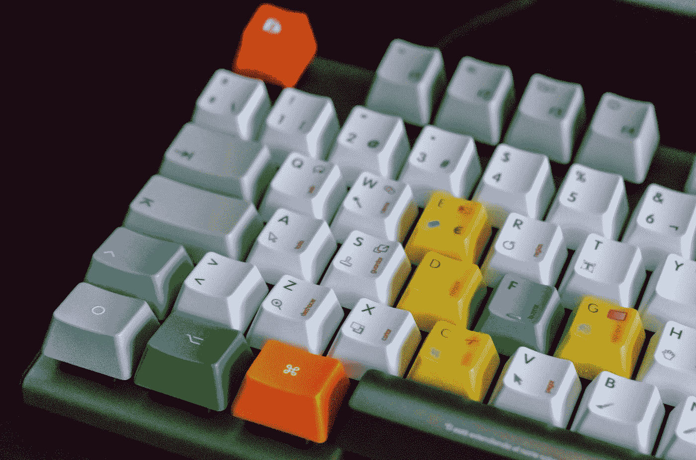

# 您需要知道的所有命令行键盘快捷键

> 原文：<https://betterprogramming.pub/boost-your-command-line-productivity-with-keyboard-shortcuts-4de2f6cbd069>

## 使用这些键盘快捷键提升您的 CLI 技能



[胡安·戈麦斯](https://unsplash.com/@nosoylasonia?utm_source=medium&utm_medium=referral)在 [Unsplash](https://unsplash.com?utm_source=medium&utm_medium=referral) 上拍照

无论您是希望学习新的快捷方式的经验丰富的命令行人员，还是因为讨厌使用箭头一次一个字符地浏览长命令来更改行尾或行首的参数而避免使用终端，本文都适合您。

我整理了一个清单，我认为是你可以在终端上使用的最有用的快捷键。

至于 shell，我使用的是 [Zsh](https://ohmyz.sh/) ，但是大多数快捷键也适用于 [Bash](https://www.gnu.org/software/bash/) 。最后，我还展示了如何创建自己的自定义快捷方式！

# 目录

```
· [Shell Line Editor](#6410)
  ∘ [Switching modes](#163b)
· [Emacs Mode](#7dd9)
  ∘ [Moving the Cursor](#4d01)
  ∘ [Editing Text](#8a88)
  ∘ [Command Completion](#e495)
  ∘ [Managing the Screen](#f95d)
  ∘ [Managing Processes](#3ace)
  ∘ [Accessing Command History](#6a21)
· [Vi Mode](#ce4b)
  ∘ [Commands](#90ea)
  ∘ [Why not both?](#c977)
· [Custom Keyboard Shortcuts](#ecb7)
  ∘ [Line editor commands](#bf34)
  ∘ [Macros](#cde1)
  ∘ [Shell commands](#f3cf)
```

# 外壳行编辑器

行编辑器是一种文本编辑器，允许用户编辑代表命令的行。这是您可能与之交互的 shell 的第一部分，因为它处理您键入的所有命令。

每个 shell 都提供某种行编辑功能，包括输入和删除字符、单词导航、删除行等。

Zsh(和 Bash) 行编辑器*，*有两种操作模式，一种(默认)基于 [Emacs](https://www.gnu.org/software/emacs/) *，*，另一种基于 [vi](https://www.vim.org/) *。*我推荐从 Emacs 模式开始，掌握它，后期尝试 vi 模式。

我不会深入讨论行编辑器是如何工作的，如果你感兴趣，你可以找到更多关于 [zle (Zsh 行编辑器)](http://zsh.sourceforge.net/Guide/zshguide04.html)和[Readline](https://www.gnu.org/software/bash/manual/html_node/Command-Line-Editing.html)(Bash 使用的)的信息。

## 切换模式

虽然 Emacs 模式是默认的，但是如果您将`$EDITOR`设置为 vi (或任何包含“vi”*的编辑器，如 [vim](https://www.vim.org/) )，VI 模式将被启用。*

*要切换到 Emacs 模式，运行(或添加到您的`.rc`文件):*

```
*# zsh
bindkey -e# bash
set -o emacs*
```

*要切换到 vi 模式，运行(或添加到您的`.rc`文件):*

```
*# zsh
bindkey -v# bash
set -o vi*
```

*要列出所有当前的键绑定，请运行:*

```
*# zsh
bindkey# bash
bind -P*
```

*Zsh 和 Bash 都支持键映射，所以您可以在不同的时间激活不同的键绑定。*

# *Emacs 模式*

## *移动光标*

*   *`CTRL-A` / `HOME`:移动到一行的开头。*
*   *`CTRL-E` / `END`:移动到一行的末尾。*
*   *`CTRL-B` / `LEFT`:左移一个字符。*
*   *`CTRL-F` / `RIGHT`:右移一个字符。*
*   *`ALT-B` / `CTRL-LEFT`:左移一个字。*
*   *`ALT-F` / `CTRL-RIGHT`:右移一个字。*
*   *`CTRL-XX`:按住`CTRL`按两次`X`将光标移动到行首，再次按住`CTRL`按两次`X`将光标移回。*

## *编辑文本*

*   *`CTRL-U`:剪切所有字符。*
*   *`CTRL-K`:剪切光标右侧的字符。*
*   *`CTRL-H` / `BACKSPACE` / `DELETE (MACOS)`:向左删除一个字符。*
*   *`CTRL-D` / `DELETE` / `FN DELETE (MACOS)`:向右删除一个字符。*
*   *`CTRL-W`:向左切一个字。*
*   *`ALT-D`:向右切一个字。*
*   *`CTRL-Y`:粘贴之前剪切的字符。*
*   *`CTRL-_`:撤销最后一次编辑。*
*   *`CTRL-XE`:打开`$EDITOR`编辑线条。*
*   *`ALT-U`:将右边一个字改为大写。*
*   *`ALT-L`:将右边一个字改为小写。*

## *命令完成*

*   *`TAB`:尝试对当前单词进行 shell 扩展。如果失败，尝试完成。*

```
*gi<TAB>     # git
ls *<TAB>   # ls folder1 folder2 file3*
```

*   *`CTRL-G`:列出当前单词的扩展。*

## *管理屏幕*

*   *`CTRL-L`:清屏(跟`clear`一样)。*
*   *`CTRL-S`:停止屏幕输出。有助于防止进程向 stdout 发送垃圾邮件。*
*   *`CTRL-Q`:恢复屏幕输出。*

## ***管理流程***

*   *`CTRL-C`:终止前台进程。(也可以用来删除整行。)*
*   *`CTRL-Z`:暂停前台进程(使用`fg`和`bg`恢复)。*
*   *`CTRL-D:`退出外壳(就像`exit`)。*

## *访问命令历史记录*

*   *`CTRL-R`:搜索命令历史。用`ENTER` / `RETURN`接受，用`CTRL-G`中止。*
*   *`CTRL-P` / `UP`:历史上的上一条命令。*
*   *`CTRL-N` / `DOWN`:历史中下一个命令。*

# *Vi 模式*

*就像任何基于 vi 的编辑器一样，vi 模式可以在*插入模式*(按键在屏幕上产生文本)或*正常模式*(按键代表编辑命令)*下运行。**

## *命令*

*要切换到正常模式，按下`ESC`或`CTRL-[`，默认情况下，不会有任何关于当前激活模式的视觉指示。如果你想切换回插入模式，就像 vi 一样，按`a`(或者`A`、`i`、`I`，取决于你想光标在哪里)。*

*有关更多命令，请参见此[备忘单](https://vim.rtorr.com/)。*

*所以，在 vi 模式下，如果你想删除整行，你可以按`ESC`(切换到命令模式)、`dd`(删除该行)和`a`(切换回插入模式)。*

*根据您的 shell，或者如果您有任何插件，一些基于 Emacs 的快捷键可能在插入模式下工作。*

## *为什么不两者都要？*

*如果你和我一样喜欢这两种模式，有一个非常好的 [Zsh 插件](https://github.com/softmoth/zsh-vim-mode)，它不仅通过更多的功能增强了 vi 模式，如模式视觉指示器和对[环绕绑定](https://sourceforge.net/p/zsh/code/ci/master/tree/Functions/Zle/surround)的支持，而且还使大多数 Emacs 键绑定可用。*

# *自定义键盘快捷键*

*添加自己的键盘快捷键很容易。如果你不确定哪个代码代表一个组合键(例如`ALT-Z`是 *^[z* )，先按`CTRL-V`再按组合键。*

## *行编辑器命令*

*有关 Zsh 可绑定命令的列表，请访问[这个站点](http://zsh.sourceforge.net/Doc/Release/Zsh-Line-Editor.html#Standard-Widgets)，有关 Bash 的，请访问[这个站点](https://www.gnu.org/software/bash/manual/html_node/Bindable-Readline-Commands.html)。*

*例如，将`undo`绑定到`ALT-Z`:*

```
*# zsh
bindkey '^[z' undo# bash
bind '"^[z":undo'*
```

## *宏指令*

*您也可以绑定字符串:*

```
*# zsh
bindkey -s '^[[24~' 'You`ve just pressed F12'# bash
bind '"\e[24~":"You`ve just pressed F12"'*
```

## *Shell 命令*

*您还可以定义键绑定来执行 shell 命令，而不影响当前命令行。*

*将打印当前目录绑定到`CTRL-P`:*

```
*# bash
bind -x '"\C-p":"pwd"'*
```

*有了 Zsh，它稍微复杂一点，但是更加灵活。我们通过[小工具](http://zsh.sourceforge.net/Guide/zshguide04.html)实现这一点:*

*多亏了[benot de Chezelles](https://medium.com/u/dbe7934987a2?source=post_page-----4de2f6cbd069--------------------------------)，这里有一个更好的版本，在命令行下面显示了结果:*

# *结论*

*我错过了什么有用的捷径吗？让我知道。*

*感谢阅读——我希望你今天学到了一些新东西。*

*保重，下次再见。*