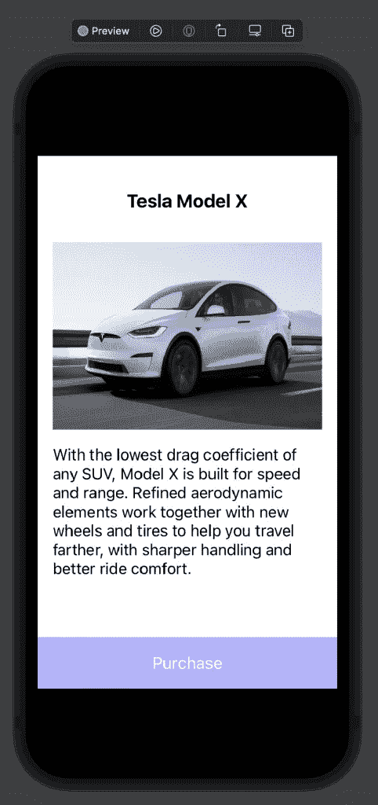
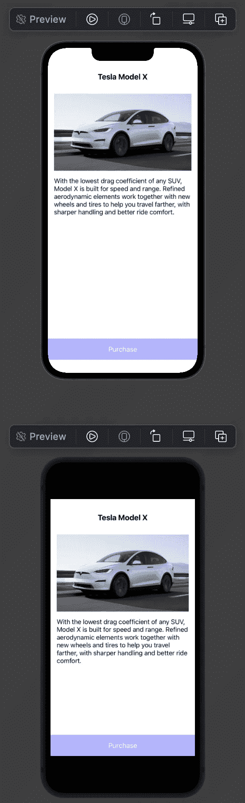

# 利用 SwiftUI 预览加快 iOS 开发时间

> 原文：<https://betterprogramming.pub/boost-your-ios-development-time-by-leveraging-swiftui-previews-c6b4e0d2d57c>

## 使用 SwiftUI 预览预览 UIViewController


格伦·卡斯滕斯-彼得斯在 [Unsplash](https://unsplash.com?utm_source=medium&utm_medium=referral) 上的照片

SwiftUI 是游戏规则的改变者，自从它发布以来已经给我们带来了很多好处。

然而，关于 SwiftUI 是否足够稳定以用于生产代码的问题仍然存在。对此，我的回答是，是的。它比几年前发布的任何时候都更稳定。

另一个问题可能是您的现有代码仅利用 UIKit，并且没有迁移到 SwiftUI 的策略——因此您无法在项目中看到 SwiftUI 的优势。我的意思是，让我们从小处着手，了解 SwiftUI Preview 的存在以及它如何改变您编写代码的方式。

今天，您将了解到使用 SwiftUI Preview 的一个额外好处，无论您的代码风格如何。

# 常见问题

构建和运行一个应用程序只是为了查看您所做的 UI 更改，这很麻烦。更糟糕的是，有时构建需要很长时间，或者有时你在模拟器上停留在一个空白屏幕上，你将不得不退出模拟器并重建一切。

最坏的情况是:清理构建并删除派生数据，然后重新构建所有内容，这又需要 30 分钟。

仅仅为了看到最小的 UI 变化，这个过程本身就很耗时。

# SwiftUI 预览版解决方案

无论你是用编程的方式还是通过 XIB/故事板来编写你的 UI，这都会让你受益匪浅，节省你很多时间，因为你真正需要看到的只是你所做的小小的 UI 修改。你可以在`UIView`或`UIViewController`上这样做，因为几乎所有的东西都在它们下面，你基本上可以在任何东西上使用它。

SwiftUI Preview 的另一个优点是，它允许您在可以触发操作的预览本身上进行交互。例如，单击一个按钮会出现一个弹出窗口或导航到不同的屏幕。

# 带有 SwiftUI 预览的 UIViewController

让我们创建一些代码来为`UIViewController`启用 SwiftUI 预览。为此，请使用以下代码创建一个新文件。

```
import SwiftUI@available(iOS 13, *)
// 1
public struct ViewControllerPreview<ViewController: UIViewController>: UIViewControllerRepresentable {
    let viewController: ViewController // 2
    public init(_ builder: @escaping () -> ViewController) {
        viewController = builder()
    }

    // 3
    public func makeUIViewController(context: Context) -> ViewController {
        viewController
    }

    // 4
    public func updateUIViewController(_ uiViewController: ViewController, context: Context) {}
}
```

1.  苹果创建了`UIViewControllerRepresentable`协议来管理 SwiftUI 界面中的 UIKit `ViewController`。
2.  初始化`ViewController`。
3.  用它的初始状态创建`ViewController`对象。
4.  用 SwiftUI 中的信息更新`ViewController`。这是必需的，并故意留为空白，因为我们只关注创作。

# 使用 SwiftUI 预览进行预览

现在您已经设置了上面的代码，现在您可以在您的`UIViewController`上使用它了。

这段代码可以放在`ViewController`的底部。

只需将`ViewController()`替换为您想要预览的文件的名称。

```
import SwiftUIstruct ViewControllerExamplePreview: PreviewProvider {
    static var previews: some View {
        ViewControllerPreview {
            ViewController()   
        }
    }
}
```



您将不再需要构建和运行应用程序来查看您所做的 UI 更改。这无疑会让你的开发时间节省很多。

# 预览多个设备

另一个你可能使用的用例是在无凹槽和凹槽手机上看到变化。例如，iPhone 8、iPhone SE、iPhone 8 Plus 没有安全区域，而 iPhone X、iPhone 11、iPhone 12 有安全区域。如果约束设置不正确，UI 有时看起来会有点不同。

预览这两种类型的 iPhones，将节省您大量的时间来构建和运行一次又一次。只需一行代码，您就可以在 SwiftUI Preview 上轻松做到这一点。

根据你需要的 iPhone 类型，你可以只写它的名字(iPhone X)或者型号类型(iPad8，1)。

```
import SwiftUIstruct ViewControllerExamplePreview: PreviewProvider {
    static var previews: some View {
        ViewControllerPreview {
            ViewController()
        }
        .previewDevice("iPhone 13")

        ViewControllerPreview {
            ViewController()
        }
        .previewDevice("iPhone 8")
    }
}
```



显然，如果按钮底部约束扩展到 iPhone 13 的安全区域会更好。在这里，你会立刻发现什么是缺失的部分。这绝对是一个节省时间的方法。