# 使用这些控制台技巧提高您的 JavaScript 调试技能

> 原文：<https://betterprogramming.pub/boost-your-javascript-debugging-skills-with-these-console-tricks-ab984c70298a>

## JavaScript 给了我们很多调试代码的工具

[Tracy Adams](https://unsplash.com/@tracycodes?utm_source=medium&utm_medium=referral) 在 [Unsplash](https://unsplash.com?utm_source=medium&utm_medium=referral) 上拍摄的照片

调试 JavaScript 代码的千篇一律的方法是通过`console.log`方法简单地输出结果。虽然这种方法可行，但它并不是最佳的做事方式。如果有更好的方法，为什么不去探索呢？

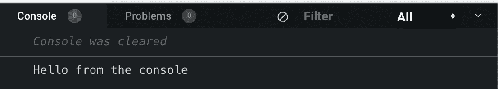

"控制台上的你好"

`console`对象提供对浏览器调试控制台的访问。只有在浏览器上运行您的 JavaScript 代码，即客户端代码，而不是服务器端代码时，您才能使用`console`对象。它的工作方式因浏览器而异，但实际上通常会提供一组特性。调试语句最好的部分是它们可以与所有的库和框架一起工作，因为它们是在核心语言中烘焙的。

`console.log`最基本的用例是显示代码的输出。以下面的代码为例:

它记录传递给`sayHello`函数的名字。

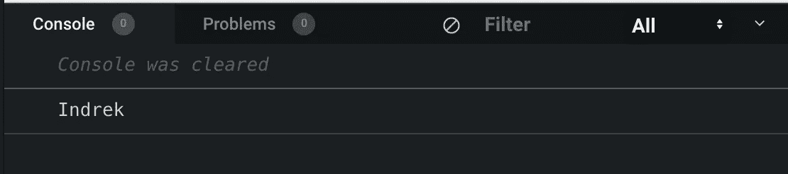

输出传递给函数的名称

如果我们想知道需要调用多少次`sayHello`函数呢？有一个简单的方法。叫`console.count()`。

# `console.count`

`count()`用那个标签输出它被调用的次数。如果没有参数，`count()`的行为就好像它是用默认标签调用的一样。

上面的代码记录了以下内容:

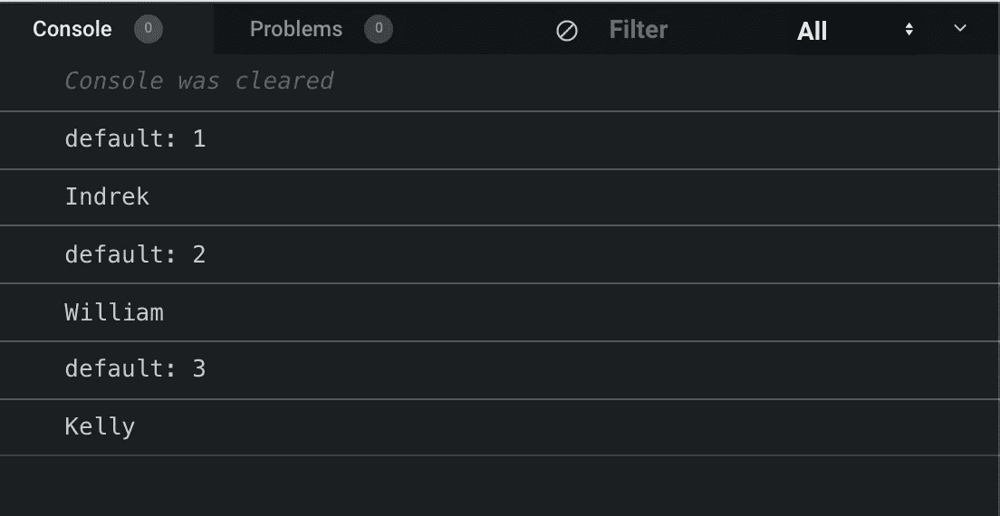

计算我们调用 sayHello 函数的次数

这给了我们一个调用函数的次数的计数，但是如果我们想计算我们调用同名函数的次数呢？方法是简单地将`name`参数传递给`count`方法。

瞧！这个函数记录了我们用每个名字调用这个函数的次数。

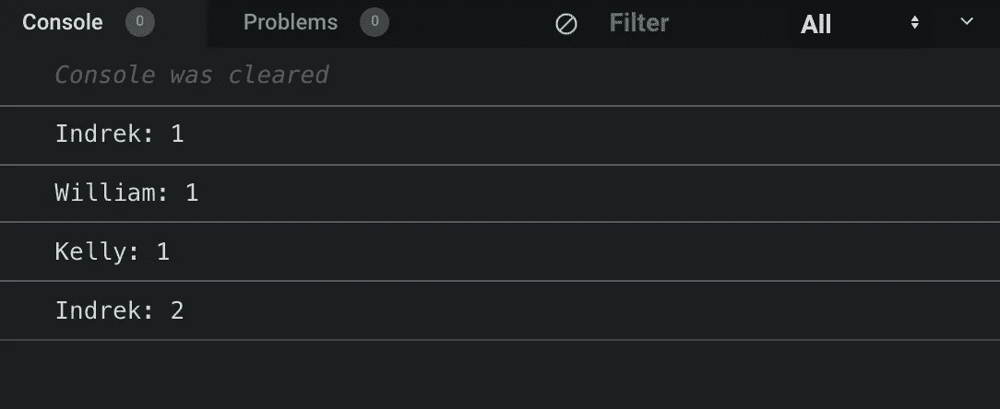

数着我们说出每个名字的次数

# 控制台.警告

下面的方法向控制台输出警告消息。当使用开发人员工具或 API 时，这很有用。`console.warn`非常适合让用户知道某些事情可能不正确，比如省略一个参数或者让开发人员知道 API/包版本被否决。

上面的代码检查 name 参数是否传递给了函数。如果没有传递名称，它会记录一条警告消息，提示它考虑一些事情。

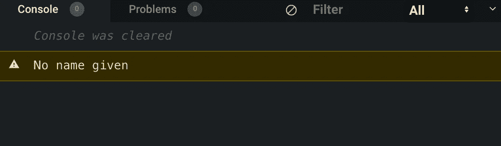

当没有传递名称时，向用户显示警告消息。

# 控制台.表格

如果我们正在处理数组或对象，那么在显示数据时，`console.table`是很有用的。数组中的每个元素都是表中的一行。以下面的例子为例，我们有一系列的水果。如果我们将水果数组传递给`console.table`方法，我们应该会看到一个打印到控制台的表格。

如果我们看一下控制台，应该会看到一个描述我们阵列的表格。

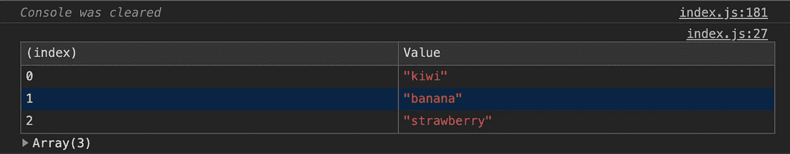

以表格形式显示我们的数组

你可以想象，当我们处理包含数百个甚至数千个值的大型数组时，这将变得多么有用。为了说明这一点，这里有一个例子，我们在数组中有更多的值。

如果我们用数组调用`console.table`，我们应该会看到下表。

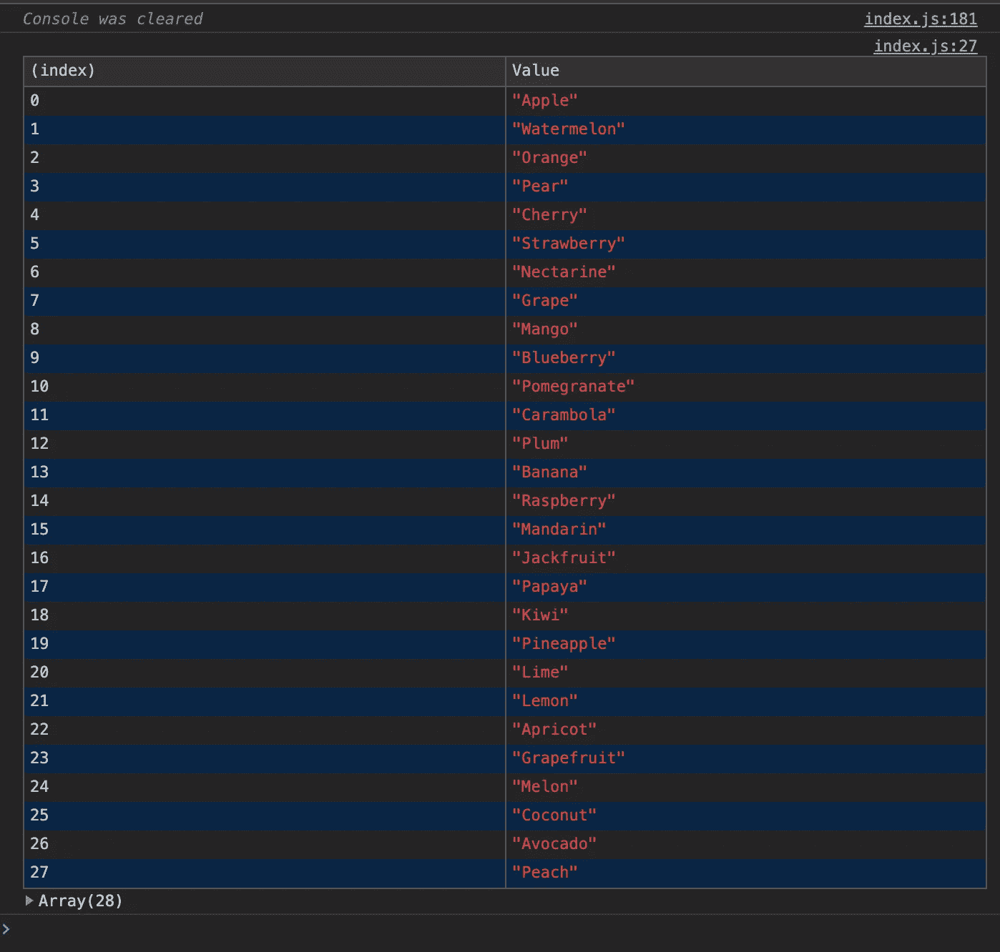

在表格中展示所有水果

使用数组非常简单。如果我们用物体来代替呢？

注意现在我们有了一个对象而不是一个数组。该对象持有两把钥匙:宠物的`name`和`type`。

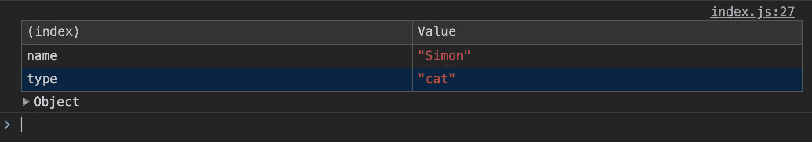

该表显示值、键和值，而不是像以前那样记录值。如果我们多了一个对象，并试图将它表化呢？

正如所料，这两个单独的对象显示在两个不同的表中。

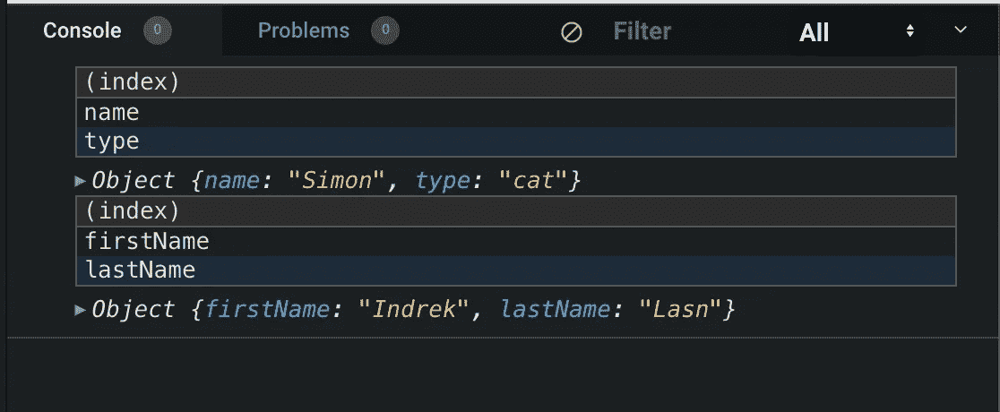

两个物体

如果我们想把它们放在一个表中，就把它们放在一个数组中。

现在我们将对象分组到一个表中。

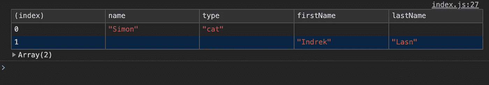

通过将对象包装在一个数组中来对它们进行分组

# 控制台.组

使用集合或链接数据时，使用嵌套组有助于通过可视化关联相关消息来组织输出。要创建新的嵌套块，调用`console.group()`。

以下代码显示嵌套的块级控制台语句，这在处理基于关系的数据时非常有用。

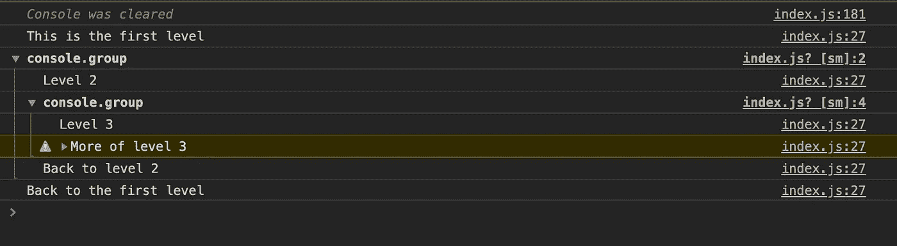

`console.groupCollapsed()`方法类似，但是新块是折叠的，需要点击一个显示按钮来阅读。

# 摘要

使用语言赋予我们的所有工具。如果使用它有意义，就使用它。简单提一下:我们现在跳过了`debugger`，因为它本身就值得一整章。

如果你对`debugger`，[感到好奇，这里有篇文章](https://medium.com/@indreklasn/how-to-find-bugs-in-your-code-with-the-debugger-a7f739ea98)。

 [## 如何用调试器发现代码中的错误

### 调试器；

medium.com](https://medium.com/@indreklasn/how-to-find-bugs-in-your-code-with-the-debugger-a7f739ea98) 

如果你是 JavaScript 新手，想学习这门语言，我建议你从阅读书籍和构建东西开始。从《 [*一个更聪明的学习 JavaScript 的方法*](https://amzn.to/2LOkzjj) 》和[这本书开始吧，这里有一个要构建的有趣应用的列表](https://medium.com/better-programming/the-secret-to-being-a-top-developer-is-building-things-heres-a-list-of-fun-apps-to-build-aac61ac0736c)。

感谢阅读。保持牛逼。