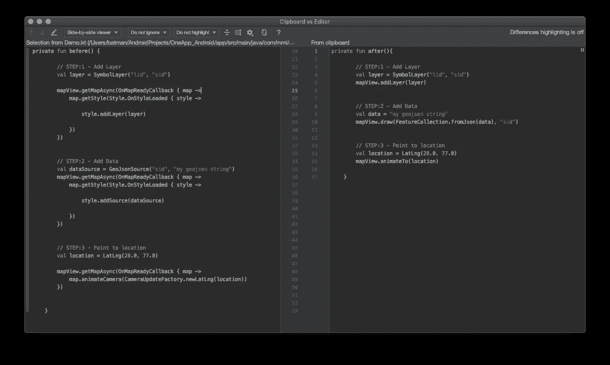

# 使用扩展和高阶函数提高您的 Kotlin 生产率

> 原文：<https://betterprogramming.pub/boost-your-kotlin-productivity-with-extensions-and-higher-order-functions-a19ebaf2aeac>

## 让你的代码更干净，更易于管理


来自 [Pexels](https://www.pexels.com/photo/blur-close-up-code-computer-546819/?utm_content=attributionCopyText&utm_medium=referral&utm_source=pexels) 的 [luis gomes](https://www.pexels.com/@luis-gomes-166706?utm_content=attributionCopyText&utm_medium=referral&utm_source=pexels) 的照片。

在 Google I/O 2017 上，谷歌宣布编程语言 [Kotlin](https://kotlinlang.org/) 现已正式支持 Android 应用开发。从此，再也没有回头。截至 Google I/O 2019，Android 移动开发一直是 Kotlin-first。

我将描述 Kotlin 的两个特性，它们是我生活中不可或缺的，而不是对它的所有特性大谈特谈，比如空安全性、数据类、过滤或 Java 的可解释性。他们保证为你节省时间。

# 扩展ˌ扩张

Kotlin 提供了用新功能扩展类的能力，而不必从类继承或使用设计模式，如装饰器。这是通过称为扩展的特殊声明来完成的。您可以创建函数、类成员等的扩展。

简单地说，这就是扩展函数的工作方式:不用扩展一个类，你就在其中定义了一个函数，现在你可以在任何地方使用它。

要定义一个扩展函数，你所要做的就是定义一个名字为`<ClassNameYouWishToInherit>.<YouMethodName>`的函数。

```
 fun MutableList<Int>.swap(index1: Int, index2: Int) {
 val tmp = this[index1] // ‘this’ corresponds to the list
 this[index1] = this[index2]
 this[index2] = tmp
}
```

# 如何利用它们提高生产力

让我们从一个非常简单的用例开始。在 Android 开发中，有一些你经常使用的通用代码(例如，显示一个祝酒词，一个简单的警告对话框，等等。).为此，您每次都必须编写同样粘人的代码行:

```
Toast.makeText(this.*applicationContext*, txt, Toast.*LENGTH_SHORT*).show()
```

## 扩张函数的魔力

让我们创建一个扩展函数来显示祝酒词:

在上面的代码片段中，我们为`Activity`类创建了扩展函数`toast`。现在你所要做的就是调用`Activity`类中的`toast`:

类似地，我们可以为`LayoutInflator`创建扩展函数:

```
fun View?.layoutInflator() = LayoutInflater.from(this?.*context*)

fun ViewGroup?.layoutInflator() = LayoutInflater.from(this?.*context*)

fun Fragment?.layoutInflator() = LayoutInflater.from(activity?.context)
```

在上面的代码片段中，我们为`View`、`ViewGroup`，甚至是`Fragment`类创建了一个扩展。

## 更复杂的用例

现在让我们来看看实际的用例。前几天，我发现自己在做地图盒子 SDK。代码大概是这样的:

它在 Java 中的样子。

在科特林是什么样子。

救援的扩展功能:

只要一句话，你就完成了。

在上面的代码片段中，我们直接创建了一个`MapView`的扩展函数。所有获得回调然后添加层的代码都是通过简单地调用`MapView`的`addLayer`扩展函数来完成的。

`addLayer`函数现在将被视为`MapView`类自己的函数。

另一种方法是扩展`MapView`类并添加这些函数。但是，当您可以添加一个扩展函数时，为什么要经历这么多痛苦并重构您现有的代码呢？

我们将进一步优化这一点。

# 高阶函数

高阶函数是以函数为参数或返回函数的函数。

> “Kotlin 函数是 [*一级*](https://en.wikipedia.org/wiki/First-class_function) ，这意味着它们可以存储在变量和数据结构中，作为参数传递给其他[高阶函数并从其返回](https://kotlinlang.org/docs/reference/lambdas.html#higher-order-functions)。您可以用任何可能用于其他非函数值的方式来操作函数。— [正式文件](https://kotlinlang.org/docs/reference/lambdas.html)

示例:

```
fun sayHello(funcAsArg: (String) -> Unit) {
 funcAsArg(“Hello”)
}
```

在上面的代码片段中，我们创建了接受另一个函数作为参数的`sayHello`函数。并且这个函数接受`String`作为参数，返回`Unit`(类似 Java 中的`void`)。

在这些函数作为参数的帮助下，我们可以摆脱为这样简单的用例定义接口(例如，只有一个方法用于回调的接口)。

我们可以通过移除接口来进一步优化代码，因为接口很难维护，除了用于回调之外，在这里没有任何用处。

用 HoF 替换回调接口。

# 最终代码

最后，我们的 Mapbox 扩展 Kotlin 文件看起来像这样(如下)。

最终 MapboxExtension.kt。

我们已经创建了几个扩展函数(用于获取`Map`实例、`Style`实例、添加`Layer`等)。).

有了扩展函数和 Hof 处理的所有东西，我们的代码变得更加紧凑和可读。

## 代码比较



之前= 53 行|之后= 17 行

后面的*(右侧)看起来紧凑，可读性强，同时也省去了我们反复写重复代码的麻烦。*

# 参考

*   延伸:【https://kotlinlang.org/docs/reference/extensions.html 
*   高阶函数:[https://kotlinlang . org/docs/reference/lambdas . html #高阶函数](https://kotlinlang.org/docs/reference/lambdas.html#higher-order-functions)

# 结束语

仅凭这两个特性，您就可以实现很多目标。天空是极限。试试它们，并评论它们如何让你的生活变得更轻松。此外，请随意评论您使用 Kotlin 的体验，以及您如何从中获得最大收益。

仅此而已！我希望你喜欢这篇文章。