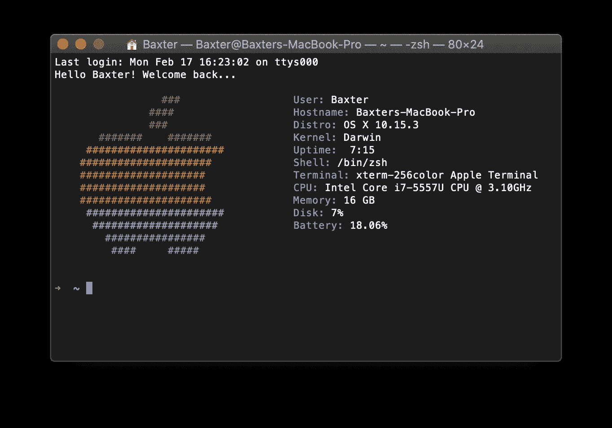
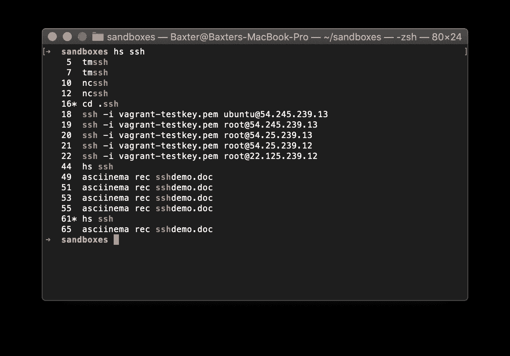
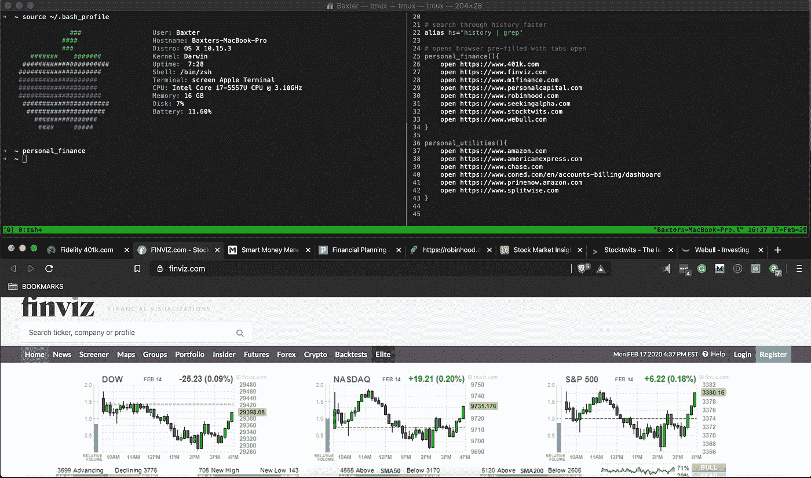

# 使用别名和函数提高您的工作效率

> 原文：<https://betterprogramming.pub/boost-your-productivity-with-aliases-and-functions-88eaf0fa0fb4>

## 利用您的 bash 配置文件:macOS 和 Linux 用户实用技巧


建立快捷方式和功能来提高您的工作效率

如果你读过我以前的文章，我有多讨厌使用任何形式的图形用户界面都不是新闻。我提倡任何想提高生产率的人放弃 GUI，开始尽可能多地利用 CLI 实用程序。

大多数 Mac 和 Ubuntu 用户都了解利用终端等工具在快速高效的命令中执行批量操作的威力，如`move`、`copy`、`delete`和`transfer`。

那些都是有用的，但是如果你想上… 下一关呢？

# 利用 Bash 配置文件

用最简单的话来说，用户的`.bash_profile`是一个命令的占位符，当一个新的终端窗口打开并且 bash 被调用时，这些命令将被执行。



我的 bash 个人资料用一个可爱的彩色苹果标志和一些系统信息来迎接我…就像低电量！

由于`.bash_profile`文件是在新的终端窗口启动或会话时执行的，我们可以放置命令并添加要执行和读取的文件。这在尝试定制 shell 环境以提高生产率和效率时很有价值。

我将介绍别名的一些常见用法，以及我如何将它们(以及函数)合并到我的工作流中。

# 改进现有 CLI 命令

通过 GUI 在 CLI 中工作已经有了它的好处。我在之前的一篇文章中谈到了很多。虽然 CLI 命令已经通过减少通过传统 GUI 完成的重复任务提高了工作效率，但是在 CLI 环境中工作时仍然存在重复任务。

例如，创建一个目录之后，几乎总是要进入该目录。或者，如果您正在进入一个现有的目录，那么几乎总是会列出该目录的内容。创建一个函数可以消除这些重复的任务。

我最喜欢的一个简单技巧是将`history`命令和`grep`命令结合起来，以提高准确性，并减少滚动 5000 行历史来查找几天前编写的特定命令所需的时间。



用两个字符的命令查找我的所有 ssh 会话。还有，那些都是假 IP 所以不用麻烦了。

下面是我使用的一些快捷方式别名，它们删除了令人讨厌的、感觉多余的两部分组合命令。

```
**# Bash function to change directories and list contents** cd() {
  builtin cd $@
  ls -lh
}**# Bash alias to search through history with speed accuracy**
alias hs='history | grep'**# Bash alias to create unique date-stamped folders for Vagrant vms** alias vgu18='mkdir ubuntu18_$dt; cd ubuntu18_$dt; vagrant init ubuntu/bionic64; vagrant up; vagrant ssh'
```

# 操纵浏览器和选项卡

一旦你掌握了别名的窍门以及如何使用它们来改进你的工作流程，你最终会遇到需要更多逻辑和工程的情况。

创建自定义函数并把它们放到你的`.bash_profile`中是为日常命令的快捷方式赢得一些时间的好方法。

```
**# opens browser pre-filled with tabs** 
personal_finance(){
    open [https://www.401k.com](https://www.401k.com)
    open [https://www.finviz.com](https://www.finviz.com)
    open [https://www.m1finance.com](https://www.m1finance.com)
    open [https://www.personalcapital.com](https://www.personalcapital.com)
    open [https://www.robinhood.com](https://www.robinhood.com)
    open [https://www.seekingalpha.com](https://www.seekingalpha.com)
    open [https://www.stocktwits.com](https://www.stocktwits.com)
    open [https://www.webull.com](https://www.webull.com)
}
```

我创建了一个功能，可以打开我在查看市场或新闻时经常访问的所有金融网站。虽然这看起来微不足道，但是将这些过程打包成一个函数赋予了我调用这个函数的灵活性和创造性。

# 让我们看一个实际的例子

是的，我可以打开浏览器，输入所有这些网站，得到同样的结果。见鬼……我甚至可以将所有这些网站分组到一个书签子文件夹中，然后点击一个按钮就可以启动所有这些书签。标准的东西。

但我说的不是标准的东西。我说的是运行 cron jobs，在周一到周五每天早上 9:00，开市前半小时调用一个函数，启动你当天需要的网站，同时屏蔽你觉得分散注意力的域名，比如 Twitter 和 Reddit，或者无用的域名，比如 CNN。



调用 personal_finance 函数会启动一个带有我列出的选项卡的浏览器

还有其他自动化工具，但是使用 bash 函数、cron 作业和一点逻辑，您可以根据自己的喜好自动化您的工作或开发环境，甚至可以自动化到每天的每一分钟——而且是免费的。

您甚至可以通过具体指定哪个浏览器打开哪个站点来进一步定制。我喜欢为了不同的目的而分开我的浏览器。

*   谷歌浏览器严格用于与工作/开发相关的项目
*   Safari 适合兼职和自由职业者
*   勇者浏览器是个人查看等。

通过为每个浏览器创建功能并在这些浏览器中定义标签，我每周都可以节省几个小时，因为我不需要在每个浏览器中输入每个地址，而且更重要的是，我避免了社交媒体和 YouTube 等干扰。

# 设置开发环境

当我自学如何编码和构建系统时，我很难拥有一个测试脚本或自动化部署的环境。我住在纽约的一个小公寓里，所以家庭网络实验室的空间和面积有限。云服务，如 AWS 和数字海洋，对我来说仍然太可怕而不敢涉足(巨额账单的恐怖故事把我吓跑了，直到我自学)。

软件和服务，如 vagger 和 VirtualBox，成为我测试脚本和自动化解决方案的首选工具。但是，我很快发现自己无法跟踪所有的流浪虚拟机，所以我构建了一个功能，帮助我在一个定制的带日期标记的系统中自动化、组织和部署服务器。

```
**# Launch Vagrant boxes based on user input
# Folders are date-stamped and numbered accordingly.**ubuntufleet(){
 n=0
 echo "How many machines do you want?"; read n; \
 for i in {1..$n..1}; do \
  dt=$(date +"%m-%d-%y")
  id=$i
  FOLDER=$(echo ubuntu18_${dt}_${id}); \
  echo $FOLDER; mkdir $FOLDER; cd $FOLDER; vagrant init ubuntu/bionic64; \
  cd ../; \
  unset FOLDER; echo $id; unset id; \
 done
}
```

在任何目录中运行`ubuntufleet`然后部署用户声明的许多服务器。


我的 ubuntufleet 函数正在运行

# 结论

最后，我想承认这种级别的定制并不适合所有人，而且看起来可能有些过头了。如果你使用 Macbook 只是为了查看邮件和浏览社交媒体，我不会反对这一点。

但是对于专业开发人员，甚至只是一般的专业人员，重复的任务和多余的步骤会占用你大量的时间、精力和动力。

找到可以简化和优化的工作流，并以任何可能的方式实现自动化，这符合您的最大利益。我之所以选择 bash 别名和函数，是因为我觉得它最舒适、最灵活、最细粒度。