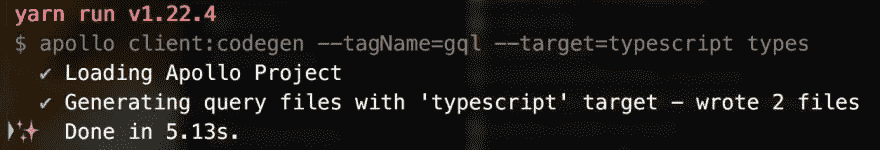
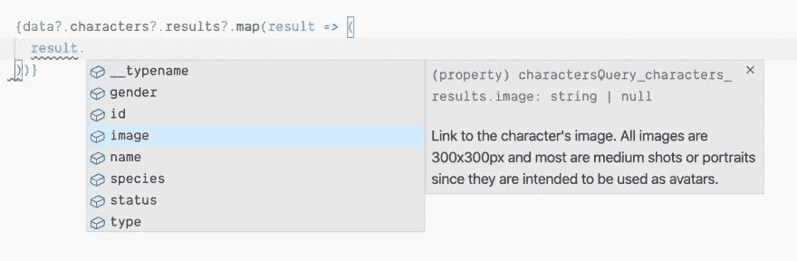

# 使用 Apollo Hooks 和 TypeScript 提高您的生产力

> 原文：<https://betterprogramming.pub/boost-your-productivity-with-apollo-hooks-and-typescript-91f246fdef95>

## 使用 Apollo 代码生成生成类型


由 [SpaceX](https://unsplash.com/@spacex?utm_source=unsplash&utm_medium=referral&utm_content=creditCopyText) 在 [Unsplash](/s/photos/rocket?utm_source=unsplash&utm_medium=referral&utm_content=creditCopyText) 上拍摄的照片。

在这个世界上，TypeScript 正成为许多 web 应用程序必不可少(几乎是必需的)的一部分，了解如何在我们当前堆栈中的许多库上使用它是非常有用的。

如果你正在使用一个已经使用了 TypeScript 的 React 应用程序，并且你也使用了 [Apollo](https://www.apollographql.com/) ，这个指南将帮助你开始一起使用它们来利用静态类型。

# 开始我们的项目

让我们在新应用中配置 Apollo:

```
yarn add apollo-boost @apollo/react-hooks apollo
```

现在，让我们创建 Apollo 客户机，并将其用于 React 应用程序。

在`App.tsx`上，添加以下代码:

# 编写一些查询

现在我们已经在应用程序中配置了 Apollo，让我们编写一些查询来从 API 中获取数据。

让我们在`src`文件夹中创建一个名为`queries.ts`的新文件，并添加我们的第一个查询来获取字符:

上面的查询使用了一些变量来过滤字符并对列表进行分页。看`results`里面的字段。那些是属于角色的。还有一些，但这些是目前最相关的。

现在，创建一个名为`Characters.tsx`的新字段。这是我们将使用查询并发出请求的地方:

为了更好地理解这一点，我们来分解一下:

*   `useQuery` —根据 [Apollo 的文档](https://www.apollographql.com/docs/react/data/queries/)，这是在 Apollo 应用程序中执行查询的主要 API。不再需要高阶元件。只需使用`useQuery`，它将返回一个包含`loading`、`error`和`data`属性的对象。
*   `charactersQuery` —这是我们之前写的查询。将它传递给`useQuery`钩子，它将返回数据。

将这个新的`Characters`组件导入到 app 中，你会看到所有角色的数据。

# 生成类型

这是我最喜欢的部分:您可以为查询生成类型。使用 Apollo Codegen 将使我们在编写代码时大大提高生产率。

之前，我们安装了`apollo`库，所以现在我们将在项目的根目录下创建一个配置文件(`apollo.config.js`):

让我们在`package.json`上包含一个新的脚本来运行它并生成类型:

`tagName`标志是使用的模板文字标签的名称(在本例中是`gql`),`target`是要使用的代码生成器的类型，最后的`types`是输出和所有类型将要存放的新文件夹。

查看[文档](https://github.com/apollographql/apollo-tooling#apollo-clientcodegen-output)以了解您可以设置的其他选项。

所以现在你已经准备好在控制台上运行`yarn run apollo:codegen`，看看会发生什么:



检查您的项目，您应该会看到两个新文件夹。我们只需要里面有`charactersQuery.ts`文件的那个。

# 使用带挂钩的类型

让我们回到`Characters`组件。现在我们已经生成了类型，下一部分很简单:

导入这些类型，将它们包含在`useQuery`钩子上，现在就可以开始了:



因为我们已经包含了变量的类型，如果您尝试:

它将抛出一个错误:

```
Type 'string' is not assignable to type 'number | null | undefined'.ts(2322)
```

# 结论

一般来说，我尝试在我所有的项目中使用 TypeScript。拥有查询和变异的类型节省了我很多时间。我希望你觉得这是有用的。