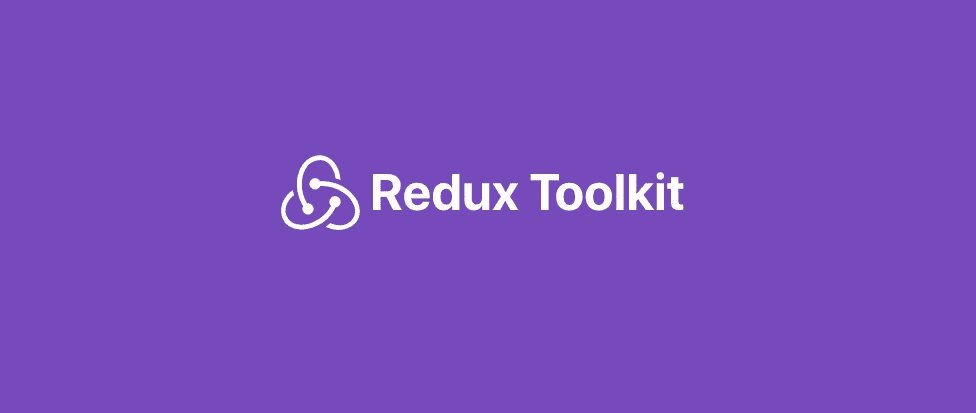
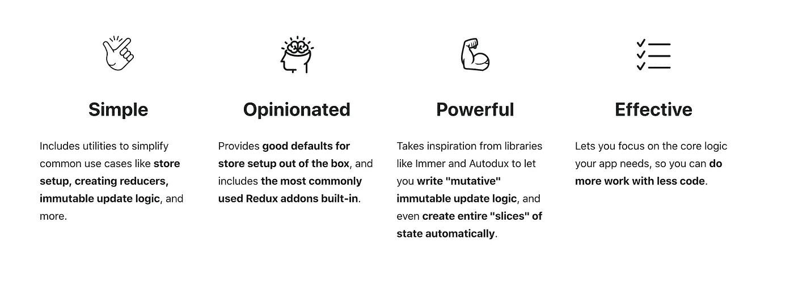
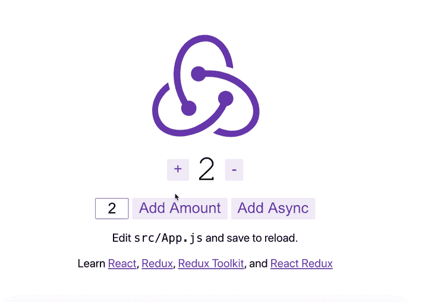

# 使用 Redux 工具包提高您的工作效率

> 原文：<https://betterprogramming.pub/boost-your-productivity-with-the-redux-toolkit-7a14657351c3>

## Redux Toolkit 是官方的、固执己见的、包含电池的工具集，用于高效的 Redux 开发



官方的、固执己见的、包含电池的高效 Redux 开发工具集。来源: [Redux 工具包](https://redux-toolkit.js.org/)

Redux 是管理应用程序全局状态的优秀工具。React 非常适合前端库，如 React、Vue 或 Angular。

不过，Redux 是有代价的——设置起来很繁琐，而且有相当一部分样板代码。

[redux toolkit](https://github.com/reduxjs/redux-toolkit) 包解决了 redux 库的一些痛点——比如编写过多的样板代码。


来源: [redux-toolkit](https://github.com/reduxjs/redux-toolkit)

Redux 工具包旨在成为编写 Redux 逻辑的标准方法。最初创建它是为了帮助解决 Redux 的三个常见问题。

*   配置 Redux 存储太复杂了。
*   我必须添加很多包才能让 Redux 做任何有用的事情。
*   Redux 需要太多样板代码。



来源: [redux-toolkit](https://redux-toolkit.js.org/)

# 入门指南

使用 React 和 Redux Toolkit 启动新应用的推荐方式是使用[官方 Redux+JS 模板](https://github.com/reduxjs/cra-template-redux)用于[创建 React 应用](https://github.com/facebook/create-react-app)，该模板利用了 React Redux 与 React 组件的集成。

```
npx create-react-app my-react-redux-app --template redux
```



Redux 应用程序运行在 [http://localhost:3000/](http://localhost:3000/)

# 标准商店设置

以下示例来自[配置您的商店](https://redux.js.org/recipes/configuring-your-store)页面。Redux 文档显示了一个典型的商店设置过程。

设置 Redux 存储是冗长的

上面的例子很冗长，而且并不总是简单明了。Redux `createStore`函数接受位置参数:`(rootReducer, preloadedState, enhancer)` —很容易忘记哪个参数是哪个。

设置中间件和增强器的过程可能会令人困惑，尤其是当您试图添加几个配置时。

Redux DevTools 扩展文档最初建议使用一些手工编写的代码来检查全局名称空间以查看扩展是否可用。这样做的问题是许多开发人员复制并粘贴这些代码片段——这使得安装代码整体上更难阅读。

# 使用 redux-kit 简化商店设置

让我们使用 redux-kit 库中的版本，而不是编写我们自己的存储。下面是一个如何导入和使用`configureStore`功能的例子。

使用`configureStore`最简单的方法是将根缩减器函数作为名为`reducer`的参数传递。

此外，`configureStore`默认添加了一些中间件，每个都有特定的目标:

*   `[redux-thunk](https://github.com/reduxjs/redux-thunk)`是最常用的中间件，用于处理组件之外的同步和异步逻辑
*   在开发中，检查常见错误的中间件，如改变状态或使用不可序列化的值。

## `configureStore`有助于

*   让 options 对象带有“命名的”参数，这样更容易阅读。
*   允许您提供想要添加到商店中的中间件和增强器的阵列。
*   为你呼叫`applyMiddleware`和`compose`。
*   启用现成的 Redux DevTools 扩展。

商店设置代码本身要短得多，也更容易阅读。它还为您提供了开箱即用的强大功能。

# 自定义商店设置

如果您需要自定义商店设置，您可以传递附加选项。

下面是使用 Redux Toolkit 的热重装示例。

如果您提供了`middleware`参数，`configureStore`将只使用您列出的任何中间件。

如果您想将一些定制的中间件和默认值捆绑在一起，您可以调用`[getDefaultMiddleware](https://redux-toolkit.js.org/api/getDefaultMiddleware)`并将结果包含在您提供的`middleware`数组中。

# 用`createReducer`简化减速器

Redux Toolkit 包括一个`createReducer`功能，类似于 Redux 文档中显示的功能。然而，我们的`createReducer`实用程序有一些特殊的“魔力”,让它变得更好。

它在内部使用了 [Immer](https://github.com/mweststrate/immer) 库，这允许你编写代码来“改变”一些数据，但是实际上是不变地应用更新。这使得在一个缩减器中意外地改变状态实际上是不可能的。

# 使用`createReducer Function`的注意事项

虽然 Redux Toolkit `createReducer`函数很有帮助，但请记住:

*   “变异”代码只能在我们的`createReducer`函数中正常工作。
*   Immer 不会让你混合“改变”草稿状态和返回一个新的状态值。

详见`[createReducer](https://redux-toolkit.js.org/api/createReducer)` [API 参考](https://redux-toolkit.js.org/api/createReducer)。

# 用`createAction`定义动作创建者

手动编写动作创建器会变得单调乏味，并且会引入大量样板代码。

Redux Toolkit 提供了一个名为`[createAction](https://redux-toolkit.js.org/usage/usage-guide#defining-action-creators-with-createaction)`的函数，它简单地生成一个动作创建器，该创建器使用给定的动作类型，并将其参数转换为`payload`字段。

`createAction`还接受一个“准备回调”参数，这允许您定制生成的`payload`字段，并可选地添加一个`meta`字段。

请参阅`[createAction](https://redux-toolkit.js.org/api/createAction#using-prepare-callbacks-to-customize-action-contents)` [API 参考](https://redux-toolkit.js.org/api/createAction#using-prepare-callbacks-to-customize-action-contents)了解有关使用准备回调定义动作创建者的详细信息。

如果你感到好奇，查看官方文档[进行深入探究。](https://redux-toolkit.js.org/usage/usage-guide)

# 结论

感谢您的阅读——希望您能发现新的方法。编码快乐！