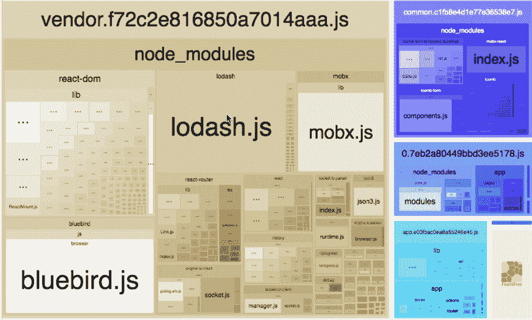
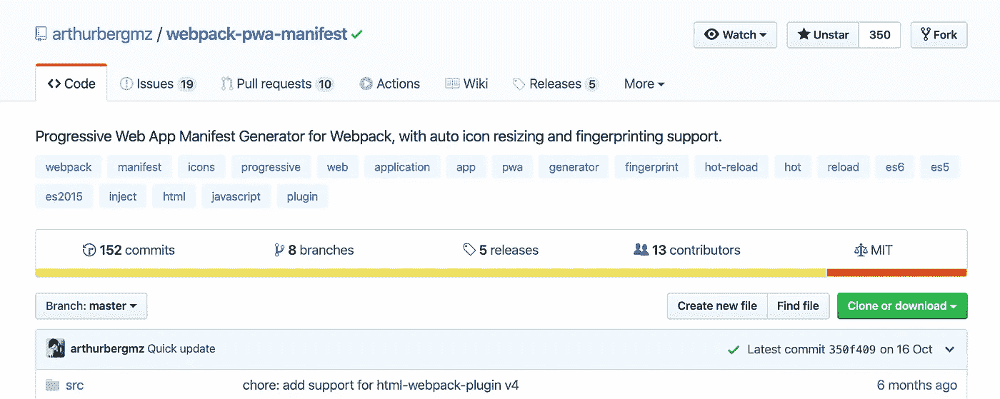
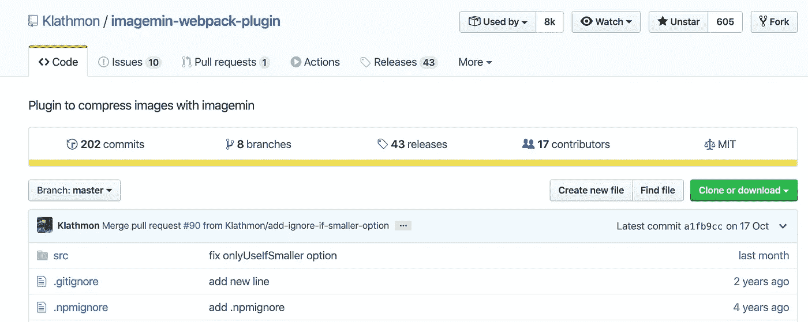
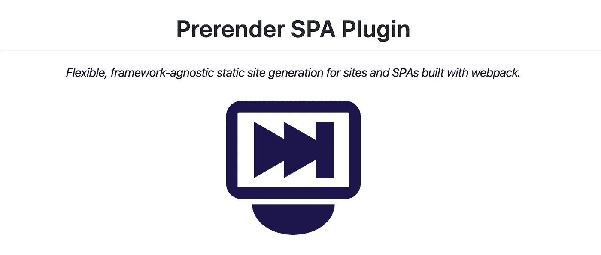
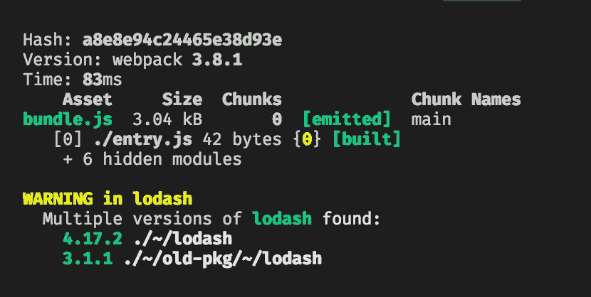

# 使用这 6 款出色的 webpack 插件提高您的工作效率

> 原文：<https://betterprogramming.pub/boost-your-productivity-with-these-6-awesome-webpack-plugins-23cee20d32ea>

## 插件是 webpack 的支柱


[webpack](https://webpack.js.org/) 标志

webpack 插件用于执行更广泛的任务，如包优化、资产管理和环境变量注入。

webpack 本身建立在您在 webpack 配置中使用的同一插件系统上。根据你如何使用 webpack，有多种方法可以使用插件。

事不宜迟，这里有六个很棒的 webpack 插件。

# Webpack 捆绑包分析器

使用交互式、可缩放的树状图来显示 webpack 输出文件的大小。



Webpack 捆绑包分析器—[https://github.com/webpack-contrib/webpack-bundle-analyzer](https://github.com/webpack-contrib/webpack-bundle-analyzer)

这个插件将帮助你做以下事情:

1.  意识到你的包裹里到底有什么
2.  找出哪些模块构成了包的大部分大小
3.  找到错误到达那里的模块
4.  优化您的 webpack 捆绑包

## 入门指南

```
# NPM
npm install --save-dev webpack-bundle-analyzer# Yarn
yarn add -D webpack-bundle-analyzer
```

## 使用

```
const BundleAnalyzerPlugin = require('[webpack-bundle analyzer](https://github.com/webpack-contrib/webpack-bundle-analyzer)');module.exports = {
  plugins: [
    new BundleAnalyzerPlugin()
  ]
}
```

# 离线插件

`offline-plugin`旨在为 webpack 项目提供离线体验。


离线插件—[https://github.com/NekR/offline-plugin](https://github.com/NekR/offline-plugin)

该插件使用`ServiceWorker`和`AppCache`作为引擎盖下的后备。只需在您的`webpack.config`中包含这个插件，并在您的客户端脚本中包含相应的运行时间，您的项目就会通过缓存所有(或部分)webpack 输出资产而准备好离线。

## 装置

```
npm install offline-plugin [--save-dev]
```

## 设置

首先，在您的`webpack.config`中实例化插件:

```
// webpack.config.js examplevar OfflinePlugin = require('[offline-plugin](https://github.com/NekR/offline-plugin)');module.exports = {
  // ... plugins: [
    // ... other plugins
    // it's always better if OfflinePlugin is the last plugin added
    new OfflinePlugin()
  ]
  // ...
}
```

(可选地，您可以使用[选项](https://github.com/NekR/offline-plugin/blob/master/docs/options.md)对其进行配置。)

然后，将[运行时间](https://github.com/NekR/offline-plugin/blob/master/docs/runtime.md)添加到您的条目文件中(通常是主条目):

```
require('[offline-plugin/runtime](https://github.com/NekR/offline-plugin)').install();
```

## ES6/巴别/类型脚本

```
import * as OfflinePluginRuntime from '[offline-plugin/runtime](https://github.com/NekR/offline-plugin)';OfflinePluginRuntime.install();
```

关于`TypeScript`的更多使用细节，请参见[这里的](https://github.com/NekR/offline-plugin/blob/master/docs/typescript.md)。

# web pack-pwa-清单

`webpack-pwa-manifest`将自己描述为“Webpack 的渐进式 Web 应用清单生成器，支持自动调整图标大小和指纹识别。”



web pack-pwa-manifest—[https://github.com/arthurbergmz/webpack-pwa-manifest](https://github.com/arthurbergmz/webpack-pwa-manifest)

`webpack-pwa-manifest`是一个 webpack 插件，它为你的渐进式 web 应用程序生成一个`manifest.json`。

如果您在配置中使用了`inject`，请确保`[HtmlWebpackPlugin](https://github.com/jantimon/html-webpack-plugin)`出现在`plugins`数组中*之前*之前`WebpackPwaManifest`。

## 特征

*   自动调整图标大小
*   图标指纹
*   明显的指纹
*   HTML 上的自动演示注入
*   热重装支持

## 装置

```
npm install --save-dev webpack-pwa-manifest
```

## 使用

在你的`webpack.config.js`:

```
import WebpackPwaManifest from '[webpack-pwa-manifest](https://github.com/arthurbergmz/webpack-pwa-manifest)'...plugins: [
  new WebpackPwaManifest({
    name: 'My Progressive Web App',
    short_name: 'MyPWA',
    description: 'My awesome Progressive Web App!',
    background_color: '#ffffff',
    crossorigin: 'use-credentials', //can be null, use-credentials or anonymous
    icons: [
      {
        src: path.resolve('src/assets/icon.png'),
        sizes: [96, 128, 192, 256, 384, 512] // multiple sizes
      },
      {
        src: path.resolve('src/assets/large-icon.png'),
        size: '1024x1024' // you can also use the specifications pattern
      }
    ]
  })
]
```

# imagemin-web pack-插件

`imagemin-webpack-plugin`是一个用 [imagemin](https://github.com/imagemin/imagemin) 压缩图像的 webpack 插件。



imagemin-web pack-plugin—[https://github.com/Klathmon/imagemin-webpack-plugin](https://github.com/Klathmon/imagemin-webpack-plugin)

## 安装

```
npm install imagemin-webpack-plugin
```

## 使用

```
import ImageminPlugin from '[imagemin-webpack-plugin](https://github.com/Klathmon/imagemin-webpack-plugin)'module.exports = {
  plugins: [
    // Make sure that the plugin is after any plugins that add images
    new ImageminPlugin({
      disable: process.env.NODE_ENV !== 'production', // Disable during development
      pngquant: {
        quality: '95-100'
      }
    })
  ]
}
```

# prerender-spa-插件

`prerender-spa-plugin`将静态 HTML 预渲染到单页应用程序中。



prerender-spa-plugin—[https://github.com/chrisvfritz/prerender-spa-plugin](https://github.com/chrisvfritz/prerender-spa-plugin)

这个插件的目标是提供一个简单的预渲染解决方案，该解决方案易于扩展，可用于任何使用 webpack 构建的网站或单页应用程序。

## 什么是预渲染？

最近，服务器端呈现(SSR)席卷了 JavaScript 前端世界。事实上，你现在可以在把你的站点和应用程序发送到你的客户端之前，在服务器上渲染它们，这绝对是一个革命性的想法(而且完全不是 JS 客户端应用程序流行之前每个人都在做的事情)。

然而，对 PHP、ASP、JSP(以及诸如此类的)网站有效的批评，今天也适用于服务器端呈现。它很慢，很容易出错，并且很难正确实现。

事情是，不管每个人可能告诉你什么，你可能不需要 SSR。通过使用预渲染，您可以获得它的几乎所有优点(没有缺点)。预渲染基本上就是启动一个无头浏览器，加载应用程序的路线，并将结果保存到一个静态 HTML 文件中。然后，您可以使用以前使用的任何静态文件服务解决方案来服务它。它只是和 HTML5 导航之类的一起工作。无需更改代码或添加服务器端渲染解决方案。

## 安装

```
yarn add -D prerender-spa-plugin
```

## 基本用法

```
const path = require('[path](https://nodejs.org/api/path.html)')
const PrerenderSPAPlugin = require('[prerender-spa-plugin](https://github.com/chrisvfritz/prerender-spa-plugin)')module.exports = {
  plugins: [
    ...
    new PrerenderSPAPlugin({
      // Required - The path to the webpack-outputted app to prerender.
      staticDir: path.join(__dirname, 'dist'),
      // Required - Routes to render.
      routes: [ '/', '/about', '/some/deep/nested/route' ],
    })
  ]
}
```

# 复制-软件包-检查器-网络包-插件

这是一个 webpack 插件，当你的包包含同一个包的多个版本时会发出警告。



duplicate-pack-checker-web pack-plugin—[https://github . com/darrensserri/duplicate-pack-checker-web pack-plugin](https://github.com/darrenscerri/duplicate-package-checker-webpack-plugin)

## 为什么？

由于不同的包版本，单个包可能会多次包含在 webpack 包中。这种情况可能在没有任何警告的情况下发生，导致您的包额外膨胀，并且可能导致难以发现的错误。

这个插件会警告你这种情况，以最小化包的大小，避免意外的重复包引起的错误。

动机:[web pack/web pack/issues/385](https://github.com/webpack/webpack/issues/385)和[web pack/web pack/issues/646](https://github.com/webpack/webpack/issues/646)。

## 安装

```
npm install duplicate-package-checker-webpack-plugin --save-dev
```

## 使用

将插件添加到您的 webpack 配置中:

```
const DuplicatePackageCheckerPlugin = require("[duplicate-package-checker-webpack-plugin](https://github.com/darrenscerri/duplicate-package-checker-webpack-plugin)");module.exports = {
  plugins: [new DuplicatePackageCheckerPlugin()]
};
```

# 结论

感谢阅读。我希望你学到了新东西。webpack 对我们 web 开发人员来说是一个很好的工具——充分利用它的所有优势。编码快乐！

如果你是 JavaScript 新手，想学习这门语言，我建议你从阅读书籍和构建东西开始。从《[](https://amzn.to/2LOkzjj)*】学习 JavaScript 的更聪明的方法》这本书开始，这里有一个有趣的应用程序列表，可以构建。r*