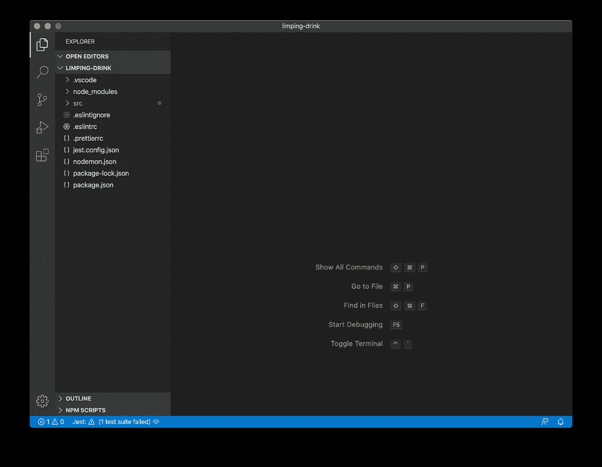
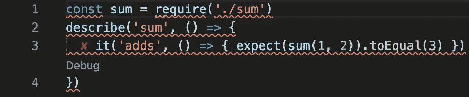
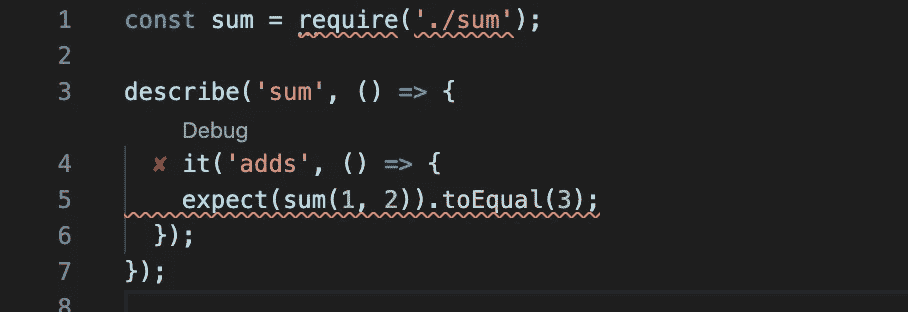
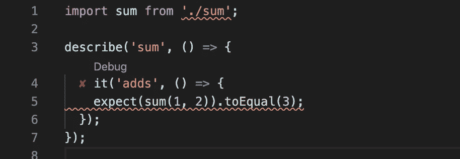
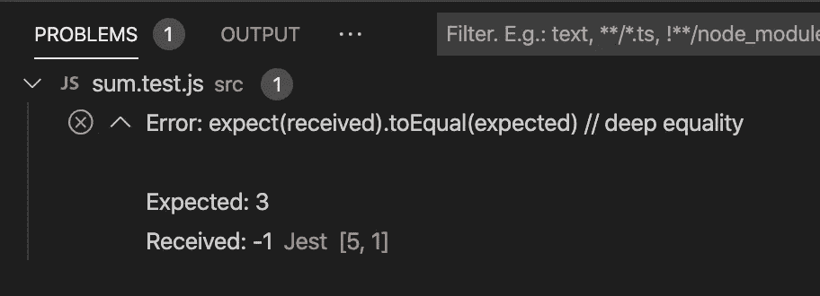
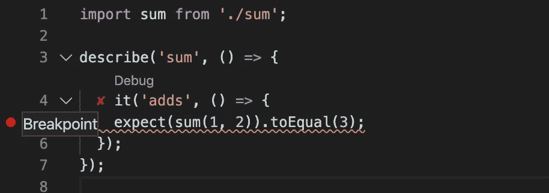
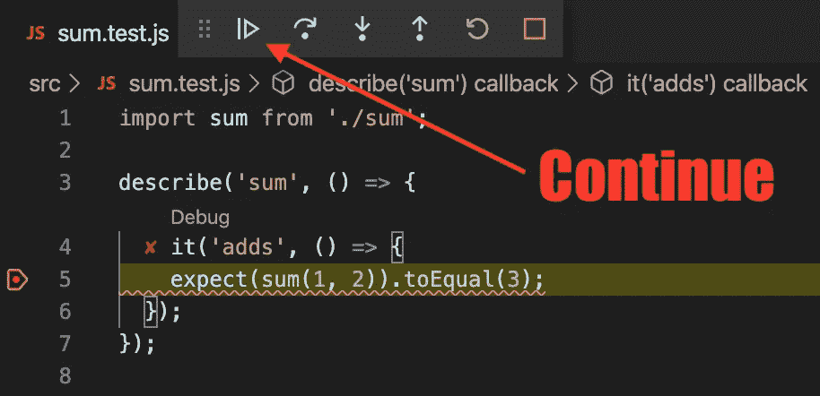

# Bootstrap a VS 代码和 Node.js 开发环境

> 原文：<https://betterprogramming.pub/bootstrap-a-vs-code-and-node-js-development-environment-6e817d6c0a87>

## 用代码完成、林挺等等来设置我们的环境


照片由[奥泽尔·戈麦斯](https://unsplash.com/@ozgomz?utm_source=medium&utm_medium=referral)在 [Unsplash](https://unsplash.com?utm_source=medium&utm_medium=referral) 上拍摄

# 介绍

在本教程中，我们将引导一个后端 JavaScript 开发环境，支持现代 JavaScript 语法、智能代码完成、连续林挺、连续样式和连续测试。我们将在 Mac 上使用 [Node.js](https://nodejs.org/) (Node)作为我们的运行时，在 [Visual Studio 代码](https://code.visualstudio.com/) (VS 代码)中设置环境。

**剧透预警！**[github.com/bacongravy/bootstrap-vscode-node](https://github.com/bacongravy/bootstrap-vscode-node)项目包含遵循本教程的结果。如果您不理解本教程，您可以尝试克隆该项目并从那里开始。

# 目标

在我们开始教程之前，让我们回顾一下我们的五个主要目标。

## 1.现代(ES2019) JavaScript 语法

*我们将拥有现代的 JavaScript 特性，如箭头函数、导入/导出、异步/等待和对象休息/传播属性。*

截至最新的 LTS 版本 12，Node 几乎完全支持 ES2019 标准中的所有内容，除了本机(ES6 风格)模块。我们将使用 [Sucrase](https://sucrase.io/) 编译器在运行 Node 之前转换我们的代码，这样我们就可以编写本地 ES6 模块，而不是传统的 Node CommonJS 模块。虽然当前版本的 Node 对本机模块有实验性的支持，但通过使用 Sucrase 并限制我们自己在代码中使用主流 ES6 语法，我们可以针对任何版本的 Node，一直到 LTS 版本 8。

## 2.智能代码完成

*我们将拥有智能代码完成功能。*

VS Code 是一个免费的开源代码编辑器。它包括一个基于[typescript](https://www.typescriptlang.org/)t 语言服务的智能感知特性，为 JavaScript 提供智能完成和参数信息。这个特性是默认启用的，这也是使用 VS 代码进行 JavaScript 开发的一个重要原因。

## 3.连续林挺

我们将拥有持续的林挺和自动修复保存行为。

ESLint 是一个高度可配置的静态分析器，能够在你的代码运行之前报告其中的问题。例如，它可以检测你是否使用了未定义的变量。它甚至可以帮你修改代码(有时)。

我们将配置 ESLint 使用流行的 [Airbnb JavaScript 风格指南](https://github.com/airbnb/javascript)中的规则，这样我们的代码就遵循了通用标准。我们将使用 VS 代码扩展将连续静态分析集成到源代码编辑器视图中，并且我们将配置 VS 代码使用 ESLint 在每次保存代码时自动修复它所能修复的一切。

VS 代码中的 TypeScript 语言服务支持推断 JavaScript 文件中的类型，并报告它检测到的任何类型错误，因此我们也将启用连续林挺特性。

## 4.连续造型

*我们将会有自动保存样式的行为。*

是一个自以为是的代码格式化程序，它理解 JavaScript 代码格式化惯例。它考虑了最大行长度，如果单行语句太长，它会将单行语句重组成多行语句，使代码更具可读性。它通过将代码解析为抽象语法树(AST ),然后根据自己的一致规则重新打印代码，从而消除了所有定制样式。

我们将配置 ESLint 应用更漂亮的样式作为可修复的林挺规则，并在每次保存代码时自动样式化代码。我们还将安装一个 VS 代码扩展，并将其配置为自动格式化-保存其他文件格式(JSON、HTML、Markdown、YAML 等)。)，也是。

## 5.连续测试

*每当我们在项目中修改和保存文件时，我们都会进行持续的测试。*

Jest 是一个关注简单性的测试框架。它很容易与我们选择的其他工具集成，并且运行速度非常快。我们将安装一个 VS 代码扩展，当我们的工作空间打开时，它在观察模式下运行 Jest。每当我们保存代码时，我们将立即看到我们的测试是通过还是失败。该扩展与源代码一起内联报告状态，并使一次点击即可调试失败的测试变得容易。

# 辅导的

我们将从全新的 Mac 开始。如果您已经安装了最新版本的[自制软件](https://brew.sh/)、节点和 VS 代码，您可以跳到**安装 VS 代码扩展**部分。

首先，我们将使用 Homebrew 中的`brew`来安装 Node 和 VS 代码，使用 VS 代码中的`code`来安装扩展。然后我们将使用来自节点的`npm`来安装模块。最后，我们将配置这些组件，使它们能够协同工作。当我们完成时，我们将通过编写一个测试并用 VS 代码调试它来测试我们的开发环境。

## 安装自制软件

家酿是一个软件包管理器。它包括一个命令`brew`，我们将用它来安装一些包。请按照 [brew.sh](https://brew.sh) 中的说明立即安装。

## 安装节点

节点是我们的运行时目标，也是驱动我们将要使用的大多数工具的引擎。我们用自制软件安装节点包，包括`node`、`npm`和`npx`。安装运行时:

```
brew install node
```

## 安装 VS 代码

VS Code 是一个可扩展的源代码编辑器，它将托管我们的开发环境。安装应用程序:

```
brew cask install visual-studio-code
```

除了`Visual Studio Code.app`之外，Homebrew 包还安装了命令行工具`code`，接下来我们将使用它来安装我们的 VS 代码扩展。

## 安装 VS 代码扩展

为了将 ESLint、Prettier 和 Jest 完全集成到 VS 代码中，我们需要一些 VS 代码扩展。安装扩展:

```
code --install-extension dbaeumer.vscode-eslint
code --install-extension esbenp.prettier-vscode
code --install-extension Orta.vscode-jest
```

## 创建项目

在安装节点模块之前，我们需要位于项目目录中。如果您还没有，那么开始为项目创建一个空目录，并用`npm`初始化它。运行以下命令:

```
PROJECT_NAME="$(npx project-name-generator -o dashed)"
mkdir "${PROJECT_NAME}"
cd "${PROJECT_NAME}"
npm init -y
```

我们使用`npx`运行`project-name-generator`，它为我们生成一个随机的项目名称。如果你愿意，请随意选择你自己的名字。我们运行`npm init`来生成一个`package.json`文件。目前默认设置是好的。

## 安装蔗糖酶

Sucrase 是一个编译器，它允许我们在代码中使用导入/导出语句，就像我们在编写本机 ES6 模块而不是节点 CommonJS 模块一样。安装编译器:

```
npm install -D sucrase
```

## 安装 Nodemon

Nodemon 是一个实用程序，它运行我们的代码，然后观察变化。每当我们进行修改时，它都会重新加载我们的代码。安装实用程序:

```
npm install -D nodemon
```

## 安装 ESLint

ESLint 是一个静态分析器，但就其本身而言，它做的并不多。我们将在本教程的后面安装配置和插件，告诉 ESLint 如何施展魔法。安装静态分析仪:

```
npm install -D eslint
```

## 安装 Airbnb JavaScript 风格指南规则

Airbnb JavaScript 风格指南非常受欢迎(GitHub 上的> 93K 明星)，其中包括 ESLint 规则，用于执行其中的许多部分。有一个完整版本的配置支持 JSX 和反应，但我们只打算在我们的项目中使用基本配置。安装配置及其插件依赖项:

```
npm install -D eslint-config-airbnb-base \
               eslint-plugin-import
```

## 安装额外的 ESLint 插件

因为我们的目标是 Node，所以我们将安装一个 ESLint 插件，它包括所有节点全局规则和其他节点环境特有的细节。Airbnb 风格指南没有关于承诺的意见，所以我们将安装一个插件来为他们强制一些代码风格。安装插件:

```
npm install -D eslint-plugin-node \
               eslint-plugin-promise
```

## 安装更漂亮

更漂亮的代码格式化程序与 ESLint 很好地集成在一起，首先禁用所有与更漂亮相冲突的 ESLint 规则，然后添加规则来实施更漂亮的样式。安装配置和插件:

```
npm install -D prettier \
               eslint-config-prettier \
               eslint-plugin-prettier
```

## 安装 Jest

Jest 是一个快速易用的测试运行程序。Jest 与 Sucrase 集成在一起，所以我们可以用与主要代码相同的 JavaScript 方言编写测试。ESLint 有一个 Jest 插件，让我们的测试套件看起来很漂亮。有一个 Jest 类型包，这样 VS 代码类型检查器就不会抱怨 Jest 全局变量了。安装测试转轮和集成:

```
npm install -D jest \
               @sucrase/jest-plugin \
               eslint-plugin-jest-formatting \
               @types/jest
```

# 配置一切

我们刚刚安装的组件需要进行配置，以便彼此协同工作。我们将在项目目录中创建一些文件来配置它们。

## 创建`nodemon.json`

运行以下命令创建文件:

```
cat >nodemon.json <<EOF
{
  "execMap": {
    "js": "sucrase-node"
  }
}
EOF
```

这个文件配置 Nodemon 使用蔗糖酶。

## 创建`.eslintrc`

运行以下命令创建文件:

```
cat >.eslintrc <<EOF
{
  "extends": [
    "airbnb-base",
    "plugin:node/recommended-module",
    "plugin:promise/recommended",
    "plugin:jest-formatting/recommended",
    "plugin:prettier/recommended"
  ],
  "plugins": ["import"],
  "env": {
    "jest": true
  },
  "rules": {
    "no-console": 0
  }
}
EOF
```

这个文件配置 ESLint 使用 AirBnB 风格指南、`node`和`promise`插件，以及 Jest 和更漂亮的集成。我们启用了`jest`环境，以便 ESLint 了解 Jest globals。最后，我们禁用`console.log`的 ESLint 警告。

## 创建`**.eslintignore**`

运行以下命令创建文件:

```
cat >.eslintignore <<EOF
dist
EOF
```

这个文件配置 ESLint 忽略`dist`目录，Sucrase 将在那里输出我们编译的代码。

## 创建`**.prettierrc**`

运行以下命令创建文件:

```
cat >.prettierrc <<EOF
{
  "tabWidth": 2,
  "semi": true,
  "singleQuote": true,
  "trailingComma": "all"
}
EOF
```

这个文件配置得更漂亮，以匹配我们选择使用的 Airbnb 风格指南。

## 创建`**jest.config.json**`

运行以下命令创建文件:

```
cat >jest.config.json <<EOF
{
  "collectCoverage": true,
  "collectCoverageFrom": ["src/**/*.js", "!**/node_modules/**"],
  "coverageDirectory": "coverage",
  "testPathIgnorePatterns": ["<rootDir>/dist/", "<rootDir>/node_modules/"],
  "transform": {
    ".(js|jsx|ts|tsx)": "[@sucrase/jest-plugin](http://twitter.com/sucrase/jest-plugin)"
  }
}
EOF
```

这个文件配置 Jest 来创建代码覆盖率，忽略`dist`目录，并使用 Sucrase 来转换它加载的文件。

## 创造`**.vscode**`

运行以下命令创建目录:

```
mkdir .vscode
```

VS 代码在我们项目的这个目录中查找工作区设置和启动配置。

## 创造`**.vscode/settings.json**`

运行以下命令创建文件:

```
cat >.vscode/settings.json <<EOF
{
  "editor.formatOnSave": true,
  "[javascript]": {
    "editor.formatOnSave": false
  },
  "editor.codeActionsOnSave": {
    "source.fixAll": true
  },
  "prettier.disableLanguages": ["javascript"],
  "[json]": {
    "editor.defaultFormatter": "esbenp.prettier-vscode"
  },
  "javascript.implicitProjectConfig.checkJs": true
}
EOF
```

这个文件配置 VS 代码在保存时自动格式化所有文件。JavaScript 文件禁用了使用 beauty VS 代码扩展的格式化，这样 ESLint 和 beauty ESLint 插件就可以施展它们的魔法了。

文件中的最后一个设置将 VS 代码配置为使用 TypeScript 语言服务在 JavaScript 文件中进行类型检查。

## 创建`**.vscode/launch.json**`

运行以下命令创建文件:

```
cat >.vscode/launch.json <<'EOF'
{
  "version": "0.2.0",
  "configurations": [
    {
      "type": "node",
      "request": "launch",
      "name": "src/index.js",
      "skipFiles": [
        "<node_internals>/**",
        "${workspaceFolder}/node_modules/**"
      ],
      "runtimeArgs": ["-r", "sucrase/register"],
      "cwd": "${workspaceFolder}",
      "program": "${workspaceFolder}/src/index.js"
    },
    {
      "type": "node",
      "request": "launch",
      "name": "vscode-jest-tests",
      "skipFiles": [
        "<node_internals>/**",
        "${workspaceFolder}/node_modules/**"
      ],
      "args": ["--runInBand"],
      "cwd": "${workspaceFolder}",
      "program": "${workspaceFolder}/node_modules/jest/bin/jest"
    }
  ]
}
EOF
```

这个文件包括两种调试代码的方法。第一个配置允许我们从`src/index.js`开始调试我们的项目。Jest 扩展使用第二种配置来运行单独的测试，并允许我们调试整个测试套件。

## 更新`**package.json**`

运行以下命令来更新文件:

```
node -e "
  const fs = require('fs');
  let p = JSON.parse(fs.readFileSync('package.json'));
  p.scripts = JSON.parse(fs.readFileSync(process.stdin.fd));
  fs.writeFileSync('package.json', JSON.stringify(p, null, 2));
" <<EOF
{
  "start": "nodemon src/index.js",
  "build": "sucrase -t imports src --out-dir dist --ignore node_modules",
  "lint": "eslint src --color",
  "lint:fix": "eslint src --fix --color",
  "lint:check": "eslint --print-config .eslintrc | eslint-config-prettier-check",
  "test": "jest",
  "test:watch": "jest --watchAll",
  "serve": "node dist/index.js"
}
EOF
```

`start`脚本使用`nodemon`来运行我们的节点应用程序，并在我们的代码改变时重启它。

`build`脚本使用 Sucrase 编译成从`src`到`dist`的代码，`server`脚本运行从`dist`编译好的节点 app。

`lint`脚本检查代码的 lint 问题，其中一些问题可以用`lint:fix`脚本修复。`lint:check`脚本验证 ESLint 规则不与 Prettier 规则冲突。

`test`脚本运行 Jest，`test:watch`脚本在观察模式下运行 Jest。

大多数时候，你将从 VS 代码中使用的唯一的`package.json`脚本是`start`。当您从 VS 代码外部访问项目时，其他脚本更有用。

# 尝试一下

为了感受我们的新开发环境，我们将通过编写一个失败的测试，然后实现代码使测试通过，来实践测试驱动设计(TDD)。

我们可以使用`code`在 VS 代码中从当前目录打开一个新的工作区窗口。我们将触摸一些文件来创建它们，然后打开工作区:

```
mkdir src
touch src/sum.js src/sum.test.js
code .
```

迎接我们的应该是这样的景色:



显示空项目的 Visual Studio 代码

您可能会注意到，在窗口左下角的蓝色状态栏中，Jest 已经检测到了我们的测试文件，并试图运行它，但由于它是空的，所以没有成功。现在让我们在测试文件中放些东西。

最终，我们将编写一个返回两个数之和的函数，但首先，我们将编写该函数的测试。打开文件`src/sum.test.js`，将以下内容粘贴到编辑器中:

这段代码是故意不正确的，这样我们就可以看到 VS 代码对它的反应。当您第一次将它粘贴到编辑器中时，由于缺少换行符和分号，您应该会看到一堆红色的曲线:



一堆红色的曲线

保存文档后，您应该看到代码自动用空格和分号格式化。一些曲线消失了，但是一个红色的曲线仍然在`require`的上方:



错误的模块导入和失败的测试

VS 代码告诉我们，这段代码使用了 CommonJS 模块加载语法(`require`)，但是我们已经将项目配置为需要本地模块加载语法(`import`)。我们可以让 VS Code 为我们解决这个问题，方法是单击带有红色波浪下划线的文本，然后单击旁边出现的黄色灯泡图标，并选择“Convert to ES6 Module”:


将模块转换为 ES6

保存文件，发现还有两个问题:linter 抱怨模块`./sum`还没有定义，而 test runner 抱怨它不能运行测试。



缺失的模块和失败的测试

让我们通过解决这两个问题来让我们的测试通过。打开名为`src/sum.js`的文件，将以下内容粘贴到编辑器中:

这段代码是故意不正确的，这样我们可以 Jest 如何报告测试失败。现在保存文件。Jest 检测到变化并重新运行测试。我们现在应该看到项目中的一个错误:


1 个错误 0 个警告

点击 VS 代码窗口左下角的蓝色和白色的问题状态项，显示问题视图。我们看到 Jest 告诉我们，该测试预期接收 3 个“但得到了”-1 个”:



问题视图中的 Jest 测试失败

这次测试失败是由于我们的`sum`函数中的一个错误。但是在我们修复它之前，让我们简单地看一下如何在 VS 代码中使用交互式调试器来调试测试。

如果您导航回`sum.test.js`文件，您应该在失败的`expect`断言下看到一个红色的曲线，在测试用例旁边看到一个红色的 X。在测试用例上面会出现一个 whispy 调试按钮。让我们通过点击悬停在横栏上行号左侧的红点，在带有`expect`调用的行上设置一个断点:



设置断点

现在单击调试按钮。您应该看到调试器启动，然后在您设置断点的那一行停止执行:



调试测试

我们现在实际上不需要调试这个测试，所以单击 Continue 按钮，让测试完成，调试会话结束。

现在让我们来修复这个错误。将`src/sum.js`中的`a - b`替换为`a + b`，并保存文件。请注意，测试失败会自动消失。恭喜你，你已经使用 TDD 和连续测试修复了你的第一个 bug！

我们的教程到此结束——剩下要做的就是开始添加包和编写代码。项目脚本和调试器配置被设置为期望您的应用程序入口点是`src/index.js`。祝你好运，别忘了玩得开心！

# 参考

我们在本教程中使用了以下工具和软件包:

*   [家酿](https://brew.sh/)——MAC OS 的“缺失包管理器”
*   [节点](https://nodejs.org/en/) —基于 Chrome 的 V8 JavaScript 引擎构建的 JavaScript 运行时
*   [蔗糖酶](https://sucrase.io/)——超快速巴别塔替代品
*   [Nodemon](https://nodemon.io/) —一个实用程序，它将监视源代码中的任何更改，并自动重启服务器
*   [ESLint](https://eslint.org/) —静态分析你的代码，快速发现问题
*   [AirBnB 风格指南](https://github.com/airbnb/javascript)——最合理的 JavaScript 方法
*   一个固执己见的代码格式化程序
*   [Jest](https://jestjs.io/)——专注于简单性的令人愉快的 JavaScript 测试框架
*   [Visual Studio 代码](https://code.visualstudio.com/)——代码编辑，重新定义，免费，基于开源，随处运行
*   [ESLint 扩展](https://marketplace.visualstudio.com/items?itemName=dbaeumer.vscode-eslint) —将 ESLint 集成到 VS 代码中
*   [漂亮——代码格式化程序扩展](https://marketplace.visualstudio.com/items?itemName=esbenp.prettier-vscode)——将漂亮集成到 VS 代码中
*   [Jest 扩展](https://marketplace.visualstudio.com/items?itemName=Orta.vscode-jest) —将 Jest 集成到 VS 代码中

# 承认

以下资源对本教程有影响:

*   [matheus-beck . github . io/blog/node mon/sucrase/eslint/appeller/node . js/express . js/2019/09/02/node-js-back end-node mon-sucrase-eslint-appeller . html](https://matheus-beck.github.io/blog/nodemon/sucrase/eslint/prettier/node.js/express.js/2019/09/02/node-js-backend-nodemon-sucrase-eslint-prettier.html)
*   [https://github.com/wesbos/eslint-config-wesbos](https://github.com/wesbos/eslint-config-wesbos)

谢谢你。