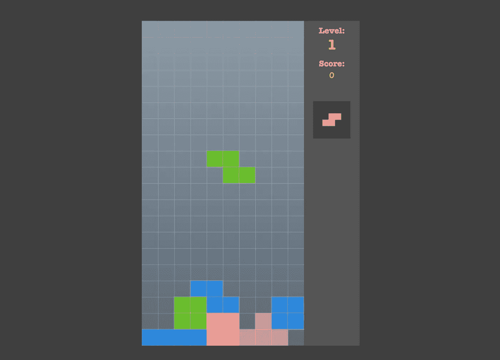
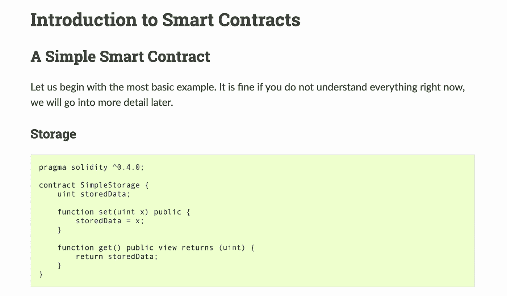
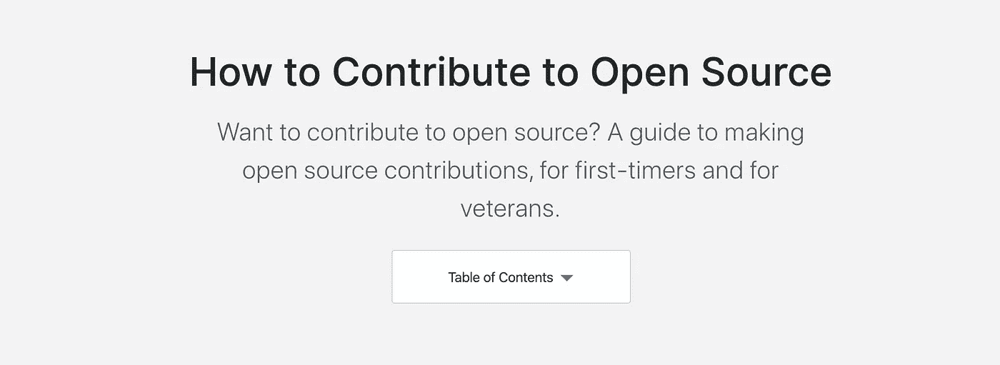

# 无聊？你可以做的 7 件有趣的事情

> 原文：<https://betterprogramming.pub/bored-7-fun-things-you-can-build-91833439b5d4>

## 从俄罗斯方块到智能合同等等

克里斯托夫·高尔在 [Unsplash](https://unsplash.com?utm_source=medium&utm_medium=referral) 上拍摄的照片

成为一名优秀的开发人员没有真正的秘密。伟大的开发人员和平庸的开发人员的区别在于他们付出的努力。不幸的是，没有捷径可走。弄脏你的手会让你成长为一个开发者。

因此，当你正在成为一名出色的开发人员时，为什么不做一些有趣的事情呢？

建什么好玩？你可能已经考虑了一段时间。你想建造一些东西，但你不知道是什么…好吧，让我来帮你。

在这篇文章中，我将与你分享七个既有挑战又有趣的项目。

# 项目 1:浇灌植物的硬件

照片由[哈里森·布罗德本特](https://unsplash.com/@hbtography?utm_source=medium&utm_medium=referral)在 [Unsplash](https://unsplash.com?utm_source=medium&utm_medium=referral) 上拍摄

这是我很久以来一直想为自己做的一个项目。开发的时候，我花了很多时间在 web 开发上。但是软件开发就是这么多*多*！如果你喜欢软件和硬件的结合，这个项目是给你的。

这个项目旨在自动给你的植物浇水。你所需要的只是一个 Arduino(或树莓 Pi)、一个湿度传感器和一个水泵。目标是编写一段代码，让你的植物尽可能长时间存活。

您将学到的内容:

*   Arduino(或 Raspberry Pi)的基本用法。
*   读取传感器。
*   软件和硬件之间的相互作用。

# 项目 2:俄罗斯方块

查看 GitHub 库[这里](https://github.com/sandywalker/Tetris)

构建俄罗斯方块是从基础角度感受游戏如何开发的一个好方法。如果你想做一个应用程序，你可以用 Swift 做这个项目。如果你想使用 HTML5，你可以使用 JavaScript 框架，比如 React 或 Vue。

你将学到的东西:

*   实体的运动。
*   按键的检测。
*   碰撞检测。

在这里找到示例 GitHub 库[。](https://github.com/sandywalker/Tetris)

# 项目 3:智能合同

官方文件[文档](https://solidity.readthedocs.io/en/v0.4.24/introduction-to-smart-contracts.html)

加密货币已经成为热门话题好几年了。尽管如此，仍然没有多少开发人员有能力编写智能合同。

许多区块链使用智能合约——以太坊区块链目前是其中最大的一个。用于这些以太坊智能合约的编程语言叫做 Solidity。

要开始编写智能协定，您可以从发送事务的智能协定开始。如果你想要一个更高级的智能合约，你可以做一个类似于托管的合约。

您将学到的内容:

*   一个完全不同的思维模式。
*   区块链。
*   坚实的基础。

你可以在这里找到一个坚实的起点[。](https://solidity.readthedocs.io/en/v0.4.24/introduction-to-smart-contracts.html)

# 项目 4:鸢尾花的分类

[来源](https://www.w3resource.com/machine-learning/scikit-learn/iris/index.php)

如果你是机器学习领域的新手，那么鸢尾花的分类是一种很好的方式来了解机器学习是怎么回事。那是因为这个项目被称为机器学习项目的“Hello World”。

这个项目的目的是根据萼片和花瓣的长度和宽度，将鸢尾花分为三个种类(刚毛鸢尾、杂色鸢尾或海滨鸢尾)。这个项目非常适合用 Python 制作。你需要做的就是开始使用[数据集](https://gist.githubusercontent.com/curran/a08a1080b88344b0c8a7/raw/639388c2cbc2120a14dcf466e85730eb8be498bb/iris.csv)。

您将学到的内容:

*   你将掌握机器学习

# 项目 5:为开源做贡献

想了解更多？检查[这个](https://opensource.guide/how-to-contribute/)

如果你不是那种喜欢独自做项目的人，你可以选择为开源做贡献。乍一看这似乎很可怕，但是有很多项目可能需要一点帮助。

如果你对提交代码感到不舒服，那也没关系。贡献可以像检查拉取请求一样简单。

选择一个你喜欢的项目，开始帮助别人！

如果你想为 GitHub 上的开源项目做贡献，这里是一个很好的起点。

您将学到的内容:

*   开源很有趣也很吸引人，你会遇到很棒的人。
*   项目种类繁多。
*   从不同的人身上可以学到很多东西。

# 项目 6:创建你自己的交易算法

[M. B. M.](https://unsplash.com/@m_b_m?utm_source=medium&utm_medium=referral) 在 [Unsplash](https://unsplash.com?utm_source=medium&utm_medium=referral) 上拍摄的照片

创建自己的交易算法是一个需要大量微调的项目。但是在你开始构建你的算法之前，你应该对交易策略做一些研究。一旦你想好了自己的策略，你可以使用免费的股票 API，比如 [IEX 云](https://iexcloud.io/docs/api/)，来查看你的股票的当前价格。

让算法运行一段时间，看看它的表现如何。有很多股票模拟器可以让你玩虚拟现金，而不是真正的现金。

您将学到的内容:

*   学习和实施交易策略(算法)。
*   与 API 交互。
*   你可以更进一步，让算法决定购买哪些股票或资产。

# 项目 7:仪表板

[来源](https://kinsta.com/nl/mykinsta/)

谈到仪表板，有许多现成的项目可用——但没有什么比构建自己的仪表板更有趣了！

这是这个列表中比较容易的项目之一。对刚起步的开发者非常有用。你可以在基本的 HTML5 和 CSS 中实现这一点，但如果你想更进一步，可以在混合中添加 React 或 Vue。

您将学到的内容:

*   Web 开发基础，比如 HTML5 和 CSS。
*   实现图形。
*   与数据库交互。
*   不想自己做所有的 CSS？让[顺风](https://tailwindcss.com/)助你一臂之力！

# 现在轮到你了！

当你学习新东西的时候，是时候做一些真正的工作和享受乐趣了。这些项目会让你忙上一段时间。选择一个，然后放手去做吧！

我很乐意为您的项目提供反馈，我期待看到结果。

> 如果你不能享受乐趣，那就没有任何意义——保罗·沃克

编码快乐！