# 无聊猿游艇俱乐部:智能合同破裂

> 原文：<https://betterprogramming.pub/bored-ape-yacht-club-smart-contract-breakdown-6c254c774394>

## 通过对代码行进行分组来解释其功能

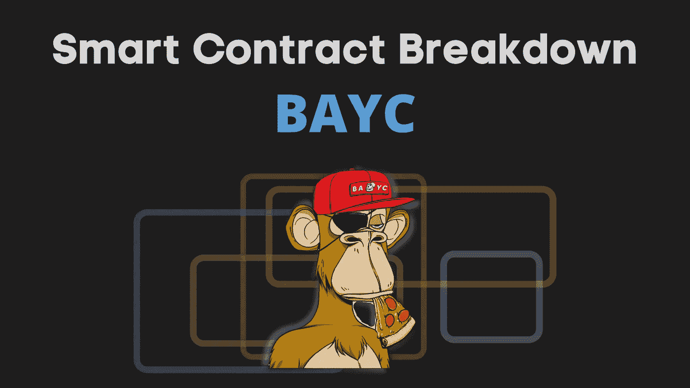

无聊的猿不需要介绍。当我决定对 BAYC 进行分解时，我决定回答我长期以来的问题:

*   猿有什么用？买一个真的能得到什么？
*   他们实际上是如何实现他们承诺的商业之地、独家使用权等的呢？
*   访问控制是如何实现的？
*   二次支付(版税)是如何实现的？

在这篇文章中，我们正在回答这些问题。在探索过程中，我们还将了解

*   NFT 拍卖期间的市场动态
*   BAYC 的创始人赚了多少钱
*   BAYC 的一个傻 bug 以及其他 NFT 是如何盲目抄袭的

下面是这篇文章的提纲:

*   ERC 721—NFT 标准
*   BAYC 合同源代码
*   合同部署后发生了什么

# ERC 721—NFT 标准

ERC721 是用于实现 NFT(不可替换令牌)的标准。它类似于用于 Dogecoin 等可替换令牌的 ERC20。主要区别在于，ERC20 令牌都是相同的，而每个 ERC721 令牌都是唯一的。

下面是根据 [ERC721](https://eips.ethereum.org/EIPS/eip-721) 应该实现的功能:

大多数函数应该很简单，因为它们非常类似于 ERC20(如果你感兴趣，我有一个 ERC20 的[分解)。不同的功能是:](https://ilamanov.medium.com/erc20-smart-contract-breakdown-9dab65cec671)

*   `tokenURI` —令牌元数据的路径(如图像、令牌质量等)
*   `tokenByIndex` —返回指定索引处令牌的`tokenId`
*   `tokenOfOwnerByIndex` —与`tokenByIndex`相同，但针对指定的所有者

为了比较，下面是 [ERC20](https://eips.ethereum.org/EIPS/eip-20) 标准要求的功能:

## BAYC 如何实施 ERC721

BAYC 只是使用了它的 [OpenZeppelin 实现](https://github.com/OpenZeppelin/openzeppelin-contracts/blob/master/contracts/token/ERC721/ERC721.sol)。OpenZeppelin 是最常见标准的实现库。

您可以检查代码，但没有什么惊喜。您期望从标准实施中获得的一切:

*   他们使用映射来管理令牌的所有权:

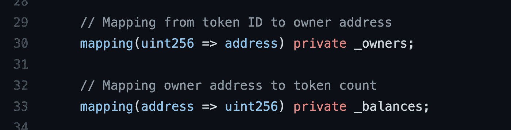

*   所有权是如何转移的(只需在映射中重新分配值):

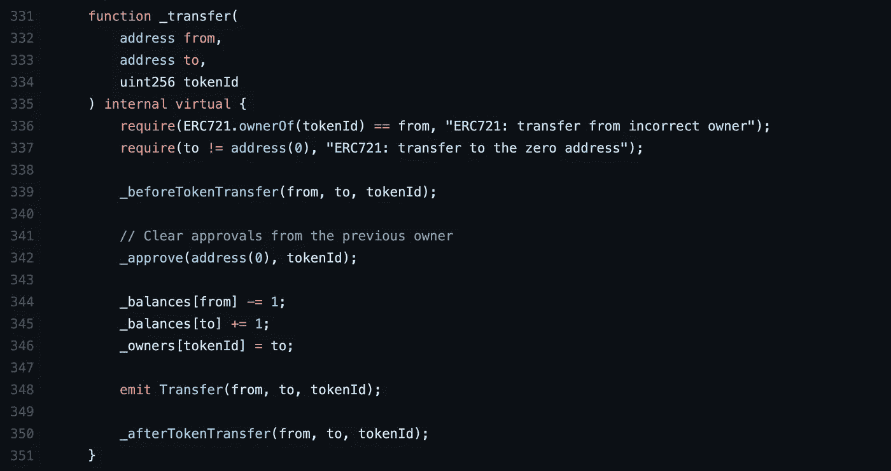

*   映射还用于管理**批准**和**操作员**:

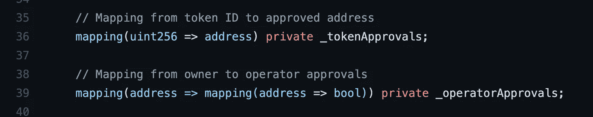

> **什么是审批和操作员？** 批准—允许其他人管理(转让、出售等)我的令牌
> 操作员—批准，但由 OpenSea 等第三方使用的所有令牌
> 除外，以管理我的令牌

*   尽管不是标准的一部分，Openzeppelin 增加了用于添加/移除令牌的`mint` / `burn`函数:

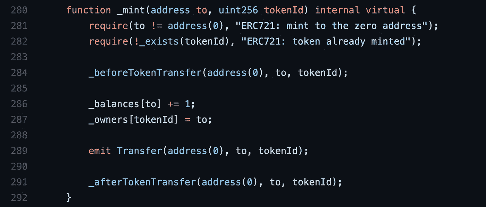

“刻录”功能只是“薄荷”的镜像

> 顺便说一句，通过阅读这段代码，我终于知道了`safeTransfer`中“安全”一词的来源。它只是检查 NFT(如果是合同)的接收者是否知道 ERC721 协议，以防止令牌被永远锁定。

# BAYC 合同源代码

BAYC 合同扩展了 OpenZeppelin 的 ERC721，以添加特定于 BAYC 的功能。合同源代码可以在 [Etherscan](https://etherscan.io/address/0xbc4ca0eda7647a8ab7c2061c2e118a18a936f13d#code) 上找到(或者 [Github](https://gist.github.com/JofArnold/bf2c4a094fcdd4aee2f52983c7714de8) 以获得更好的可读性)。

文件看起来很长，但大部分都是 OpenZeppelin 导入的(ERC721、SafeMath、Ownable 等)。实际的 BAYC 代码是一个非常短的契约，名为 [BoredApeYachtClub](https://gist.github.com/JofArnold/bf2c4a094fcdd4aee2f52983c7714de8#file-boredapeyachtclub-sol-L1906) :

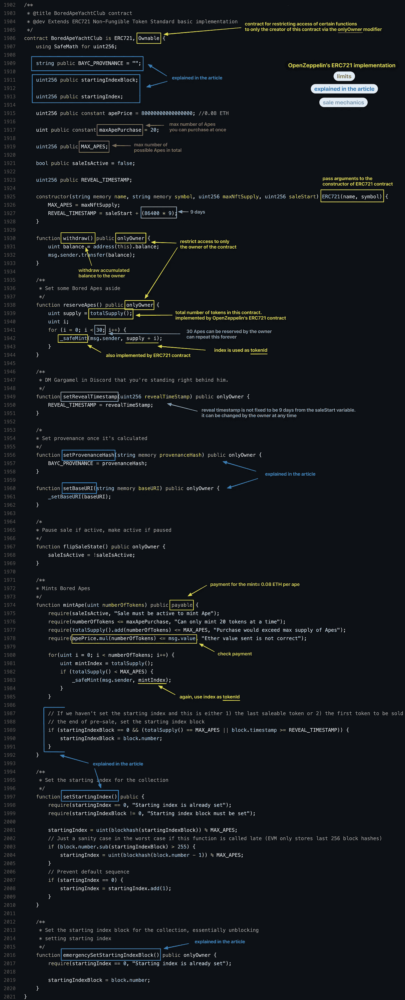

截图中没有解释的几件事:

*   **出处**——这应该是整个 NFT 系列独一无二的签名(哪怕换一张图片，签名都不匹配)。出处的 BAYC 页面解释了这个签名是如何生成的:

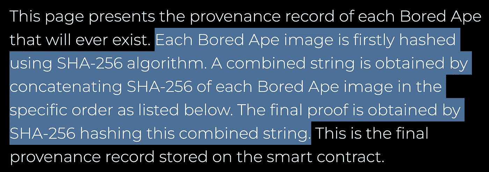

*   不幸的是，出处不是不变的，可以随时被所有者改变。

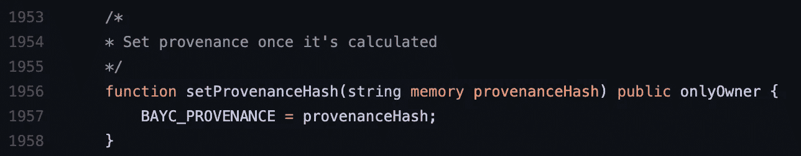

*   另外两个无法解释的事情:`**baseUri**`和`**startingIndex**`将在本文后面解释。

通过检查 BAYC 代码，我意识到它远没有 Uniswap 的[优雅和高效。一些例子:](https://ilamanov.medium.com/uniswap-smart-contract-breakdown-ea20edf1a0ff)

*   **浪费气体** — BAYC 计算显示构造函数中的时间戳。这可以通过传递已经计算好的值来避免。

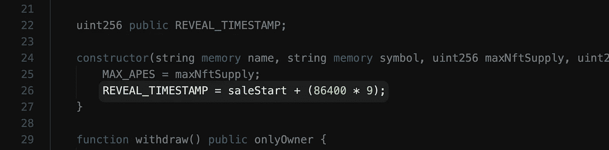

*   虽然`REVEAL_TIMESTAMP`用大写字母拼写，但是**并不是常量**——主人可以随时更改。`BAYC_PROVENANCE`也一样。
*   猿可以由主人在**无限量**中预定👌。

## BAYC 的一个愚蠢的错误，以及其他 NFT 是如何盲目复制它的

至此，我们已经跳过了神秘的变量`startingIndex`。感谢[另一篇关于 BAYC 智能合约的文章](https://medium.com/northwest-nfts/bored-ape-yacht-club-contract-review-80dce503308e)，我了解了它的用途。

BAYC 团队试图通过随机排列代币顺序来防止预售期间对稀有代币的狙击。`startingIndex`应该作为随机偏移来随机化顺序。

下面的代码说明了`startingIndex`是如何计算的。这是一种非常复杂的生成随机数的方法！

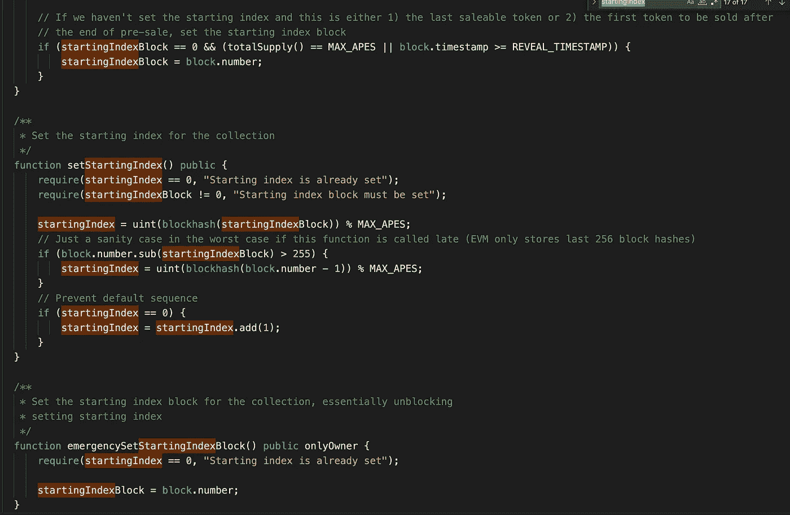

但是……这个随机偏移量实际上并没有被用到任何地方！代码没用！尽管 BAYC 的[声称](https://boredapeyachtclub.com/#/provenance)猿的顺序是随机的，但实际上不是！而`startingIndex`只是浪费汽油！

关于 BAYC 的[文章还声称，其他 NFT 只是盲目地复制/粘贴 BAYC 代码，而不理解它是做什么的。所以他们继承了这个`startingIndex` bug。我想证实这一说法，但懒得去搜索“受 BAYC 启发的 NFTs”。如果你知道任何这样的合同，请在评论中留下它们。](https://medium.com/northwest-nfts/bored-ape-yacht-club-contract-review-80dce503308e)

# 合同部署后发生了什么

我们看到了代码。但是代码是静态的，它没有告诉我们动态的画面。部署合同后发生了什么？

您可以在 Etherscan 上查看该合同[的全部交易历史。让我们回到开头:](https://etherscan.io/address/0xbc4ca0eda7647a8ab7c2061c2e118a18a936f13d)

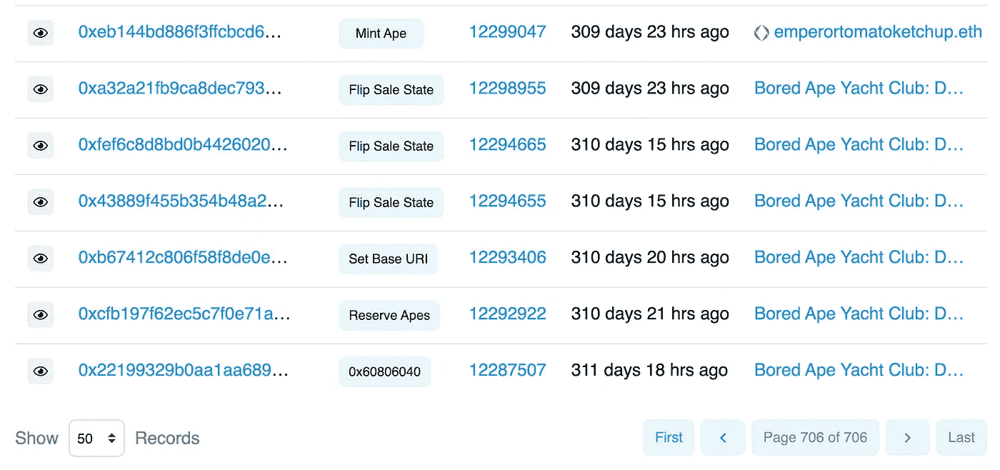

点击第一条交易消息:该合同于 2021 年 4 月 22 日[部署](https://etherscan.io/tx/0x22199329b0aa1aa68902a78e3b32ca327c872fab166c7a2838273de6ad383eba)

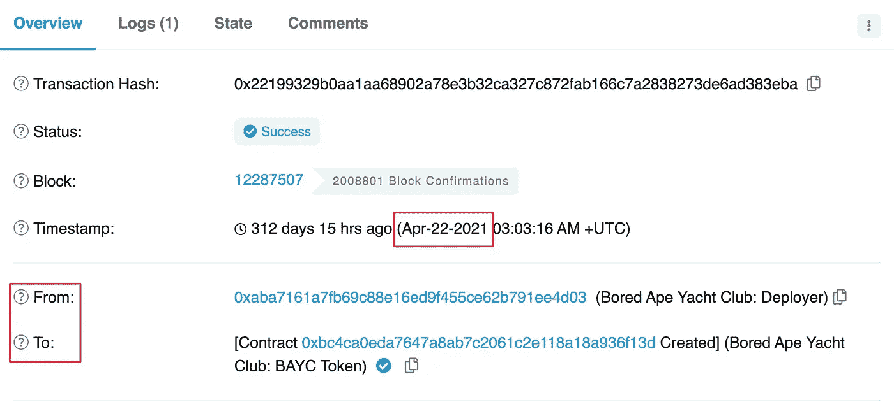

大约 25 小时后(第二个 txn)，30 只猿被创作者[保留](https://etherscan.io/tx/0xcfb197f62ec5c7f0e71a11ec0c4a0e394a3aa41db5386e85526f86c84b3f2796)。以一只 Ape 在 82 ETH 的底价(23 万美元)为例，**这 30 只 Ape 在今天的估值约为 690 万美元**😳。

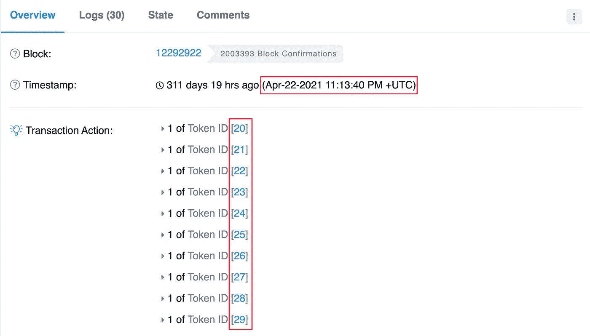

30 只猿被保留

> **沉默寡言的类人猿的命运是什么？** BAYC 团队把他们转移到不同的地址。不确定这些地址是否属于 BAYC 团队。

下一个 txn 设置`baseUri`。这是合同中的`baseUri`变量:

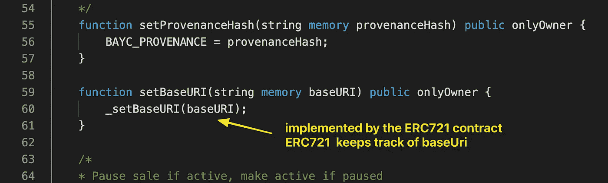

## 什么是 baseUri？

有点像存储所有图像元数据的根路径。如果我们[检查合同中`baseUri`的当前值](https://etherscan.io/address/0xbc4ca0eda7647a8ab7c2061c2e118a18a936f13d#readContract)，它显示:

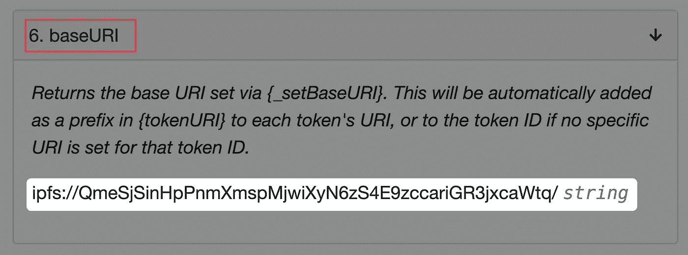

所以，Ape 0 元数据在`ipfs://QmeSjSinHpPnmXmspMjwiXyN6zS4E9zccariGR3jxcaWtq**/0**`。该元数据是:

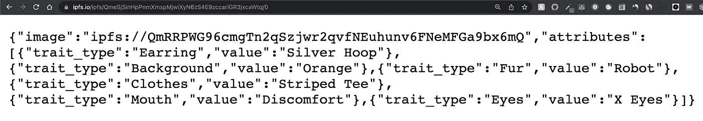

这里有一个`image`字段指向:


事实上，所有这些元数据都与 BAYC 网站上的内容相匹配:

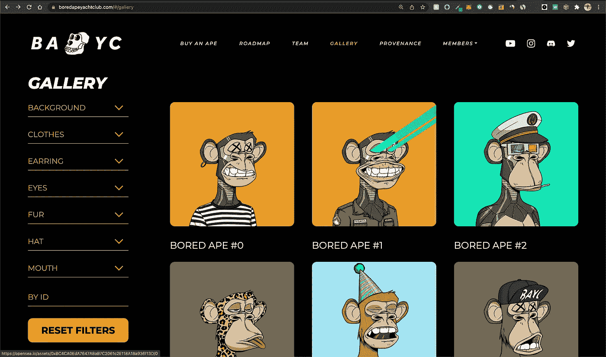

理想情况下，`baseUri`应该在这个契约中保持不变。然而，它可以被创作者随意修改多次。

## 回到交易的历史

设置`baseUri`后，合同创建者

*   开始销售
*   然后改变了主意
*   16 个小时后，又开始了
*   铸造过程开始了

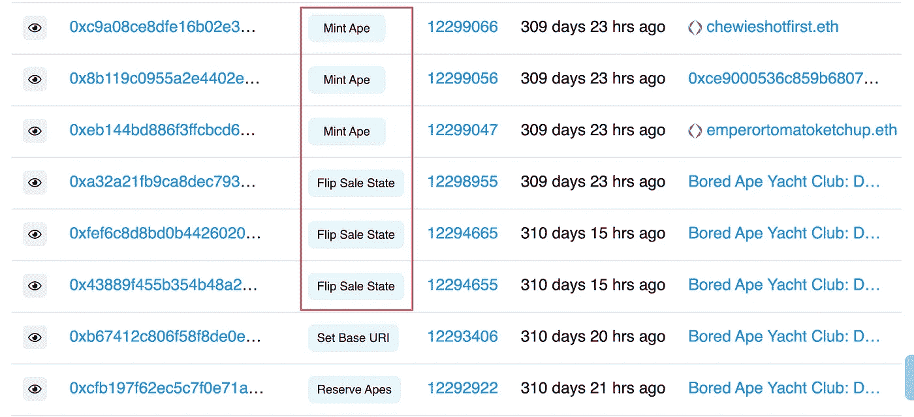

如果你看得更远，

*   有很多`mintApe`txn
*   然后你开始看到`transferFrom`和`setApproval`txn
*   然后，在销售开始后 **4 天**，我们看到 BAYC 团队第一次撤回**14 ETH**(175 Ape，0.08 ETH/Ape)。

之后，更多的猿被铸造，更多的 ETH 被回收。这种情况一直持续到所有的猿类(包括 10K)都被铸造出来。之后，只有二次销售(在 OpenSea 上)在 Etherscan 上显示为`transfer`事件。

## 结束语

那么，猿的所有权到底给了你什么？BAYC 网站上说，你可以获得俱乐部的某种独家使用权，在那里你可以在板上添加自己的涂鸦。基本上没什么有用的。我觉得主要是作为一种投机工具。

如何实施专属俱乐部的出入控制？这应该很简单，因为所有其他所有权数据都公开存储在区块链上。

在进入 BAYC 的兔子洞之前，我的印象是 NFTs 向原创者提供二次付款(版税)。所以，每次交易一个代币，最初的创造者会得到一小部分。代码没有实现这个功能，所以看来我错了。但是谁知道呢，也许“现代”NFT 确实实现了它。我将在另一个智能合同分解中找到答案:)

更正:感谢 [Isaac](https://medium.com/@zikyfranky) 在评论中指出这一点，版税没有在 NFT 智能合同级别实现。它们在市场中实现。市场就像一个中间人，收取一部分佣金，然后将一部分转给最初的创造者。

BAYC 合同破裂到此为止！我希望这有所帮助。如果你有任何问题，请在评论中告诉我。

我计划对流行的智能合约进行更多的分解，如 **Axie Infinity** 和 **Aave、**，所以请在 Medium 或 Twitter 上关注我以获取更新。

在 solidnoob.com，你还可以查看其他智能合同的细目表以及更多关于 Solidity noobs 的东西。

```
**Want to Connect?**Follow me on [Twitter](https://twitter.com/nazar_ilamanov).
```