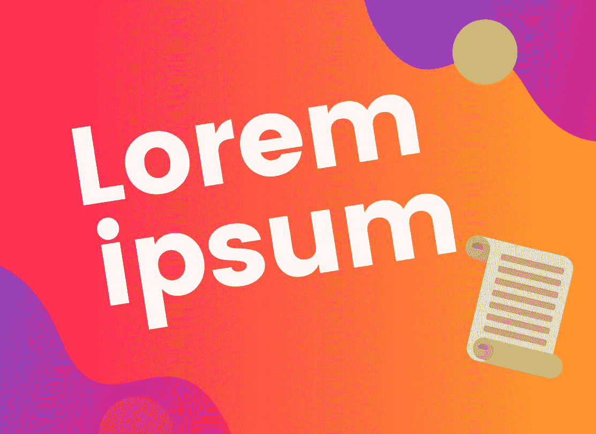
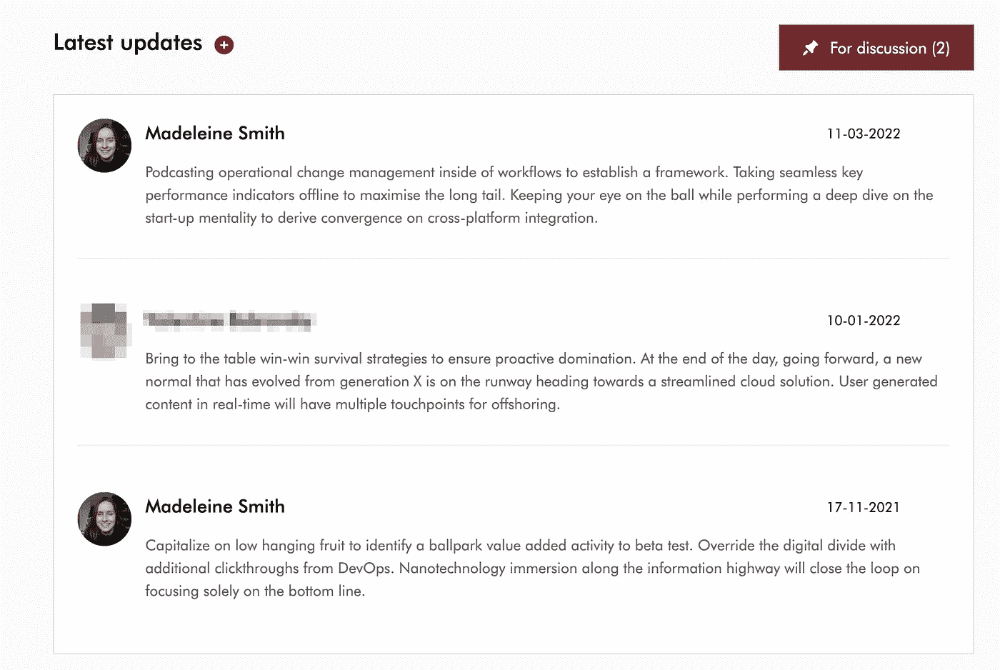

# 厌倦了 Lorem Ipsum？请为您的应用尝试这些替代填充文本

> 原文：<https://betterprogramming.pub/bored-of-lorem-ipsum-try-these-alternative-filler-texts-for-your-apps-instead-a3d905ac18a9>

## 利用虚拟文本发挥创意



我们都听说过“Lorem ipsum”，即作为真实内容占位符的虚拟文本。这使得设计人员或开发人员可以专注于网页的设计，而不会显得空洞或使用分散注意力的真实文本。它源于拉丁语——尽管是这种语言的一种扭曲和无意义的版本。典型的代码片段如下所示:

> *Lorem ipsum dolor sit amet，consected ur adic ation elit。当我离开时，我想我已经离开了。整数 sed massa nec enim 孕妇格言。快乐时光。Nullam cursus tempus porta…*

然而，我们不再是在古代，许多现代的替代品已经涌现出来——有些是喜剧效果。我最近发现了[Cipsum](https://cipsum.com/)——一个企业行话版本，包含你可能想要的所有“深度挖掘”和“协同效应”。

它也非常适合我的一个在非常专业的环境中工作的客户。它的可笑之处让我开怀大笑，我肯定遇到过在专业环境中使用不必要的混淆语言的人，比如:

> *利用敏捷框架为高层概述提供一个健壮的概要。公司战略的迭代方法培养协作思维，以推进整体价值主张。有机地培养整体世界观…*



[*Cipsum*](https://cipsum.com) *在我的一个客户项目中使用——总是让我忍俊不禁*

以下是其他一些 Lorem Ipsum 生成器，我希望有一天能派上用场:

# [培根 Ipsum](https://baconipsum.com/)

ipsum 的主要部分。在 [baconmockup](https://baconmockup.com/) 他们甚至还有与肉类相关的占位符图片🥓

> *牛腩排骨朗德耶格阿尔卡特培根。熏牛肉鸡舌排骨猪排排骨。肉丸汉堡猪五花肉、肩肉、舌尖肥肉、鸡肉……*

# [洛瑞斯(Gangsta Lorem Ipsum)](http://lorizzle.nl/)

如果暴徒的生活选择了你，这个黑帮版本是它在哪里。我不确定我应该审查以下内容的多少，或者这只是我的大脑😇

> 黑色代表它的形状，掺杂着脂肪。为 boofron velizzle，aliquet volutpizzle，suscipizzle quis，gravida vizzle，gangsta。佩伦特斯凯打破它拉皮条。咝咝爱欲。

# [咖啡 Ipsum](http://coffeeipsum.com/)

最后，一个含有咖啡因的益普生。他们还在段落大小选项上超越了自己——浓缩咖啡、普通咖啡或大杯咖啡。

> *焦糖化额外，西克品种，茶托 con panna 丰富的 sit et 即时强大的土耳其，快，虹吸勺 affogato 蒸速溶阿拉比卡卡布奇诺咖啡师额外。还有红眼，黑色泡沫，那个 java 红眼 java ristretto 研磨提取过滤器那个…*

# [哈利波特 Ipsum](http://www.christinachern.com/hpipsum/)

有了这个 ipsum，就不会有愚蠢的魔杖挥舞或愚蠢的咒语。对于那些庄严宣誓他们不怀好意的人:

> *半巨人倒霉蛋假腿吉利沃特破眼镜大黑狗大会堂。差点没头的尼克现在把它们串起来，然后回答我，哪个生物是你不愿意亲吻的？闹鬼贴魔咒…*

# [奥巴马 Ipsum](https://obamaipsum.com/)

可能不会成为我客户工作的首选，但仍然很有趣。还有一个特朗普版本[的口号是“让占位符文本再次变得伟大！”—如果你有这种倾向:](https://trumpipsum.net/)

> 我心中的怀疑并没有突然消失。在竞选的第一年，与所有相反的预测相反，我们看到美国人民是多么渴望团结的信息。讽刺的是，这个典型的美国人…

```
**Want to Connect?**Originally published at [https://www.madeleinesmith.uk](https://www.madeleinesmith.uk/blog/lorem-ipsum-alternatives/).
```