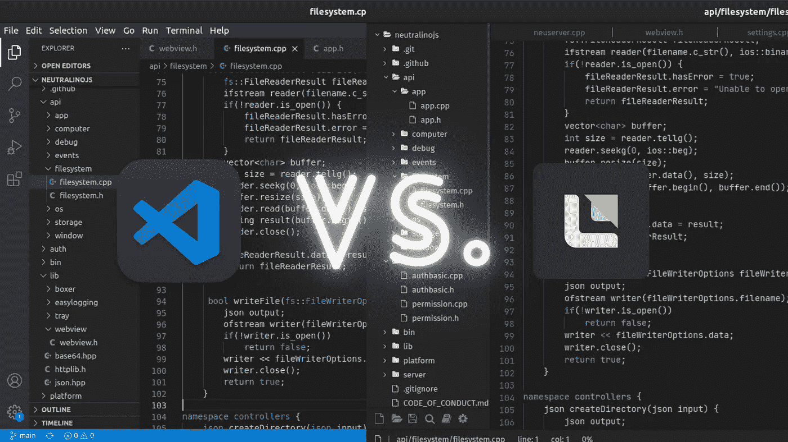
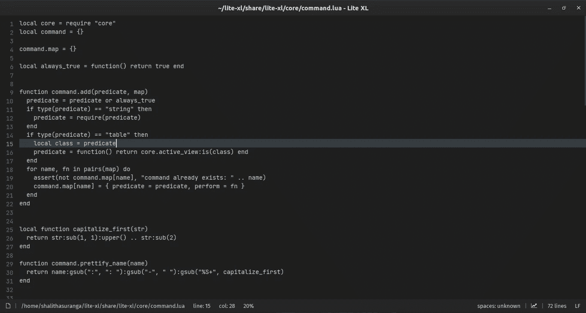
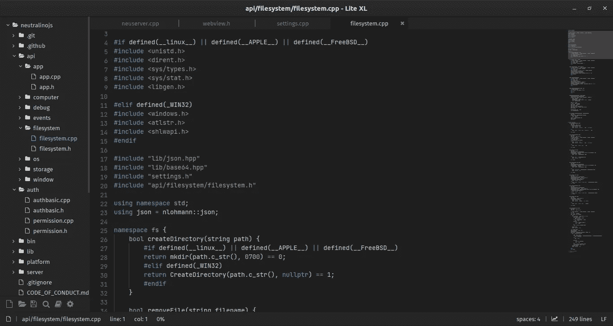
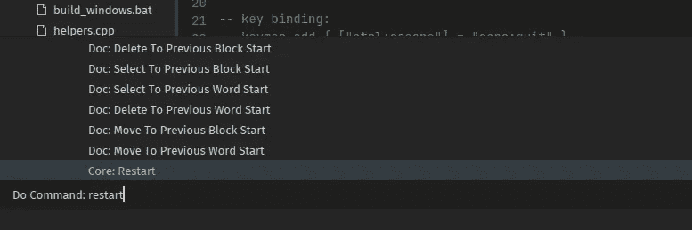

# 厌倦了 VS 代码？试试 Lite-XL

> 原文：<https://betterprogramming.pub/bored-of-vs-code-try-lite-xl-76d4cb3f8dda>

## 您疲惫的计算机会要求您尝试 Visual Studio 代码替代方案，如 Lite-XL



Visual Studio Code vs. Lite-XL，作者用 Canva 设计的封面。

三年来，我一直是 Visual Studio 代码的铁杆粉丝。但是，在 Visual Studio 代码的行为开始类似于 Visual Studio，通过占用其他进程希望占用的所有资源之后，我开始使用一种叫做 Lite 的轻量级替代方法。Lite 是一个用 Lua 和 c 编写的最小化代码编辑器，它确实是尽可能最小化实现的。Lite 编辑器核心是一个应用程序，由 SDL 图形库制作的多行文本框组成。所有其他现代代码编辑器特性，比如语法高亮，都是作为插件实现的。它只占用 1 兆字节的磁盘空间，消耗大约 20 兆字节的物理内存。

然而，它并没有为所有的开发者提供所有需要的特性。Lite 项目的维护者提到，该项目旨在提供一些实用、漂亮、*小、*并且尽可能简单地快速实现的东西——易于修改和扩展，或者不用做任何事情就可以使用。换句话说，Lite 编辑器本身可能不会进一步提供任何特性，如果有人需要更多特性，他们必须派生源代码库并进行扩展。

[Lite-XL](https://lite-xl.github.io/) 是 Lite 编辑器的一个积极维护的分支，它提供了几乎所有 Visual Studio 代码具有的基本生产力特性。三个月前，我写了一篇[故事](https://levelup.gitconnected.com/one-megabyte-lite-xl-instead-of-heavyweight-visual-studio-code-f35d12efb09e)，解释了 Lite-XL 在技术上比 Visual Studio 代码表现得更好。在这个故事中，我将带您了解 Lite-XL 的新特性，这些特性使它比 Visual Studio 代码更好。

# Visual Studio 代码的问题

如果 Lite-XL 只是一个代码编辑器，与您最喜欢的 Visual Studio 代码做同样的工作，为什么您要尝试一个替代品呢？这两者在技术上有很大的不同。Visual Studio 代码建立在电子框架之上，开发人员可以利用 web 技术构建跨平台的桌面应用程序。Visual Studio 代码是一个在无框架本机窗口中运行的 web 应用程序。

另一方面，Lite-XL 是用 SDL 图形库构建的本地桌面应用程序。Lite-XL 可以在 Linux、macOS 和 Windows 上工作，因为 SDL 是一个跨平台的图形库，就像谷歌的 [Skia](https://github.com/google/skia) 。SDL 不像 Visual Studio 代码那样向 Chromium webview 呈现元素，而是通过 OpenGL 或 DirectX 来呈现图形元素。一个 Lite-XL 实例通常占用大约 10 兆字节的物理内存，而一个 Visual Studio 代码实例占用 400 多兆字节。Visual Studio 代码每天都在向编辑器核心添加新功能。现在它在没有任何扩展的情况下需要大约 300 兆字节的磁盘空间，我们不会怀疑几年后它是否需要 1gb。

听说过 VSCodium 吗？尽管 Visual Studio Code 的源代码得到了麻省理工学院的许可，但微软通过添加一种包括遥测(跟踪)在内的商业味道，以不同的非 [FLOSS](https://www.gnu.org/philosophy/floss-and-foss.en.html) (自由/自由和开放源代码软件)许可发布版本。VSCodium 项目发布了最新的二进制版本，带有 MIT 授权的代码库。然而，从技术上讲，VSCodium 与消耗高于平均水平的资源的 Visual Studio 代码是相同的。

在最坏的情况下，您可能会使用其他基于电子的混合桌面应用程序和 web 浏览器运行多个 Visual Studio 代码实例。那么你可能会责怪你的计算机硬件，但事实上，你的计算机成了现代膨胀软件的游乐场。

下面的故事进一步解决了这个现代膨胀软件问题:

[](https://shalithasuranga.medium.com/goodbye-native-apps-2ffcbd2773e7) [## 再见，本地应用

### 混合应用正在取代在低端和高端电脑上都能流畅运行的原生应用

shalithasuranga.medium.com](https://shalithasuranga.medium.com/goodbye-native-apps-2ffcbd2773e7) 

# 如何将 Lite-XL 自定义为 Visual Studio 代码

如前所述，Lite-XL 的特性(甚至是上下文菜单和树形视图)通常以插件的形式出现。然而，Lite-XL core 包括几个重要的特性，如状态栏、命令执行程序和文件搜索。Lite-XL 只是一个没有任何插件的文本编辑器，如下所示:



Lite-XL 芯，作者截图。

如果我们像 Visual Studio 代码一样定制它，它看起来就像这样。



Lite-XL 是类似 Visual Studio 代码定制的，作者截图。

即使进行了这些定制，内存使用量也不会超过 15mb。

让我们开始 Lite-XL 定制过程。首先，一定要从 GitHub [releases](https://github.com/lite-xl/lite-xl/releases) 下载最新的 Lite-XL 版本。之后，打开首选项文件(`init.lua`)并添加下面一行来启用 Visual Studio 代码的默认主题。

```
core.reload_module("colors.vscode-dark")
```

每个 Lite-XL 版本都预装了插件，如自动完成、树形视图、上下文菜单、某些语言的语法高亮等。但是您可能需要安装以下插件，使其更像 Visual Studio 代码。安装一个 Lite-XL 插件是小菜一碟。您可以将插件复制到`data/plugins`目录，然后重启编辑器来激活特定的插件。您可以通过按 Ctrl + Shift + P 使用命令执行器重新启动编辑器。



Lite-XL 中的重启命令，作者截图。

现在，用上面的方法安装下面的插件。所有插件源文件都可以在[这里](https://github.com/lite-xl/lite-plugins)获得。

**indentguide**

缩进指南插件在每个缩进处画一条垂直线，类似于 Visual Studio 代码。

**小地图**

这个插件在编辑器的右侧呈现源代码的可视化地图，类似于 Visual Studio 代码。Visual Studio 代码通过 HTML 画布呈现源代码图，但是 Lite-XL 是以本机方式呈现的。因此，当您处理较大的文件时，资源使用率不会上升。

**附加语法高亮支持**

默认情况下，Lite-XL 不包括对所有支持的编程语言的语法高亮支持。例如，它没有在安装过程之后立即为您提供 JSX 和 TypeScript 语法突出显示支持。所以你需要随心所欲的安装语法高亮插件。

# 结论

Visual Studio 代码由微软提供支持，并拥有大量的开发人员。但是 Lite-XL 是新的，仍然拥有很少的开发人员受众(仍然不到 Discord 的数百名成员)。如今，本地应用程序开发被如此低估，并被由 electronic 创建的混合应用程序开发所取代。混合应用程序开发框架通过隐藏现代硬件的性能问题，激励开发人员快速开发类似本机的混合应用程序。然而，像 Flutter 和 SDL 这样的框架/库为开发跨平台应用程序提供了更好的性能优先解决方案。

此外，像 Tauri 和 Neutralinojs 这样的跨平台框架试图用轻量级架构提供类似电子的开发环境。建兴 XL 是建立在 SDL，是一个真正的原生桌面应用程序。使用这些应用程序来保护它们，因为这可能是原生桌面应用程序的最后时代。

感谢阅读。