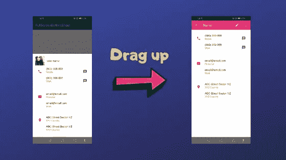
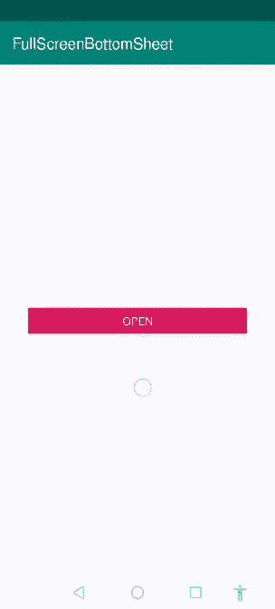
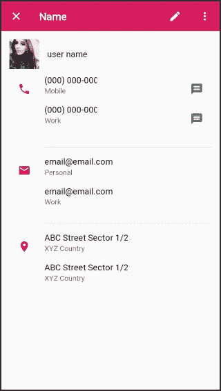

# 全屏底部页

> 原文：<https://betterprogramming.pub/bottom-sheet-android-340703e114d2>

## 材料设计魔法！

## 想做一个可以充当全面屏的底片？给你！



底部表单是表示任何类型的用户相关信息或放置选项以获得用户快速操作的好方法，如打开相机、共享和图库等。

但是今天我们将学习如何制作一个漂亮的底部表单，通过点击一个按钮就可以像全屏一样打开。激动吗？

我们开始吧！

我们要建造的是:



让我们创建一个新项目，并在您的`gradle.build`中添加以下依赖项。

我在本教程中使用数据绑定，所以请确保您已经在`build.gradle`中添加了数据绑定依赖项。

```
dataBinding{
    enabled true
}
```

要制作这个底部表单，我们首先需要有一个将与底部表单一起弹出的布局。



底部工作表布局

在布局目录中创建布局资源文件，并粘贴以下代码:

现在你有了一个布局，是时候做一个底层适配器了。

`BottomSheet.java`是从`BottomSheetDialogFragment`、*、*延伸出来的，所以有一些超越功能，像`onCreateDialog()`。

*   `[onCreateDialog](https://developer.android.com/reference/android/support/v7/app/AppCompatDialogFragment.html#onCreateDialog(android.os.Bundle))([Bundle](https://developer.android.com/reference/android/os/Bundle.html) savedInstanceState)`:覆盖构建自己的自定义对话框容器。

我们需要添加底部表单行为，这样我们就可以根据底部表单的行为隐藏和显示应用程序栏。对此我们有一个`BottomSheetBehavior`类。

根据[文件](https://developer.android.com/reference/android/support/design/widget/BottomSheetBehavior)，底板可定义为:

> 一个交互行为插件，用于`[CoordinatorLayout](https://developer.android.com/reference/android/support/design/widget/CoordinatorLayout.html)`的子视图，使其作为底层工作表工作。

底层有一些常数。

*   [PEEK_HEIGHT_AUTO](https://developer.android.com/reference/android/support/design/widget/BottomSheetBehavior.html#PEEK_HEIGHT_AUTO) :查看其父级的 16:9 比率关键线。
*   [STATE_COLLAPSED](https://developer.android.com/reference/android/support/design/widget/BottomSheetBehavior.html#STATE_COLLAPSED) :表示底层板材已经折叠。
*   [STATE_EXPANDED](https://developer.android.com/reference/android/support/design/widget/BottomSheetBehavior.html#STATE_EXPANDED) :表示底部板材展开。

`BottomSheetBehavior` 有一个嵌套类`BottomSheetCallback`，它将帮助我们实现我们需要的结果，即根据底部工作表的状态隐藏或显示应用程序栏。

在这个嵌套类中，有两个抽象方法。

*   `[onSlide](https://developer.android.com/reference/android/support/design/widget/BottomSheetBehavior.BottomSheetCallback.html#onSlide(android.view.View,%20float))([View](https://developer.android.com/reference/android/view/View.html) bottomSheet, float slideOffset)`，拖动底层板材时调用。
*   `[onStateChanged](https://developer.android.com/reference/android/support/design/widget/BottomSheetBehavior.BottomSheetCallback.html#onStateChanged(android.view.View,%20int))([View](https://developer.android.com/reference/android/view/View.html) bottomSheet, int newState)`，当底层表的状态改变时调用。

所以这些都是相对的方法，可以帮助我们实现目标。

现在，我们的底部表单已经准备好了，只需点击一下按钮就可以弹出来。让我们回到我们的`MainActivity.java`。在 Java 类中添加以下代码行。

您的`activity_main.xml`应该是这样的:

现在，让我们运行应用程序，看看它的神奇之处。


**关注**[**CodixLab**](https://medium.com/codixlab)**了解更多科技知识。**

觉得这篇文章有用？跟着我 [Mustufa Ansari](https://medium.com/u/8ee4abb8abb8?source=post_page-----1b8c9832af43----------------------) 上媒。看看下面我读得最多的文章。

*   [如何使用 textView 在 android 中实现复制/粘贴功能？](https://medium.com/better-programming/android-copy-paste-7dd60ad47d0)
*   [如何在没有任何库的情况下制作可扩展的 recyclerView？](https://medium.com/better-programming/recyclerview-expanded-1c1be424282c)
*   想要制作具有更多选项的动画浮动操作按钮？
*   用漂亮的动画制作 RecyclerView！
*   [什么是安卓系统？](https://medium.com/better-programming/what-is-androidx-1b8c9832af43)