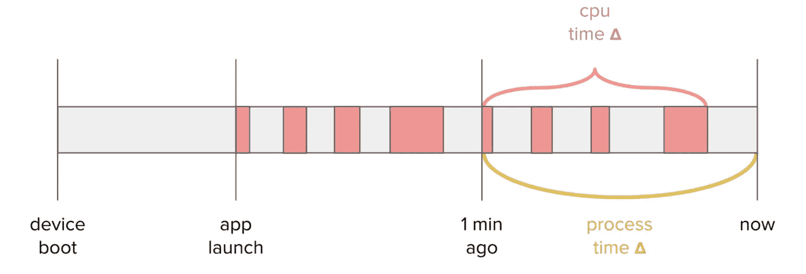
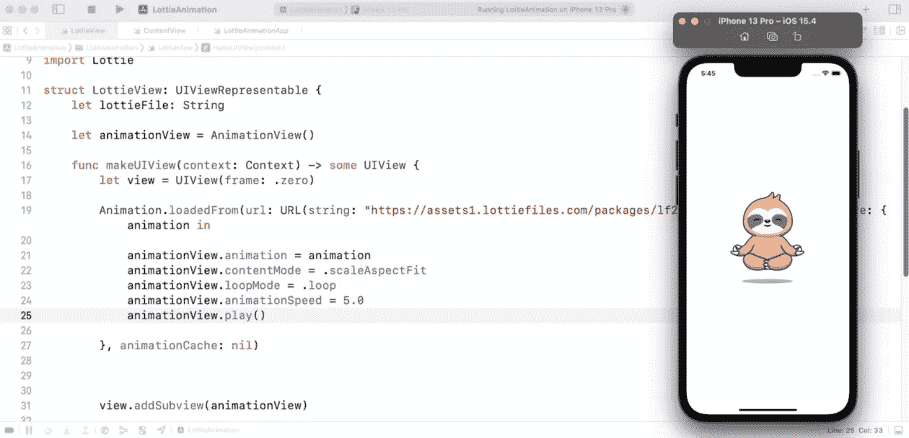

# BP 每日文摘#13 —移动应用中的动画、Python 代码瓶颈等

> 原文：<https://betterprogramming.pub/bp-daily-digest-13-animations-in-mobile-apps-python-code-bottlenecks-and-more-f0b9c19b0dd1>

欢迎来到第 13 版咖啡字节，更好的编程每日文摘。

这一期包括对 Lyft 的 Android 应用程序的 CPU 性能的深入研究，对 Bored Apes Yacht Club 智能合同的分析，检测 Python 代码中的瓶颈，以及一些可以快速插入移动应用程序的酷动画。

# 编程；编排

## [网飞指挥入门。使用超简单导体的网络](/getting-started-with-netflix-conductor-in-net-using-supersimpleconductor-ed8a02120c1)

作者[埃里克·伯格](https://medium.com/u/d207c006936d?source=post_page-----f0b9c19b0dd1--------------------------------)

网飞指挥的两个关键概念是工人和任务。Workers 是包含任务实现的微服务，由 Conductor 作为工作流的一部分来执行。任务是工作流的构建块，即由工作流所表示的流程执行的步骤。

实现工人和任务的库可用于各种编程语言，最著名的是 Go、Java 和 Python。在本文中，我将介绍一个。名为[的超级简单导体](https://github.com/erikbrgr/supersimpleconductor)，是我开发和维护的。

# 软件工程

## [监控 Lyft 安卓应用的 CPU 性能](https://eng.lyft.com/monitoring-cpu-performance-of-lyfts-android-applications-4e36fafffe12)

由 Pavlo Stavytskyi — 9 分钟阅读

CPU 分析的主要思想是跟踪应用程序在运行时给设备的 CPU 带来了多少负载。基于这些数据，可以获得不同产品版本的平均值，比较它们并采取相应的行动。

# Web 开发

## [在 Next.js 中实现 Rest API 的 HTTP 代理](/implementing-an-http-proxy-for-rest-api-in-next-js-65cdcd18fb73)

由富尔坎·德米尔 — 4 分钟读完

如果您的后端服务对公共用户和其他各种恶意攻击隐藏起来，那不是很好吗？Next.js 提供的后端服务有助于您的沟通

# 计算机编程语言

## [如何找出我的 Python 代码的瓶颈](https://towardsdatascience.com/how-to-find-out-the-bottleneck-of-my-python-code-46383d8ef9f)

由[高](https://medium.com/u/2adc5a07e772?source=post_page-----f0b9c19b0dd1--------------------------------) — 10 分钟读完

在本文中，我想告诉你一个找到代码瓶颈的战略方法——从理解你是否应该优化你的代码到找出哪个函数导致了性能问题。

# 摆动

## [颤振动画综合指南](https://medium.com/flutter-community/flutter-animations-comprehensive-guide-cb93b246ca5d)

通过 [Roaa](https://medium.com/u/bdb3e40146cc?source=post_page-----f0b9c19b0dd1--------------------------------) — 11 分钟读取

在这篇文章中，我将尽我所能，用大量的例子详细地讲述你需要知道的关于 Flutter 动画的一切。到本文结束时，您将能够向您的 Flutter 应用程序添加各种复杂的动画。您将知道在 Flutter 中可用的各种方法中哪一种最适合您的动画目标。所以让我们开始吧！

# iOS 开发

## [使用 Lottie 和 SwiftUI 创建令人敬畏的动画](https://medium.com/appcoda-tutorials/using-lottie-and-swiftui-to-create-awesome-animations-6101c74299cb)

通过 [Simon Ng](https://medium.com/u/bcd4289cad19?source=post_page-----f0b9c19b0dd1--------------------------------) — 5 分钟阅读

SwiftUI 框架已经使得创建令人惊叹的视图动画变得很容易。有了 Lottie 库，在你的应用中加入漂亮的动画变得更加容易。

# Web3 开发

## [无聊猿人游艇俱乐部如何制造无限数量的猿人，为什么这是一件坏事](https://kf106.medium.com/how-the-bored-apes-yacht-club-can-mint-unlimited-apes-and-why-thats-a-bad-thing-f2a1b72ee25f)

通过[凯尔·芬洛-贝茨](https://medium.com/u/e2444c78fe61?source=post_page-----f0b9c19b0dd1--------------------------------) — 5 分钟读取

你的`reserveApes()`功能可以用来随时铸造 30 多只猿吗？查看这个故事以了解更多信息。

# 工作经历

## [团队成长如何改变工程经理的职责](/how-team-size-changes-engineering-managers-responsibilities-b9b22e3c7e5f)

由安德烈·格里德涅夫 — 6 分钟读完

为了成功地交付利益相关者想要的结果，应该关注什么和委派什么。

