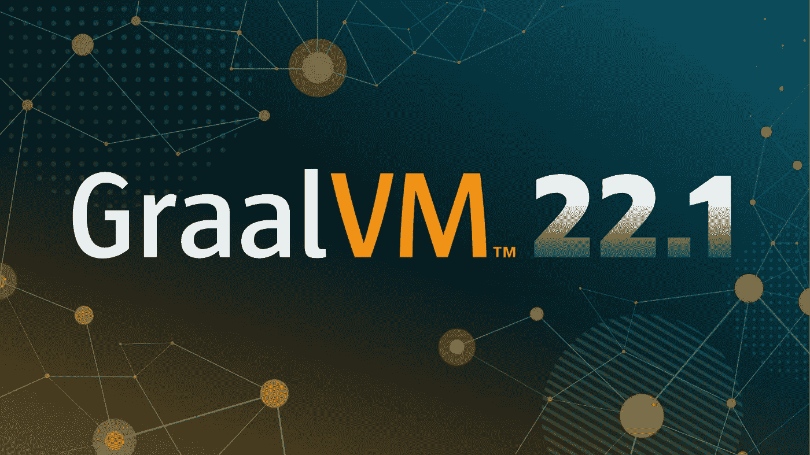
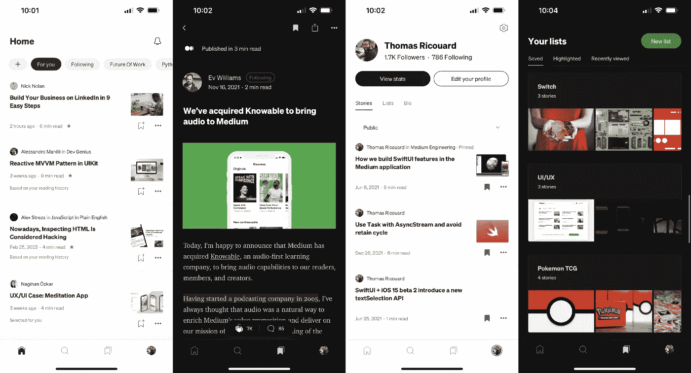
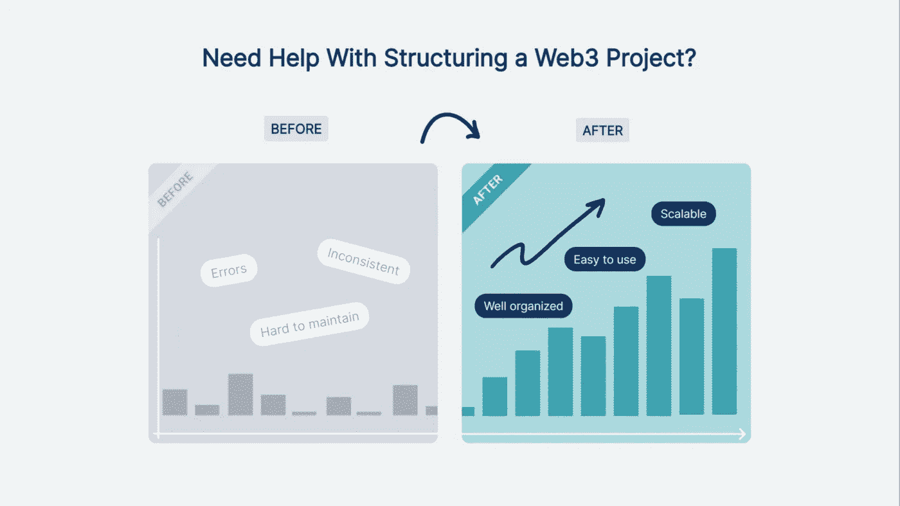

# BP 每日文摘#14 — GraalVM 22.1、Medium 的 iOS 应用程序架构等

> 原文：<https://betterprogramming.pub/bps-daily-digest-14-graalvm-22-1-salesforce-mobile-sdk-and-more-e60052118e9d>

欢迎来到第 14 版咖啡字节，更好的编程每日文摘。

在这一期，我们已经初步了解了 GraalVM 22.1，编写微服务的六边形方法，另一个有趣的 Python 库，中等 iOS 应用程序的架构，以及大量的编程建议。

# 编程；编排

## [为什么你的 PRs 没有提高质量](/why-your-prs-arent-improving-quality-9f5b52a08b89)

每个开发人员工作流程的核心是一个拉式请求或 PR，许多团队试图在这一层加强代码和产品的质量。你猜怎么着？*这很少奏效。*

由[陈子强](https://medium.com/u/61db58b8ec88?source=post_page-----e60052118e9d--------------------------------) — 9 分钟读完

# 软件工程

## [GraalVM 22.1:开发者体验改善，苹果芯片构建，等等](https://medium.com/graalvm/graalvm-22-1-developer-experience-improvements-apple-silicon-builds-and-more-b7ac9a0f6066)

GraalVM 团队强调了最新版本中引入的新特性改进。从本机映像的快速构建模式到 Apple Silicon 的预览构建，再到语言的大量增强，每个人都有很多好东西。

通过 [Alina Yurenko](https://medium.com/u/d4fd34fa2320?source=post_page-----e60052118e9d--------------------------------) — 8 分钟阅读

# Web 开发

## [为可扩展和分散业务编写微服务的六边形方法](/how-to-ports-and-adapter-with-typescript-32a50a0fc9eb)

通过这个 TypeScript 实现理解整洁的六角形架构

由[卡洛斯·库尼亚](https://medium.com/u/34c695d5bfdf?source=post_page-----e60052118e9d--------------------------------) — 7 分钟阅读

# 计算机编程语言

## [介绍 Python 的 Moto 库——轻松模拟 AWS 服务](/introduction-pythons-moto-library-easily-mock-out-aws-services-9d9d3d7e100)

如果您的 Python 代码涉及 AWS 资源的使用，您可能会发现这篇文章对您的测试覆盖范围很有用。

由[埃尔达德·乌兹曼](https://medium.com/u/27af5b90f53f?source=post_page-----e60052118e9d--------------------------------) — 3 分钟读完

# 反应自然

## [使用 React Native 探索 sales force Mobile SDK](/exploring-the-salesforce-mobile-sdk-using-react-native-34f05217c1d4)

John 继续探索 Salesforce 平台。了解 be 如何使用一组源代码构建一个定制的移动应用程序，以便从 Android 和 iOS 应用程序商店进行本机部署。

约翰·维斯特 — 10 分钟阅读

# iOS 开发

## [中型 iOS 应用架构的演变](https://medium.engineering/evolution-of-the-medium-ios-app-architecture-8b6090f4508e)

有兴趣了解 Medium 的 iOS 应用程序的架构在过去一年中发生了怎样的变化吗？查看 Thomas 的指南，了解他们的 iOS 之旅和项目的状态，以及这个新架构是如何进行的。

由 [Thomas Ricouard](https://medium.com/u/b067c9115d59?source=post_page-----e60052118e9d--------------------------------) — 9 分钟阅读

# Web3 开发

## [是时候拆分你的 Monorepo 了？我们对构建 Web3 项目的看法](/time-to-split-your-monorepo-our-take-on-structuring-web3-project-5ad93be1cf9f)

由 břetislav·哈杰克 — 4 分钟阅读

处理智能合同很棘手，因为一旦部署，它们就在那里，更新并不总是容易的。此外，您的 dApp 的其他部分需要一个契约代码来与它们进行交互。本文将展示我们在 [FELToken](https://feltoken.ai/) 中使用的代码结构，这将有望使事情变得可伸缩和易于维护。

