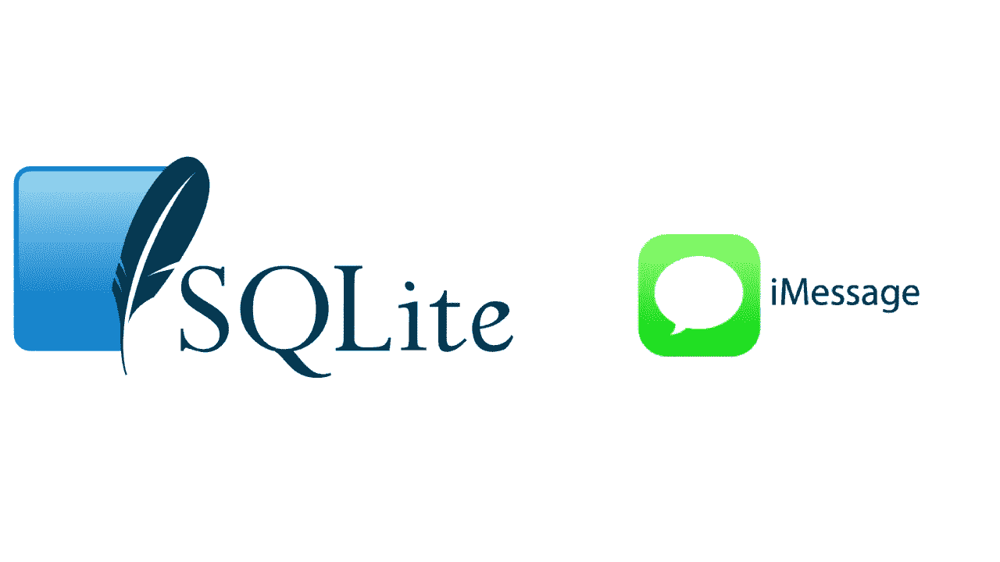
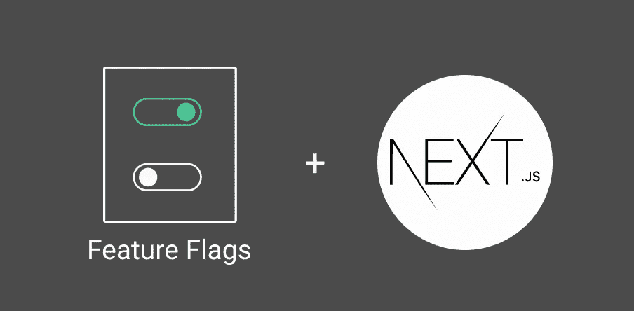

# 英国石油公司的每日文摘# 16-分析网址，iMessages，lambda 冷启动，等等

> 原文：<https://betterprogramming.pub/bps-daily-digest-16-analyzing-urls-imessages-lambda-cold-starts-and-more-ad9121092855>

欢迎来到第 16 版咖啡字节，更好的编程每日文摘。

在这一期中，我们有一份关于 YAML 的综合指南，一份 Next.js 中的功能标志实现，一份在 iOS 中编写模块化代码的指南，一种优化智能合同以提高燃气效率的方法，以及大量实用的建议。

# 编程；编排

## [关于 YAML 你需要知道的一切](/everything-you-need-to-know-about-yaml-fdbb7acf6db6)

[森蒂尔·E](https://medium.com/u/1d8fcdc16d73?source=post_page-----ad9121092855--------------------------------)深入 YAML 的根基。从语法到数据类型，再到通过 Docker Compose 和 AWS Cloudformaton 使用配置文件，他已经编译了您需要了解的关于数据序列化语言的所有内容。

# 软件工程

## [用 SQLite 分析 iMessage】](https://databasedive.com/analyzing-imessage-with-sql-5e3be5b9159)

iMessage 在幕后使用 SQLite。与一般的 consesus 不同，iMessage 并非无法访问。Arctype 分享了使用 SQLite 查询 iMessage 数据的全面分析。

# Web 开发

## [在 Next.js 应用程序中实现特征标志](https://daveyhert.medium.com/implementing-feature-flags-in-a-next-js-application-ad3ed881aa83)

我们在应用程序中都依赖于特征标志。无论是基于配置规则切换功能，还是在生产中安全推出新功能。 [David Herbert](https://medium.com/u/2fa9e0e586fb?source=post_page-----ad9121092855--------------------------------) 通过实践教程分享了 Next.js 应用的特性标志用例。

# 计算机编程语言

## [用网络图分析和可视化 URL](https://towardsdatascience.com/analyze-and-visualize-urls-with-network-graph-ee3ad5338b69)

从 URL 中提取数据和见解变得乏味了吗？ [Khuyen Tran](https://medium.com/u/84a02493194a?source=post_page-----ad9121092855--------------------------------) 结合了`yarl`和`PyGraphistry` Python 库，使得分析 URL 在视觉上更具吸引力

# Android 开发

## 创作，还是不创作，这是个问题

艾曼·纳比尔在英国石油公司的第一篇文章就围绕着这个问题。Jetpack Compose 是否足以构建动画？她通过使用经典的 Android view 系统和 Jetpack Compose 编写相同的代码来回答这个问题。

# iOS 开发

## [将 SwiftUI 视图和模型转移到单独的 Swift 包中](/moving-swiftui-views-and-models-into-separate-swift-packages-4319acdd8827)

“Swift 包是将我们的代码分成模块的好方法，我们可以在多个项目中使用这些模块。这是在 SwiftUI 中使用它们的简单指南，但是任何 Swift 代码都可以这样分发，” [Rob Sturgeon](https://medium.com/u/1de9d252156e?source=post_page-----ad9121092855--------------------------------) 写道。

# Web3 开发

## [如何在固定的天然气成本下制造 NFTs】](https://medium.com/nifty-gateway/how-to-mint-nfts-at-a-fixed-gas-cost-4a040f9792d6)

Nathan Gang 和 Nifty Gateway 团队的指南涵盖了如何编写自己的智能合同，以固定成本打造您的项目，无论您的收藏有多大。

# 自动警报系统

## [分析节点上的冷启动λ](/analysing-cold-starts-on-a-nodejs-lambda-360dfb52a08f)

[Kyle Higginson](https://medium.com/u/954fa90cc41d?source=post_page-----ad9121092855--------------------------------) 深入探讨 Lambda 冷启动问题，看看正常冷启动需要多长时间，以及什么配置会导致更长的冷启动时间。

# 建议

## [为什么我不再阅读“我如何成为一名软件开发人员”的文章](/why-i-stopped-reading-how-to-become-a-software-developer-articles-dba17222f071)

“对于每一个在六个月内找到第一份技术工作的人来说，都有几十个人花了好几年。但你不会看到这些故事，因为《我如何在 24 个月内成为一名开发人员》没有同样的光环。Sunny Beatteay 发人深省的文章给有抱负的开发人员提供了一些好的建议。

