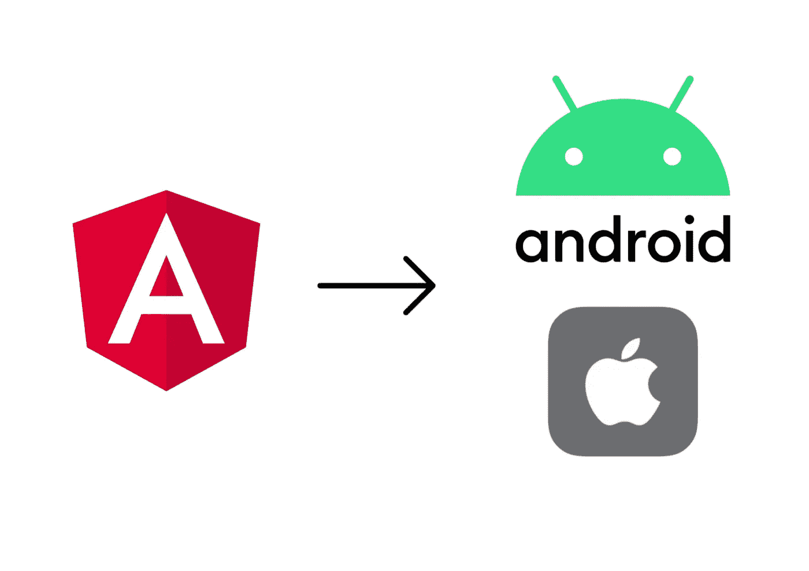
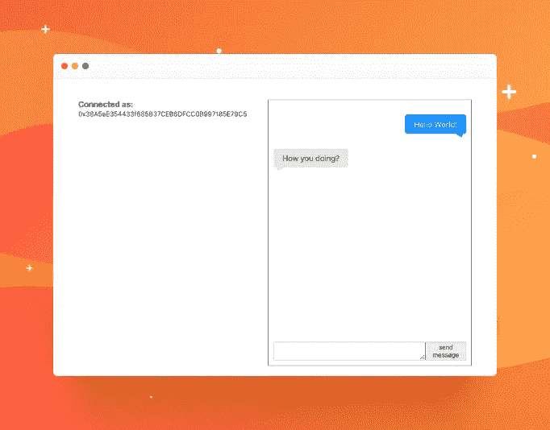
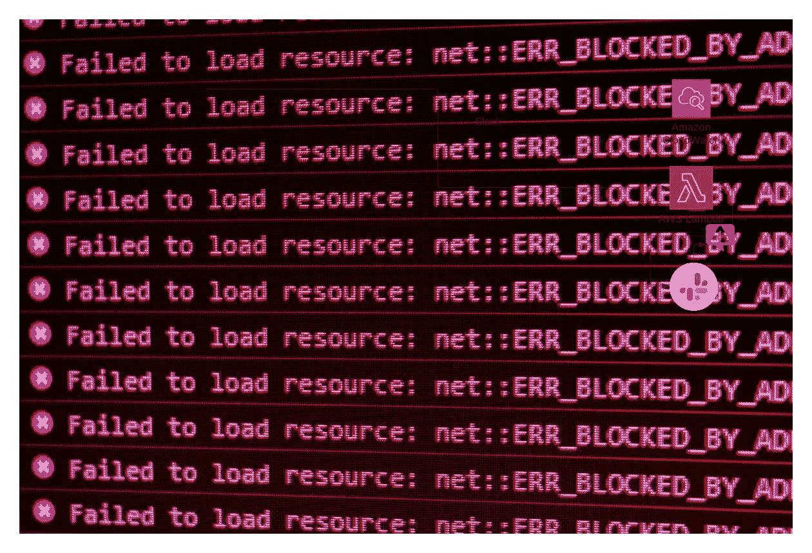

# BP 每日文摘#17 — Python 3.11 类型注释、Node.js 18 特性等等

> 原文：<https://betterprogramming.pub/bps-daily-digest-17-python-3-11-type-annotations-node-js-18-features-and-more-b9d9ddeeb542>

欢迎来到第 17 版咖啡字节，更好的编程每日文摘。

在这一期中，我们将关注 Python 3.11 和 Node.js 18 的新功能，将 Angular 应用程序转换为原生 Android 和 iOS 的指南，使用以太坊构建 Web3 支持的聊天的实践教程，以及通过 AWS Lambda 向 Slack 频道通知 Cloudwatch 日志流的方法。

## [Python 3.11 中的 4 项新类型注释特性](/4-new-type-annotation-features-in-python-3-11-84e7ec277c29)

由[崔永](https://medium.com/u/88ff1e2545d0?source=post_page-----b9d9ddeeb542--------------------------------)

一看`Self`——班级类型、`LiteralString`、`TypeVarTuple`和`NotRequired`

## [node . js 18 的 5 大特色](/5-major-features-of-node-js-18-5f4a164cc9fc)

由[詹妮弗·傅](https://medium.com/u/faf2e58f3d28?source=post_page-----b9d9ddeeb542--------------------------------)

[Node.js 18](https://nodejs.org/en/blog/release/v18.0.0/) 发布于 2022 年 4 月 19 日。它变成了`Current`版本。它有 5 个主要特点:

*   实验提取 API
*   Web 流 API
*   HTTP 超时
*   实验测试转轮
*   V8 JavaScript 引擎已更新至 V8 10.1

让我们来探索它们是什么以及如何使用它们。

## [如何将您的 Angular 应用程序转换为原生移动应用程序(Android 和 iOS)](/how-to-convert-your-angular-application-to-a-native-mobile-app-android-and-ios-c212b38976df)

作者[哈龙·切比](https://medium.com/u/901d3068860d?source=post_page-----b9d9ddeeb542--------------------------------)

正在寻找一种方法将您现有的 Angular 应用程序转换为移动应用程序，而不必从头开始重写一切？你来对地方了。在本文中，我们将使用电容来实现这一点。

## [创建一个基于以太坊的 Web3 聊天工具](/create-a-web3-chat-powered-by-ethereum-6886824fad7a)

作者:[托马斯·吉伯特](https://medium.com/u/7ef2130c129e?source=post_page-----b9d9ddeeb542--------------------------------)

我们将为这种基于区块链的聊天构建一个界面，如下所示:

## [如何让 Slack 用 AWS Lambda 通知你 Cloudwatch 错误](/how-to-let-slack-notify-you-on-cloudwatch-errors-with-aws-lambda-c98f1193ce59)

由[海科·范德沙夫](https://medium.com/u/a9f2f75ff5f6?source=post_page-----b9d9ddeeb542--------------------------------)

出问题时得到通知不是很好吗？如果它运行在 AWS 上，你很幸运，因为 AWS Lambda 可以监听 Cloudwatch 日志流。在这个故事中，我将演示如何使用 AWS Lambda 处理 Cloudwatch 日志流中的错误，然后向 Slack 发送通知。

