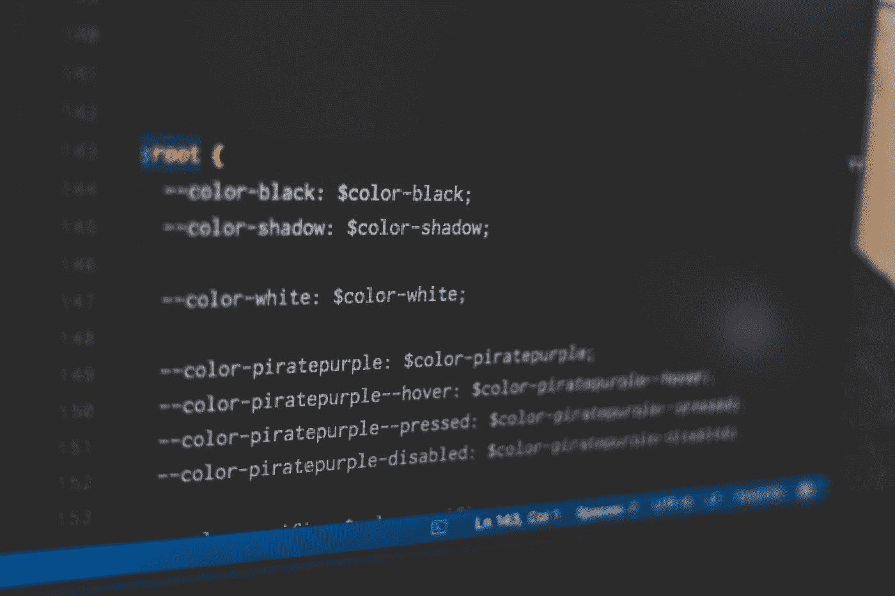

# 英国石油公司的每日文摘# 21-有用的代码片段和哲学的力量

> 原文：<https://betterprogramming.pub/bps-daily-digest-21-helpful-code-snippets-and-the-power-of-philosophy-eebbf03531e6>

## 这是我们今天要读的内容

欢迎来到第 21 版咖啡字节，更好的编程每日文摘。

在这一期中，我们为 Pythonistas、JavaScript 爱好者和 Gophers 提供了一些字节大小的指南，同时还有一篇发人深省的哲学文章。

事不宜迟，我们开始吧。

## [哲学能让你成为更好的程序员的 3 个理由](/3-reasons-why-philosophy-can-make-you-a-better-programmer-d226ff0d0748)

由[马蒂尔德·阿里菲](https://medium.com/u/2d961eeed08f?source=post_page-----eebbf03531e6--------------------------------)

哲学和编程是两个不同的学科。然而，在花了九年时间研究哲学之后，马蒂尔德发现，她在研究哲学时形成的思维模式帮助她成为了一名软件工程师。看了她的故事才知道“如何”。

作者图片

## [VS 代码的定制属性片段生成器](/a-custom-properties-snippet-builder-for-vscode-e6f415f2ccd7)

作者[马西莫·卡桑德罗](https://medium.com/u/ff7cb29d8f7c?source=post_page-----eebbf03531e6--------------------------------)

当你的 VS 代码插件不能正常工作时，你会怎么做？你创造一个。Massimo 展示了如何创建一个脚本，该脚本可以从用户定义的文件中提取 CSS 属性列表，并最终为您生成一个 VS 代码片段。

## [使用 Swift 结果生成器编写漂亮的代码](/write-beautiful-code-with-swift-result-builder-39af642f81e6)

由[阿维·察多克](https://medium.com/u/19a827575039?source=post_page-----eebbf03531e6--------------------------------)

的确，SwiftUI 代码库看起来不可思议。但是，你有没有想过如何在 UIKit 中复制这种体验？不要担心，Avi 正在探索一种使用 Swift 5.4 的结果生成器来实现这一点的方法。

## [如何用 Go 1.18 编写泛型助手函数](/how-to-write-generic-helper-functions-with-go-d47c52986016)

作者:亨利·施泰因豪尔

对于软件开发人员来说，检查数组是否包含特定值是一项相当常见的任务。并且有许多内置的功能来帮助我们。不幸的是，Go 编程语言对此没有预定义的函数。不用担心，Henry 在最新的 Go 1.18 更新中介绍了一种编写通用助手函数的方法。

这一次到此为止。感谢阅读。

直到你下次喝咖啡，

[Anupam](https://medium.com/u/9833cc01f515?source=post_page-----eebbf03531e6--------------------------------) 和更好的编程团队。