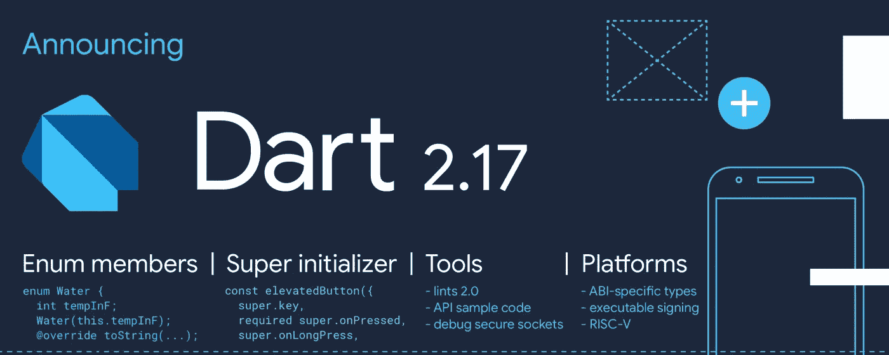
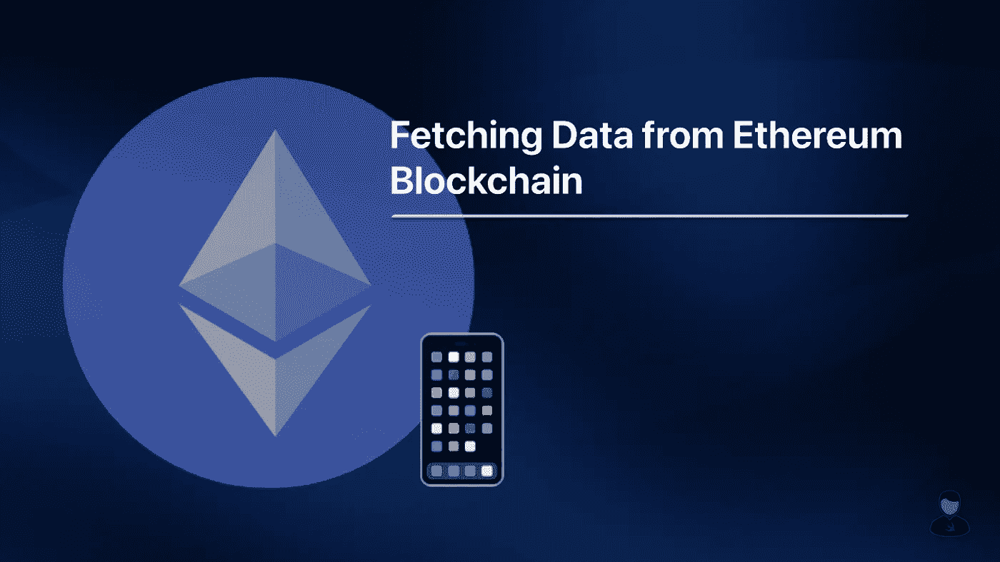

# 英国石油公司的每日文摘# 23——Flutter 3、Dart 2.17、Web3.swift 等

> 原文：<https://betterprogramming.pub/bps-daily-digest-23-flutter-3-dart-2-17-web3-swift-and-more-7187a750d9c2>

## 第 23 期——今日精选故事——5 月 12 日

欢迎来到第 23 版咖啡字节，更好的编程每日文摘。

谷歌 I/O 2022 活动昨天启动。主要公告包括推出 Flutter 3 和新的 Dart SDK。除了这些更新中的像素化之外，本期还介绍了 Web3.swift 的初步情况、针对 AWS Step 函数的案例以及对您的部署环境进行颜色编码的方法。

## [引入颤振 3](https://medium.com/flutter/introducing-flutter-3-5eb69151622f)

由[蒂姆·斯内斯](https://medium.com/u/59a5b43ec048?source=post_page-----7187a750d9c2--------------------------------)

## [Dart 2.17:生产力和整合](https://medium.com/dartlang/dart-2-17-b216bfc80c5d)

由迈克尔汤姆森

## [如何对您的部署环境进行颜色编码](/how-to-color-code-your-deployment-environments-271c5ef862c6)

由[马德琳·史密斯](https://medium.com/u/d9834f024687?source=post_page-----7187a750d9c2--------------------------------)

## [如何在 iOS 中使用 web 3 . swift](/how-to-fetch-data-from-the-ethereum-blockchain-using-swift-46138b290ac)

作者[李嘉盛](https://medium.com/u/69f6bded953d?source=post_page-----7187a750d9c2--------------------------------)

## [你应该远离 AWS 步进功能的 3 个理由](/3-reasons-you-should-stay-away-from-aws-step-functions-43bdd97b75a)

艾伦·赫尔顿

直到你下次喝咖啡，

阿努帕姆和更好的编程团队。