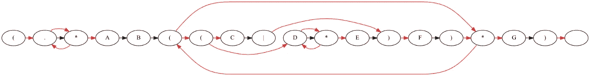

# 英国石油公司的每日文摘# 25-动画正则表达式，分享反应组件，等等

> 原文：<https://betterprogramming.pub/bps-daily-digest-25-animating-regular-expressions-sharing-react-components-and-more-82643ec96522>

## 5 月 17 日，第 25 期——今日精选故事

欢迎来到第 25 版咖啡字节，更好的编程每日文摘。

从通过插图理解正则表达式，到在 Android 中编写主题，到在 iOS 中复制活动指示器，再到分享 React 组件，我们今天为您准备了五篇颇有见地的文章。

## [用 Python 和 Graphviz 制作正则表达式动画](/animating-regular-expressions-with-python-and-graphviz-e0df447b827a)

窥视正则表达式引擎的内部

作者[艾登·施瓦茨](https://medium.com/u/d94d711eed0a?source=post_page-----82643ec96522--------------------------------)

## [如何使用 SwiftUI 重新创建默认的 iOS ActivityIndicator】](/make-default-ios-activityindicator-from-scratch-using-swiftui-7f31bb2f4493)

利用渐变和圆形

由 [Nikhil Vinod](https://medium.com/u/2ece37063f07?source=post_page-----82643ec96522--------------------------------)

## [Jetpack 撰写主题:颜色](/jetpack-compose-theming-colors-1cf86754d5b9)

探索 Android 应用程序中的颜色

由[戈兹德·卡瓦尔](https://medium.com/u/1b9915d639c1?source=post_page-----82643ec96522--------------------------------)

## [10 个好用的 Flutter 小工具](/10-flutter-widgets-that-come-in-handy-decae69a0f26)

TextButton.icon、AnimatedSwitcher 等等

由[德丹·恩东古](https://medium.com/u/f9d92785b881?source=post_page-----82643ec96522--------------------------------)

## [与 Webpack 5 共享 React 组件](/sharing-react-components-with-webpack-5-84c5496f3c64)

关于使用 Webpack 5 在应用程序之间共享 React 组件的完整指南

由[杰勒德·范德普特](https://medium.com/u/9292823729fa?source=post_page-----82643ec96522--------------------------------)

这一次到此为止。感谢阅读。

直到你下次喝咖啡，

阿努帕姆和更好的编程团队