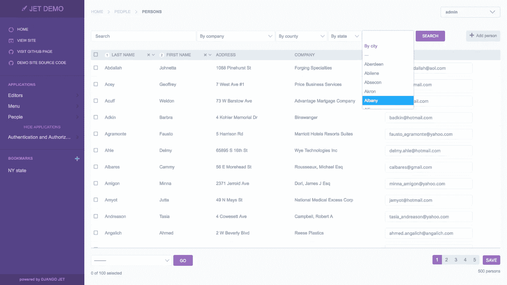
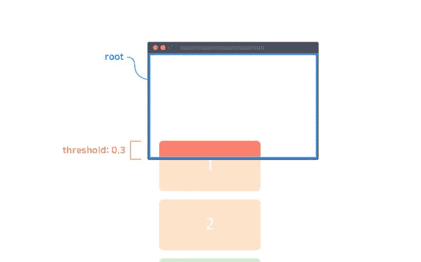

# 英国石油公司《每日文摘》第 26 期——Django Jet、NFT Token gates 等

> 原文：<https://betterprogramming.pub/bps-daily-digest-26-django-jet-nft-token-gating-and-more-af125eb44198>

## 5 月 18 日，第 26 期——今日精选故事

欢迎来到第 26 版咖啡字节，更好的编程每日文摘。

在这一期中，我们将通过令牌门深入 NFTs 的世界，快速浏览 IntersectionObserver API，学习一些从稀缺到丰富思维的实践，并为 Django 应用程序构建一个更好的管理

## [使用 Django Jet 改进您的 Django 管理面板](/a-better-admin-for-your-django-app-b6302ae06847)

> *Jet 是非常可定制的，对于管理员来说，它比默认面板有更好的外观和感觉，所以我肯定会推荐这种方法。*

由[纳乔·瓦格斯](https://medium.com/u/3010bc73cb39?source=post_page-----af125eb44198--------------------------------)

## [使用 Solidity Smart 契约实现 NFT 令牌门控](/implementing-the-concept-of-nft-token-gating-with-a-solidity-smart-contract-35cc77e45315)

> *令牌门控的概念用于限制访问，并向特定令牌或一组令牌的持有者提供专有内容、权利或成员资格。在这个场景中，我们将编写一个简单的智能契约，它实现了为 NFT 社区提供成员访问的相同概念。*

由[格蕾丝伦古](https://medium.com/u/5742881ca48?source=post_page-----af125eb44198--------------------------------)

## [从匮乏到富足心态转变的 5 种做法](/5-practices-to-shift-from-scarcity-to-abundance-mindset-d8bf717aac1c)

> 不要把世界看成一个有限的馅饼，而是把它看成一个无边无际的海洋，每个人都有足够的食物

由[维尼塔](https://medium.com/u/b892e7626234?source=post_page-----af125eb44198--------------------------------)

## [了解 intersect observer API](/the-intersectionobserver-b19fca5a194e)

> IntersectionObserver 是所有主流浏览器都支持的浏览器 API。它有一个有点吓人的名字和一个有点混乱的 API。但这不应该阻止我们使用它，因为它为我们提供了一些非常酷的功能。

埃米尔·海因

这一次到此为止。直到你下次喝咖啡，

[Anupam](https://anupamchugh.medium.com/) 以及更好的编程团队。