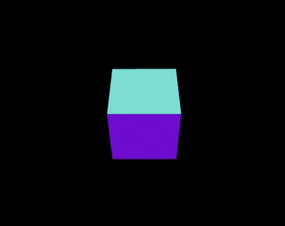

# 英国石油公司的每日文摘# 27——仙丹和 NEAR，WhatsApp 云 API 包装器，等等

> 原文：<https://betterprogramming.pub/bps-daily-digest-27-elixir-and-near-whatsapp-cloud-api-wrapper-and-more-c7bad18d33d8>

## 第 27 期——今日精选故事——5 月 23 日

欢迎来到第 27 版咖啡字节，更好的编程每日文摘。

在这一期中，我们将从使用流行的 3D JavaScript 库 Three.js 构建一些令人惊叹的动画开始，浏览 Angular 的一些主要 Google I/O 2022 公告，深入了解 Jetpack Compose 的视差滚动实现，使用《区块链附近》的 Elixir API，最后初步了解 WhatsApp Cloud API 的新开源库。

## [使用 Three.js:流行的 3D JavaScript 库](/working-with-three-js-the-popular-3d-javascript-library-bd2e9b03c95a)

由[詹妮弗·傅](https://jenniferfubook.medium.com/)

## [角度状态的 7 个关键点—谷歌输入输出 2022](/7-key-points-from-state-of-angular-google-i-o-2022-6f2c95540cac)

洛伦佐·萨拉安东内洛

## [视差滚动与 Jetpack 组合](/tldr-parallax-scrolling-with-jetpack-compose-ea2fe092a718)

由 [Hellajoey](https://medium.com/u/ae982dd9562a?source=post_page-----c7bad18d33d8--------------------------------)

## [用于近区块链的 Elixir API](/elixir-api-for-near-blockchain-b3c2c112dbb8)

亚历克斯·菲拉托夫

## [见见 Heyoo——WhatsApp Cloud API 的开源 Python 包装器](/programming-whatsapp-is-now-even-easier-for-python-developers-e1a4343deed6)

克里斯托弗·柯林斯

仅此而已。感谢阅读。

直到你下次喝咖啡，

阿努帕姆和更好的编程团队