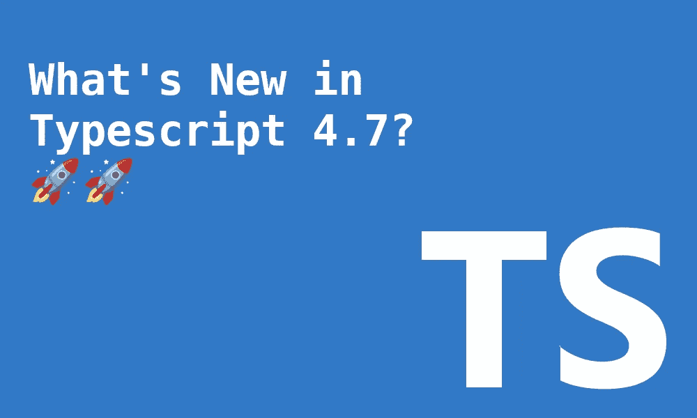

# BP 的每日文摘#28 —TypeScript 4.7、SwiftUI 扩展等等

> 原文：<https://betterprogramming.pub/bps-daily-digest-28-typescript-4-7-swiftui-extensions-and-more-38cbca4eeeea>

## 第 28 期——今日精选故事——5 月 24 日

欢迎来到第 28 版咖啡字节，更好的编程每日文摘。

在这一期中，我们选择了一些有趣的观点和当天的突出帖子。从第一眼看到 TypeScript 4.7，到软件工程师辞职的原因(以及经理如何留住他们)，到用 GitHub 操作自动化吉拉 webhooks，到插入 Jetpack Compose API 的缺失部分，再到探索一些 SwiftUI 扩展——有这么多快速字节。

## TypeScript 4.7 有什么新功能？

由[何塞·格兰哈](https://dioxmio.medium.com/)

## [吉拉 Webhook 和 GitHub Actions 工作流程自动化](/automation-with-jira-webhook-and-github-actions-workflow-fcd7efbf6688)

由[文琪·格兰兹](https://medium.com/@wenqiglantz)

## [软件工程师辞职的 5 个原因以及管理者如何留住他们](/five-reasons-why-software-engineers-quit-and-how-managers-can-retain-them-for-longer-9f8660e157b5)

由[安德烈格里德涅夫](https://andreigridnev.medium.com/)

## [Jetpack 组合中的双标题 lazy column](/double-header-lazycolumn-in-jetpack-compose-5cbbcece75ec)

由[比尔·查帕洛斯](https://medium.com/@tsapalos.v)

## [swift ui 的 16 个有用扩展](/16-useful-extensions-for-swiftui-88aae6ff8909)

由[马克幸运](https://marklucking.medium.com/)

快乐阅读。直到你下次喝咖啡，

阿努帕姆和更好的编程团队