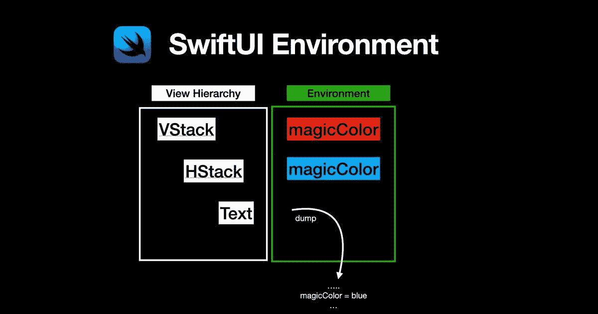
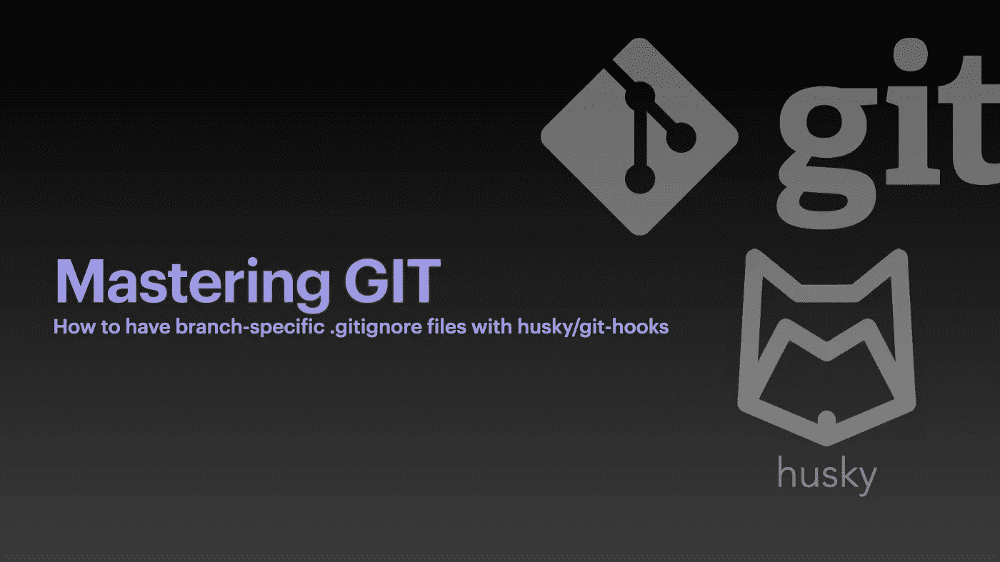

# 英国石油公司的每日文摘# 30——阅读 Android 上的智能合同，分支特定。gitignore 等等

> 原文：<https://betterprogramming.pub/bps-daily-digest-30-read-smart-contracts-on-android-branch-specific-gitignore-and-more-2bfdeec3b0b6>

## 第 30 期——今日精选故事——5 月 30 日

欢迎来到第 30 版咖啡字节，更好的编程每日文摘。这将是我们几周前的最后一期日报。但是不要担心！新的体验来了。

在本期中，我们将学习如何使用 Web3j 从 Android 应用程序中读取已部署的智能合约，高效地打印 SwiftUI 环境值以用于调试目的，了解如何配置分支特定的`.gitignore`文件，发现一些微调无服务器应用程序以获得更好性能的方法，并且还会有一些编程幽默。

## [如果编程语言是流行的浪漫比喻](/if-programming-languages-starred-in-popular-romance-tropes-2ec81bd9713)

到[黑文](https://medium.com/u/d00525b1bbf0?source=post_page-----2bfdeec3b0b6--------------------------------)

## [如何高效转储 SwiftUI 环境](/how-to-dump-swiftui-environment-efficiently-1bdf12ef37ed)

马尔科·艾丁格

## [您应该对无服务器应用程序进行快速优化](/quick-optimizations-you-should-make-to-your-serverless-applications-9cc73ec464b9)

艾伦·赫尔顿

## [如何使用 Web3j 从 Android 读取已部署的智能合同](/how-to-read-deployed-smart-contract-from-android-using-web3j-d56b23d616a3)

由 [Yoorbit](https://medium.com/u/365c70576952?source=post_page-----2bfdeec3b0b6--------------------------------)

## [如何进行分支具体化。gitignore 带有 Husky/git-hooks 的文件](/how-to-have-branch-specific-gitignore-files-with-husky-git-hooks-4ca04d7e78cf)

作者:flo·拉格斯尼

感谢阅读。直到下一次，

[Anupam](https://anupamchugh.medium.com/) 和更好的编程团队。