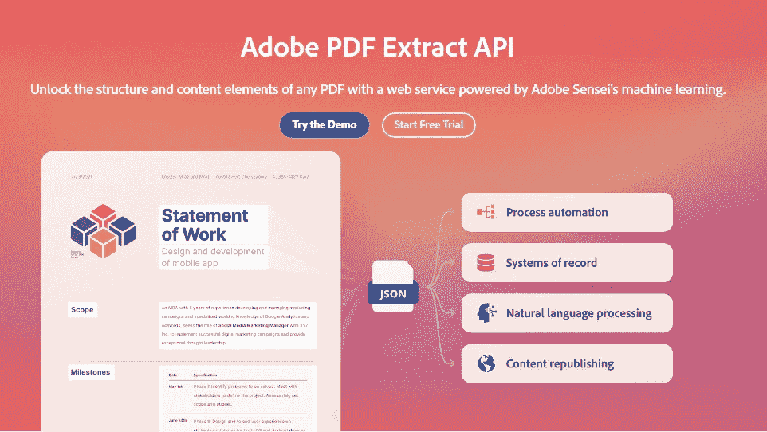
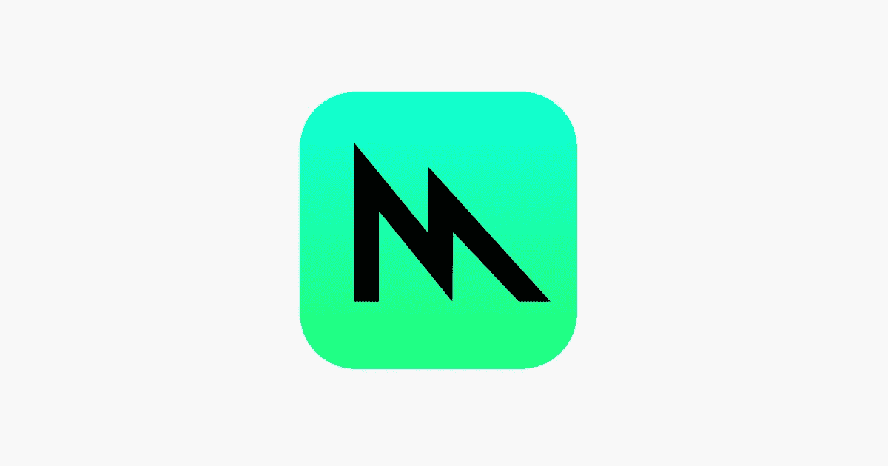
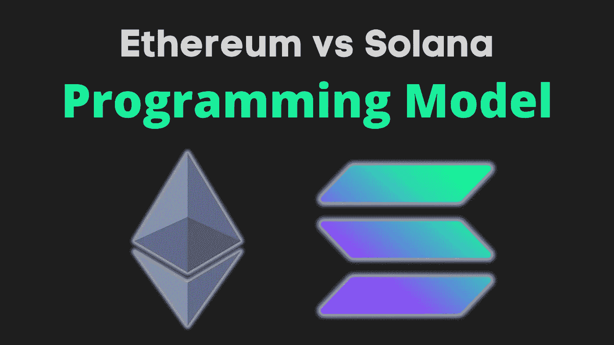

# BP 的每日文摘:Adobe PDF Extract API Demo、Solana、AWS Amplify 等等

> 原文：<https://betterprogramming.pub/bps-daily-digest-adobe-pdf-extract-api-demo-solana-aws-amplify-and-more-fbc5b6765308>

欢迎来到第 12 版咖啡字节，更好的编程每日文摘。

在这一期中，我们已经初步了解了 Jetpack Macrobenchmark，快速浏览了 Adobe 新发布的 [PDF Extract API 演示](https://documentcloud.adobe.com/dc-visualizer-app/index.html?sdid=Q3FWPSFT&mv=social&mv2=paidsoc)，一些敏捷视角，一条招聘建议，AWS Amplify 的风险，以及大量代码。

# 编程；编排

## [如何写出值得通过代码评审的正则表达式](/how-to-write-a-regex-worthy-of-passing-code-review-68b9a25c013a)

由[马修·坎纳特](https://medium.com/u/aae754e76361?source=post_page-----fbc5b6765308--------------------------------) — 4 分钟阅读

您可以仅用一些基本知识编写有效的正则表达式，并使它们对其他工程师来说是可读的，甚至是那些发誓永远不使用它们的固执己见的工程师。

让下面的内容成为理解、利用和维护正则表达式的实用指南。

# 软件工程

## [宣布发布 Adobe PDF Extract API 演示](https://medium.com/adobetech/announcing-the-release-of-the-adobe-pdf-extract-api-demo-90089b8038b3)

由[雷蒙德·卡姆登](https://medium.com/u/bf14ea4a1d6f?source=post_page-----fbc5b6765308--------------------------------)在 [Adobe 技术博客](https://medium.com/adobetech)中发表— 4 分钟阅读

PDF Extract API 通过由 Adobe Sensei 的机器学习支持的 web 服务，帮助解锁任何 PDF 的结构和内容元素。然而，大量的数据可能会让用户不知所措。考虑到这一点，Adobe 团队发布了一个演示，努力为 PDF Extract API 返回的数据提供上下文。

# Web 开发

## [让我们使用 Go](/lets-build-a-movie-api-with-clean-architecture-ef1f555b563d) 构建一个具有分离分层架构的电影 API

通过[Dilara grüm](https://medium.com/u/b9839858ba42?source=post_page-----fbc5b6765308--------------------------------)—5 分钟读取

看看我们如何借助三层架构更容易地测试我们的电影 API。这些层是什么—处理程序、服务和存储库。

了解他们的角色并观察他们的行动。

# Python 开发

## [如何在 Python 中构建可数类](/how-to-build-countable-classes-in-python-c3aa5b887c90)

由[列夫·马克西莫夫](https://medium.com/u/7f0da47ee5ba?source=post_page-----fbc5b6765308--------------------------------) — 4 分钟读完

如果你希望你的类是可数的，或者在类似字典的结构中作为关键字使用，你需要三样东西:

1.  覆盖`__hash__`方法
2.  相应地覆盖`__eq__`方法
3.  使类不可变

# Android 开发

## [用宏观基准](https://medium.com/androiddevelopers/measure-and-improve-performance-with-macrobenchmark-560abd0aa5bb)衡量和改进绩效

by[Tomámlynari](https://medium.com/u/f557899ce692?source=post_page-----fbc5b6765308--------------------------------)in[Android 开发者](https://medium.com/androiddevelopers) — 9 分钟阅读

在本文中，我们将了解 [Jetpack Macrobenchmark 库](https://developer.android.com/studio/profile/macrobenchmark-overview)如何帮助您了解应用程序的性能，以及如何[使用基线配置文件将应用程序的启动时间提高 30%](https://android-developers.googleblog.com/2022/01/improving-app-performance-with-baseline.html) ！

# iOS 开发

## [在 Swift Playgrounds 4 中使用金属](/using-metal-in-swift-playgrounds-4-e100122d276a)

通过[E skills](https://medium.com/u/4fc3d67637cd?source=post_page-----fbc5b6765308--------------------------------)—3 分钟读取

本文将展示在 Swift Playgrounds 4 中制作 Metal 的两种方法，并比较 playground 使用这两种方法在 M1 Mac 上加载 Metal 库的时间:

*   在 Xcode 中编译金属库
*   将金属源作为资源储存

# 自动警报系统

## [为什么要提防 AWS Amplify 上的 next . js](/beware-of-next-js-on-aws-amplify-5a1286db2a6a)

克里斯·维伯特——4 分钟阅读

几个月前，我受命在 AWS Amplify 上部署一些 Next.js 应用程序。我知道这不会像使用 Vercel 那么容易，但我有兴趣尝试一些不同的东西。但事实证明挑战太大了，几天后我回到了 Vercel，再也不想使用 Amplify。

# Web3 开发

## [面向 Solidity 开发人员的 Solana 入门](/getting-started-with-solana-for-solidity-developers-ee97a9bdf7ed)

通过[纳扎尔·伊拉马诺夫](https://medium.com/u/7313b3fb800?source=post_page-----fbc5b6765308--------------------------------) — 8 分钟读取

通过比较以太坊和索拉纳的编程模型开始你的索拉纳之旅。

如果你熟悉以太坊和固体，你可能会尝试一下索拉纳生态系统。索拉纳的快速区块链充满希望，令人兴奋。另外，你增加了你的网络 3 知识的表面积。

# 敏捷

## [敏捷是一种反设计模式吗？](https://uxdesign.cc/is-agile-an-anti-design-pattern-1a5d6a87c069)

由 [Shamsi Brinn](https://medium.com/u/14326f7afc67?source=post_page-----fbc5b6765308--------------------------------) — 4 分钟阅读

如果你是一个对自己有限的角色和标准敏捷中缺乏 UX 感到沮丧的设计师，或者是一个想要更多验证和指导的开发人员，这样你就可以停止猜测一个规范的存在，考虑一个新的敏捷模式。

# 招聘建议

## 根据这些强有力的原则雇佣员工，而不是经验

由 [Roo Benjamin](https://medium.com/u/7edb049e27b0?source=post_page-----fbc5b6765308--------------------------------) — 6 分钟阅读

想想吧。几乎任何人都可以在成功的一天和客户一起工作。但是，当关系变得棘手，你需要进行一次艰难的对话时，该怎么办呢？没有任何战略文件能拯救你。

在这种时候，你需要一个有情商的人。当压力来临时，你想和能够接受反馈并在经历困难时有弹性的人在一起或一起工作。

直到你下次喝咖啡，

[Anupam](https://medium.com/u/9833cc01f515?source=post_page-----fbc5b6765308--------------------------------) 以及更好的编程团队。