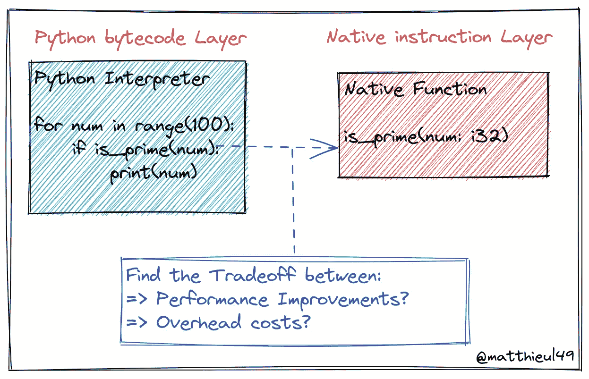
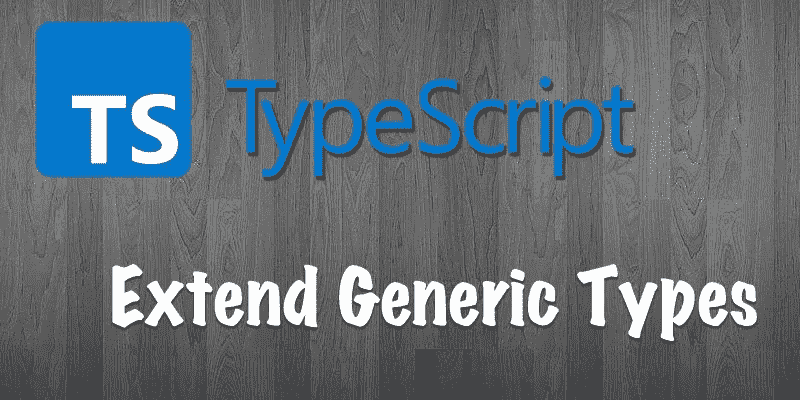
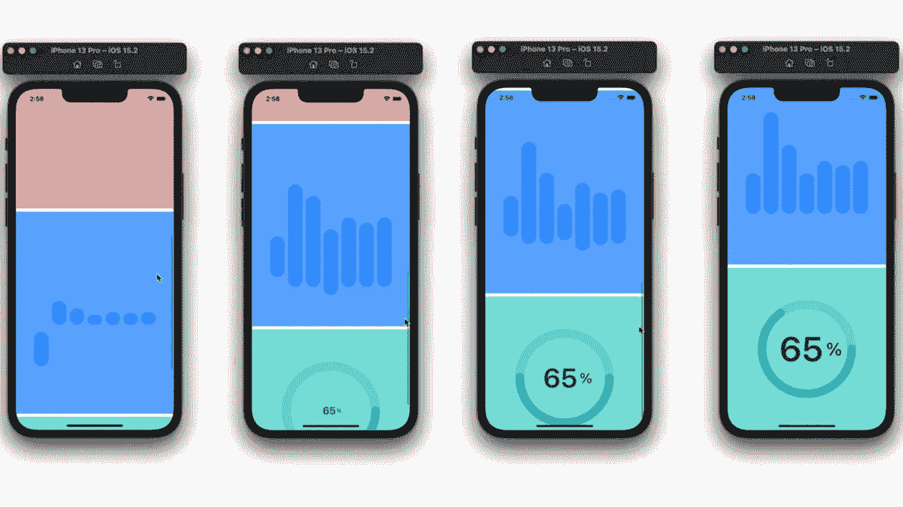

# 英国石油公司的每日文摘:“但它在我的机器上工作”？，“当这一切都分崩离析”，GPT-4，等等

> 原文：<https://betterprogramming.pub/bps-daily-digest-but-it-works-on-my-machine-when-it-all-falls-apart-gpt-4-and-more-27e055ef07df>

## 新作品开始你的一周

又一个星期一，又一个星期。在本摘要中，我们将了解如何编写用于基准测试的原生 Python 扩展，浏览构建全栈 web3 应用程序所需的工具，将我们的 TypeScript 多态性技能提升一个档次，深入了解 Android 和 iOS 世界，了解一两件关于软件工程招聘游戏的新事情，并浏览大量代码。

# 编程；编排

[**“但是在我的机器上能用”？**](https://medium.com/@igniteram/but-it-works-on-my-machine-f9ecee373b0f) —我们在软件开发过程中都听过这个短语。Ram Pasala 和他们的团队已经建立了 [Neverinstall](https://neverinstall.com/) ，一个托管在云机器上的开发者工具。它允许用户共享整个实例，并跨机器一致地复制它。希望这个工具能最大限度地减少这句话的使用。

## 当一切分崩离析

> 需要勇气转身说，“好吧，哪里出问题了？”。你承认你犯了错误，你必须改正它。那需要勇气。作为一名开发人员，我们得到报酬来修复我们自己的错误——Jason Manning

[**阅读全文> >**](https://medium.com/@jasonkylemanning/when-it-all-falls-apart-26bc1f08a253)

# 来自数据科学

## GPT 4 号即将发射。以下是我们对它的了解

> **结盟:**GPT 4 号将比 GPT 3 号更与我们结盟。它将实现 InstructGPT 的学习，instruct GPT 是通过人类反馈训练的。尽管如此，人工智能校准仍然是一个漫长的过程，应该仔细评估这些努力，不应该夸大其词

[阅读更多> >](https://towardsdatascience.com/gpt-4-is-coming-soon-heres-what-we-know-about-it-64db058cfd45)

# 来自 Python

## (简单的)原生 Python 扩展基准

> 我已经建立了一个基本的基准来测试基于 Rust/PyO3 和 Cython 的原生模块的性能。为了进行比较，我使用三种方法开发了相同的算法:
> 
> 1.一个纯 Python 实现:该基准的基线。
> 2。带有类型提示的 Cython 实现。
> 3。PyO3 框架的 Rust 实现。
> —由[马特](https://medium.com/u/460833753bd7?source=post_page-----27e055ef07df--------------------------------)

[**阅读教程> >**](https://medium.com/@MatthieuL49/a-simple-native-python-extension-benchmark-40c9ed8037b2)

# 来自打字稿

## 扩展 TypeScript 泛型以实现额外的类型安全

> 一些如何通过扩展你的泛型类型来进行更高级操作的快速例子——Jason Byrne

[**阅读教程> >**](/extending-typescript-generics-for-additional-type-safety-313f35aca5b3)

# 来自 Android

## Android 中的活动嵌入

> 这篇文章讲述了`Activity`嵌入如何影响小屏幕和大屏幕上的应用程序行为，如何在你的应用程序中添加对它的支持，以及如何配置它和控制诸如`Activity`启动和后退导航等方面。—作者[侯赛因·哈基姆](https://medium.com/u/9ed81b63628d?source=post_page-----27e055ef07df--------------------------------)

[**阅读教程> >**](https://proandroiddev.com/activity-embedding-in-android-b07da14b715)

# 来自 iOS

## 带 SwiftUI 的 ScrollView 中的动画

> 延迟播放动画，直到一个视图出现在屏幕上——由 [Sarah](https://medium.com/@sarah.h.alsharif)

[**阅读教程> >**](/animations-inside-a-scrollview-with-swiftui-3b550c18a442)

# 来自 Web3

## FullStack Web3 —您需要知道的一切

> 我们确切地了解了 web3 /区块链/智能合约应用程序如何在前端使用 HTML 和 Javascript 工作。然后，我们将通过 6 种不同的方式将您的元掩码、幻象或其他区块链钱包地址连接到您的前端。我们将看看流行的 Nextjs / React 包，让你的开发生命周期轻松 100 倍

[**阅读更多> >**](/everything-you-need-to-know-about-fullstack-web3-94c0f1b18019)

# 赢得面试比赛

刚出炉的！在 Tinder，Ishan Khanna 已经面试了一段时间机器人高级职位的候选人。没有具体的公司，他在这个 [Twitter 帖子](https://twitter.com/droidchef/status/1515780914093047808)中记下了他的心得。

## 技术面试的另一个指南

> 屡试不爽的策略帮助你在下一次工作面试中胜出——作者[丽娜·阿特斯坦](https://medium.com/u/f540d518c481?source=post_page-----27e055ef07df--------------------------------)

[**阅读更多> >**](/yet-another-guide-to-tech-interviews-d7ed52454155)

今天到此为止。感谢阅读。