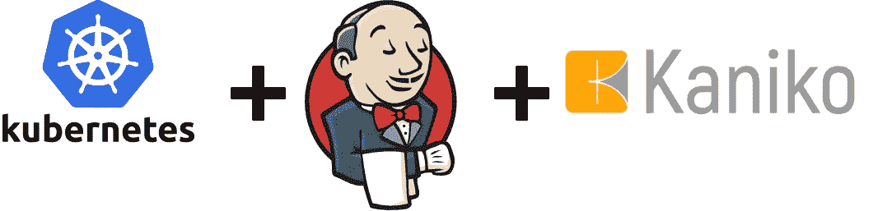
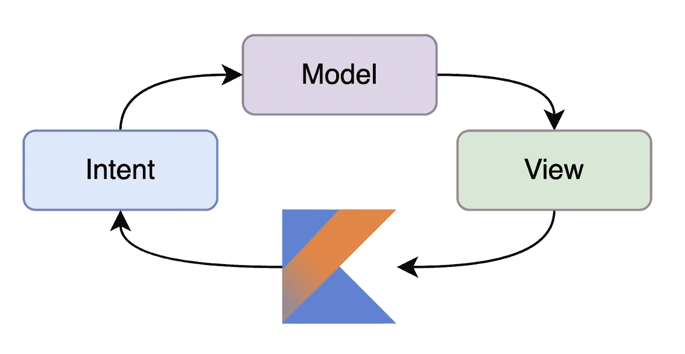
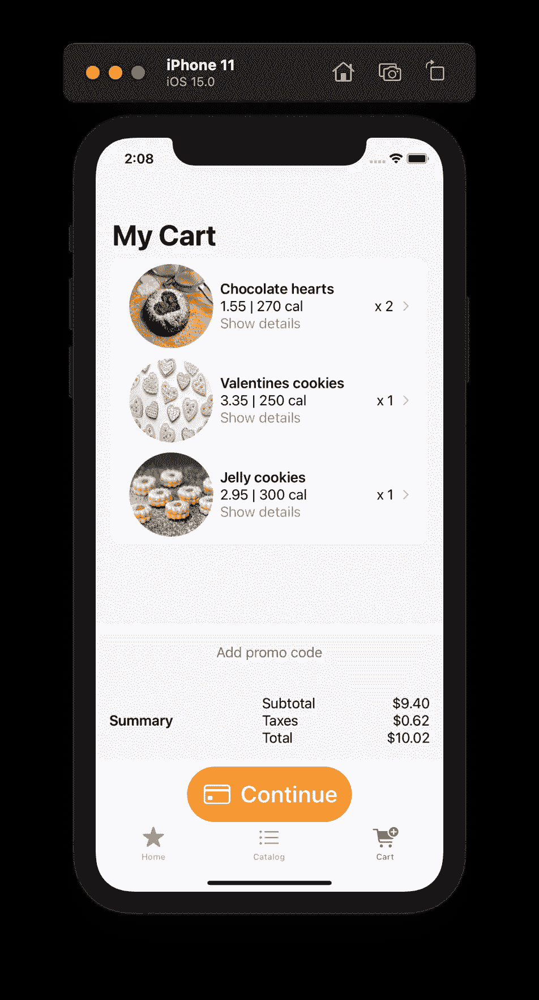
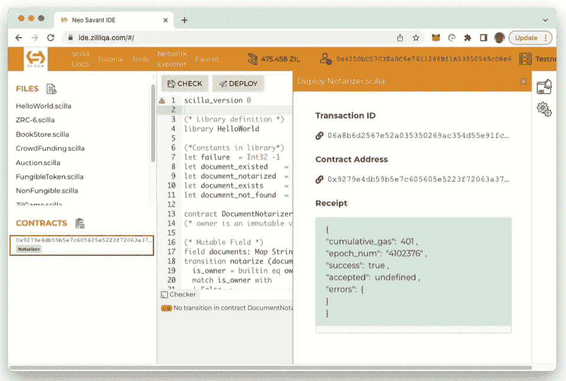

# 英国石油公司的每日文摘:C# 11 预览更新，MVI 与科特林，等等

> 原文：<https://betterprogramming.pub/bps-daily-digest-c-11-preview-updates-mvi-with-kotlin-and-more-5edd3ab55efe>

## 更多的每日阅读来激励你

在这份每日文摘中，我们已经初步了解了微软为您带来的 C#11 预览版更新，来自一些软件工程媒体出版物的最新更新，一种全新的调试应用程序的方法，一个有趣的 Python 挑战，对组织可能面临的敏捷挑战的全新思考(以及补救措施)，为 Zilliqa 区块链编写智能合同的全面指南，以及一如既往的大量代码来帮助您构建东西。

# 编程；编排

在她的博客文章中， [Kathleen Dollard](https://twitter.com/kathleendollard) 向我们介绍了即将推出的 C# 11 预览版特性——原始字符串、UTF-8、检查用户定义的操作符、自动默认结构、跨度模式匹配等等。在这里阅读[完整文章](https://devblogs.microsoft.com/dotnet/csharp-11-preview-updates/)。

## 使用会话回放工具通过用户的眼睛调试你的应用程序

> 其他时候，错误报告说“用户抱怨应用程序无法工作”，或者更糟的是，“应用程序有时可以工作，但当我点击红色按钮时，它就停止工作了”。你会想知道用户在谈论的是你整个应用程序中 10 个红色按钮中的哪一个。很高兴，会议重播来拯救我们。
> 
> 会话回放是一种在稍后的时间准确回顾别人浏览器中发生的事情的能力——作者[费尔南多·多格里奥](https://medium.com/u/d55832d5b3b1?source=post_page-----5edd3ab55efe--------------------------------)

[**阅读更多> >**](/debug-your-app-through-the-users-eyes-with-a-session-replay-tool-e2a37a4e133a)

# 来自软件工程出版物

## Kaniko 简介

> 如何使用 Kaniko 在 Jenkins CI 管道中构建容器映像
> 
> Kaniko 是最好的图像生成器工具之一，它的运行不依赖于 docker 守护进程。与使用 docker 相比，这也是一个值得考虑的安全选项——由[Groww Engineering](https://medium.com/u/b60d3b452046?source=post_page-----5edd3ab55efe--------------------------------)的 Tanvi P Karennavar 提供。

[**阅读更多> >**](https://tech.groww.in/an-introduction-to-kaniko-5cf4a8168d80)

*   [由](https://blog.branchkey.com/structuring-a-golang-application-3c15030681e0) [Deepshi Garg](https://medium.com/u/f324b341a551?source=post_page-----5edd3ab55efe--------------------------------) 在 [BranchKey](https://blog.branchkey.com/) 构建一个 Golang 应用。
*   [在自主团队中启动 CI 最佳实践](https://medium.com/dynatrace-engineering/kickstarting-ci-best-practices-in-autonomous-teams-f4fefcf43948)由 [Dynatrace Engineering](https://medium.com/dynatrace-engineering) 的 [Katharina Sick](https://medium.com/u/460407e1dfd2?source=post_page-----5edd3ab55efe--------------------------------) 。

# 来自 Python

## 如何用 Python 在象棋中找到国王的合法走法

想知道如何使用 Python 在棋盘上找到国王的合法走法吗？不要去任何地方，因为马丁·安德松·阿伯格向我们展示了如何解决这个有趣的挑战。

[**阅读更多> >**](/how-to-find-the-kings-legal-moves-in-chess-with-python-1267192cf089)

# 来自 Web Dev

## 用依赖注入、存储库模式、React 和 Typescript 来消除您的顾虑

> 你有没有被固化的应用程序逻辑所困扰？当供应商发生变化时，必须重写整个组件或项目？希望您的前端代码不依赖于特定的数据实现？被文章开头无情的问题所困扰？
> 
> 在这篇文章中，我将通过一个例子来说明如何构建能够扩展并适应未来变化的松耦合应用——作者是 [Leigh White](https://medium.com/u/e7e6f4d0ece4?source=post_page-----5edd3ab55efe--------------------------------)

[**阅读更多> >**](/decoupling-your-concerns-with-dependency-injection-the-repository-pattern-react-and-typescript-6b455788a374)

# 来自 Android Dev

## MVI 需要的只是科特林。没有减压器怎么减？

> 在本文中，我描述了我基于 [Kotlin 流](https://kotlinlang.org/docs/flow.html)——由 [Maciej Sady](https://medium.com/u/7b5c1fbf7610?source=post_page-----5edd3ab55efe--------------------------------) 开发的一个简单状态缩减器的尝试

[**阅读更多> >**](/all-you-need-for-mvi-is-kotlin-how-to-reduce-without-reducer-5e986856610f)

# 来自 iOS 开发

在这个由四部分组成的系列中， [Elena Rubilova](https://medium.com/u/7e8822aac723?source=post_page-----5edd3ab55efe--------------------------------) 使用 SwiftUI 构建了一个 Cookies 应用程序。查看第 4 篇教程，了解如何实现购物车功能。

[**阅读更多> >**](https://medium.com/@elena.rubilova/cart-functionality-for-cookies-app-with-swiftui-dc87d327e038)

# 来自 Web3 开发

## 使用 Scilla 编程语言为 Zilliqa 区块链编写智能合同

> 要编写 Scilla 智能合同，最简单的方法是使用 Neo Savant IDE，这是一个成熟的 IDE，用于编写、测试和部署 Scilla 智能合同

[**阅读更多> >**](https://blog.cryptostars.is/writing-smart-contracts-for-the-zilliqa-blockchain-using-the-scilla-programming-language-b287951e0b1f)

# 来自 AWS

## 使用 AWS Lambda 和 API 网关创建无服务器重定向功能

> 你已经创建了一个发布在应用商店上的应用，现在你想使用一个 URL 将你的用户重定向到他们各自的商店？你来对地方了——作者[拉菲尔·安萨里](https://medium.com/u/5a47494c562a?source=post_page-----5edd3ab55efe--------------------------------)

[**阅读更多> >**](/creating-a-serverless-redirect-function-600816603d48)

# 敏捷

## 敏捷组织的真正挑战——以及如何解决它

> 似乎应用敏捷方法的主要问题不是缺乏知识。更确切地说，是领导层愿意放弃他们的战术决策权，信任他们的团队

[**阅读更多> >**](/the-real-challenge-of-organizations-with-agile-and-how-to-fix-it-84fa99f250ae)

目前就这些。感谢阅读。