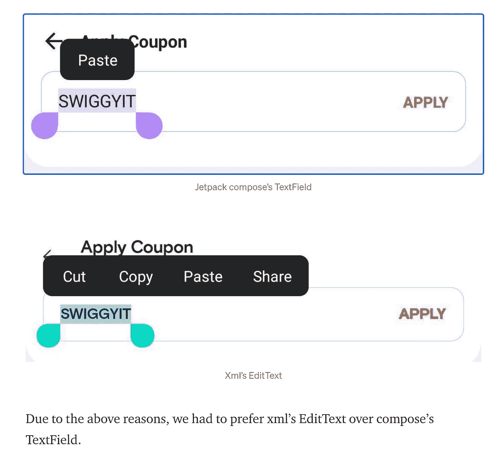

# 英国石油公司的每日文摘:马斯克的推特分析，iPad 上的代码，等等

> 原文：<https://betterprogramming.pub/bps-daily-digest-musk-s-twitter-analysis-code-on-an-ipad-and-more-eeb26baf55c8>

## 给你的早晨增添咖啡因的新故事

照片由[法赫米·法克鲁丁](https://unsplash.com/@fahmipaping?utm_source=medium&utm_medium=referral)在 [Unsplash](https://unsplash.com?utm_source=medium&utm_medium=referral) 上拍摄

大多数开发人员都有一个问题:“我的 iPad 能代替 MacBook 和台式机来写代码吗？”一如既往，答案是“视情况而定”。尽管苹果在本地应用程序开发方面取得了长足的进步，并为其 iPad 带来了 M1 芯片，但在开发人员从桌面和 Mac 电脑转型之前，还有很长的路要走。在此之前，让我们看看你如何使用 iPads 进行编码。

同样在这一版中，我们将了解 StashQL:一个新的 npm 包，了解 Jetpack Compose 如何增强大规模 Android 应用程序，构建一个井字游戏，在 iOS 中将 Dribbble UI 设计转换为 Swift 代码，处理一个易受攻击的智能合约代码，并分析 Musk 的 Twitter 线程。

# 编程——在 iPad 上编码

*   2020 年，当“iPad for development”刚刚兴起时，[按键按键](https://medium.com/u/179527732133?source=post_page-----eeb26baf55c8--------------------------------)尝试了 Codeanywhere、GitPod 等工具，以及一切[让在 iPad 上编码变得更有趣的工具](/its-2020-and-coding-on-ipads-is-finally-enjoyable-ab10c9e4d3d2)。
*   同时， [Rob Sturgeon](https://medium.com/u/1de9d252156e?source=post_page-----eeb26baf55c8--------------------------------) 向我们展示了[Swift ui 允许我们使用 Swift Playgrounds 在 iPad 上做什么](/write-swiftui-entirely-on-an-ipad-using-swift-playgrounds-f48364e50c9a)
*   随着 2021 年 GitHub Codespaces 的推出，在 iPad Pro 上编码变得更加容易。[欧文·威廉姆斯](https://medium.com/u/9cca1cc5944f?source=post_page-----eeb26baf55c8--------------------------------)说: [GitHub Codespaces 是一种在你的 iPad 上编码的*惊人的*方式](https://medium.com/@ow/the-2021-guide-to-coding-on-an-ipad-pro-5428d062c5ff)而且足够强大，足以可靠地将你笨重的笔记本电脑留在家里，而不是仅仅依靠你的 iPad。
*   接下来，[崔永](https://medium.com/u/88ff1e2545d0?source=post_page-----eeb26baf55c8--------------------------------)尝试在 iPad 上使用浏览器中的[vs code . dev—*我没有感觉到与桌面浏览器有任何不同，因为 iPad 的屏幕并不太小。*](https://towardsdatascience.com/meet-vs-code-in-the-browser-vscode-dev-vs-code-for-the-web-cf8740211967)
*   2022 年初，在 iPad 上编码变得更加有趣。 [David Amos](https://medium.com/u/2b3100272a2a?source=post_page-----eeb26baf55c8--------------------------------) 向我们展示了在 iPad 上编写 Python 代码的 [5 种方法——Carnets 和`a-shell`是你今天就可以开始利用的两种工具。](/5-ways-to-use-python-on-an-ipad-a6b780de64fc)
*   最后， [Samjproctor](https://medium.com/u/ac87e5d30b2a?source=post_page-----eeb26baf55c8--------------------------------) 演示了[如何用来自互联网的数据](/practice-swiftui-skills-api-calls-and-programming-practice-6efbf6914db3)快速创建一个功能性的 iOS 应用程序…但是也有一些[限制](/can-you-really-build-an-app-using-only-ipad-swift-playgrounds-4-f3e9c484b3ee)。

# Web 开发

## StashQL:高效地更新和缓存您的 GraphQL 查询

StashQL 是一个 npm 包，用于缓存 GraphQL 查询和数据，与传统包相比，它具有额外的选项来更新缓存-由 [Hakudo Ueno](https://medium.com/u/9a44a156500f?source=post_page-----eeb26baf55c8--------------------------------)

[**阅读更多> >**](https://medium.com/@hakudo.0909/stashql-efficiently-update-and-cache-your-graphql-queries-bd7b4a743da2)

*   [让我们用 React With TypeScript 和 Hooks](/lets-build-a-tic-tac-toe-game-using-react-with-typescript-and-hooks-321f78d8d1e0) 来做一个井字游戏——作者[罗杰奥·阿莫林](https://medium.com/u/82244dfb6a6a?source=post_page-----eeb26baf55c8--------------------------------)

# 计算机编程语言

## 使用 Python 从埃隆·马斯克的推文中发现情绪

胡安·克鲁兹·马丁内斯写道，只需有限的一组推文，无需编写大量代码，我们就可以对埃隆的推特账户上发生的事情进行一些非常有趣的分析

[**阅读更多>>**](/detecting-sentiment-from-elon-musks-tweets-using-python-ec7820469ac0)

*   想要构建一个 Python web 应用程序来将视频转换为 gif？ [Eugenia Anello](https://medium.com/u/86fdc517c278?source=post_page-----eeb26baf55c8--------------------------------) 使用 [MoviePy 简化它，并在本教程中简化它。](/building-a-web-application-to-convert-a-video-to-a-gif-using-streamlit-2ab3b377eac1)

# Android 开发

## Jetpack Compose-为 Swiggy 的新优惠券列表页面提供动力

Swiggy 是一个按需交付的食品平台。把它想象成超级吃印度。他们在媒体上运行一个[软件工程出版物。](https://bytes.swiggy.com/)

他们的 Android 团队最近从用于 UI 开发的 XML 转向了 Jetpack Compose。在他们的最新文章中， [Shivam Mahajan](https://medium.com/u/f7001412b60f?source=post_page-----eeb26baf55c8--------------------------------) 分享了该团队在 Jetpack Compose 中构建 UI 时所面临的改进和挑战:

> 代码的减少和代码的可重用性是我们从 compose 得到的最大好处之一。如果我们增加其他页面对 compose 的采用，那么我们肯定会看到应用程序大小的减少以及开发工作量估计的减少。

[**阅读更多> >**](https://bytes.swiggy.com/jetpack-compose-powering-swiggys-new-coupon-listing-page-1784a0eb27f7)

# iOS 开发

## 使用 Swift 5 在 iOS 应用中设计一个类似 Dribbble 的 UITabBar

如果你厌倦了像 Margels 这样的标签栏设计，可以看看她的教程来创建漂亮的用户界面。这是她在英国石油公司的处女作。

[**阅读更多> >**](/how-to-create-a-nice-uitabbar-for-your-ios-app-using-swift-5-pt-1-f9d2d5450909)

# 以太坊开发

## 防止对以太坊的智能合约攻击——代码分析

Abhishek Chauhan 展示了一个易受攻击的智能合约代码，以演示攻击是如何工作的，然后提供了一个修复它的解决方案。

[**阅读更多>>**](/preventing-smart-contract-attacks-on-ethereum-a-code-analysis-bf95519b403a)

# 自动警报系统

## AWS kine sis vs . SNS vs . SQS——与 Python 示例的比较

解耦提供了无数的优势，但是为这项工作选择正确的工具可能具有挑战性。仅 AWS 就提供了几种服务，允许我们分离发送和接收数据。虽然这些服务表面上似乎提供了类似的功能，但它们是为不同的用例设计的，如果正确应用于手头的问题，它们中的每一个都是有用的——Anna ge ller 写道。

[**阅读更多> >**](/aws-kinesis-vs-sns-vs-sqs-a-comparison-with-python-examples-6fc688bfd244)

直到下一个咖啡字节，

感谢阅读。