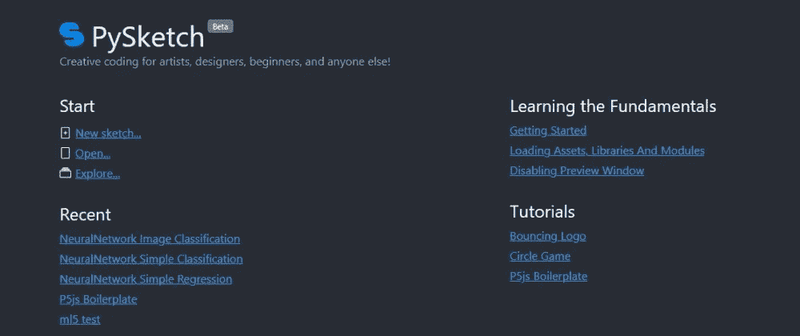
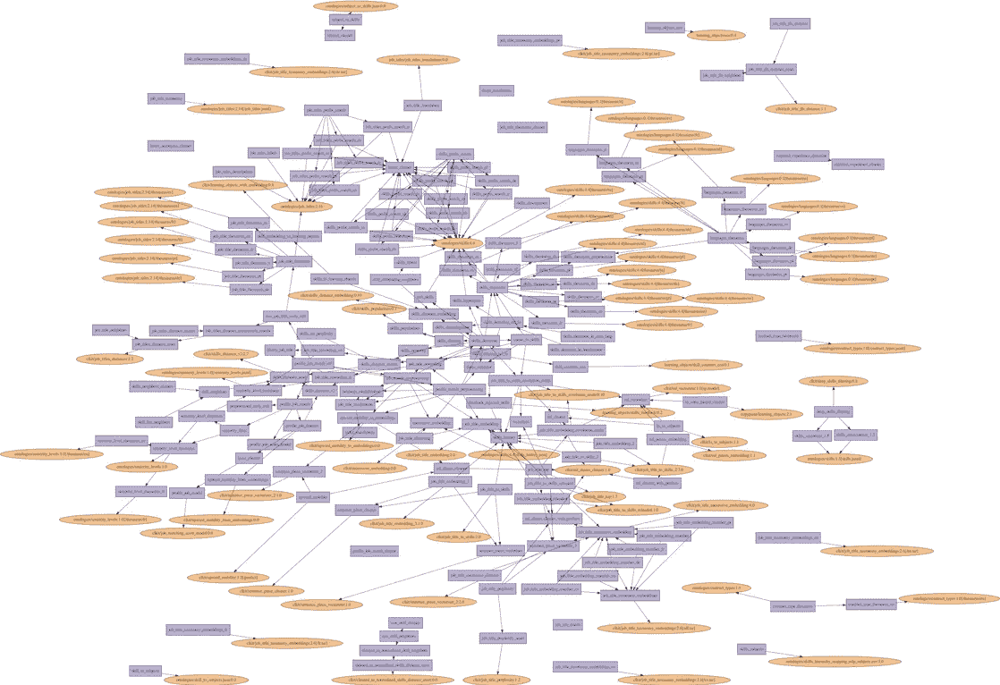
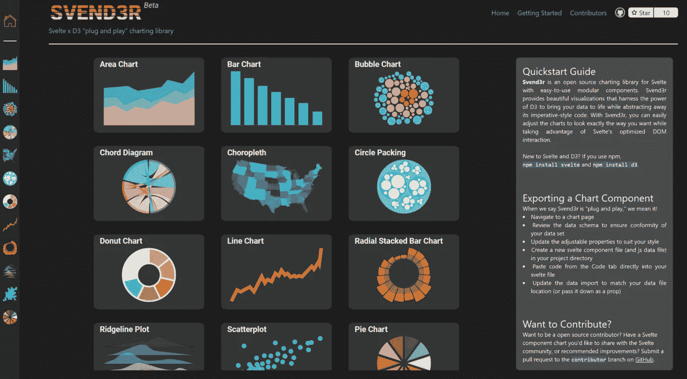
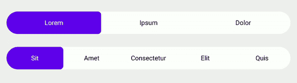
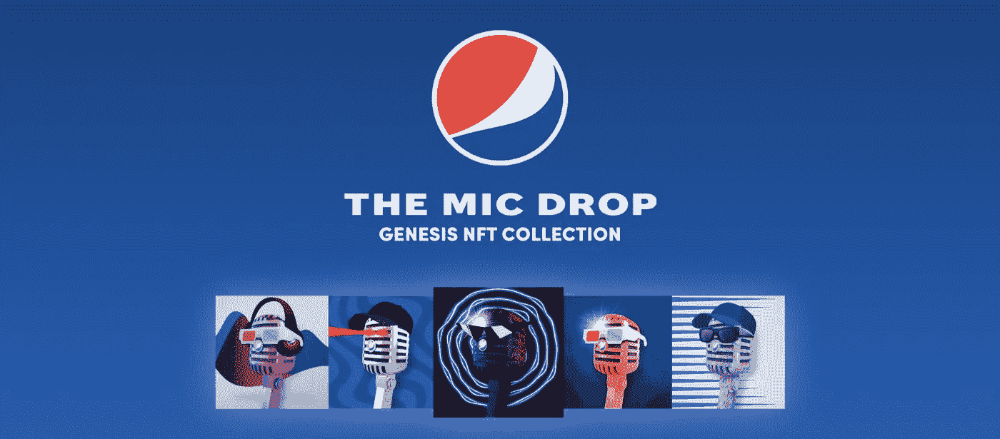

# 英国石油公司的每日文摘:百事 NFT 智能合同，更快的代码与卤化物，PySketch，Svend3r，等等

> 原文：<https://betterprogramming.pub/bps-daily-digest-pepsi-nft-smart-contract-faster-code-with-halide-pysketch-svend3r-and-more-cd9e0a1e29ab>

## 这是我们今天要读的内容

照片由[伊斯哈格·罗宾](https://unsplash.com/@esmiloenak?utm_source=medium&utm_medium=referral)在 [Unsplash](https://unsplash.com?utm_source=medium&utm_medium=referral) 上拍摄

嘿大家好，

这份每日文摘包括对 Halide 编程语言的初步了解、来自 JavaScript 和 Python 世界的一些新工具、另一份智能合同分析、针对 Android 和 iOS 开发人员的两个动画教程、大量代码和一条工作建议。

# 编程；编排

## 用 Halide 编写快速且可维护的代码——试播集

点击图片阅读更多信息

写高性能的代码经常以降低可移植性和简单性为代价——Halide 解决了这个问题，我们经常在谷歌使用它——作者 [Minhaz](https://medium.com/u/820b4ad3efe1?source=post_page-----cd9e0a1e29ab--------------------------------)

[阅读更多](/write-fast-and-maintainable-code-with-halide-part-1-6a5c3a519250)

*   [Go 中的仿制药:我们到了吗？](/generics-in-go-are-we-there-yet-af851c35ba0)
*   [用 Rust 提升 Python S3 客户端性能](https://joshua-robinson.medium.com/improving-python-s3-client-performance-with-rust-e9639359072f)作者[约书亚·罗宾逊](https://medium.com/u/7a83b11a1be0?source=post_page-----cd9e0a1e29ab--------------------------------)

# 计算机编程语言

## PySketch.com:好玩的 Python！

点击阅读文章

由 PySketch 团队制作，这是一个 Python web 编辑器，旨在为任何喜欢创造性编码的人提供社交编码体验。

[阅读更多](https://medium.com/@pysketch/pysketch-python-coding-for-fun-dc13732db502)

# 机器学习

## 使用我们的 MLOps python 库 modelkit 制作生产就绪的 ML 模型

点击图片阅读文章

我们有开源的 [modelkit](https://github.com/Cornerstone-OnDemand/modelkit) ，一个 python MLOps 框架，目的是让 ML 模型可重用、健壮、高性能，并且易于在各种环境中部署 [Cyril Le Mat](https://medium.com/u/8cdf813e226e?source=post_page-----cd9e0a1e29ab--------------------------------)

[阅读更多](https://medium.com/@cyrillemat/making-a-ml-models-production-ready-with-modelkit-our-mlops-python-library-af877cda0ca1)

# Java Script 语言

## Svend3r，一个即插即用的图表库。

图表是乏味的，让 [Svend3r](https://www.svend3r.dev/) 节省你的时间……作者[艾萨克·桑德斯](https://medium.com/u/a1e556aa93dc?source=post_page-----cd9e0a1e29ab--------------------------------)

[阅读更多](https://medium.com/@isaaclsaunders/svend3r-a-plug-and-play-charting-library-for-your-svelte-project-2753b8762ec8)

# Android 开发

## 在 Jetpack Compose 中创建动画选择器

在今天的故事中，我们将学习如何创建一个自定义选择器，让用户从几个选项中选择一个，并带有动画背景来突出显示所选的选项——作者是 [Francesc Vilarino Guell](https://medium.com/u/d814f16b5155?source=post_page-----cd9e0a1e29ab--------------------------------)

[阅读更多](https://fvilarino.medium.com/creating-an-animated-selector-in-jetpack-compose-669066dfc01b)

# iOS 开发

## 带 AVKit 的 SwiftUI 中的气泡动画

通过这篇文章，我们将创建一个简单而丰富多彩的界面，带你向这个奇妙的世界迈出第一步——作者[阿比盖尔·德·郭睿](https://medium.com/u/125fa70528ac?source=post_page-----cd9e0a1e29ab--------------------------------)

[阅读更多](/bubble-animation-in-swiftui-avkit-39a688a0b942)

# Web3 开发

## 百事 NFT 智能合同分析

百事可乐于 2021 年 12 月放弃了它的创世纪 NFT 系列([来源](https://micdrop.pepsi.com/))，直到今天这个项目的交易量为 23000 ETH(560 万美元)。我仔细研究了百事 NFT 公司的合同，了解他们是如何实施这个项目的。在本教程中，我将逐行解释智能合约——作者[赵思聪](https://medium.com/u/8e6bcf52156c?source=post_page-----cd9e0a1e29ab--------------------------------)

[阅读更多](/nft-beginner-tutorial-pepsi-nft-smart-contract-explained-962721b7361a)

# 卡夫卡

## 监控 Kafka 应用程序—实施健康检查和跟踪延迟

微服务通常使用发送或回复心跳/健康检查的模型，作为向报告、调度或编排服务提供状态信息的方式——由 [Ivelina Yordanova](https://medium.com/u/97cfe701f78?source=post_page-----cd9e0a1e29ab--------------------------------)

[阅读更多](/monitoring-kafkaapplications-implementing-healthchecks-and-tracking-lag-3976cc6f00d5)

# 工作

## 如何与你的经理建立良好的关系

与他人合作的一个重要因素是不仅要关心你自己的需求，还要关心别人想要什么——T2·维尼塔

[阅读更多](/how-to-build-a-thriving-relationship-with-your-manager-2e97ef3ef5d8)

这一次到此为止。感谢阅读。