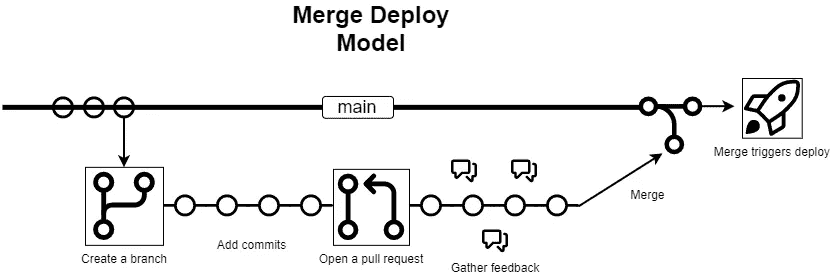
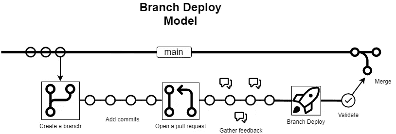

# 具有问题操作和 GitHub 操作的分支部署

> 原文：<https://betterprogramming.pub/branch-deployments-with-issueops-and-github-actions-d9405311ad8b>

## 通过 IssueOps 和 GitHub 行动将您的部署实践发扬光大

发布操作+分支+部署

# 介绍

开发人员将他们的变更部署到生产环境中最常见的方式是合并→部署模型。然而，有一种更好的方法将我们的代码交付到产品中。与其按下合并键，不如十指交叉，握紧我们的屁股...我们可以满怀信心地点击“合并”,相信我们的更改会完全按照我们的预期进行！

**介绍…分支机构部署模式！**

> 如果您已经听说过 branch deploy 模型并且熟悉它，您可以直接跳到我们用 GitHub 操作实现它的部分

为了真正理解分支部署模型，让我们首先看一下传统的**部署→合并**模型。事情是这样的:

1.  创建分支
2.  向您的分支添加提交
3.  打开拉取请求
4.  收集反馈+同行评审
5.  合并你的分支
6.  部署从`main` / `master`分支开始

现在让我们看看**分支部署**模型:

1.  创建分支
2.  向您的分支添加提交
3.  打开拉取请求
4.  收集反馈+同行评审
5.  部署您的更改
6.  使生效
7.  合并你的分支

合并部署模型

分支部署模型

正如您所看到的，合并部署模型本质上是有风险的，因为`main`分支从来就不是一个真正稳定的分支。如果部署失败，或者我们需要回滚，我们将再次遵循整个过程来回滚我们的更改。然而，在分支部署模型中，`main`分支总是处于“良好”状态，我们可以在任何时候部署它以从分支部署恢复部署。在分支部署模型中，我们只在分支被成功部署和验证后，将我们的变更合并到`main`分支中。

> 注意:这有时被称为 [GitHub 流](https://docs.github.com/en/get-started/quickstart/github-flow)

# 关键概念

**分支部署**模式的关键概念:

*   `main`分支总是被认为是稳定的和可部署的分支
*   所有的变更在被合并到`main`分支之前都被部署到生产中
*   要回滚分支部署，您需要部署`main`分支

好了，到现在为止，您有望了解分支机构部署方法。但是我们如何实施呢？介绍…问题！

# 问题

定义问题的最好方法是将其与类似的东西 ChatOps 进行比较。您可能已经对 ChatOps 这个概念很熟悉了，但如果您不熟悉，下面是它的一个快速定义:

> ChatOps 是与聊天机器人交互以直接在聊天平台中执行命令的过程。例如，使用 ChatOps，你可以做类似于`.ping example.org`的事情来检查网站的状态

IssueOps 采用相同的思维模式，但通过不同的媒介。而不是使用聊天服务(不和谐、懈怠等。)为了调用命令，我们在 GitHub 问题或 Pull 请求上使用注释。 [GitHub Actions](https://github.com/features/actions) 是在调用 IssueOps 命令时执行我们期望的逻辑的运行时。

# GitHub 行动！

它是如何工作的？

这一节将详细介绍这个动作是如何工作的，并希望能启发你如何在自己的项目中利用它。

完整的源代码和进一步的文档可以在 [GitHub](https://github.com/GrantBirki/branch-deploy) 上找到

在 GitHub 存储库中的`.github/workflows/branch-deploy.yml`下创建这个文件

让我们一行一行地使用这个[动作](https://github.com/marketplace/actions/branch-deploy)来完成一个 GitHub 动作工作流:

细分市场#1

需要注意的是，我们想要运行 IssueOps 的工作流是`issue_comment`和`created`。

这意味着我们不会在此工作流的任何其他上下文中运行。您可以随意编辑它，但它确实会改变这个模型最终的工作方式。

例如，`issue_comment`工作流仅使用在`main`上找到的文件来运行。如果你做了类似`on: pull_request`的事情，你可能会暴露自己的问题，比如用户可能会修改 PR 中的文件，泄露你的秘密。

仅使用`issue_comment`是建议的工作流程类型

细分市场#2

这些是运行此操作所需的最低权限

细分市场#3

设置您的`demo`作业，使用 ubuntu runner，并检查您的 repo——这只是一般操作的一些标准设置

细分市场#4

> 注意:为这个作业设置一个`id:`是很重要的，这样我们可以在后续步骤中引用它的输出——您可以在这里看到动作所采取的输入和输出的完整列表

这个动作的核心就发生在这里。这段代码将触发分支部署操作运行。它将执行以下操作:

1.  检查调用此处定义的`trigger:`短语(`.deploy`)的工作流的注释
2.  如果找到触发短语，它将继续进行部署
3.  它将首先对您的消息做出反应，让您知道它正在运行
4.  该操作将发布一条注释，其中包含指向正在运行的操作工作流的链接，以便您跟踪其进度
5.  部署将被启动并附加到您的拉取请求上——您将得到一个漂亮的黄色小火箭，告诉您部署正在进行中
6.  此作业将导出输出，以便以后在其他作业中引用

细分市场#5

如上所示，我们有两个步骤。一个用于 noop 部署，一个用于常规部署。例如，noop 部署可以触发一个`terraform plan`，而常规部署可以是一个`terraform apply`。这些步骤由两个变量有条件地控制:

*   `steps.branch-deploy.outputs.continue == 'true'`-`continue`变量仅在部署应该继续时设置为真
*   `steps.branch-deploy.outputs.noop == 'true'`-`noop`变量仅在`noop`部署应该运行时设置为真

> 示例:您在一个 pull 请求上注释了`.deploy noop`。检测到 noop 部署，因此该操作将`noop`变量输出到`true`。您还拥有执行 IssueOps 命令的正确权限，因此该操作还会将`continue`变量输出到`true`。这将允许上面看到的“假 noop 部署”步骤运行，而“假常规部署”步骤将被跳过

**就是这样！**

如果你想了解更多关于设置这个动作和所有可用的配置选项，你可以在 GitHub Marketplace 上查看这个动作:[链接](https://github.com/marketplace/actions/branch-deploy)

> 注意:您也可以通过上面引用的链接找到所有代码和完整的工作流示例

# 例子🎥

下面的例子演示了在一个拉请求上使用 [**分支-部署**](https://github.com/marketplace/actions/branch-deploy) 动作

分支部署演示

# 结论

如果您正在寻求增强您的 DevOps 体验，在您的部署中获得更好的可靠性，或者更快地发布变更，那么`branch-deployments`正是您所需要的！

希望您现在能够更好地理解为什么分支部署模型是将您的代码交付到产品中的一个很好的选择。

通过使用 GitHub + Actions + IssueOps，您可以在任何回购中利用 branch deploy 模型！

源代码: [GitHub](https://github.com/marketplace/actions/branch-deploy)