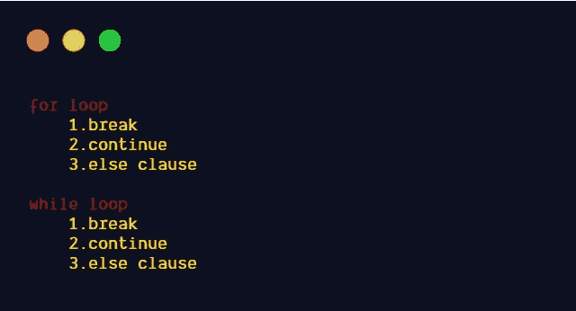
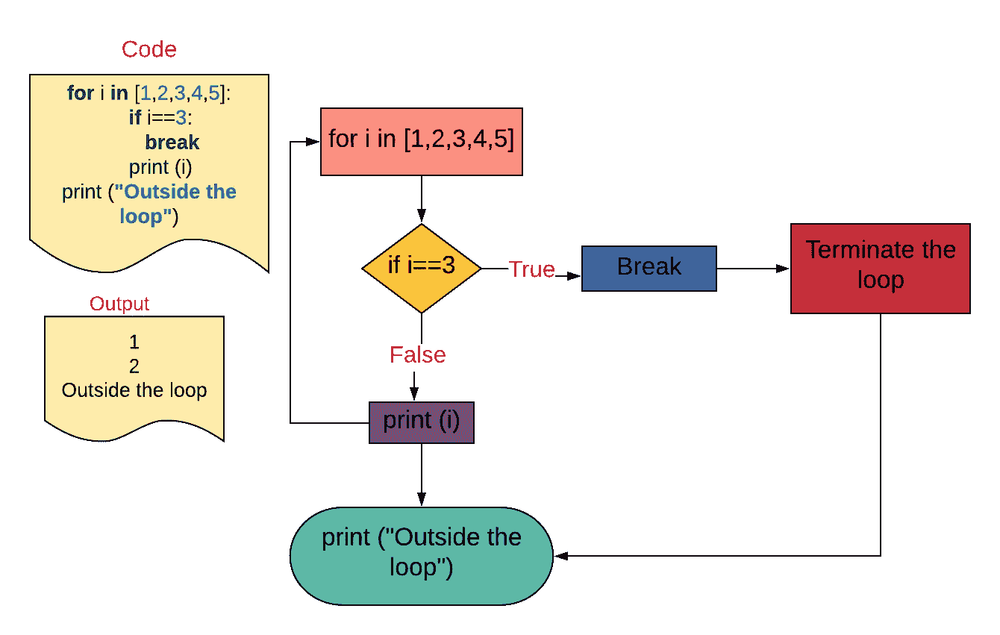
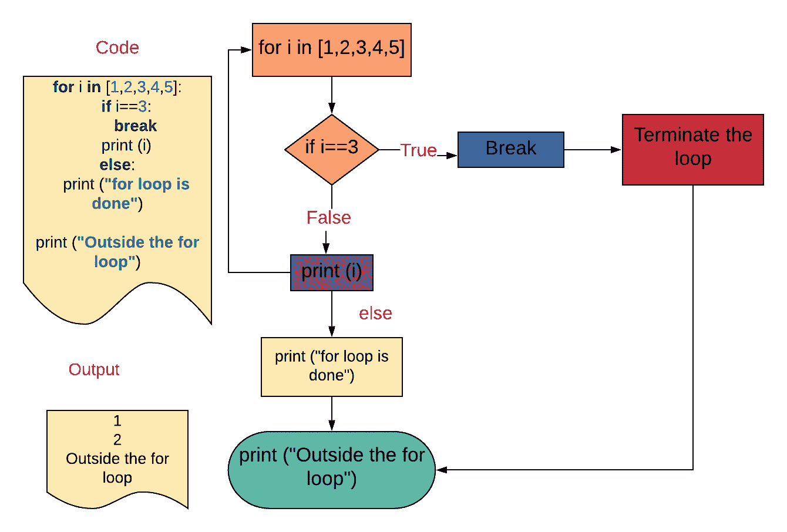
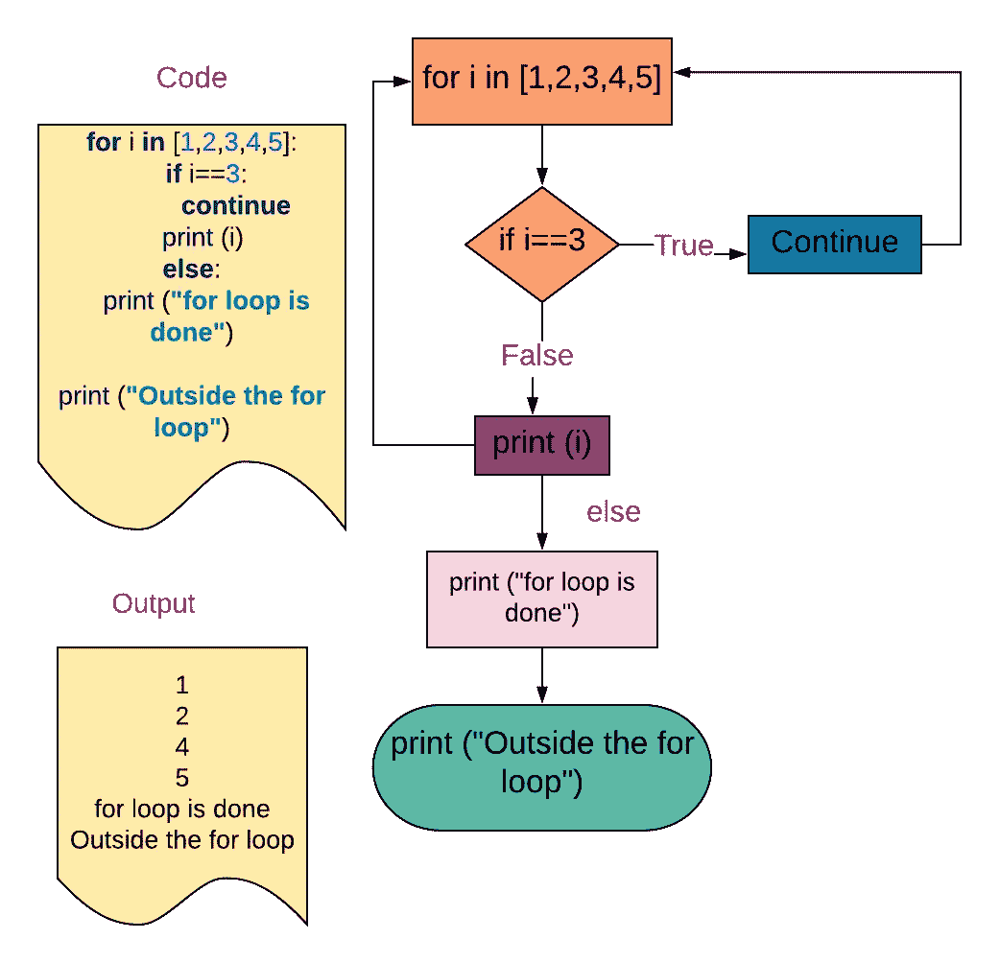
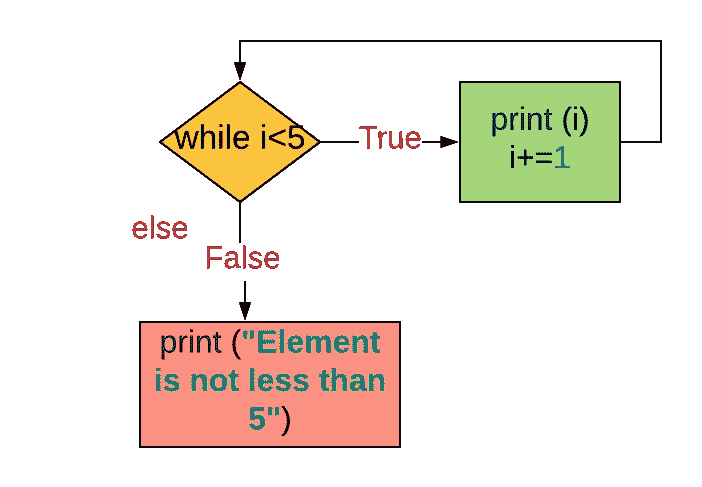
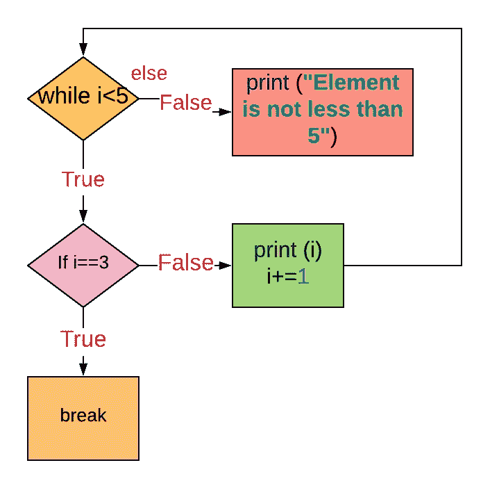
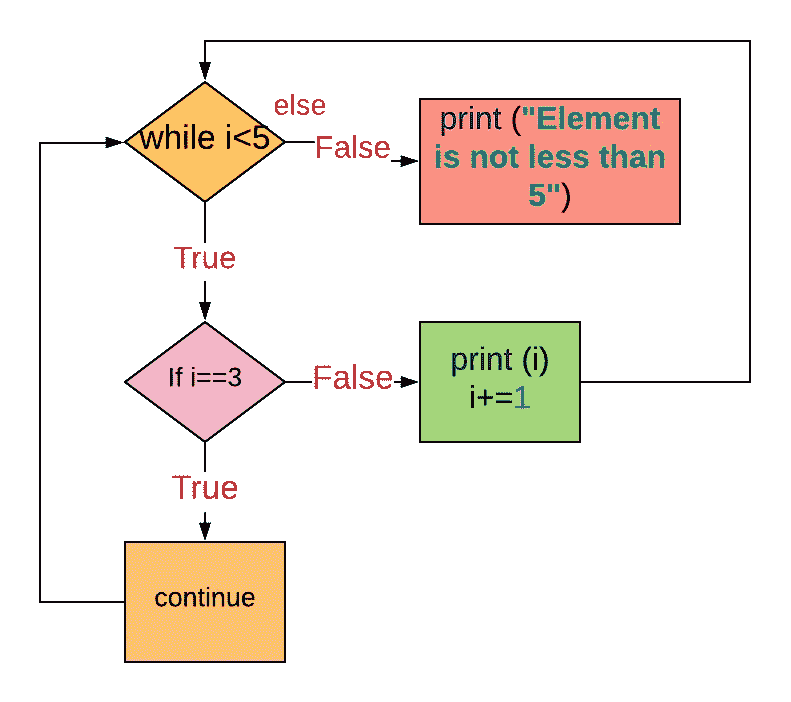

# Python 中循环上的 Break、Continue 和 Else 子句

> 原文：<https://betterprogramming.pub/break-continue-and-else-clauses-on-loops-in-python-b4cdb57d12aa>

## 如何编写更好的 Python 循环的快速概述


克里斯·里德在 [Unsplash](https://unsplash.com?utm_source=medium&utm_medium=referral) 上拍摄的照片

# Python 中的循环

*   `for`循环
*   `while`循环

让我们学习如何在`for`循环和`while`循环中使用控制语句，如`break`、`continue`和`else`子句。



本故事涵盖的主题(图片来源:作者)

# “for”语句

> `for`语句用于迭代序列(比如字符串、元组或列表)或任何其他可迭代对象的元素。- [python 文档](https://docs.python.org/3/reference/compound_stmts.html#for)

```
**for** item **in** iterable:
    suite
```

*   iterable 只计算一次。为 iterable 的结果创建一个迭代器。
*   然后，按照迭代器返回的顺序，对迭代器提供的每个项目执行一次该套件。
*   当项目用尽时，循环终止。

## 例 1。for 循环

```
**for** i **in** range(1,6):
    print (i)
**'''
Output:
1
2
3
4
5
'''**
```

`for`循环可能有类似`break`和`continue`的控制语句，或`else`子句。

在某些情况下，您可能需要完全退出某个特定条件的循环，或者希望跳过循环的一部分并开始下一次执行。`for`循环和`while`循环有控制语句`break`和`continue`来处理这些情况。

# **‘中断’声明**

`break`语句脱离最内层的封闭`for`循环。

在第一个套件中执行的`break`语句终止循环，而不执行`else`子句的套件。

`break`语句用于终止`for`循环或`while` 循环的执行，控制转到`for`循环体之后的语句。



图片来源:作者

## 例 2。在“for”循环中使用“break”语句

*   `for`循环将遍历 iterable。
*   如果 iterable 中的 item 是`3`，将中断循环，控制将转到`for`循环后的语句，即`print (“Outside the loop”)`。
*   如果项目不等于`3`，它将打印该值，并且`for`循环将继续，直到所有项目都用完。

```
**for** i **in** [1,2,3,4,5]:
    **if** i==3:
        **break** print (i)
print (**"Outside the loop"**)
**'''
Output:
1
2
Outside the loop
'''**
```

## 例 3。在具有“else”子句的“for”循环中使用“break”语句

在第一个套件中执行的`break`语句终止循环，而不执行`else`子句的套件。



图片来源:作者

**例如:**

在`for`循环中，当条件`i==3`满足时，将中断`for`循环，控制将转到`for`循环体之后的语句，即`print (“Outside the for loop”)`。

也跳过了`else`子句。

```
**for** i **in** [1,2,3,4,5]:
    **if** i==3:
        **break** print (i)
**else**:
    print (**"for loop is done"**)

print (**"Outside the for loop"**)
**'''
Output:
1
2
Outside the for loop
'''**
```

# “继续”语句

`continue`语句继续循环的下一次迭代。

在第一个套件中执行的`continue`语句会跳过套件的其余部分，继续执行下一项，或者如果没有下一项，则继续执行`else`子句。

## 例 4。在“for”循环中使用“continue”语句

*   `for`循环将遍历 iterable。
*   如果 iterable 中的项目是`3`，它将继续`for`循环，不会执行套件的其余部分，即`print (i)`。
*   因此元素`3`将被跳过。
*   `for`循环将从下一个元素继续执行。
*   也执行`else`条款。

```
**for** i **in** [1,2,3,4,5]:
    **if** i==3:
        **continue** print (i)
**else**:
    print (**"for loop is done"**)

print (**"Outside the for loop"**)
**'''
1
2
4
5
for loop is done
Outside the for loop
'''**
```



图片来源:作者

# “for”循环中的“else”子句

循环语句可能有一个`else`子句。当`for`循环由于 iterable 的耗尽而终止时，它被执行——但当循环被`break`语句终止时，它不被执行。

## 例 5。在“for”循环中使用“else”子句

当 iterable 用尽后`for`循环终止时，执行`else`子句。

```
**for** i **in** [1,2,3,4,5]:
    print (i)
**else**:
    print (**"for loop is done"**)

print (**"Outside the for loop"**)
**'''
1
2
3
4
5
for loop is done
Outside the for loop
'''**
```

## 例 6。在带有“break”语句的“for”循环中使用“else”子句

当`for`循环被`break`语句终止时，不执行`else`子句。

```
**for** i **in** [1,2,3,4,5]:
    **if** i==3:
        **break** print (i)
**else**:
    print (**"for loop is done"**)

print (**"Outside the for loop"**)
**'''
1
2
Outside the for loop
'''**
```

## 例 7。在带有“continue”语句的“for”循环中使用“else”子句

也执行`else`条款。

```
**for** i **in** [1,2,3,4,5]:
    **if** i==3:
        **continue** print (i)
**else**:
    print (**"for loop is done"**)

print (**"Outside the for loop"**)
**'''
1
2
4
5
for loop is done
Outside the for loop
'''**
```

## 例 8。在“for”循环中使用“break”语句和“else”子句

搜索列表中的特定元素。如果存在，则中断循环并返回元素的索引；否则返回“未找到”

```
l1=[1,3,5,7,9]
**def** findindex(x,l1):
    **for** index,item **in** enumerate(l1):
        **if** item==x:
            **return** index
            **break
    else**:
        **return "**Not found**"** print (findindex(5,l1))
*#Output:2* print (findindex(10,l1))
*#Output:*Not found
```

# “while”循环

只要表达式为真，`while`语句就用于重复执行。— [python 文档](https://docs.python.org/3/reference/compound_stmts.html#while)

```
**while** expression:
    suite
**else**:
    suite
```

这将重复测试表达式，如果为真，则执行第一个套件。如果表达式为假(这可能是第一次测试),则执行`else`子句集(如果存在),循环终止。

## 例 9。在“while”循环中使用“else”子句

执行`while`循环，直到条件`i<5`为假。

`else`子句在条件为假后执行。

```
i=0
**while** i<5:
    print (i)
    i+=1
**else**:
    print (**"Element is not less than 5"**)

**'''
Output:
0
1
2
3
4
Element is not less than 5
'''**
```



图片来源:作者

# “break”语句

在第一个套件中执行的`break`语句终止循环，而不执行`else`子句的套件。

## 例 10。在“while”循环中使用“break”语句和“else”子句

`break`语句终止循环，并且不执行`else`子句。

```
i=0
**while** i<5:
    print (i)
    i+=1
    **if** i==3:
        **break
else**:
    print (**"Element is not less than 5"**)

**'''
Output:
0
1
2
'''**
```



图片来源:作者

# “继续”语句

在第一个套件中执行的`continue`语句跳过套件的其余部分，返回测试表达式。

## 例 11。在“while”循环中使用“continue”语句和“else”子句

当条件`i==3`为真时，`continue`语句跳过套件的部分。控制再次回到`while`循环。

也执行`else`条款。

```
i=0
**while** i<5:
    print (i)
    i+=1
    **if** i==3:
        **continue
else**:
    print (**"Element is not less than 5"**)

**'''
Output:
0
1
2
3
4
Element is not less than 5
'''**
```



图片来源:作者

# **结论**

*   使用的 Python 版本是3.8.1。
*   `break`语句将终止循环(包括`for`和`while`)。`else`条款没有被执行。
*   `continue`语句将跳过套件的其余部分，继续处理下一项，或者如果没有下一项，则继续处理`else`子句。
*   在 iterable 用尽之后，`for`循环终止时，执行`else`子句。

# 资源(Python 文档)

`[break](https://docs.python.org/3/tutorial/controlflow.html#break-and-continue-statements-and-else-clauses-on-loops)` [和](https://docs.python.org/3/tutorial/controlflow.html#break-and-continue-statements-and-else-clauses-on-loops) `[continue](https://docs.python.org/3/tutorial/controlflow.html#break-and-continue-statements-and-else-clauses-on-loops)` [语句，以及](https://docs.python.org/3/tutorial/controlflow.html#break-and-continue-statements-and-else-clauses-on-loops) `[else](https://docs.python.org/3/tutorial/controlflow.html#break-and-continue-statements-and-else-clauses-on-loops)` [循环上的子句](https://docs.python.org/3/tutorial/controlflow.html#break-and-continue-statements-and-else-clauses-on-loops)

`[break](https://docs.python.org/3/reference/simple_stmts.html#break)`Python 中的[语句](https://docs.python.org/3/reference/simple_stmts.html#break)

`[continue](https://docs.python.org/3/reference/simple_stmts.html#the-continue-statement)`python 中的[语句](https://docs.python.org/3/reference/simple_stmts.html#the-continue-statement)

`[for](https://docs.python.org/3/reference/compound_stmts.html#for)`[python 中的语句](https://docs.python.org/3/reference/compound_stmts.html#for)

请关注此空间，了解更多关于 Python 和数据科学的文章。如果你喜欢看我的更多教程，就关注我的 [***中***](https://medium.com/@IndhumathyChelliah)[***LinkedIn***](https://www.linkedin.com/in/indhumathy-chelliah/)*[***Twitter***](https://twitter.com/IndhuChelliah)***。****

*感谢阅读！*