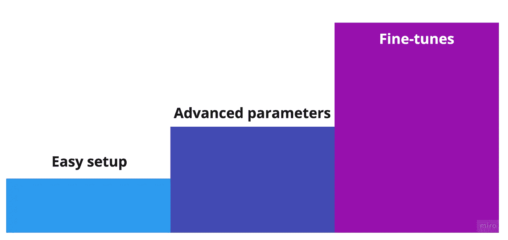
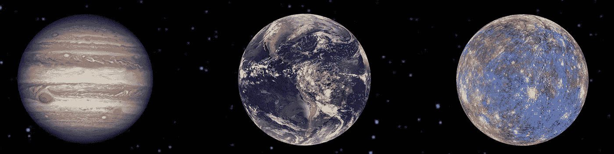
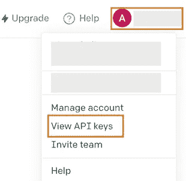
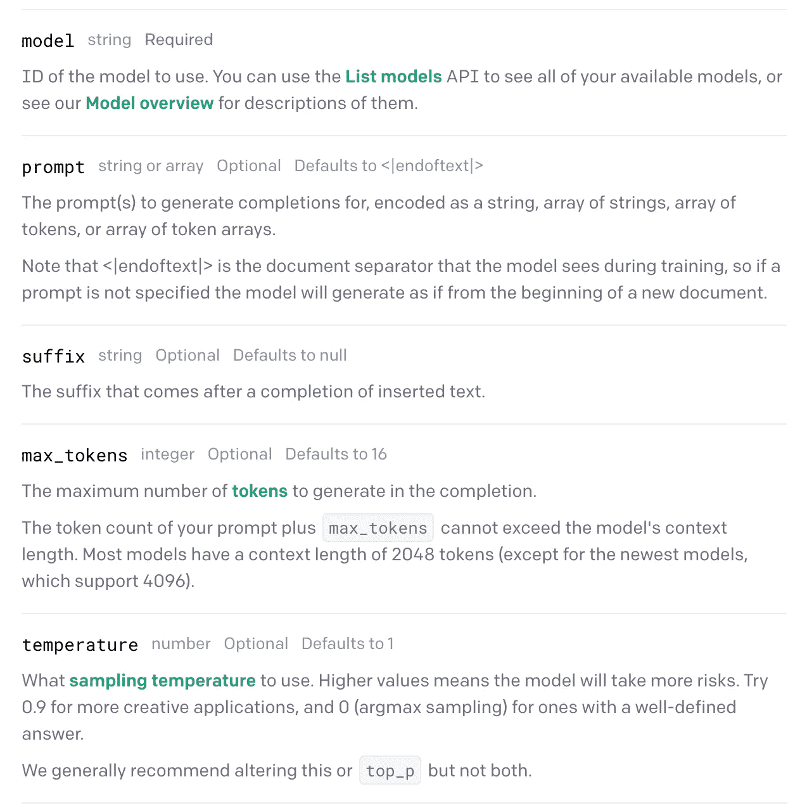

# 用 OpenAI 的 API 构建高级机器学习模型

> 原文：<https://betterprogramming.pub/break-into-advanced-machine-learning-with-openai-api-fd9307bc9403>

## 用几行代码过渡到机器学习



可扩展性—设计的映像

OpenAI 发布了一个 API，允许研究人员和开发人员基于论文“语言模型是很少的学习者”用几行代码构建高级的 GPT 3 机器学习模型。

该 API 可以轻松地开始与最先进的 GPT3 模型进行交互。高级用户可以根据业务用例或用户的定制语言对模型进行微调。

# 让我们建立一个模型来回答美国宇航局太阳系的事实



来源:nasa.gov——参考文献中的许可证

我试图用 GPT3 建立一个机器学习模型，来回答美国宇航局网站上关于“*太阳系*10 件需要知道的事情”的问题。模型结果令人兴奋，本博客将与您一起逐步构建高级问答模型。

模型令人兴奋的结果的一个例子:我问模型在我们的太阳系中有多少颗行星，它通过查看这一段成功返回“8”:“*我们的太阳系由一颗恒星、八颗行星和无数较小的天体组成，如矮行星、小行星和彗星*”。

尽管它看起来像是直观的信息，但该模型从给定的段落中自己学习了答案，其中包括多个细节。

当被问及这个模型需要多少年才能完成一个环绕银河系的轨道时？它从这一段返回“2.3 亿年”:

*我们的太阳系大约需要 2.3 亿年绕银河系中心运行一周。*

这是目标 NASA 文章的[链接](https://solarsystem.nasa.gov/solar-system/our-solar-system/overview/)。我在 2022 年 10 月更新了博客，以应对最新的 openai API 变化。

# 打开人工智能设置

要开始使用开放式人工智能模型，请访问该网站并创建一个帐户:

[](https://openai.com/api/) [## OpenAI API

### OpenAI 的 API 提供了对 GPT-3 和 Codex 的访问，前者执行各种各样的自然语言任务，后者…

openai.com](https://openai.com/api/) 

获取 API 密钥以开始构建模型，这个“密钥”在您的 profile/view API 密钥下。



查看 API 密钥

使用 python 或 node.js 可获得该 API 本文将关注 python 代码。使用 python run 下载 Open AI:

```
pip install openai
```

# 参数

与开放的人工智能 GPT 3 交互不需要有很深的模型构建知识 API 为每个人民主化了模型，允许使用基本参数进行交互。然而，它为数据科学专家提供了微调功能。

**型号类型**

首先，你需要选择你的模型类型；API 附带了四个引擎:

```
ada, babbage, curie, or davinci
```

订购的发动机从速度最快、成本最低的 **ada** 到最先进的 **davinci** 。

更多详情:[https://beta.openai.com/docs/engines/gpt-3](https://beta.openai.com/docs/engines/gpt-3)

完井 API 的其他参数:



打开 AI 完成参数

# 构建太阳系答案模型的完整代码示例


资料来源:unsplash.com

导入`openai`并设置键值:

```
import openai
openai.api_key = "enter_your_key"
```

准备包含模型上下文段落的输入模板文件，以回答您的问题；使用文件可以更容易地设置行的格式和起草示例:

文件-模型输入的示例

使用 python 加载输入文件:

```
with open('answer_ahmadai_template.txt') as f:
    prompt_input = ''.join(f.readlines())
```

调用 openai 完成 API 并存储响应:

代码—调用 openai 问答

现在，您可以打印返回的答案，如下所示:

```
response["choices"][0]["text"]
```

打印响应:“8”

参数解释:

*   `model`:你的答题模式的引擎。
*   `prompt`:输入文本，包括文件和问题。
*   `max_tokens`:生成答案的最大令牌数。
*   `temperature`:更高的值意味着模型将冒更大的风险
*   `stop`:将编码标记为不包含在响应中。

# 提高

模型的输入提示是有限的，您不能发送扩展的上下文段落来提供答案，如完整的网站内容。
为了适应这种限制，您必须对数据库进行语义搜索，并返回所有与用户问题更相似的内容。然后你可以把选中的 n 个内容和你的问题一起发送到 openAI 来提供答案。

# 摘要

开放式人工智能使用先进的机器学习模型来扩大你的业务；您可以使用基本设置开始构建 ML 模型，然后使用自定义参数和引擎选项推进模型。

默认情况下，API 使用标准的 GPT3 模型和数据。为获得竞争优势，将您的自定义数据上传为文件，并使用微调功能；如果您的业务或语言有独特的数据，这将很有帮助。后续文章将更多地关注微调代码和结果。

我更喜欢直接与模型交互，而不是通过 API。然而，出于安全考虑，OpenAI 决定不发布该模型本身。发布的 API 看起来足够灵活，可以构建许多精彩的应用程序。

# 参考

*   太阳系事实:[https://solar system . NASA . gov/solar-system/our-solar-system/overview/](https://solarsystem.nasa.gov/solar-system/our-solar-system/overview/)
*   open ai:[https://beta.openai.com/](https://beta.openai.com/)
*   GPT3 安全问题的历史:[https://analyticsindiamag . com/finally-open ai-plans-to-trough-GPT-3s-safety-issues/](https://analyticsindiamag.com/finally-openai-plans-to-tackle-gpt-3s-safety-issues/)
*   美国宇航局内容政策:【https://gpm.nasa.gov/image-use-policy 

引言: **NASA 的内容(图像、视频、音频等)通常没有版权**，可以用于教育或信息目的**，无需明确许可。**