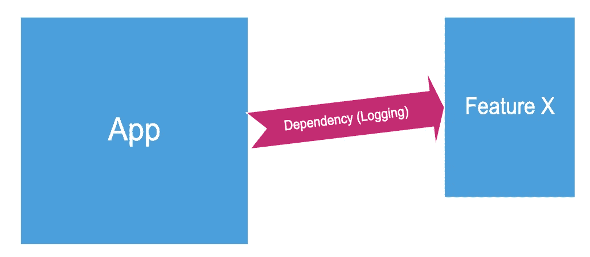
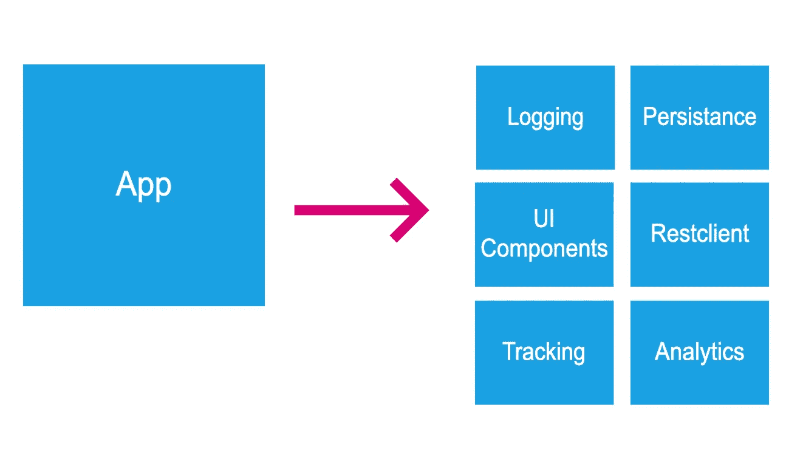
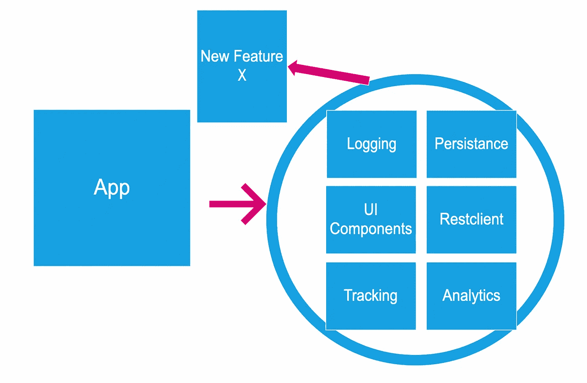
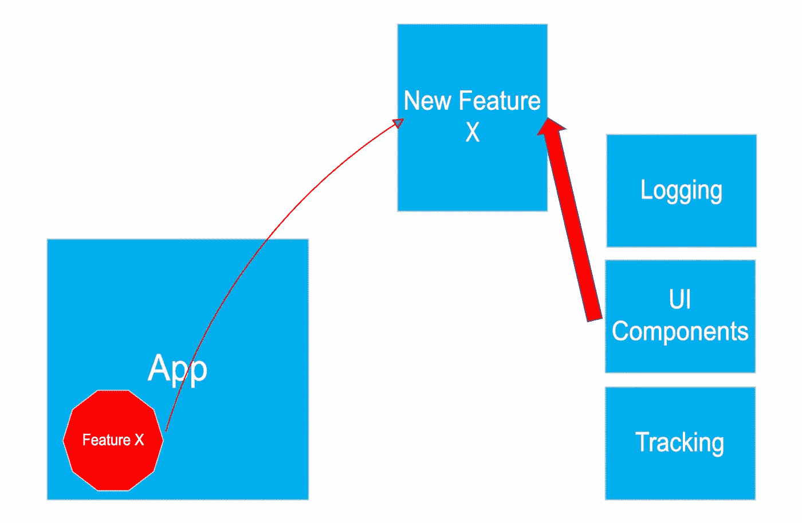
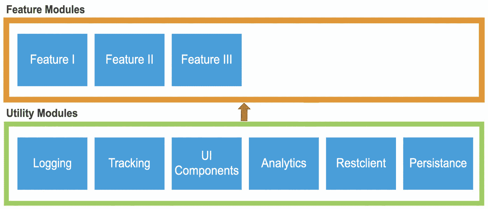
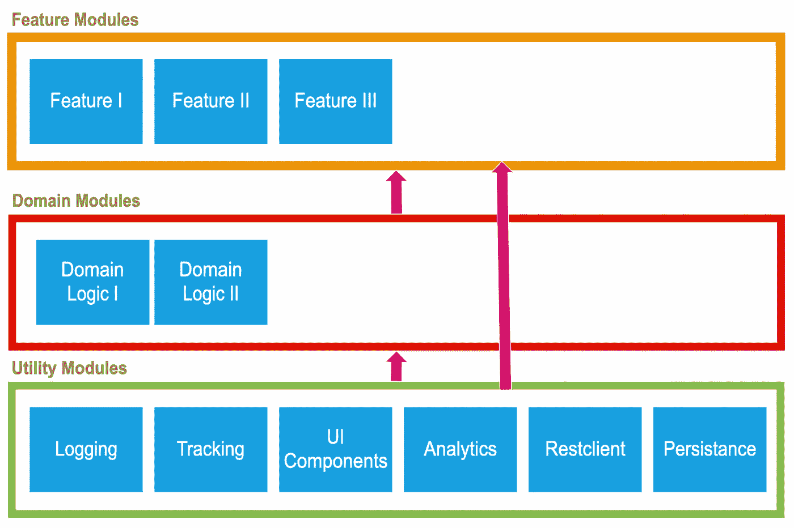

# 打破单一模式——将您的应用模块化

> 原文：<https://betterprogramming.pub/break-the-monolith-a0a57301b6a3>

## 了解拆分 monolith 应用程序的好处

[万花筒](https://unsplash.com/@kaleidico?utm_source=medium&utm_medium=referral)在 [Unsplash](https://unsplash.com?utm_source=medium&utm_medium=referral) 上拍摄的照片

*马丁·福勒*写道:

> 几乎所有我听说过的从零开始作为微服务系统构建的系统，最终都陷入了严重的困境。
> 
> 你不应该用微服务开始一个新项目，即使你确信你的应用程序足够大，值得这么做。

# 我们应用的生命周期

## 初始相位

很自然，在初始阶段，你的应用程序是一段代码。这当然有其充分的理由:

[来源](https://www.geograph.ie/photo/4299750)

*   **小团队**。所有开发人员在项目的所有部分紧密合作。
*   **加快上市时间**。我们需要用有限的预算发布我们的应用程序和更新。
*   **成功的不确定性**。该应用程序的未来版本只有在应用程序成功的情况下才会出现。
*   **简约**。该应用程序还不是很大，我们需要保持简单和快速。

## 发布阶段

过了一段时间，如果你有一个成功的产品上市，这个庞然大物就开始成长了:

[Pixabay](https://pixabay.com/photos/water-sea-seashore-travel-ocean-3375822/)

*   增加了更多的功能。我们的应用变得更大。
*   **团队成长**。更多的开发人员被添加到项目中。
*   **多个** **独立团队**在做同一个 app。
*   独石正在失去控制。每个人都在添加和修改代码库。

## 过度生长阶段

是时候打破巨石了？我们知道，当以下几点开始出现时，是时候打破这块巨石了。

*   构建时间是一个瓶颈。构建时间太长了，以至于开发人员花费了很大一部分工作时间来等待他们的构建完成。
*   团队需要彼此独立工作。没有日常交流的多个团队使用同一个应用程序。
*   项目变得太复杂，需要重新简化。
*   **新团队成员入职**，由于 App 的复杂性，**耗时太长**

# 模块化

我们已经决定，我们需要把我们的应用程序分成多个模块。现在我们需要选择如何开始模块化。

一种天真的方法是决定每个新特性都应该作为一个新模块来实现。虽然简单，但我们很快就会意识到模块分离过程的最大挑战:**依赖性。**

即使是最简单的功能也至少有一个当前在主应用程序中的依赖项。

新功能通常需要应用程序中现有的组件。最有可能的是:日志、数据库、Rest 客户端、UI 组件…

这将使模块非常依赖于应用程序。尽管这种依赖性不被认为是阻碍因素，但也应该避免。应用程序应该使用模块，而不是相反。

另一种方法是首先将一些基本的实用工具，如日志、跟踪、分析、持久性、rest-client、UI 组件转移到单独的模块中。那么每个新功能都可以使用这些基本模块，而不依赖于主应用程序。

这种方法在我看来是理想的。一个更大的重构来清理和拆分基本的东西。所有旧功能将保留在应用程序中，但因为实用程序将在单独的模块中，新功能从现在开始可以作为功能模块编写。

不幸的是，这里最大的障碍是说服涉众批准这么大的重构。开发人员会忙上一段时间，总会有新的 bug 被添加的风险，也不会有新的特性被发布。

另一种方法是确定当前应用程序的主要难点。它可以是一个功能，但也可以是一个实用程序，如数据库。

选择重构这个痛点，将它移到一个单独的模块中，同时修复它所存在的错误。

为了将这一棘手问题转移到一个单独的模块中，很有可能一些实用程序也需要转换成模块。

结果与前面的方法类似，但是在这种情况下，我们将获得一些商业价值，解决一些错误，或者提高性能和/或稳定性。

# 模块类型

模块分为两大类。

*   实用模块
*   功能模块

这里有两条规则。

*   实用模块不应依赖于其他实用模块或功能模块。
*   功能模块应该只依赖于实用模块。

如果应用程序更大，可以添加另一层。在这个额外的层中，我们可以有域模块。这些模块可以被多个功能模块使用。

## 证明文件

我们建议我们的开发人员在每个模块的公共方法和类中遵循[开-闭](https://en.wikipedia.org/wiki/Open–closed_principle)原则。公共接口不应该改变！它也应该很好地记录和使用的例子应该提供。

## 自动化测试

每个模块都应该完全被测试覆盖。最好是通过单元测试，但是如果单元测试不可能或者不能覆盖整个模块，那么可以通过 UI、屏幕截图或者集成测试。

# 结论

分割这块巨石并不是一件容易的事情，但是它的好处甚至可以说服最怀疑的人。

*   新开发人员可以更快地提高工作效率。他们现在可以在独立的模块上工作，而不需要了解所有其他模块。
*   在较小的模块上工作确实减少了构建和开发时间。
*   团队可以获得模块的完全所有权。
*   关注点分离
*   模块化迫使每个开发人员更多地考虑正确的架构。
*   每个模块的自动化测试在几秒钟内完成。
*   模块可以使用不同的技术( **Kotlin 多平台)**。

拆分现有应用的最初努力是巨大的，但好处远远大于坏处。

像往常一样，快乐编码。