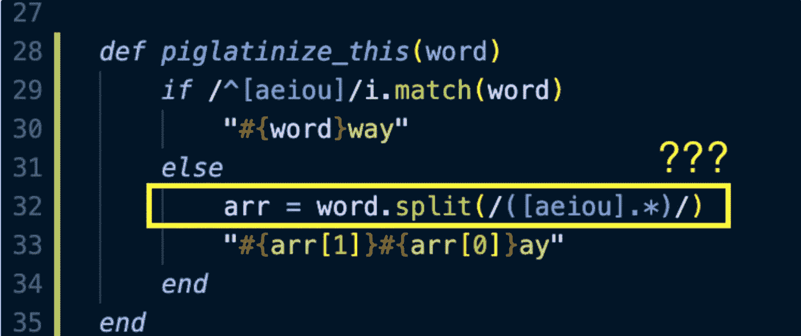

# 分解复杂的正则表达式

> 原文：<https://betterprogramming.pub/breaking-down-a-complex-regex-73b6c795a2be>

## 提升你的正则表达式技能



作者照片。

在学习创建 Pig Latinizer 的多种方法时，我努力理解复杂的 regex(正则表达式)如何在一个`.split`方法中发挥其魔力。

更具体地说，我对一行简单的代码感到惊讶和困惑(通过[这位了不起的程序员](https://aubreeabril.wordpress.com/2018/08/23/pig-latinizer-using-regex/)):

```
"forest".split(/([aeiou].*)/)
# => ["f", "orest"]
```

这种拆分方法的目标是将一个单词分成两个字符串的数组，以单词的第一个元音字母作为分隔符。如上所示，第一个字符串包含第一个元音前的所有字符，第二个字符串包含第一个元音后的所有字符(包括元音本身)。

为了消除 split/regex 组合的复杂性，我决定“拆分”regex——一次一个正则表达式。

# Regex 1: /[aeiou]/

`[]`是一个字符类，允许我们在字符串中找到任何匹配的字符。字符类中的字符充当分隔符。当找到匹配时，字符串中的字符被分割/拆分。

在这里，我们可以看到单词`forest`被`o`和`e`分开，返回一个分开的字符串数组:

```
"forest".split(/[aeiou]/)
# dividers =>  ("o")("e")
# returns => ["f", "r", "st"]
```

# Regex 1 + 2: /[aeiou]。/

`.`匹配字符类中任何字符之前或之后的任何一个字符。

在字符串`forest`里面，`o`和`r`匹配我们的角色类，`[aeiou]`。然后`.`找到匹配字符后面的单个字符，使`or`和`es`成为分隔符:

```
"forest".split(/[aeiou]./)
# dividers => ("or")("es")
# returns => ["f", "", "t"]
```

但是等等，为什么返回的数组里有空字符串？

因为`.split`方法将一个字符串分成子字符串，这里我们有两个并排的分隔符。换句话说，分隔符之间没有字符。分隔符之间的空白部分作为空子字符串返回。

# Regex 1 + 2 + 3: /[aeiou]。*/

点(`.`)表示“任何单个字符”，而星号(`*`)表示“零或更多次”

这里我们基本上是在说:

1.  在单词`forest`中查找任何匹配的字符。
2.  抓取单个字符，后跟匹配的字符。
3.  匹配零次或多次出现的(1)和(2)

换句话说，`[aeiou]`找到`o`作为第一个匹配的字符，`.`抓取`or`，然后`*`抓取后面所有的字符，使`orest`成为唯一的除法器。

现在我们只剩下`f`的结果了:

```
"forest".split(/[aeiou].*/)
# divider =>    ("orest")
# returns => ["f"]
```

# Regex (1 + 2 + 3): /([aeiou]。*)/

您可能还记得，我们实现这个方法是为了将一个单词分成两部分，并按照单词的第一个元音来划分。

常规模式返回第一部分。

第二部分呢？

这就是括号(或“子表达式”)出现的地方。它匹配`/[aeiou].*/`常规模式的内容，该模式包含我们想要的结果的第二部分，并将该内容推送到结果上。

因此，我们返回的数组包含这两部分。瞧啊。

# 最后的想法

我分解这个正则表达式的初衷是为了理解正则模式的不同部分是如何组合在一起的，但是后来我遇到了一些意想不到的结果，比如空字符串。

这让我更深入地研究 regex 和`split`方法之间的关系。我发现[是一篇有用的文章](https://spin.atomicobject.com/2007/11/01/ruby-string-split/)，它通过一些很酷的例子解释了那些奇怪的行为。

《原子对象》的作者扎克·丹尼斯也挖出了我困惑的根源:

> “当你开始超越简短的时候，你会发现 String#split 有一些奇怪的行为，它总是带有正则表达式分隔符。”

很高兴知道我不是一个人。