# 分解 AWS 的身份和访问管理(IAM)

> 原文：<https://betterprogramming.pub/breaking-down-awss-identity-access-management-iam-cb51c9195e4f>

## 开始使用 IAM 需要知道的一切


本·斯威特在 [Unsplash](https://unsplash.com/s/photos/identity?utm_source=unsplash&utm_medium=referral&utm_content=creditCopyText) 上的照片

如果您在 AWS 领域工作，身份和访问管理(IAM)是您需要认真对待的事情。如果你试图忽视它，它只会一次又一次地回来咬你。

你可以看到[在这里](https://www.scmagazine.com/home/opinion/executive-insight/cloud-infrastructure-iam-lessons-from-the-capital-one-breach/)发生了什么，当资本一号有一个我的失误。不要让这种事发生在你身上！从他们的错误中吸取教训。

我建议每天只抽出半个小时，让你在 AWS 的余生变得更轻松。一旦你花了一些时间，你会发现这些概念并不复杂。

在本文中，我们将深入研究 AWS 的 IAM 部分。

然后，我将带您了解如何在 AWS 控制台的 IAM 部分实现 5/5 的安全状态。

## 目标

了解 IAM —它的关键术语以及如何开始在 AWS 上使用 IAM。

我们将看看:

[IAM 的力量](#f6b2)
[如何入门](#b331)
[在我们的 Root 帐户上激活 MFA](#8dd7)
[创建单个 IAM 用户](#4959)
[使用组分配权限](#fe2d)
[应用 IAM 密码策略](#73c3)

# 我的力量

首先，我们来谈谈我是什么。*身份和访问管理*是一项 AWS 服务，允许您控制 AWS 控制台的用户和权限。

作为一名系统管理员，这非常有用和重要，因为这是您管理谁能看到什么的方式。如果您想让人力资源部门的员工对 S3 存储桶拥有只读访问权限，那很简单:只需在 IAM 控制台中分配权限。

所有与安全相关的问题都可以在此服务中得到解决。

具体来说，IAM 使您能够执行以下操作:

*   为每个用户设置不同级别的权限
*   允许用户/服务临时访问
*   实施多因素身份认证
*   创建密码轮换策略(例如，120 天后过期)
*   将安全性与您的所有 AWS 服务相集成
*   身份联盟——从脸书、LinkedIn 等网站登录。
*   是否符合支付卡行业数据安全标准(PCI DSS)

当涉及到控制谁可以与您的 AWS 服务交互时，IAM 授权您做您想做的任何事情。好好利用！

# 关键术语

下面是我们学习如何使用 IAM 时需要记住的基本定义:

*   **用户** —最终用户。这些人被分配了权限。这些用户将访问 AWS 控制台或执行 API 命令。
*   **组** —在他们需要的特权方面有共同之处的用户。为组分配一组权限，例如，一组开发人员。
*   **角色** —为 AWS 资源分配权限。例如，允许 S3 存储桶查询 EC2 中的 DynamoDB。
*   **策略** —允许您定义权限的 JSON。它附加到用户、组或角色。下面是一个策略示例，它将使您只拥有 S3 只读访问权限:

```
{
   “Version”: “2012–10–17”,
   “Statement”: [
     {
       “Effect”: “Allow”,
       “Action”: [
         “s3:Get*”,
         “s3:List*”
       ],
     “Resource”: “*”
     }
   ]
}
```

# 如何开始

登录到您的 AWS 控制台。如果您没有帐户，您可以[在此创建一个。](https://portal.aws.amazon.com/billing/signup?redirect_url=https%3A%2F%2Faws.amazon.com%2Fregistration-confirmation#/start)

登录后，我们将进入如下所示的屏幕:

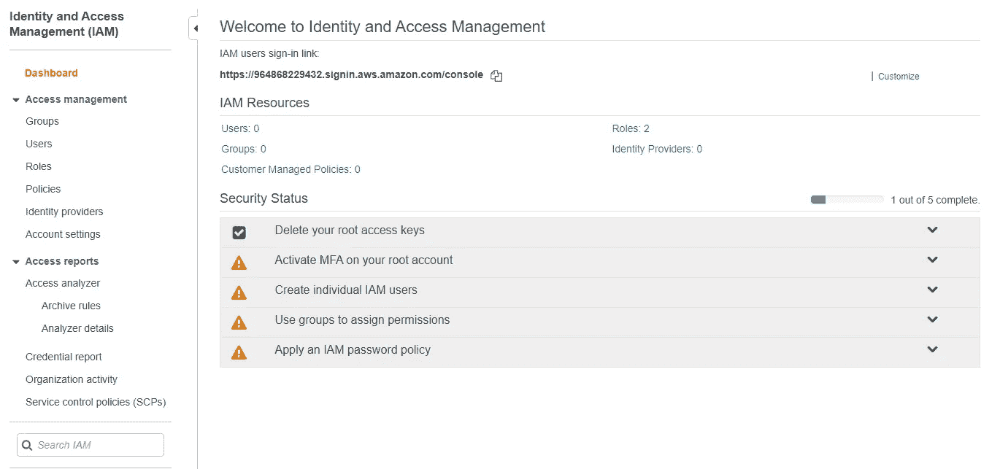

AWS 正在不断地改变他们的界面，所以如果看起来不是这样，我道歉。我会尽我所能更新，但请注意这是不断变化的。这些概念可能会保持不变。

当我们第一次登录时，您会看到绿色复选标记已经出现在“删除您的根访问密钥”旁边

我们将在本文结束时解决接下来的四个问题。

# 在我们的根帐户上激活 MFA

我们现在将导航到“安全状态”部分中的“在您的 root 帐户上激活 MFA”下拉列表。

什么是*多重身份认证？*在 MFA 中，您只能通过从两个不同的设备成功输入凭据来获得访问权限。

单击“管理 MFA”按钮，我们将进入如下所示的屏幕:

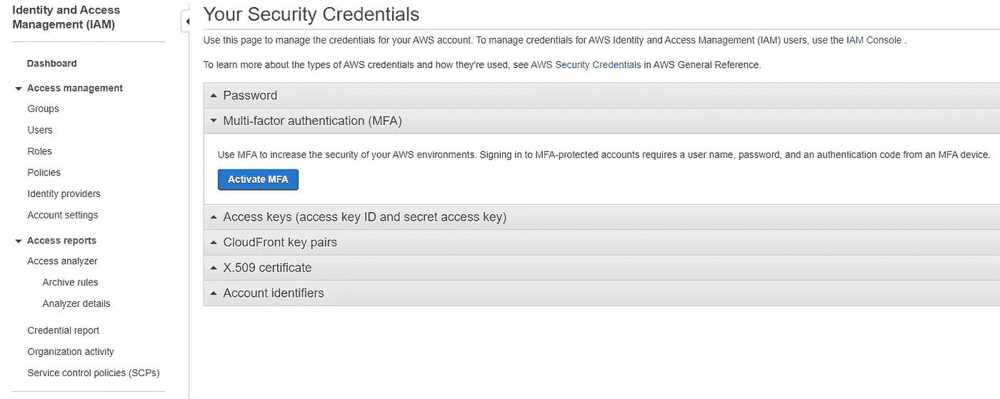

现在让我们激活我们的 MFA。

我建议选择“虚拟 MFA 设备”，这样你就可以用你的手机进行认证了。

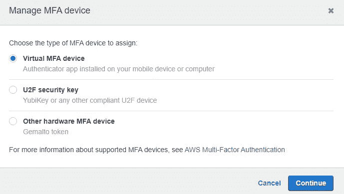

然后它会要求你安装一个认证应用程序。我选择为我的 iOS 设备下载谷歌认证应用程序。

然后，您需要通过完成以下步骤来激活身份验证器:

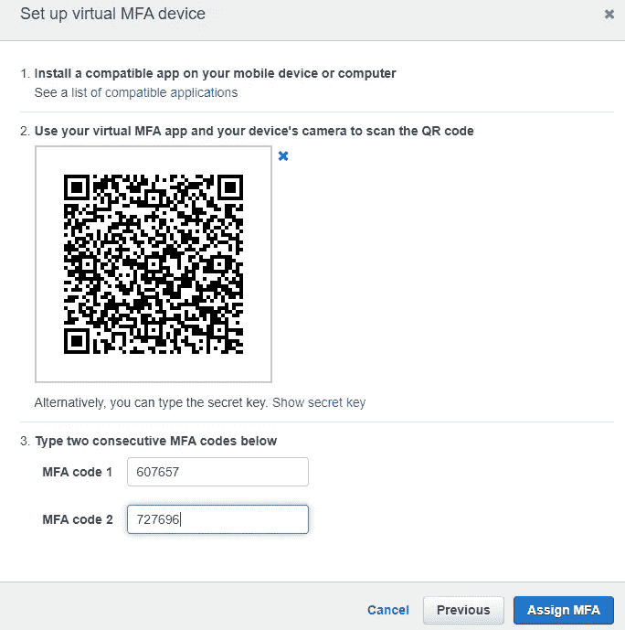

点击“分配 MFA”按钮后，您应该会看到添加了一个新的 MFA 设备，如下所示:

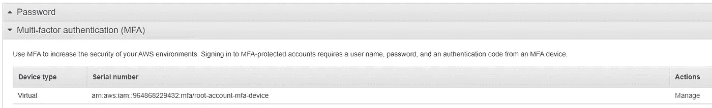

当我们返回 IAM 控制台时，我们已经成功地将复选标记变为绿色！

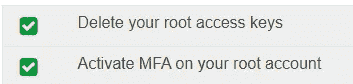

但更重要的是，我们为 AWS root 帐户增加了另一层安全性。

# 创建单个 IAM 用户

现在，让我们创建一些单独的 IAM 用户。

我们将创建 IAM 用户，这样我们就不必使用 root 帐户来完成 AWS 上的日常任务。我们应该只在需要的时候使用根。

现在，在 IAM 控制面板的用户部分，我们添加一个新用户:

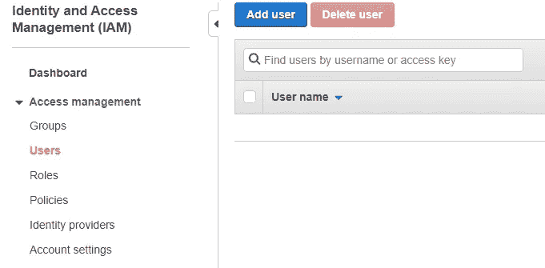

我将创建一个名为`ryan`的新用户，并选择授予他编程访问和 AWS 管理控制台访问权限，如下所示:

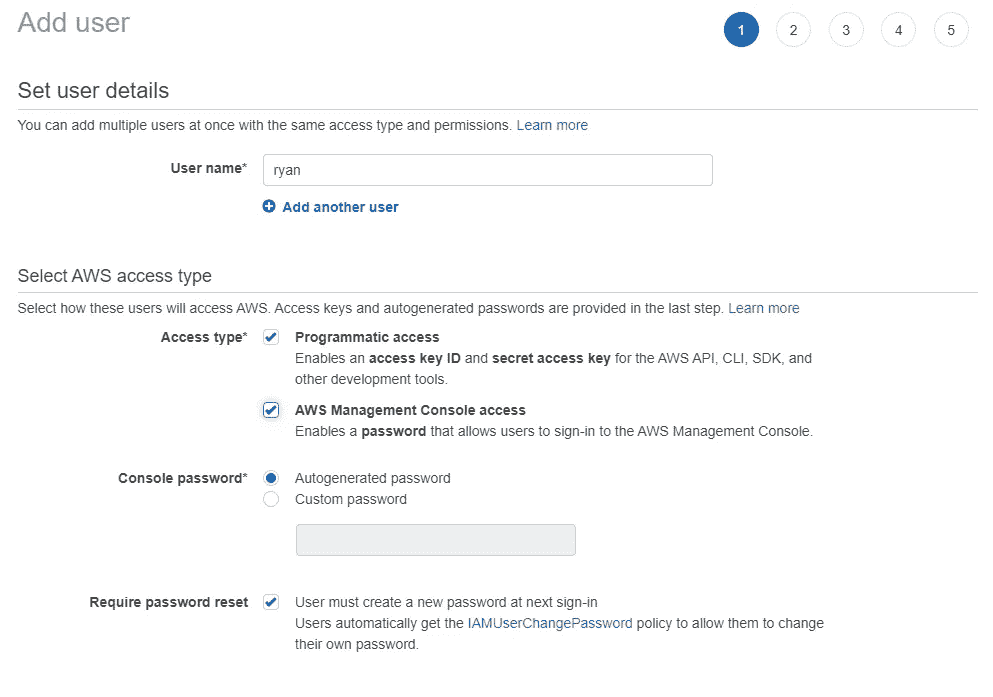

我们必须授予我们的新用户权限(否则，有什么意义呢？).由于这是我想作为系统管理员使用的帐户，我想拥有对 AWS 及其服务和资源的完全访问权限。

因此，我将选择“AdministratorAccess”作为我的策略名，并将该组命名为`SysAdmin`。

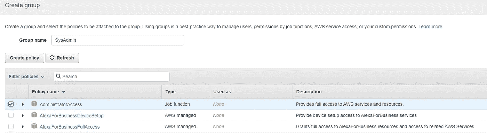

然后点击底部的下一步按钮。

我们可以跳过标签部分，因为它们不是必填字段。

当我们回顾我们的添加用户操作时，它应该看起来像这样:

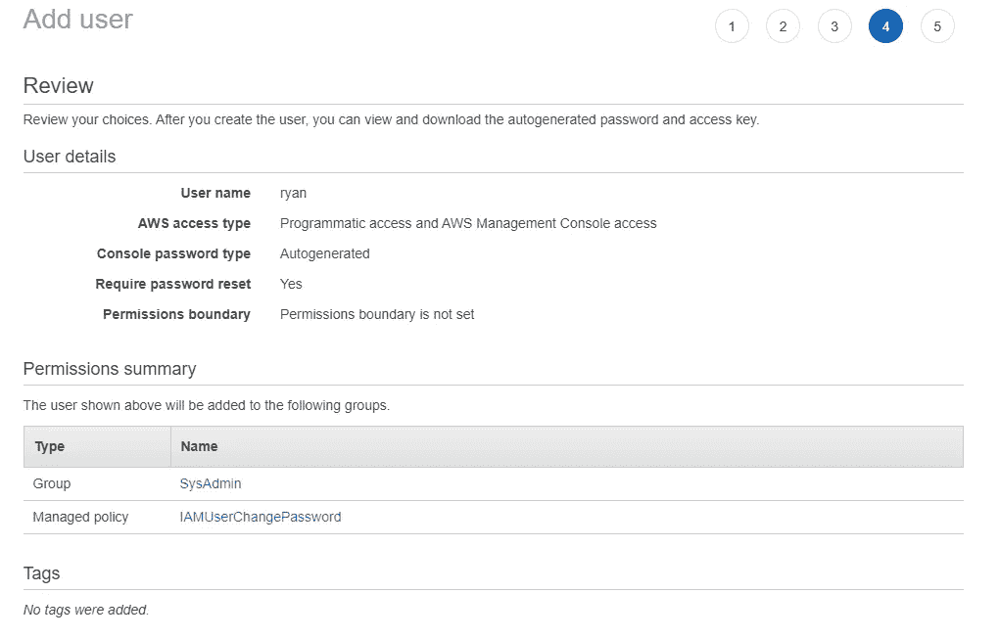

当您点击底部的“创建用户”时，您应该会看到一条成功消息。

**重要提示:**这是您最后一次看到这些凭证，所以我建议您下载。csv 并将其存储在某个安全的地方，因为您不知道何时会再次需要它们。

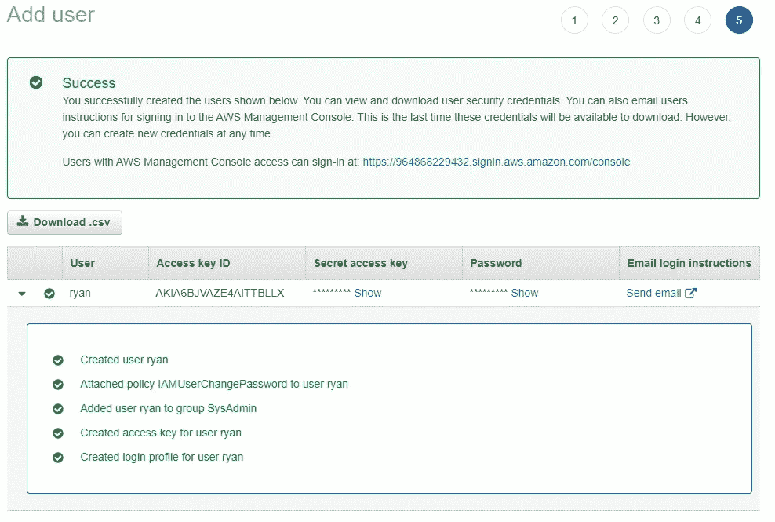

你会看到我们在这里一举两得，因为我们创建了一个组，也增加了一个用户。

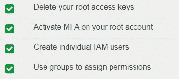

在下一节中，我们将创建一个权限更有限的组，这样您就可以对这些 IAM 组有所了解。

# 使用组来分配权限

让我们创建一个名为`Developers`的新团体。

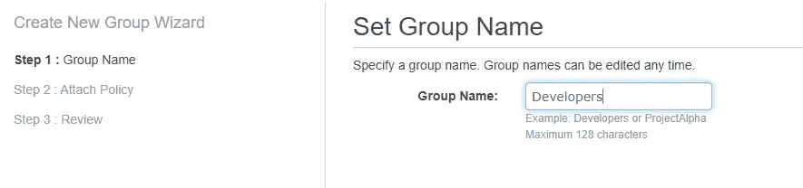

现在我们来附上一些政策。我们希望我们的开发人员能够完全访问 DynamoDB 和 EC2。

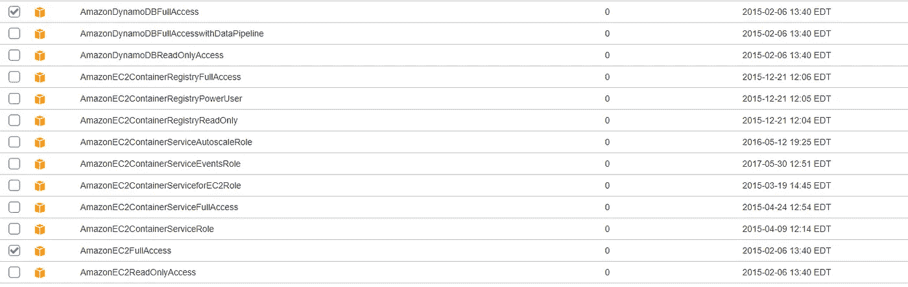

AWS 使得简单地将这些策略附加到组上变得非常容易。

所以当你复习的时候，应该是这样的:

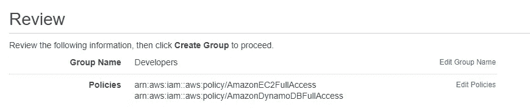

现在，让我们添加一个新用户，并将他们添加到这个组中。

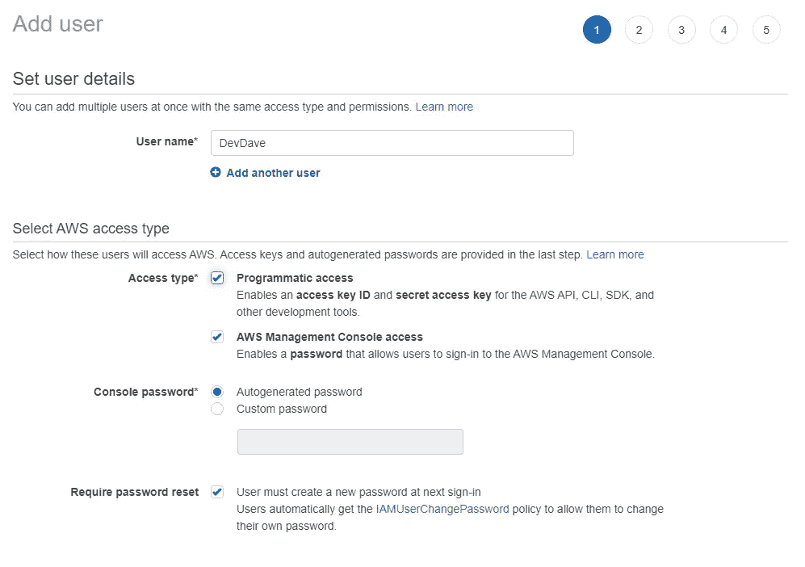

`DevDave`将成为我们团队的开发人员。我们只是将他添加到开发人员组，如下所示:

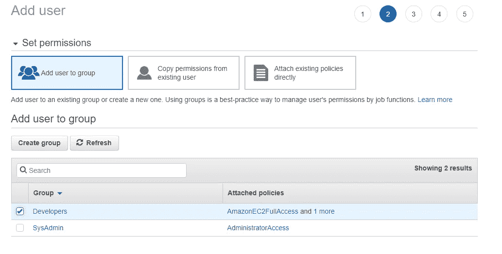

点击并最终点击“创建用户”按钮后，您会看到`DevDave`已经被创建为用户:

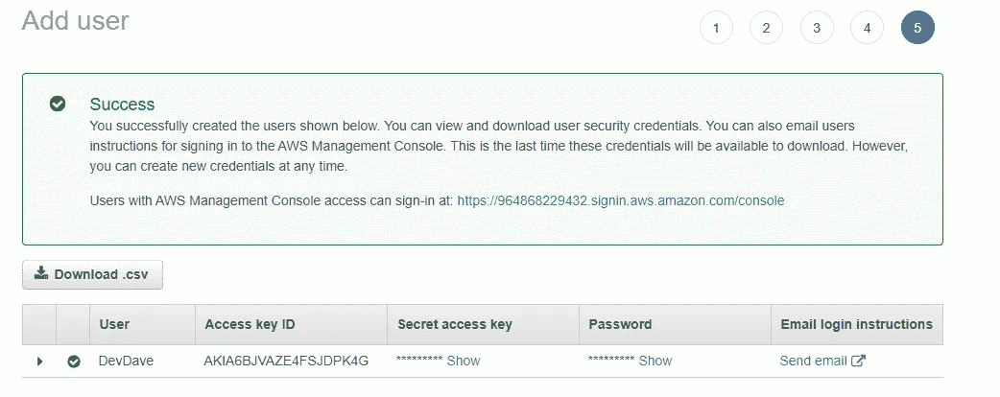

当我们导航回“用户”页面时，我们现在有两个不同组下的两个用户:

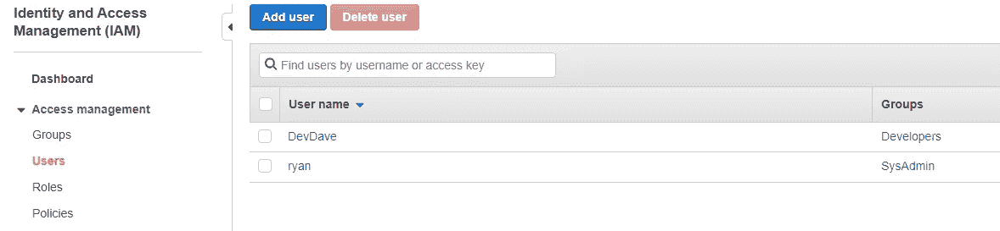

很简单，对吧？

# 应用 IAM 密码策略

现在，让我们处理最终的安全状态:应用 IAM 密码策略。

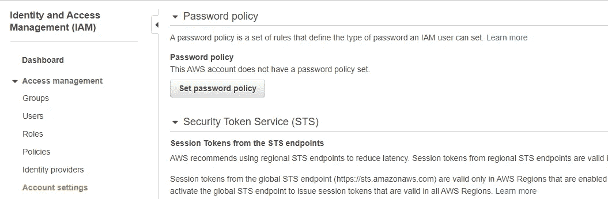

在 IAM 的帐户设置中，我们将点击“设置密码策略”按钮

您可以根据需要将密码策略设置得严格或宽松:


您也可以选择在 *x* 天后到期。你可以看到上面我决定它在 120 天后过期。

当您返回仪表板时，您应该看到所有五个安全状态步骤都已完成！

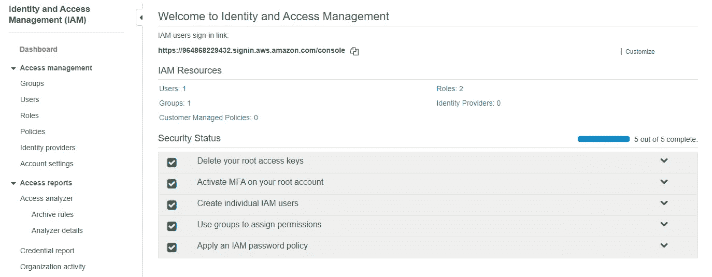

# 自定义 IAM 用户登录链接

您会注意到在顶部，有一个我们可以自定义的 IAM 登录链接。此链接会将您直接带到 IAM 管理控制台。

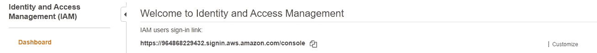

你可以随心所欲地建立这种联系。

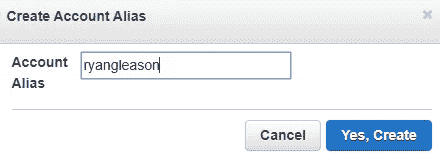

这允许快速和容易地登录。

# 回顾

在本文中，我们学习了 IAM 的基础知识。我们还演示了如何开始使用它。

您现在应该能够:

*   定义与 IAM 相关的关键术语
*   在您的 root 帐户上激活 MFA
*   创建用户
*   使用组来分配权限
*   更改您的密码策略
*   自定义您的 IAM 链接

很简单，对吧？

我在学习这个的时候用到的一个资源:[Udemy 上的一个云专家](https://www.udemy.com/course/aws-certified-developer-associate/)