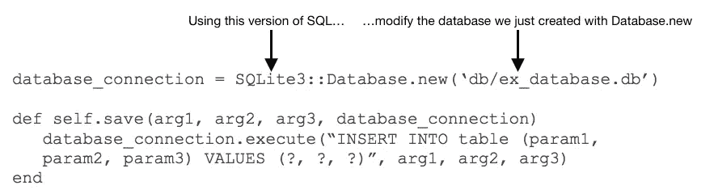
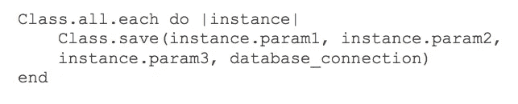
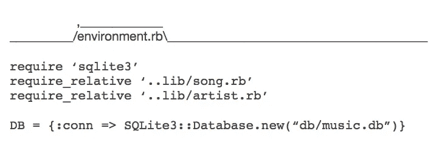
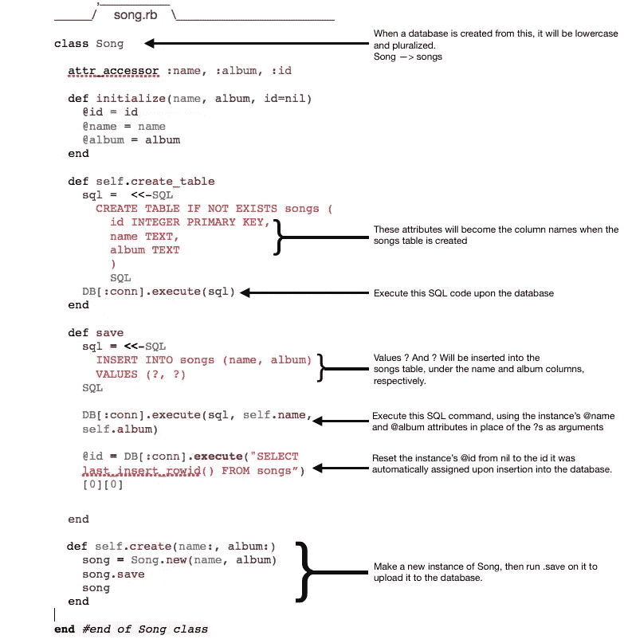
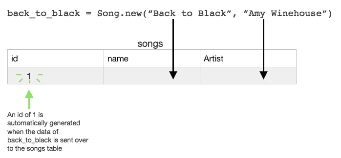
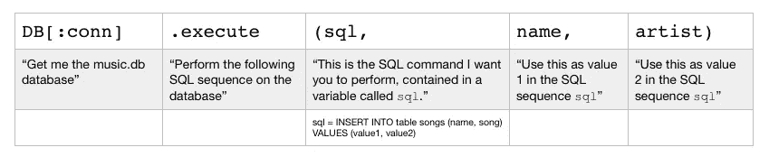
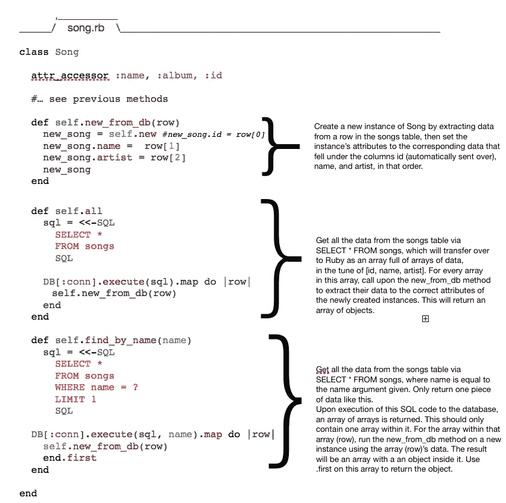
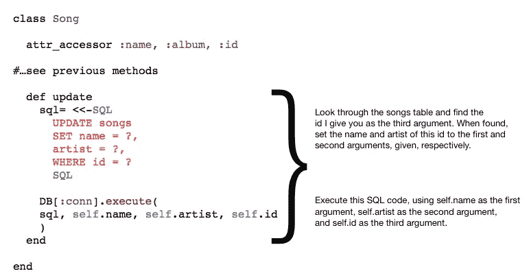
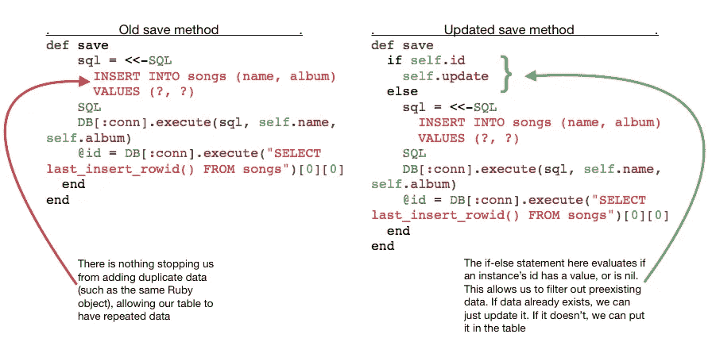

# 分解 ORM 和 Ruby

> 原文：<https://betterprogramming.pub/breaking-down-orm-and-ruby-aa8174c4b632>

## 从头到尾构建一个 ORM 设置

克里斯托夫·高尔在 [Unsplash](https://unsplash.com/search/photos/coding?utm_source=unsplash&utm_medium=referral&utm_content=creditCopyText) 上拍摄的照片

**请注意:**这篇文章大量引用了熨斗学校实验和讲座 ORM 部分的几个学习模块。

这是这些模块的重复——以我能解释的最简单、最详细的方式从头到尾构建一个 ORM 设置。由于这种复杂的润色，这篇文章相当冗长。然而，它应该为读者提供丰富的信息。

另外，这篇文章的例子使用了 [SQLite3](https://www.sqlite.org/) 作为他们的 SQL 版本。示例中使用的逻辑应该是相同的，但是不同 SQL 版本之间的语法可能会有所不同。

> *“ORM 是一种使用面向对象语言访问关系数据库的技术。它允许语言通过将数据库表“映射”到类来管理数据库数据。行是由这些类的实例组成的。*——*转述自学习模块“ORM 为什么有用”。*

# ORM —对象关系映射

这到底是什么意思？描述 ORM 的另一种方式是，通过使用这种技术，您可以创建一个“虚拟对象数据库”，它可以在面向对象语言中使用和操作(正如 Sitepoint 上的一篇文章所描述的)。

因为数据在对象中的处理方式不同于在数据库中的处理方式，所以我们使用 ORM 来弥合这一差距，并在两者之间建立联系。

它可以被看作是某种翻译。假设你在一个使用英语键盘的日本网站上。你下载一个扩展来翻译网站上的内容，同时也把你的英文字符翻译成日文。

使用该扩展，您可以看到网站上的信息，并随后访问这些信息。在这个例子中，日语网站可以理解为数据库，英语键盘可以理解为面向对象的语言(如 [Ruby](https://www.ruby-lang.org/en/) )，而翻译扩展可以理解为 ORM。

ORM 将 SQL 的编码传递给 Ruby，提高了效率。

SQL 可能是一种很难编程的语言，此外，它的许多命令可能非常重复。例如，向数据库中添加新数据需要一整行代码，每次你想放入新数据时都必须编写代码。

不要介意这样一个事实，您可能有一个包含几个参数的健壮表，您每次都必须输入所有这些参数，然后输入它们的后续值。

我们可以使用 ORM 作为联络工具，而不是编写大量的 SQL 代码。在一个类中，我们可以创建一个类似这样的`self.save`方法:

`database_connection`变量只是连接到我们的数据库，在本例中名为`ex_database.db`。

`execute`方法将一条 SQL 语句作为参数，并执行它。

SQL 语句中的问号表示要插入的参数，参数本身会在要插入的语句后立即列出。

从那里，使用类的类变量`@@all`，我们可以做类似这样的事情:

这允许我们在`Class`的所有实例上调用`save`方法。每个实例都将经历`save`方法，这意味着每个实例都将其参数插入到`save`方法中的`execute`方法中。

因此，我们为每个实例及其参数创建一个新的 SQL 语句，并执行它。

在这种情况下，我们的 SQL 语句有`INSERT INTO`，所以我们将新数据插入到`ex_database.db`。这比逐个输入单个 SQL 命令要快得多。

# 用 Ruby 和 ORM 创建数据库

假设我们有一个音乐库数据库，包含歌曲和艺术家。每首歌曲都有一个艺术家，但是一个艺术家可以有多首歌曲。

为了创建数据库，我们将使用以下内容创建一个`environment.rb`文件:

我们首先需要建立音乐数据库。

在一个 Ruby 文件中，我们需要使用一个 SQL 程序(在这个例子中是 SQLite3)，以及我们想要转换成这个数据库中的表的任何文件。在我们的例子中，这些文件是`.rb`文件——因此，我们首先需要在这些文件中存储一些类，这些类将在以后进行转换。对我们来说重要的文件被命名为`song.rb`和`artist.rb`。

这里的`DB`常量被设置为一个散列值——我们基本上是说我们的连接(key) `:conn`将会转到一个名为`music.db` (value)的新数据库。该数据库将由 SQLite3 访问和修改。

稍后可以使用`DB[:conn]`在我们的`song.rb`和`artist.rb`文件中调用它。

记住，当我们调用 hash 的键时，返回的是相应的值，所以这实际上是指向`music.db`数据库。

我们的下一步是填充`song.rb`和`artist.rb`文件。出于这个例子的目的，我们将使用`song.rb`文件，因为创建`artist.rb`文件将遵循非常相似的过程。

我们首先创建一个`Song`类。

这个类最终会变成一个表。传统的 ORM 结构以复数形式命名它的表——因此，当这个类被“转换”成一个表时，它将被称为“songs”表。

您会注意到这个类有许多与非 ORM 关联类相同的特性——它有带有典型属性的`attr_accessors`,还有一个`:id`属性。

# id 属性成为表的主键

当`Song`的一个实例被移入数据库时，`:id`属性将被转换为主键。

它有一个缺省值`nil`，因为当一个实例被创建时，它的主键/id 将在该实例被移入数据库时被创建。

程序员自己不定义主键/id。我们让 ORM 来分配它们，因为当创建一个新的实例时，跟踪每首歌曲的 id 对我们来说是一个巨大的痛苦。通过用 ORM 自动化这个过程，我们有了一种更快、更少出错的分配主键的方法。

我们实际上通过创建一个`self.create_table`方法来创建歌曲表(来自类`Song`)。这是一个类方法，因为一个实例创建一个表是没有意义的——否则，每个实例都有一个表，这在很大程度上是没有用的。

通过使`create_table`成为一个类方法，我们涉及到了`Song`的所有实例，这些实例稍后将被映射到 songs 表。

我们用的是`sql = <<- SQL`这条线。

双箭头语法`<<-`允许创建一个`heredoc`，它是一个多行字符串文字。这允许用户在一个字符串中键入几行，并允许他们在需要的地方形成新的行。

这很有用，因为我们必须在这里放入一个 SQL 命令——如果我们试图使用一个常规的字符串，它会很长，每次当您关注该字符串的内容时，您都必须向右滚动。

Heredocs 以指示该字符串的开始和结束的序列开始和结束(注意:在这篇文章中，我可能会将这样的序列称为“侧翼序列”，因为它们包围该字符串的性质)。

这里，我们在字符串开始和结束之前使用了序列`SQL`。`SQL`在这里是一个很好的序列——它明确地说明了该字符串的内容与什么相关。

heredoc 中包含的 SQL 代码是这样说的，“如果没有名为‘songs’的表，那么创建一个具有以下三个属性的表:id(主键)是一个整数，name 是 text(字符串)，album 也是 text(字符串)。”

完成所有这些之后，我们可以虚拟地认为`songs`表正在被创建。`songs`表将是音乐库数据库中的几个表之一。

请记住，一个数据库包含多个表。出于我们的目的，我们将只关注其中一个。

# 如何将对象数据发送到表中

很容易假设整个 Ruby 对象被发送到位于整个数据库中的表中。然而，事实并非如此。

如前所述，数据库不会识别 Ruby 对象。实际发生的是对象的*属性*被发送过来，在表中编译一行。

在我们的例子中，这意味着对于`Song`，将`@name`和`@artist`发送到`songs`表，*而不是*整个`Song`对象。

更清楚地说，如果我们有一个`back_to_black`变量，它是`Song`的实例，带有`@name` = "Back to Black "和`@artist` = "Amy Winehouse "，那么将被发送的是" Back to Black "和" Amy Winehouse "，而不是`back_to_black`对象本身。

从视觉上看，它应该是这样的:

# 重新审视保存方法

我们已经讨论了`save`方法应该做什么，但是这次我们将从`Song`类的角度来看。

同样，我们设置一个 var `sql`等于一个 heredoc(使用序列“SQL”作为多行字符串的侧翼序列)，我们的字符串是一个 SQL 代码，表示“对于表 songs 中的值(name，album)，输入这些值(value1，value2)”。

之后，我们引用 DB 常量，并执行命令。

记住，键入`hash[:key]`实际上指向那个键的*值*，所以我们真正指向的是数据库`:conn`所绑定的(`music.db`)。

当我们在这个数据库上运行`.execute`方法时，我们使用`sql`、`self.name`和`self.album`作为参数。

记住，我们在这个保存方法中使用`sql`作为局部变量，而`sql`只是一个 SQL 代码片段。

所以我们*实际上*说的是:

假设我们还没有向`music.db`数据库发送任何东西。

因此，要在数据库中创建歌曲表，我们首先要调用`Song.create_table`。

然后，我们可以调用`back_to_black.save`，它将获取`back_to_black` **、**的`@name` 和`@artist`值，并以行的形式发送到 song 表中。

该行在创建后会自动分配一个主键，位于`songs`表的`id`列下。

# @id 属性的重新分配:从表中获取主键，并将其值设置为@id

在我们将数据发送到数据库中的表之前，`back_to_black`的`@id`值是`nil`。

在表中，它会自动被赋予一个主 id 形式的值。然而，回到 Ruby 方面，它仍然是`nil`。

所以我们需要做的是——现在我们的表已经存在，并且已经为`back_to_black`的数据分配了一个主键——我们想要获取这个主键并为其设置`@id`。

实质上，我们是将`@id`从它之前的值`nil`重新分配给它在`songs`表中的主键的新值。

为此，我们设置了`@id = DB[:conn].execute(“SELECT last_insert_rowid() FROM songs”)[0][0]`。

这段代码清楚地表明，“`back_to_black`的`@id`以前是`nil`。通过进入`music.db`数据库重新分配它，并从那里进入歌曲表。从那个表中，转到我们刚刚插入了`back_to_black`的数据的那一行。从那一行，得到它的`id`。那个`id`是`back_to_black`的`@id`属性将要被赋值的值。"

我们之所以要写`[0][0]`，是因为从数据库传输的数据在 Ruby 中是以数组的形式返回的。如果返回多行数据，那么将返回一个数组的数组，形式类似于`[[row1.name, row1.artist]` **、** `[[row2.name, row2.artist]]`。

在我们返回的数组中，我们将有一行数据，但只是其中的一部分。所以，我们得到了`[[1]]`。要访问 1，我们必须从返回的数组中获取第一个(也是唯一一个)元素，这是一个数组。然后我们得到数组的第一个元素，也就是 1。

# 创建类的新实例并将属性推送到表中

`self.create` class 方法是创建一个类的新实例的有效方法，并将所述实例的属性推送到一个表中(同时重新分配实例的`@id`值)。

这个`self.create`类方法总结了我们到目前为止所做的很多事情。

这个方法的目的是消除程序员创建一个类的新实例，然后在那个类上运行`.save`，然后*和*从数据库中检索`id`以分配给那个实例的`@id`的过程。

为了加快整个过程，我们应该使用一种方法！

`self.create`方法将 name 和 album 参数用作`Song.new`的参数，然后在该实例上运行`.save`。

尽管我们不想隐式返回`.save`的结果，而且我们*肯定*不想自己到处跑并试图从`songs`表中提取这个新实例，所以我们只是返回新的`Song`实例。

# 将数据库表映射到 Ruby 对象

到目前为止，我们已经看到，我们可以创建 Ruby 对象，获取其数据的属性，并将这些数据推送到数据库中的一个表中。

我们也可以做相反的事情——也就是说，我们可以使用 ORM 从已建立的数据库中预先存在的表中获取数据。

对于这个例子，让我们回忆一下我们的`back_to_black`变量——带有`@name` =“回到黑色”和`@artist` =“艾米·怀恩豪斯”的`Song`类的一个实例。

虽然我们目前仍然有这个变量，但假设我们错误地删除了它。幸运的是，我们已经把它上传到了`music.db`数据库的歌曲表中。

然而，我们必须把它作为 Ruby 对象取回。我们如何做到这一点？

表格存储纯数据，而 Ruby 对象要复杂得多。这意味着我们必须利用 ORM，并在 Ruby 中创建一个方法来从表中提取数据并将其转换成有意义的东西。

# self.new_from_db 方法将从表中获取数据，并将其转换为对象

`self.new_from_db` 方法是一个类方法，因为我们要用它创建新的`Song` 实例。

首先，我们设置一个变量等于`new_song = Song.new`。

然后，在接下来的行中，我们设置新实例的`@id`、**、**、`@name`和`@artist to row[#]`。

我们将这些属性设置为行数组的原因是，当数据从 SQLite 提取回 Ruby 时，它以数组的形式返回。

这个数组的顺序反映了这个类的实例是如何被实例化的——在我们的 def initialize 方法中，我们按照这个顺序构造了`@id`、`@name`和`@artist`，所以这就是`songs`表上的列的顺序。

ORM 中的`self.all`方法采用基于 SQL 的方法从表中检索数据

在 SQL 中，用`SELECT * FROM` table 命令返回一个表的所有值相当容易。

在我们的`Song.all`方法中，我们通过使用一个设置为 heredoc 的变量`sql`来利用这一点，SQL 命令的两侧是字符序列`SQL`。

从那里，我们必须调用`DB[:conn]`来建立到`music.db`数据库的连接，从而连接到 songs 表。

本质上，我们经营`SELECT * FROM songs`。

请记住，SQLite 以数组的形式将数据返回给 Ruby，因此我们目前将获得一个只有一个数组的数组，因为“Back to Black”是我们添加到`songs`表中的唯一内容。`[ [1, “Back to Black”, “Amy Winehouse”] ]`

现在我们有了一个数组的数组。这意味着我们已经成功地获得了一些可以用来构建对象的 Ruby 数据。

因此，我们在这个数组上运行`map`，结合`new_from_db`方法，创建一个新的`Song`实例，并用从`songs`表中提取的数据填充它。

比如我们行数组的第一个元素是`[1, “Back To Black”, “Amy Winehouse”]`。我们取 1 并将其设置为`@id`，我们取“回到黑色”并将其设置为`@name`，我们取“艾米·怀恩豪斯”并将其设置为`@artist`。

如果数组中有更多的元素，我们将对它们进行同样的操作，直到遍历完整个数组。

# self.find_by_name 使用基于 SQL 的方法和 Ruby 来创建一个新的实例

虽然`self.all`方法将为歌曲表中的每首歌曲创建新的实例，但我们可能不想每次都这样做。

假设“Back to Black”是歌曲表中无数歌曲中我们想要创建的唯一歌曲对象。

将 songs 表中的所有行创建为元素，然后挖掘它们以找到我们想要的内容，这将是浪费和乏味的，因此，我们将使用 SQL 和 Ruby，通过 ORM 的力量来获得我们想要的内容。

在这个方法中，我们将`sql`设置为一个基本上是这样说的命令，

“查看整个歌曲表，并返回其名称为“我告诉你”的歌曲的所有数据行。只还我一首歌。”

在这种情况下，我们要告诉 SQL，我们关注的歌曲是“Back to Black”，所以我们将获得一个数组`[ [1, “Back to Black”, “Amy Winehouse”] ]`。

我们又有了这个数组的数组，可以从中创建一个对象。

我们将让这个数组的数组服从`.map`，并对其运行`new_from_db`，以创建一个新的`Song`实例，将歌曲表中的数据用作其`@id`、`@name`和`@artist`的值。

记住`.map`仍然返回一个数组，所以你会得到类似`[#<Song:0x083502585324de47de(1, “Amy Winehouse”, “Back to Black”)>]`的返回。

但是我们不想要一个数组，我们想要它里面的对象。要做到这一点，我们所要做的就是在这个数组上调用`.first`，瞧！我们有目标了！

# 更新 ORM 中的现有记录

在许多情况下，数据是动态的。你可能在一个邮寄名单上，并有一个地址的变化，你可以改变职业领域，甚至你喜欢的音乐类型。

因此，我们不仅需要像以前一样创建和检索数据，还必须在时机成熟时对其进行修改。对我们来说，现在正是时候。

我们已经处理“回到黑色”这个变量很久了，你会认为我们已经记住了它的每一个音符。

但是，让我们说，当我们去上传这首歌，我们不小心命名为“回到未来”，我们已经上传到歌曲表。不管*为什么会发生这样的事情，它需要被修复。*

我们可以使用`find_by_name`方法检索这些数据，并将我们得到的信息设置回一个变量，就像这样:

`back_to_black = Song.find_by_name(“Back to the Future”)`

然后我们可以修改我们得到的对象，通过对它执行`.name=`方法。

请记住，就像现在这样，我们在歌曲表中还有一行“回到未来”。如果我们将新的`back_to_black`变量更新到表中，我们没有覆盖任何内容，我们只是添加了一首艾米·怀恩豪斯的新歌。

要实际更改现有的行，我们应该利用 SQL 的`UPDATE`方法。

这个方法确实如它所说的那样做——一旦你指向你想在表格中改变什么的地方，也许使用一些参数和/或条件，它就会那样做。

为了执行这个，我们创建了一个更新方法，它说，“查找这个表，我们要更新它。为匹配的 id 重置名称和艺术家值。

然后我们通过调用`DB[:conn].execute`方法来实际执行这个命令。

# 避免在表中插入重复数据

我们已经讨论了更新表中已经存在的数据，但是我们仍然没有解决重复数据的问题。

例如，如果我们的歌曲表中已经有了“Back to Black ”,没有什么可以阻止我们再次更新相同的内容——两者之间唯一不同的是它们的 id。

目前，我们的`save`方法反映了这一点。

它总是放入新的数据，而不实际检查这些数据是否真的是“新的”。

我们有没有任何子句告诉它，“只有当数据实际上是新的才插入”。所以，我们必须修改它，使它更有选择性。

为此，我们可以使用一个`if statement`。

您可能认为可以在 SQL 中使用`WHERE`子句，但是编写这样的语句可能会更复杂。此外，如果我们试图上传的数据已经存在，我们甚至不想使用 SQL。相反，我们首先想看看它是否在表中。

不使用 SQL 我们如何做到这一点？

我们已经确定——每次一个新的数据上传到表中——它会被分配一个`id`,然后我们会立即获取这个值，并将`@id`从`nil`重新分配给该 id 的值。

因此，我们可以用一个`if`语句查询`@id`的值——任何不是`nil`或`false`的都被认为是真的，因此被认为是真的。

如果对`@id`的值的评估是`true`，我们可以用我们的 update 方法更新表中的数据，而不是再次添加它。

如果`@id`仍然为空，那么`else statement`将被运行，这意味着我们继续使用我们在`save`方法中的原始代码，在 songs 表中创建一个新行，并从中获取一个 id。

# 结论

就是这样！

这应该给你一个 ORM 如何与 Ruby 协同工作的概述。您已经学习了几种方法，从创建一个表到修改它的数据，以及将数据提取到 Ruby 对象。

这样，你就可以创建复杂的程序了！

# **来源**

1.  Learn.co*ORM 为什么有用*，*熨斗学校，[https://github . com/learn-co-students/ruby-ORM-NYC-we b-060319](https://github.com/learn-co-students/ruby-orm-nyc-web-060319)*
2.  *m .阿吉特·库玛尔(2014 年)。“ORM In Ruby:简介*”Sitepoint，*【https://www.sitepoint.com/orm-ruby-introduction/ *
3.  *Learn.co“将 Ruby 类映射到数据库表”，*熨斗学校*，[https://github . com/learn-co-students/ORM-Mapping-to-tables-NYC-we b-060319](https://github.com/learn-co-students/orm-mapping-to-tables-nyc-web-060319)*
4.  *Learn.co“将数据库表映射到 Ruby 对象”，*熨斗学校*，[https://github . com/learn-co-students/ORM-Mapping-d B- to-Ruby-object-NYC-we b-060319](https://github.com/learn-co-students/orm-mapping-db-to-ruby-object-nyc-web-060319)*
5.  *Learn.co“用 ORM 更新记录”，*熨斗学校*，[https://github . com/learn-co-students/ORM-Updating-Records-NYC-we b-060319](https://github.com/learn-co-students/orm-updating-records-nyc-web-060319)*
6.  *learn.co“防止记录复制”，*熨斗学校*，[https://learn . co/tracks/web-development-immersive-2-0-module-one/orms-and-active-Record/orms/Preventing-Record-Duplication](https://learn.co/tracks/web-development-immersive-2-0-module-one/orms-and-active-record/orms/preventing-record-duplication)*