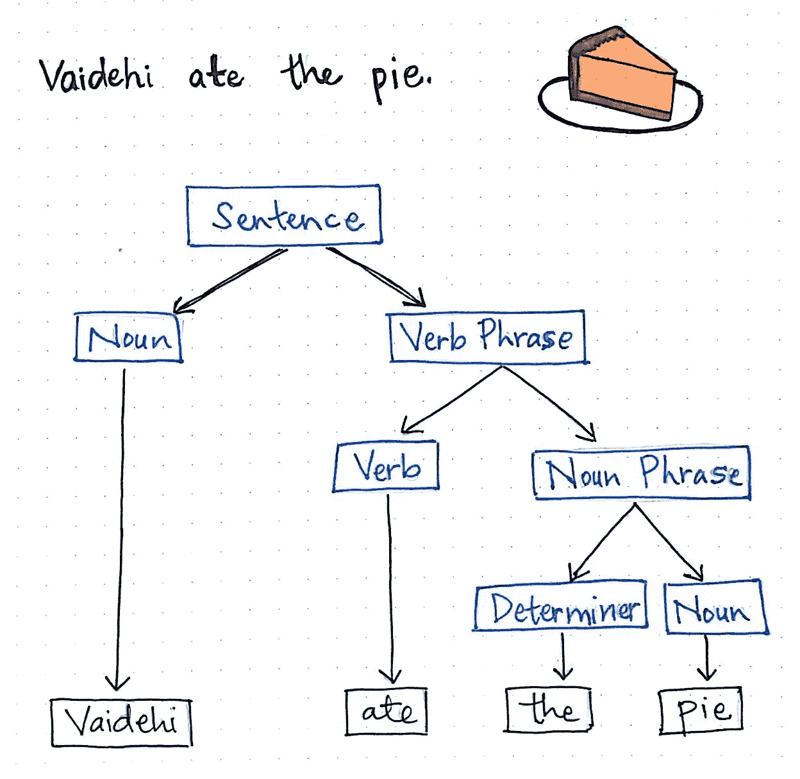
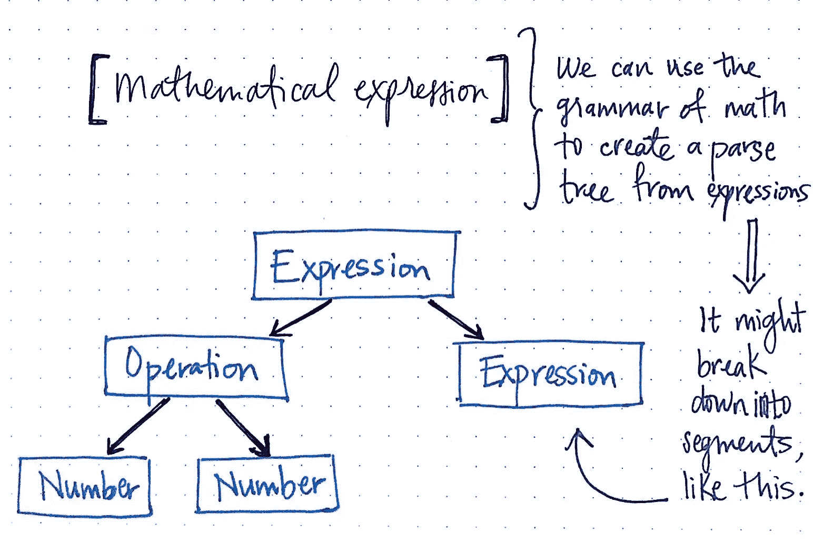
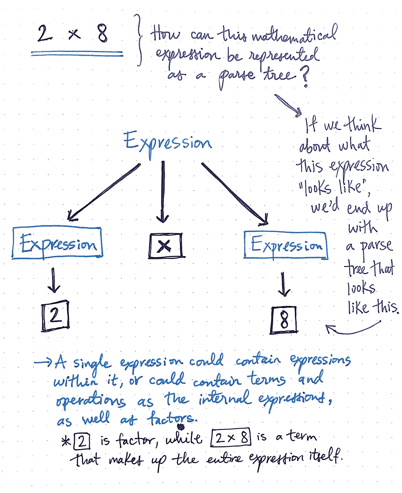
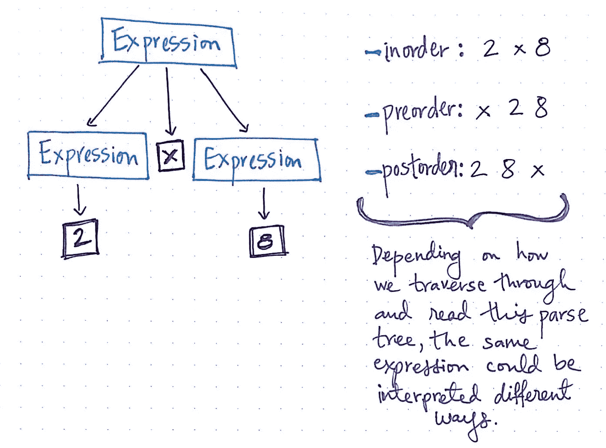
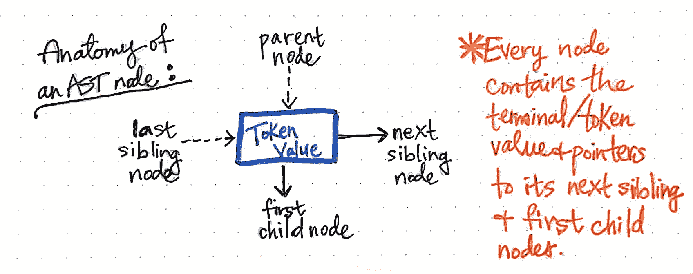
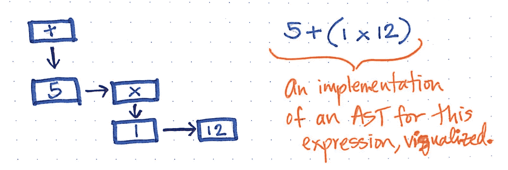

# 分解编译器的分析阶段

> 原文：<https://betterprogramming.pub/breaking-down-the-syntax-analysis-phase-of-a-compiler-18964309f332>

# 编译理论

尽管人们普遍认为 JavaScript 是一种“动态”或“解释”语言，但它实际上是一种编译语言。这种误解的原因之一可能是因为 JavaScript 没有提前编译好，就像你在许多传统编译语言中看到的那样。但是最终，JavaScript 引擎会执行许多与其他语言相同的步骤，甚至可能以更复杂的方式执行。(旁注:引擎负责我们 JavaScript 程序的从头到尾的编译和执行。)

> 在传统的编译语言过程中，一大块源代码，也就是你的程序，在执行之前通常会经历三个步骤***，大致称为“编译”
> 
> ~埃里克·埃利奥特

这两个阶段，**词法分析**和**语法分析** *，*合起来称为**分析阶段**，或者说**编译器的** **前端**。这是一个**中间代码表示**，编译器用它来表示一个源文本。

涉及的步骤(按此顺序)如下:

# 步骤 1:词法分析阶段

这是扫描器和标记器的共同努力。

## 第一部分:扫描文本

编译器做的第一件事就是扫描文本。这项工作由**扫描仪**和*执行。*文本分解成尽可能小的部分，称为**词位** *。*

## **B 部分:标记化/词法分析**

第二件事是创建一个令牌流来解析代码生成。所以基本上，这将一串字符分解成有意义的(对语言来说)块，称为**记号**。这一行代码，`var a= 2;`经过标记化阶段后会分解，看起来像`var`、`a`、`=`、`2`、`;`。

# 步骤 2:语法分析阶段

因此，我将在这里解释两件事，但它们可能会因语言而异。一旦词法分析完成，我们就开始语法分析阶段。根据手头的语言，一些语言可能会开发一个**解析树，具体语法树(CST)** ，然后使用它来派生它们的**抽象语法树(AST)。**然而，像 JavaScript 这样的一些语言会直接开发 AST，而不需要任何 CST。让我们先看一下 CST，然后再看 AST，以帮助您理解。

这里你可以用简单的英语来描述 CST。

[https://medium . com/basecs/grammatically-root-self-with-parse-trees-EC 9 daeda 7 dad](https://medium.com/basecs/grammatically-rooting-oneself-with-parse-trees-ec9daeda7dad)

> 以英语为例，每个句子的最小“部分”是一个单词；单词可以组合成短语，如名词短语或动词短语，这些短语又可以与其他短语结合在一起，形成句子表达式。
> 
> ~ Vaidehi

因此，将一个英语句子解析成 CST 似乎很容易。让我们来看看它是如何应用到数学上的。

[https://medium . com/basecs/grammatically-root-self-with-parse-trees-EC 9 daeda 7 dad](https://medium.com/basecs/grammatically-rooting-oneself-with-parse-trees-ec9daeda7dad)

[https://medium . com/basecs/grammatically-root-self-with-parse-trees-EC 9 daeda 7 dad](https://medium.com/basecs/grammatically-rooting-oneself-with-parse-trees-ec9daeda7dad)

很酷，对吧？基于数学规则，我们相应地创建了一个 CST！但是等等，根据我们遍历树的方式，它可能会被错误地解释。让我们看看几种不同的方法可以遍历它。

[https://medium . com/basecs/grammatically-root-self-with-parse-trees-EC 9 daeda 7 dad](https://medium.com/basecs/grammatically-rooting-oneself-with-parse-trees-ec9daeda7dad)

这里要注意的关键点是存在歧义，而*歧义对于编译器来说是个问题。*所以作为回报，编译器寻找*清晰*，*方向*来遵循。在这个例子中，我们可能给编译器的一个方向是简单地从左向右遍历。后来，我们可能会添加一些括号、指数、乘法、除法、加法和减法 **(PEMDAS)** 方向，等等规则*。*

CST 规则将依赖于手边的语言，但是它们总是将令牌分解成最小形式的有意义节点的树。

那么到底什么是 AST，为什么 JavaScript 直接创建了它？

在我们深入研究它之前，您需要知道:解析器将总是生成一个 AST 作为它的输出，不管它是否在两者之间创建了一个解析树。

明白了吗？很好，这里有一个 AST 中节点的简单例子:

[https://medium . com/basecs/leveling-up-ones-parsing-game-with-asts-d 7 a6 fc 2400 ff](https://medium.com/basecs/leveling-up-ones-parsing-game-with-asts-d7a6fc2400ff)

我们之前对`5 + (1 x 12)`的简单表达可以被构建成 AST 的可视化图示，如下所示:

[https://medium . com/basecs/leveling-up-ones-parsing-game-with-asts-d 7 a6 fc 2400 ff](https://medium.com/basecs/leveling-up-ones-parsing-game-with-asts-d7a6fc2400ff)

注意到我们是如何丢失括号的吗？我们可以看到，AST 并不关心将所有的令牌插入到节点中，而是通读每个令牌并确定其重要性。这取决于我们讨论的语言规则。所以 AST 的最终结果看起来更容易理解。但不要曲解。即使抽象语法树可能比 CST 更紧凑，并且在输出节点方面关心的要少得多，但它的推导仍然要复杂得多。AST 必须确定令牌的重要性，这对于编译器来说变得复杂了😬。

> *经典 JavaScript，fandangling 的东西在一起🤣*

一旦解析器知道了它试图解析的语言的语法，构建 CST 实际上是相当容易的。它不需要做任何复杂的工作来判断一个令牌是否“重要”。取而代之的是，它只是按照它所看到的特定顺序准确地获取它所看到的东西，并将其全部吐到一棵树上。

# **第三步:代码生成**

最后一步是**代码生成**。这是获取 AST 并将其转化为可执行代码的过程。这部分根据语言、目标平台等有很大的不同。对我们来说，了解这一点也不像开发人员那样重要，所以我们不会深入讨论这一部分的细节。只需知道有一种机制将 AST 视为“var a = 2；并把它变成一组机器指令，实际上*创建*一个名为`a`的变量(包括保留内存等。)，然后将一个值存储到`a`中。引擎如何管理系统资源比我们现在需要挖掘的更深入，所以我们只是想当然地认为引擎能够根据需要创建和存储变量🙂。

# **最终注释**

JavaScript 引擎比这三个步骤要复杂得多，大多数其他语言编译器也是如此。例如，在解析和代码生成的过程中，肯定会有一些优化执行性能的步骤，包括折叠冗余元素等。但是现在知道这三个步骤是最重要的。一旦你更深入地研究像 JavaScript 这样的语言的数据流和作用域，你就会明白作为一名开发人员，了解编译器为你做了什么是如此重要。

感谢所有为撰写关于你不知道 JavaScript 的 6 本书做出贡献的人，感谢 [Vaidehi Joshi](https://medium.com/@vaidehijoshi) ，我为此借用了他们的图片。