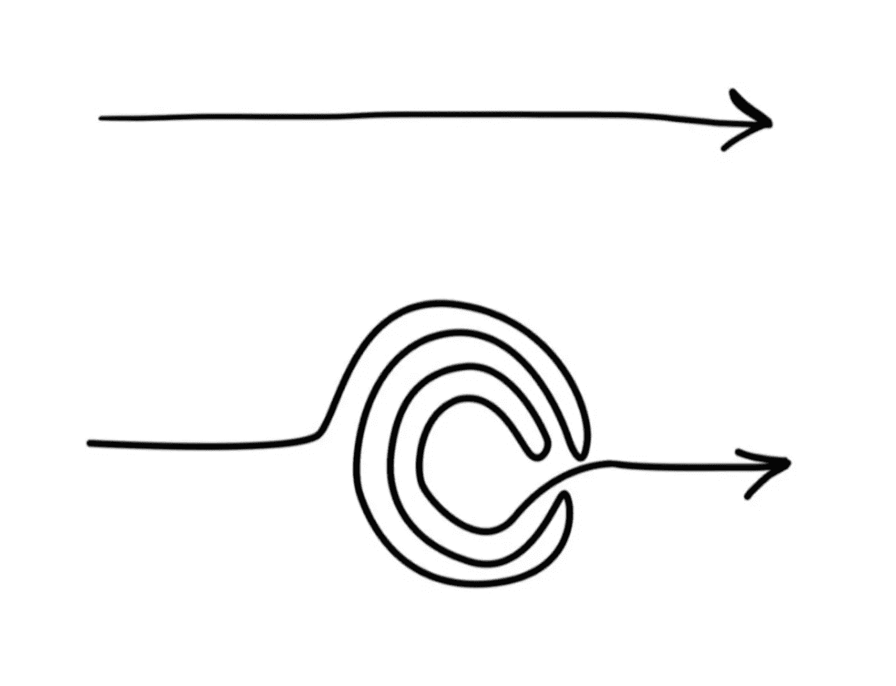
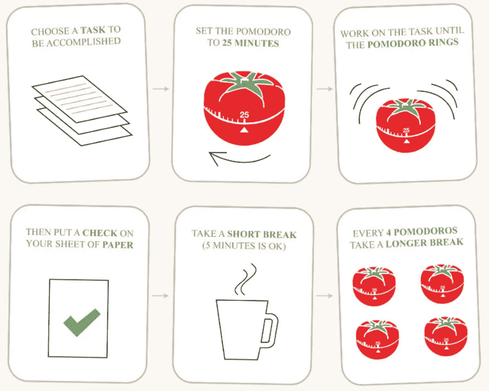

# 突破学习的压力

> 原文：<https://betterprogramming.pub/breaking-through-the-stress-of-learning-6c005aa05fb1>

## 和技术来帮助你达到目的

[绿色变色龙](https://unsplash.com/@craftedbygc?utm_source=medium&utm_medium=referral)在 [Unsplash](https://unsplash.com?utm_source=medium&utm_medium=referral) 上的照片。

我已经很久没学过新东西了。我是说全新的。学习如何编码经常被比作学习一门新的语言。作为熨斗学校的学生，我有机会在短短的几个月内学习多种编码语言。我报名参加了校园软件工程课程，但鉴于最近发生的事件，所有学生和员工都在远程工作。目前，在 Mod1 中，我们正在学习 Ruby 和 SQL。我的背景是商业——特别是时尚业——所以在走进熨斗学校的(虚拟)大门之前，我几乎没有任何编写代码的经验。不用说，我有自己的工作要做。不过，我已经准备好迎接挑战了，而且很兴奋！

事实上…我还没准备好。Mod1 的第一周是我经历过的最具挑战性的一周。我以为我对精神上的挑战有所准备，但我没有准备好情感上的挑战。在经历了一周疯狂的情绪起伏后，其中包括鼓励性的讲话(“你能行！”)接着是自嘲的想法(“天啊，真的吗？你不会成功的！”)，我认为这是不可持续的。

所以，我问自己，“伴随着学习新事物而来的这种不舒服的感觉的另一面是什么？”这是我到目前为止学到的东西。

# **冒名顶替综合症**

照片由[杰玛·科雷尔](https://twitter.com/notsowiseowl/status/1254802611527548928/photo/1)拍摄。

我的团队由来自不同背景的人组成。每个学生都带着他们的个人优势以及他们独特的挣扎和弱点来到这个项目。所以，尽管我和我的同学们一样在学习，但我告诉自己，我跟不上了。

通过我在熨斗学校的短暂时光，我了解到许多人都有与冒名顶替综合症相关的感受——尤其是在软件开发领域。事后看来，我意识到我的第一个错误是不断告诉自己，“我不明白。我跟不上了。”我应该说，“我正在学习。这是一个过程。”了解到我很可能是在应对某种形式的冒名顶替综合症(以及我的几个同伴)，让我意识到我需要一个计划。这让我们来到了下一站…

# **集中思维与分散思维**

作者照片。

一个朋友在一次学习会议上提到了分散思维，这让我想到了《数字思维》这本书。芭芭拉·奥克利博士解释说，集中思维模式是“使用顺序分析方法解决问题的直接方法”，而分散思维模式“允许我们获得洞察力，并与全局观点相关联。”

你可能会说，学习语法、深入嵌套的数据结构，以及学习如何让你的程序与数据源通信都是何时应用集中学习的例子。当学习面向对象的概念或应用你所学的知识来创建你的第一个 CLI 应用程序时，扩散思维模式就派上了用场！

我想我一直是一个“扩散模式”类型的思考者。我喜欢让我的思绪游走，想象大局。然而，我经常被无止境的待办事项清单淹没，所以有时这会阻止我实现大目标。那么，下一步是什么？我意识到我必须加强我的集中思考。输入…

# **番茄工作法**

由番茄工作法拍摄的照片。

由于看着似乎没完没了的待办事项清单足以淹没我的思绪并导致我拖延，我发现锻炼[番茄工作法](https://francescocirillo.com/pages/pomodoro-technique)对我来说是正确的一步。练习 25 分钟的集中思考，然后让我的思维间歇地进入分散思考，这让大型的多步骤任务看起来更容易处理。我知道几分钟后我会有一个充满白日梦的短暂休息。这个短暂的休息让我可以更抽象地思考，并且经常会引出更清晰的思路和新的想法！

# 结论

那么，伴随着学习新事物而来的不舒服感的另一面是什么呢？

我只需要接受一点点不舒服。采取终身学习的心态可以减轻一些压力，为更多的享受腾出空间。随着这种思想的转变，我对学习更加兴奋，对不知道的事情压力更小。毕竟总有值得学习的地方。