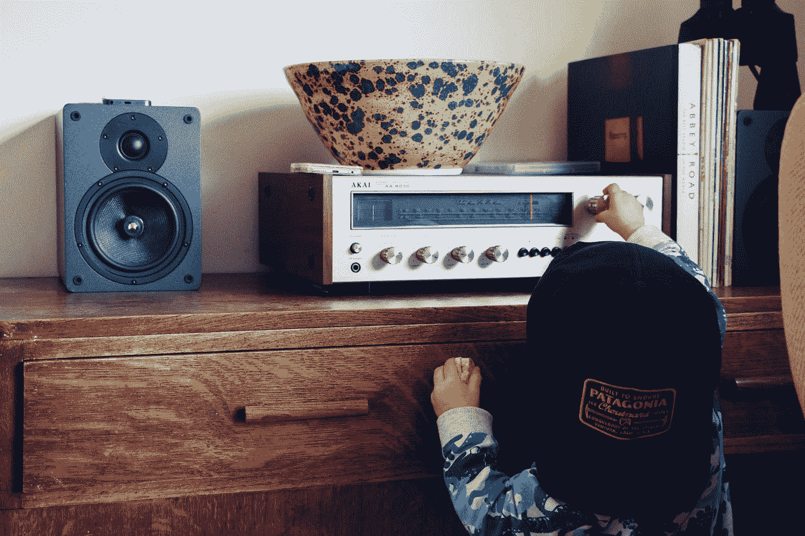

# Android 中的广播接收器

> 原文：<https://betterprogramming.pub/broadcastreceiver-in-android-adcfe2801a6b>

## 处理系统范围和自定义广播



照片由[威尔弗朗西斯](https://unsplash.com/@willfrancis?utm_source=medium&utm_medium=referral)在 [Unsplash](https://unsplash.com?utm_source=medium&utm_medium=referral) 上拍摄。

有四种不同类型的 Android 应用程序组件:

*   活动
*   服务
*   广播接收机
*   内容提供商

`BroadcastReceiver`是 Android 组件的基本构建块之一。在本文中，让我们来探讨什么是广播，什么是广播接收机，以及我们如何使用它们。

如果你想直接跳到代码库，查看一下 [GitHub repo](https://github.com/pavan5208/android_sample_broadcast_receiver) 。

# 什么是广播？

在 Android 中，广播是由于系统状态变化而发生的系统范围的事件，如`LOW_BATTERY`、呼入或呼出、网络连接变化、设备重启等。这些是需要我们执行某些操作的一些系统事件。Android 的系统在各种系统事件发生时发送广播。

例如，假设我们正在后台运行一项服务来完成某项任务，而系统由于电量不足而关闭。一段时间后，当用户重启或打开设备时，我们的服务将不会处于运行状态。我们可能需要一些可以强制重启服务的东西来完成任务。这就是广播发挥作用的地方。

另一种情况是播放视频时网络发生变化。当网络断开时，我们会显示一条消息。当它回来时，不需要点击“重试”按钮，我们应该能够恢复视频，以获得更好的用户体验。这也可以通过听广播来实现。

> “Android 应用程序可以发送或接收来自 Android 系统和其他 Android 应用程序的广播消息，类似于**发布-订阅**设计模式。”— [安卓开发者](https://developer.android.com/guide/components/fundamentals)

# 什么是广播接收机？

广播接收器是一个抽象类，它接收并处理由`Context.sendBroadcast(Intent)`发送的广播意图。为了利用这一点，我们需要通过实现基本抽象类`BroadcastReceiver`来创建一个类，并注册它。它没有任何用户界面。但是，我们可以触发通知来提醒用户。

```
**import android.content.BroadcastReceiver** //This class can be used to do tasks on restart of device
class RestartReciever **: BroadcastReceiver()**
```

有两种方法可以注册广播接收器:

1.  静态地使用清单文件中的`<receiver>`标签。
2.  通过调用`registerReciever(receiverClassInstance)`在类级别动态地。

> 广播接收器是一个组件，它使系统能够在常规用户流之外向应用程序传送事件，从而允许应用程序响应系统范围的广播公告— [安卓开发者](https://developer.android.com/guide/components/fundamentals)

让我们来看看实际情况。

# 广播接收机的例子

让我们探索一下注册和收听广播的方法。

## 为启动完成静态注册 BroadcastReceiver

首先，让我们创建一个在系统重启时被调用的`RestartReceiver`类。我们需要覆盖`onReceive`，在那里我们将接收回调。`onReceive` 在系统中发生特定注册动作的广播时被调用。

我们的`RestartReceiver`班会这样:

在`onReceive`、**、**内部，我们可以根据自己的需求做自定义动作。我们可以从首选项中获取值，如果条件得到满足，那么我们就可以导航。那样的话，我们的`onReceive` 就会是这样的:

我们需要在`AndroidManifest`文件中注册我们的接收器，以获得所需动作的广播(在我们的例子中是`BOOT_COMPLETED`**)**，如下所示:****

```
**<receiver android:name=".RestartReceiver">
    <intent-filter>
     <action android:name="android.intent.action.**BOOT_COMPLETED**" />
    </intent-filter>
</receiver>**
```

****我们的示例`MyService`看起来像这样:****

****此外，在清单文件中注册服务:****

```
**<service android:name=".MyService"/>**
```

****现在运行您的应用程序，重新启动设备，并检查日志以查看服务是否启动。你甚至可以在服务中尝试烤面包。****

## ****为网络变化动态注册广播接收器****

****让我们创建`NetworkChangeReceiver`，用`BroadcastReceiver`扩展它，并实现我们的逻辑来检查连通性变化。****

****出来的`NetworkChangeReceiver` 会是这个样子:****

*****注意:如果在清单文件中静态注册，以牛轧糖为目标的应用程序将不会接收到* `*CONNECTIVITY_CHANGE*` *广播。为了获得网络改变广播，动态注册接收器。*****

****让我们创建一个 receiver 实例，并在`Activity`级别动态注册和取消注册它。****

****创建一个`NetworkChangeReceiver`的实例:****

```
**val mNetworkReceiver = NetworkChangeReceiver()**
```

****动态注册它:****

```
****registerReceiver(
    mNetworkReceiver,
    IntentFilter(ConnectivityManager.*CONNECTIVITY_ACTION*)
)****
```

****动态取消注册:****

```
**private fun unregisterNetworkChanges() {
    try {
 **unregisterReceiver(mNetworkReceiver)**    } catch (e: IllegalArgumentException) {
        e.printStackTrace()
    }
}**
```

****我们的整个`Activity`看起来会是这样:****

*****注意:当生命周期被破坏时，取消注册任何动态注册的接收者，以避免内存泄漏。在* `*Activity*` *的情况下，在* `*OnStop*` *或者* `*OnDestroy*` *中注销。*****

****正如我们现在所做的，运行应用程序并通过打开/关闭移动数据或 wifi 来检查 logcat。****

****在我的例子中，输出是:****

```
**2021–07–04 19:27:22 NetworkChangeReceiver: Connected to Internet 
2021–07–04 19:27:28.NetworkChangeReceiver: No Connectivity
2021–07–04 19:27:32.NetworkChangeReceiver: Connected to Internet**
```

****如果您在执行代码片段时发现任何困难，请查看 [GitHub repo](https://github.com/pavan5208/android_sample_broadcast_receiver) 。****

# ****奖金****

****我们可以在单个接收器上注册多个操作。广播接收器作为`BroadcastReceiver`的子类实现，每个广播作为`Intent`对象交付，因此我们可以使用 intent 来检查指定的动作并执行所需的任务。****

****动态注册多个动作:****

****在`onReceive()`的接收器内，我们可以检查动作:****

```
****if (intent?.*action* == "android.intent.action.SCREEN_OFF") {
**   Log.v("ScreenReceiver", "in ScreenOnOff turning off")**} else if (intent?.*action* == "android.intent.action.SCREEN_ON") {
**    Log.v("ScreenReceiver", "in ScreenOnOff turning on")
}**
```

# ****摘要****

****广播接收器有助于处理与系统和自定义事件相关的情况。Android 系统触发广播事件，应用程序可以订阅这些广播来执行自定义操作。在 Android 7.0(API 24 级)及更高版本开始，不要发送以下系统广播:`ACTION_NEW_PICTURE` 和`ACTION_NEW_VIDEO`。****

****在下一篇文章中，我们将探索跨应用程序通信和`LocalBroadcast`管理器。感谢您的阅读。****

# ****参考****

*   ****[广播](https://developer.android.com/guide/components/broadcasts)****
*   ****[安卓 _ 样本 _ 广播 _ 接收器](https://github.com/pavan5208/android_sample_broadcast_receiver)****

# ****继续读 Android 的东西****

*   ****[了解视图在 Android 中的呈现方式](https://medium.com/@pavan.careers5208)****
*   ****[Android 中一个视图的生命周期](https://proandroiddev.com/the-life-cycle-of-a-view-in-android-6a2c4665b95e)****
*   ****[科特林系列](https://medium.com/android-dev-hacks/kotlin-advanced-programming-89aef9b2ecb8)****
*   ****[如何在您的 Android 应用中实现应用内购买](/how-to-implement-in-app-purchases-in-your-android-app-7cc1f80148a4)****
*   ****[多得多](https://medium.com/@pavan.careers5208)****