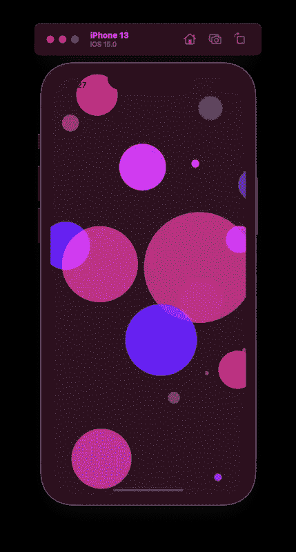
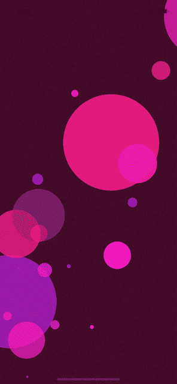
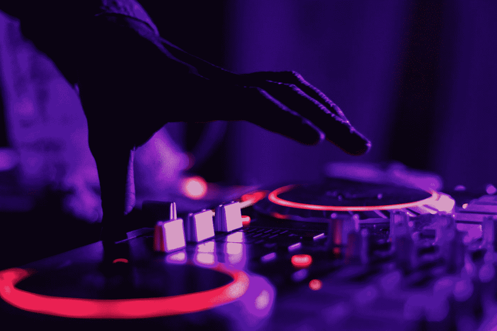

# 带 AVKit 的 SwiftUI 中的气泡动画

> 原文：<https://betterprogramming.pub/bubble-animation-in-swiftui-avkit-39a688a0b942>

## 用动画启动您的 iOS 应用程序

动画是最有力的交流方式之一。从电视广告到基本的智能手机应用程序，它们被广泛使用，即使我们没有注意到它们。

如今，它们被完美地集成到我们的应用程序中，因为它们被开发人员用来增强用户体验。动画作为一种反馈形式确实很有用，它清楚地表明系统已经识别了一个动作。最大的优点(也是缺点)实际上是吸引用户的注意力，所以*你必须小心使用它们。*

通过这篇文章，我们将创建一个简单而丰富多彩的界面，让你在这个奇妙的世界里迈出第一步。

## 开始吧！

有 **3 件事**需要重点关注:圈子*圈子*、动画*和背景*背景*。*

在`ZStack`中，我们确定了我们希望出现在屏幕上的圈数。在我们的例子中，有 50 个。然后我们说，我们随机地希望圆圈的颜色在红色、绿色和蓝色的阴影之间移动。

在这些彩色的圆圈中，我们希望底部的圆圈被顶层(第 14 行)照亮。之后，我们设置动画。我们希望通过执行一个小反弹来使圆圈变得更大和更小[第 15 行]，我们希望它以一定的速度永远重复下去[第 16 行][第 17 行]，并且在一个圆圈和另一个圆圈之间有一定的延迟[第 18 行]。

在剩下的几行中，我们通过说我们希望它们在屏幕上的某个空间内的随机范围内放大来确定圆的大小，这必须在每次开始时发生。

移动到背景，我们可以选择一个预定义的颜色或创建一个新的。让我们创建一个新的，我们将呼吁胭脂。我们将选择它的红色、绿色和蓝色的变体[第 5 行]。

我们将通过`.ignoresSafeArea()` [第 35–38 行]让这种颜色充满整个屏幕

## 现在我们可以融入一些轻松的音乐来营造一个美好的氛围。

照片由 [Marcela Laskoski](https://unsplash.com/@marcelalaskoski?utm_source=medium&utm_medium=referral) 在 [Unsplash](https://unsplash.com?utm_source=medium&utm_medium=referral) 上拍摄

首先，我们需要添加一个轨道作为资产，我们可以简单地通过在各自的部分拖动它来完成。

> ***NB:*** *时刻注意版权，使用类似*[*Pixabay*](https://pixabay.com/it/music/)*这样的网站下载免费音乐供你的项目使用。*

[第 2，6 行]现在我们可以导入`AVKit`并设置一个新变量，将其命名为`audio`。

然后我们在`ZStack`的结尾进入`onAppear`，这表明音乐必须在启动时播放。

[Line 3–5]因此，我们创建了一个新的变量(`song`)，我们将资产中调用的音轨名称与其关联起来，然后我们通过指定歌曲及其文件类型来设置音频播放器(音频)。

我们完事了。恭喜你！

下面是完整的代码:

您也可以通过以下链接下载该项目:

 [## GitHub-Abigail demico/Bubble-Animation

### 此时您不能执行该操作。您已使用另一个标签页或窗口登录。您已在另一个选项卡中注销，或者…

github.com](https://github.com/abigaildemicco/Bubble-Animation) 

尽情享受吧！