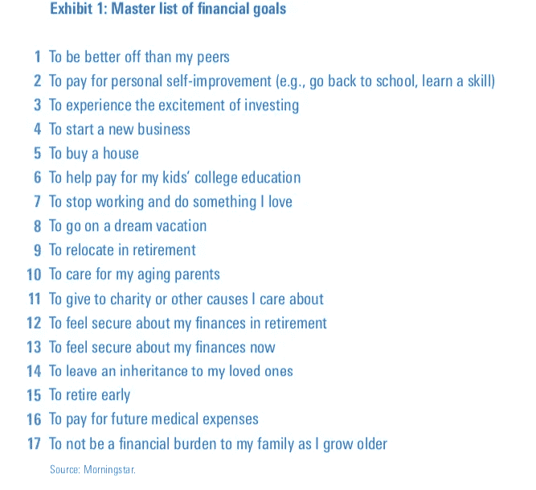

# 工程师预算

> 原文：<https://betterprogramming.pub/budgeting-for-engineers-9362db4fa2b9>

## 一个低努力，高影响的策略，以确保您的财务未来

> 直到你让潜意识变得有意识，它将指导你的生活，你将称之为命运——心理学家卡尔·荣格

我们都非常熟悉那些我们选择忽略一种感觉或行为的情况——我们内心深处知道这种感觉或行为会让我们的生活变得更好。这可能包括原谅一个朋友，或者处理你待办事项清单上的一个挥之不去的任务；我们试图忽略它，但我们知道它在悄悄地“指导我们的生活”

# 简单的金钱公式

对我们许多人来说，金钱是一种由大脑无意识部分支配的行为。毕竟，如果你已经得到了那份好工作，难道没有一个简单的公式可以依靠吗？

> **是收入>是支出？**

如果答案是真的，那么一切都是好的——正如荣格所宣称的，我们可以让“命运”从这里开始处理它。

这使得预算看起来有些多余。这是一个不必要的麻烦，似乎永远不适合我们苛刻的工作时间表或我们超负荷的注意力范围。预算不应该和吃西兰花或者睡八小时觉一起归档吗？“很高兴有——但不是现在。”

这篇文章将向你展示预算的秘密力量，以及每天不到两分钟的练习如何消除忧虑**和**提供了财富复合引擎的基础。真正的双赢。

# 为什么是工程师？

通宵写代码的好处似乎在职业选择中得到了回报。根据 [Glassdoor](https://www.glassdoor.com/blog/high-paying-jobs-tons-of-open-positions/) 的数据，软件工程师是 2019 年需求第三高的工作，有 14.1 万个职位空缺，**基本工资中位数为 103，035 美元。如果你仍然担心那些级别的钱，那么很有可能你对钱的逃避是问题的根源。**

此外，工程师在逻辑、规则和公式的世界里茁壮成长——你能想到更好的画布来结合这种心态、收入和以解决方案为导向的思维吗？

# 两类消费者

说到消费，有两种人。守财奴在应用程序和电子表格上跳来跳去。他们使用数据透视表和条件格式在复杂的工作表中跟踪每一笔支出。他们可以告诉你 2015 年他们在优步上花了多少钱，以及他们什么时候会达到提前退休的数字。他们呆在餐馆里并不有趣(“我没有喝酒”)，人们可以自信地说*他们不让自己享受自己的劳动成果*。

吝啬鬼

在这个统一体的另一端，有**逃避者。他们花钱大手大脚，表现出让吝啬鬼羡慕的自信。但在内心深处，回避者对这种不计后果的消费行为怀有一些阴暗的荣格属性——内疚、羞愧和恐惧*。***

逃避者，让它下雨

不管外表如何，做一个逃避者并不有趣。他们也享受不到自己的劳动成果。

# 取得平衡，增加你的平衡

是的，在逃避者和吝啬鬼之间存在一个甜蜜点。他们知道自己的个人财务细节，但并不依赖于他们。他们有一个未来的框架，可以灵活地适应任何意外。他们有工具，每天用不了两分钟，就能把辛苦挣来的钱复合起来，为未来的自己(和家庭)建立财务安全和自由。

# 知道就是力量

彼得·德鲁克，“现代管理的创始人”，宣称通往成功的道路始于简单的意识:

多亏了手机、应用程序和网上银行，衡量我们所有资金的流动变得异常容易。这里有一个让你开始的四步计划:

# 第一步:选择应用程序

市场上绝对不缺乏预算应用程序。虽然应用程序本身不会有意义地改变你的理财行为，但对你交易的认知会。

这里有三个应用程序可以提供一个很好的起点:

*   [薄荷](http://Mint.com)是**免费**，好用，有干净的 app。作为一个免费的产品，它的可定制性是有限的，但完全可以完成任务。
*   [Tiller](http://tillerhq.com) 为**$ 59/年**(等于**$ 4.92/月**)，完全基于 Google Sheets。这给了它很高的可定制性，但需要注意的是，你应该习惯于操作电子表格。
*   [YNAB](http://$6.99/month, billed annually at $83.99.) (你需要预算)是**$ 83.99/年**(等于**$ 6.99/月**)。设置可能有点令人生畏，但它很简单，高度可定制，并有一个很好的分析套件。(就我个人而言，我非常喜欢这个应用程序，以至于我自愿帮助人们设置它。)

# 步骤 2:开始对交易进行分类

一旦你选择了一个应用程序，并开始同步你的交易，它们将开始每天出现在你的应用程序的仪表板上。根据具体的应用程序，你会有不同的分类选项。它们将允许你为你的消费需求建立一个“层次结构”。

一个好的起点是从最重要的**到最不重要的**来组织你的支出(和其他支出)。****最重要的**类别应该涵盖租金、账单、学生贷款和汽车付款等事项——如果不及时覆盖，这些项目会产生严重影响。以下是一些例子:**

*   **租金/抵押贷款**
*   **学生贷款**
*   **汽车付款**
*   **保险(汽车、健康、汽车)**
*   **通勤费用(公共交通、通行费)**
*   **电话**
*   **互联网**
*   **电流**
*   **气体**

**这些费用的好处是它们大部分都是固定的(除了水电费)，所以它们应该很容易预算。如果你有孩子，你可能想拿出**与孩子相关的每月开支**:**

*   **儿童保育**
*   **学校**
*   **日托**

**接下来还有**可变月支出**。这些都很重要，但是这里有一些灵活性。正如你将看到的，你仍然需要食品杂货和家庭用品，但你也许可以放弃你的网飞订阅。**

*   **食品**
*   **卫生和药学**
*   **家庭用品**
*   **医疗保健(共付额)**
*   **宠物护理**
*   **数字订阅**

**然后是**可自由支配支出**——一个相当广泛的类别，涵盖了生活中非必需品的购买。根据你的生活环境和消费倾向，这些会有很大程度的变化，但它们可以包括:**

*   **交往**
*   **书**
*   **活动**
*   **假期**
*   **家中陈设**
*   **衣服**
*   **礼物**
*   **班级**

**其中一些也可能变得棘手，因为它们是不稳定的(即，你可能一年只休几次假)，理想情况下，你的预算应用程序会让你计入这笔费用——这样你就不会在最后一刻感到意外。**

# **第三步:创造你的消费瀑布**

**所以你已经把你的交易分类(和利息支付),并且——令人惊讶的——还有一点剩余。下一步是什么？那些宝贵的积蓄应该如何分配？**

**具体情况会因个人情况而异，但有几个影响深远的决定会对你未来的财务有很大帮助。**

## ****建立应急基金****

**既然你已经了解了基本必需品的成本，那么在紧急情况发生时(失业、医疗意外或家庭责任)，开始建造一些跑道是有帮助的。一个很好的经验法则是 **6 个月的基本生活费用**(假期不计算在内)，但这可以根据你的受抚养人数量、你伴侣的经济状况以及你是否可以回去和家人一起生活而有所不同。**

## **获得 401(k)匹配**

**接下来，看看你的公司是否提供 401(k)匹配——这基本上是免费的钱(为你的退休)。雇主平均匹配雇员薪水的 2.7%，然后这笔钱将在几十年内复利(以节税的方式)。**

## **考虑偿还高利率债务**

**一旦你收集了“闲钱”，寻找你以**高息债务的形式支付的例子。**罪魁祸首可能是信用卡债务，但这也包括其他类型的个人贷款(嗯，那台新电视)，甚至是发薪日贷款。根据利率，私人学生贷款也符合条件。**

**当谈到偿还债务时，没有一个特定的利率阈值来决定偿还哪种债务(即偿还高于 5%的债务)。这是因为债务受到其减税状态(即抵押贷款和联邦学生贷款)、你的税率(联邦和州)和你的投资选择(即机会成本)的影响。但是请记住，**偿还债务很难出错，尤其是高利率的债务。****

# **第四步:确定你的长期储蓄目标**

**当你进入瀑布的最后阶段时，你的选择会大大增加。在这里，它有助于评估你的长期目标，比如买房、为你孩子的大学存钱、一个史诗般的假期、帮助家庭成员、为你的退休开个好头，或者以上所有的目标。**

**晨星提供了一个[主列表](https://www.morningstar.com/lp/mining-for-goals)来帮助你开始确定这些目标，包括:**

****

**如果目标太多，或者你看不到你目前的收入如何能让你达到一个特定的目标，不要责备自己。投资是一个长期的游戏，正如爱因斯坦所说，“复利是世界第八大奇迹。”**

# **你正在走向精通**

**通过这些简单的步骤，你很容易就跨越了合理财务规划的帕累托原则。由于这些应用程序的强大功能和自动化储蓄和投资决策的能力，你已经释放了你的个人复合引擎，可以在比阅读这篇文章更短的时间内进行维护。这就是预算最好的部分:它释放了时间和精神空间，使你能够把时间花在你喜欢的活动和你最关心的人身上。**